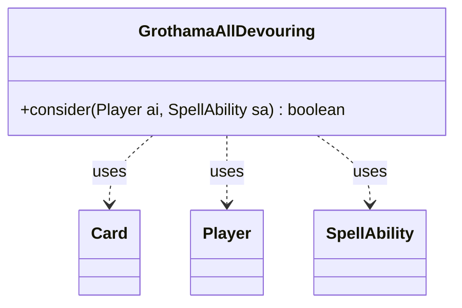

---
aliases:
  - GrothamaAllDevouring
tags:
  - java/class
  - module/forge-ai
  - pkg/forge/ai
fqn: forge.ai.SpecialCardAi.GrothamaAllDevouring
package: forge.ai
module: forge-ai
kind: Class
---

# GrothamaAllDevouring

**Package:** `forge.ai`   **Module:** `forge-ai`   **Kind:** Class



## Relationships
**Uses:**
- [[forge.game.card.Card|Card]]
- [[forge.game.player.Player|Player]]
- [[forge.game.spellability.SpellAbility|SpellAbility]]

## Design Description

Grothama, All-Devouring is a nested static AI helper within `SpecialCardAi` that encapsulates the decision logic for whether the AI should fight the legendary creature Grothama for its card-draw payoff. Its single static `consider(Player, SpellAbility)` method evaluates the proposed fight by inspecting the host `Card` (the fighter) and the original host (the devourer) reached through the `SpellAbility`, declining to attack allied copies and otherwise weighing destructibility, power/toughness, and `ComputerUtilCard` creature valuations.

As a stateless utility class it holds no fields and exposes only behavior, fitting the `SpecialCardAi` pattern of grouping card-specific AI routines as lightweight inner classes. It collaborates with `Card`, `Player`, and `SpellAbility` purely as a consumer, returning a boolean verdict so the broader AI framework retains control over execution—a deliberately narrow, side-effect-free design whose inline TODO flags the unimplemented case of fighting one's own Grothama.

## Source
`forge-ai/src/main/java/forge/ai/SpecialCardAi.java` — declaration excerpt

```java
    // Grothama, All-Devouring
    public static class GrothamaAllDevouring {
        public static boolean consider(final Player ai, final SpellAbility sa) {
            final Card fighter = sa.getHostCard();
            final Card devourer = sa.getOriginalHost();
            if (ai.getTeamMates(true).contains(devourer.getController())) {
                return false; // TODO: Currently, the AI doesn't ever fight its own (or allied) Grothama for card draw. This can be improved.
            }
            boolean goodTradeOrNoTrade = devourer.canBeDestroyed() && (devourer.getNetPower() < fighter.getNetToughness() || !fighter.canBeDestroyed()
                    || ComputerUtilCard.evaluateCreature(devourer) > ComputerUtilCard.evaluateCreature(fighter));
            return goodTradeOrNoTrade && fighter.getNetPower() >= devourer.getNetToughness();
        }
    }
```

## Python
`forge/ai/SpecialCardAi/GrothamaAllDevouring.py`

```python
from forge.game.card.Card import Card
from forge.game.player.Player import Player
from forge.game.spellability.SpellAbility import SpellAbility
from forge.ai.ComputerUtilCard import ComputerUtilCard


class GrothamaAllDevouring:
    @staticmethod
    def consider(ai: Player, sa: SpellAbility) -> bool:
        fighter = sa.getHostCard()
        devourer = sa.getOriginalHost()
        if devourer.getController() in ai.getTeamMates(True):
            return False  # TODO: Currently, the AI doesn't ever fight its own (or allied) Grothama for card draw. This can be improved.
        goodTradeOrNoTrade = devourer.canBeDestroyed() and (devourer.getNetPower() < fighter.getNetToughness() or not fighter.canBeDestroyed()
                or ComputerUtilCard.evaluateCreature(devourer) > ComputerUtilCard.evaluateCreature(fighter))
        return goodTradeOrNoTrade and fighter.getNetPower() >= devourer.getNetToughness()
```
