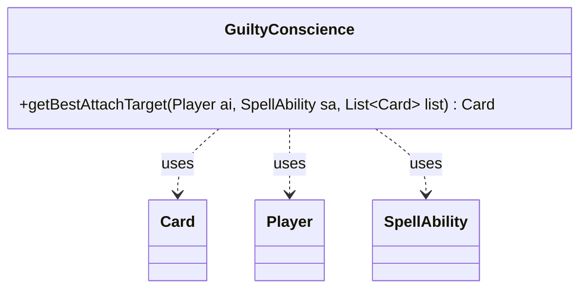

---
aliases:
  - GuiltyConscience
tags:
  - java/class
  - module/forge-ai
  - pkg/forge/ai
fqn: forge.ai.SpecialCardAi.GuiltyConscience
package: forge.ai
module: forge-ai
kind: Class
---

# GuiltyConscience

**Package:** `forge.ai`   **Module:** `forge-ai`   **Kind:** Class



## Relationships
**Uses:**
- [[forge.game.card.Card|Card]]
- [[forge.game.player.Player|Player]]
- [[forge.game.spellability.SpellAbility|SpellAbility]]

## Design Description

GuiltyConscience is a stateless AI helper—one of the nested static strategy classes inside `SpecialCardAi`—that encapsulates targeting logic for the card Guilty Conscience, which reflects combat damage back onto an enchanted creature. Its sole responsibility is the `getBestAttachTarget` method, which selects the most advantageous creature from a candidate list given the AI player and the pending `SpellAbility`.

The design encodes two prioritized intents: first, attach to the AI's own damage-reflecting creatures (Stuffy Doll, Boros Reckoner, Spitemare) to weaponize the aura defensively; otherwise, attach to an opponent's creature that would destroy itself when its combat damage meets or exceeds its toughness, while avoiding redundant enchantment. It collaborates with `Card`, `Player`, and `SpellAbility` as data inputs and delegates filtering and evaluation to utility classes like `CardLists` and `ComputerUtilCard`, keeping the class a pure, side-effect-free decision routine.

## Source
`forge-ai/src/main/java/forge/ai/SpecialCardAi.java` — declaration excerpt

```java
    // Guilty Conscience
    public static class GuiltyConscience {
        public static Card getBestAttachTarget(final Player ai, final SpellAbility sa, final List<Card> list) {
            Card chosen = null;

            List<Card> aiStuffies = CardLists.filter(list, c -> {
                // Don't enchant creatures that can survive
                if (!c.getController().equals(ai)) {
                    return false;
                }
                final String name = c.getName();
                return name.equals("Stuffy Doll") || name.equals("Boros Reckoner") || name.equals("Spitemare");
            });
            if (!aiStuffies.isEmpty()) {
                chosen = aiStuffies.get(0);
            } else {
                List<Card> creatures = CardLists.filterControlledBy(list, ai.getOpponents());
                // Don't enchant creatures that can survive
                creatures = CardLists.filter(creatures, c -> c.canBeDestroyed()
                        && c.getNetCombatDamage() >= c.getNetToughness()
                        && !c.isEnchantedBy("Guilty Conscience")
                );
                chosen = ComputerUtilCard.getBestCreatureAI(creatures);
            }

            return chosen;
        }
    }
```
