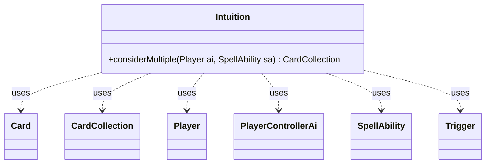

---
aliases:
  - Intuition
tags:
  - java/class
  - module/forge-ai
  - pkg/forge/ai
fqn: forge.ai.SpecialCardAi.Intuition
package: forge.ai
module: forge-ai
kind: Class
---

# Intuition

**Package:** `forge.ai`   **Module:** `forge-ai`   **Kind:** Class



## Relationships
**Uses:**
- [[forge.ai.PlayerControllerAi|PlayerControllerAi]]
- [[forge.game.card.Card|Card]]
- [[forge.game.card.CardCollection|CardCollection]]
- [[forge.game.player.Player|Player]]
- [[forge.game.spellability.SpellAbility|SpellAbility]]
- [[forge.game.trigger.Trigger|Trigger]]

## Design Description

`SpecialCardAi.Intuition` is a stateless utility class (a static nested helper within `SpecialCardAi`) that encapsulates AI decision-making for the "Intuition" card, whose effect lets the AI search its library for several cards. Its sole public method, `considerMultiple`, returns a `CardCollection` of the cards the AI should fetch, or an empty collection to defer to the standard `ChangeZoneAi` logic when the alternative-logic AI property is disabled.

Collaborating with `Player`, `SpellAbility`, `Card`, and `Trigger`, it inspects the AI's library and hand to make card-specific judgments: it recognizes the Illusions-of-Grandeur/Donate ("Trix") combo and tries to complete it, then otherwise builds tiered priority lists favoring cards good to mill into the graveyard, reanimation targets, and high-value named cards while avoiding redundant or uncastable picks. The cast to `PlayerControllerAi` reflects its tight coupling to the AI controller, and its hard-coded card names embed deck-archetype knowledge directly into the heuristic.

## Source
`forge-ai/src/main/java/forge/ai/SpecialCardAi.java` — declaration excerpt

```java
    // one of which will then be picked for you by the opponent)
    public static class Intuition {
        public static CardCollection considerMultiple(final Player ai, final SpellAbility sa) {
            if (ai.getController().isAI()) {
                if (!((PlayerControllerAi) ai.getController()).getAi().getBoolProperty(AiProps.INTUITION_ALTERNATIVE_LOGIC)) {
                    return new CardCollection(); // fall back to standard ChangeZoneAi considerations
                }
            }

            int changeNum = AbilityUtils.calculateAmount(sa.getHostCard(),
                    sa.getParamOrDefault("ChangeNum", "1"), sa);
            CardCollection lib = CardLists.filter(ai.getCardsIn(ZoneType.Library),
                    CardPredicates.nameNotEquals(sa.getHostCard().getName()));
            lib.sort(CardLists.CmcComparatorInv);

            // Additional cards which are difficult to auto-classify but which are generally good to Intuition for
            List<String> highPriorityNamedCards = Lists.newArrayList("Accumulated Knowledge", "Take Inventory");

            // figure out how many of each card we have in deck
            Map<String, Long> cardAmount = lib.stream().collect(Collectors.groupingBy(Card::getName, Collectors.counting()));

            // Trix: see if we can complete the combo (if it looks like we might win shortly or if we need to get a Donate stat)
            boolean donateComboMightWin = false;
            int numIllusionsOTB = CardLists.filter(ai.getCardsIn(ZoneType.Battlefield), CardPredicates.nameEquals("Illusions of Grandeur")).size();
            if (ai.getOpponentsSmallestLifeTotal() < 20 || numIllusionsOTB > 0) {
                donateComboMightWin = true;
                int numIllusionsInHand = CardLists.filter(ai.getCardsIn(ZoneType.Hand), CardPredicates.nameEquals("Illusions of Grandeur")).size();
                int numDonateInHand = CardLists.filter(ai.getCardsIn(ZoneType.Hand), CardPredicates.nameEquals("Donate")).size();
                int numIllusionsInLib = CardLists.filter(ai.getCardsIn(ZoneType.Library), CardPredicates.nameEquals("Illusions of Grandeur")).size();
                int numDonateInLib = CardLists.filter(ai.getCardsIn(ZoneType.Library), CardPredicates.nameEquals("Donate")).size();
                CardCollection comboList = new CardCollection();
                if ((numIllusionsInHand > 0 || numIllusionsOTB > 0) && numDonateInHand == 0 && numDonateInLib >= 3) {
                    for (Card c : lib) {
                        if (c.getName().equals("Donate")) {
                            comboList.add(c);
                        }
                    }
                    return comboList;
                } else if (numDonateInHand > 0 && numIllusionsInHand == 0 && numIllusionsInLib >= 3) {
                    for (Card c : lib) {
                        if (c.getName().equals("Illusions of Grandeur")) {
                            comboList.add(c);
                        }
                    }
                    return comboList;
                }
            }

            // Create a priority list for cards that we have no more than 4 of and that are not lands
            CardCollection libPriorityList = new CardCollection();
            CardCollection libHighPriorityList = new CardCollection();
            CardCollection libLowPriorityList = new CardCollection();
            List<String> processed = Lists.newArrayList();
            for (int i = 4; i > 0; i--) {
                for (Card c : lib) {
                    if (!donateComboMightWin && (c.getName().equals("Illusions of Grandeur") || c.getName().equals("Donate"))) {
                        // Probably not worth putting two of the combo pieces into the graveyard
                        // since one Illusions-Donate is likely to not be enough
                        continue;
                    }
                    if (cardAmount.get(c.getName()) == i && !c.isLand() && !processed.contains(c.getName())) {
                        // if it's a card that is generally good to place in the graveyard, also add it
                        // to the mix
                        boolean canRetFromGrave = false;
                        String name = c.getName().replace(',', ';');
                        for (Trigger t : c.getTriggers()) {
                            SpellAbility ab = t.ensureAbility();
                            if (ab == null) {
                                continue;
                            }

                            if (ab.getApi() == ApiType.ChangeZone
                                    && "Self".equals(ab.getParam("Defined"))
                                    && "Graveyard".equals(ab.getParam("Origin"))
                                    && "Battlefield".equals(ab.getParam("Destination"))) {
                                canRetFromGrave = true;
                            }
                            if (ab.getApi() == ApiType.ChangeZoneAll
                                    && TextUtil.concatNoSpace("Creature.named", name).equals(ab.getParam("ChangeType"))
                                    && "Graveyard".equals(ab.getParam("Origin"))
                                    && "Battlefield".equals(ab.getParam("Destination"))) {
                                canRetFromGrave = true;
                            }
                        }
                        boolean isGoodToPutInGrave = c.hasSVar("DiscardMe") || canRetFromGrave
                                || (ComputerUtil.isPlayingReanimator(ai) && c.isCreature());

                        for (Card c1 : lib) {
                            if (c1.getName().equals(c.getName())) {
                                if (!ai.getCardsIn(ZoneType.Hand).anyMatch(CardPredicates.nameEquals(c1.getName()))
                                        && ComputerUtilMana.hasEnoughManaSourcesToCast(c1.getFirstSpellAbility(), ai)) {
                                    // Try not to search for things we already have in hand or that we can't cast
                                    libPriorityList.add(c1);
                                } else {
                                    libLowPriorityList.add(c1);
                                }
                                if (isGoodToPutInGrave || highPriorityNamedCards.contains(c.getName())) {
                                    libHighPriorityList.add(c1);
                                }
                            }
                        }
                        processed.add(c.getName());
                    }
                }
            }

            // If we're playing Reanimator, we're really interested just in the highest CMC spells, not the
            // ones we necessarily have multiples of
            if (ComputerUtil.isPlayingReanimator(ai)) {
                libHighPriorityList.sort(CardLists.CmcComparatorInv);
            }

            // Otherwise, try to grab something that is hopefully decent to grab, in priority order
            CardCollection chosen = new CardCollection();
            if (libHighPriorityList.size() >= changeNum) {
                for (int i = 0; i < changeNum; i++) {
                    chosen.add(libHighPriorityList.get(i));
                }
            } else if (libPriorityList.size() >= changeNum) {
                for (int i = 0; i < changeNum; i++) {
                    chosen.add(libPriorityList.get(i));
                }
            } else if (libLowPriorityList.size() >= changeNum) {
                for (int i = 0; i < changeNum; i++) {
                    chosen.add(libLowPriorityList.get(i));
                }
            }

            return chosen;
        }
    }
```

## Python
`forge/ai/SpecialCardAi/Intuition.py`

```python
from typing import cast

from forge.ai.PlayerControllerAi import PlayerControllerAi
from forge.game.card.Card import Card
from forge.game.card.CardCollection import CardCollection
from forge.game.player.Player import Player
from forge.game.spellability.SpellAbility import SpellAbility
from forge.game.trigger.Trigger import Trigger

from forge.ai.AiProps import AiProps
from forge.ai.ComputerUtil import ComputerUtil
from forge.ai.ComputerUtilMana import ComputerUtilMana
from forge.game.ability.AbilityUtils import AbilityUtils
from forge.game.ability.ApiType import ApiType
from forge.game.card.CardLists import CardLists
from forge.game.card.CardPredicates import CardPredicates
from forge.game.zone.ZoneType import ZoneType
from forge.util.TextUtil import TextUtil


# one of which will then be picked for you by the opponent)
class Intuition:
    @staticmethod
    def considerMultiple(ai: Player, sa: SpellAbility) -> CardCollection:
        if ai.getController().isAI():
            if not cast(PlayerControllerAi, ai.getController()).getAi().getBoolProperty(AiProps.INTUITION_ALTERNATIVE_LOGIC):
                return CardCollection()  # fall back to standard ChangeZoneAi considerations

        changeNum = AbilityUtils.calculateAmount(sa.getHostCard(),
                sa.getParamOrDefault("ChangeNum", "1"), sa)
        lib = CardLists.filter(ai.getCardsIn(ZoneType.Library),
                CardPredicates.nameNotEquals(sa.getHostCard().getName()))
        lib.sort(CardLists.CmcComparatorInv)

        # Additional cards which are difficult to auto-classify but which are generally good to Intuition for
        highPriorityNamedCards = ["Accumulated Knowledge", "Take Inventory"]

        # figure out how many of each card we have in deck
        cardAmount: dict[str, int] = {}
        for c in lib:
            cardAmount[c.getName()] = cardAmount.get(c.getName(), 0) + 1

        # Trix: see if we can complete the combo (if it looks like we might win shortly or if we need to get a Donate stat)
        donateComboMightWin = False
        numIllusionsOTB = CardLists.filter(ai.getCardsIn(ZoneType.Battlefield), CardPredicates.nameEquals("Illusions of Grandeur")).size()
        if ai.getOpponentsSmallestLifeTotal() < 20 or numIllusionsOTB > 0:
            donateComboMightWin = True
            numIllusionsInHand = CardLists.filter(ai.getCardsIn(ZoneType.Hand), CardPredicates.nameEquals("Illusions of Grandeur")).size()
            numDonateInHand = CardLists.filter(ai.getCardsIn(ZoneType.Hand), CardPredicates.nameEquals("Donate")).size()
            numIllusionsInLib = CardLists.filter(ai.getCardsIn(ZoneType.Library), CardPredicates.nameEquals("Illusions of Grandeur")).size()
            numDonateInLib = CardLists.filter(ai.getCardsIn(ZoneType.Library), CardPredicates.nameEquals("Donate")).size()
            comboList = CardCollection()
            if (numIllusionsInHand > 0 or numIllusionsOTB > 0) and numDonateInHand == 0 and numDonateInLib >= 3:
                for c in lib:
                    if c.getName() == "Donate":
                        comboList.add(c)
                return comboList
            elif numDonateInHand > 0 and numIllusionsInHand == 0 and numIllusionsInLib >= 3:
                for c in lib:
                    if c.getName() == "Illusions of Grandeur":
                        comboList.add(c)
                return comboList

        # Create a priority list for cards that we have no more than 4 of and that are not lands
        libPriorityList = CardCollection()
        libHighPriorityList = CardCollection()
        libLowPriorityList = CardCollection()
        processed: list[str] = []
        for i in range(4, 0, -1):
            for c in lib:
                if not donateComboMightWin and (c.getName() == "Illusions of Grandeur" or c.getName() == "Donate"):
                    # Probably not worth putting two of the combo pieces into the graveyard
                    # since one Illusions-Donate is likely to not be enough
                    continue
                if cardAmount.get(c.getName()) == i and not c.isLand() and c.getName() not in processed:
                    # if it's a card that is generally good to place in the graveyard, also add it
                    # to the mix
                    canRetFromGrave = False
                    name = c.getName().replace(',', ';')
                    for t in c.getTriggers():
                        ab = t.ensureAbility()
                        if ab is None:
                            continue

                        if (ab.getApi() == ApiType.ChangeZone
                                and "Self" == ab.getParam("Defined")
                                and "Graveyard" == ab.getParam("Origin")
                                and "Battlefield" == ab.getParam("Destination")):
                            canRetFromGrave = True
                        if (ab.getApi() == ApiType.ChangeZoneAll
                                and TextUtil.concatNoSpace("Creature.named", name) == ab.getParam("ChangeType")
                                and "Graveyard" == ab.getParam("Origin")
                                and "Battlefield" == ab.getParam("Destination")):
                            canRetFromGrave = True
                    isGoodToPutInGrave = (c.hasSVar("DiscardMe") or canRetFromGrave
                            or (ComputerUtil.isPlayingReanimator(ai) and c.isCreature()))

                    for c1 in lib:
                        if c1.getName() == c.getName():
                            if (not ai.getCardsIn(ZoneType.Hand).anyMatch(CardPredicates.nameEquals(c1.getName()))
                                    and ComputerUtilMana.hasEnoughManaSourcesToCast(c1.getFirstSpellAbility(), ai)):
                                # Try not to search for things we already have in hand or that we can't cast
                                libPriorityList.add(c1)
                            else:
                                libLowPriorityList.add(c1)
                            if isGoodToPutInGrave or c.getName() in highPriorityNamedCards:
                                libHighPriorityList.add(c1)
                    processed.append(c.getName())

        # If we're playing Reanimator, we're really interested just in the highest CMC spells, not the
        # ones we necessarily have multiples of
        if ComputerUtil.isPlayingReanimator(ai):
            libHighPriorityList.sort(CardLists.CmcComparatorInv)

        # Otherwise, try to grab something that is hopefully decent to grab, in priority order
        chosen = CardCollection()
        if libHighPriorityList.size() >= changeNum:
            for i in range(changeNum):
                chosen.add(libHighPriorityList.get(i))
        elif libPriorityList.size() >= changeNum:
            for i in range(changeNum):
                chosen.add(libPriorityList.get(i))
        elif libLowPriorityList.size() >= changeNum:
            for i in range(changeNum):
                chosen.add(libLowPriorityList.get(i))

        return chosen
```
