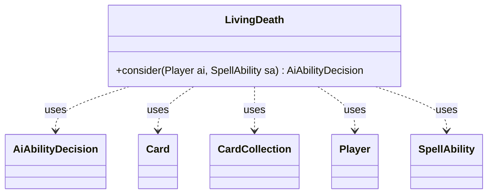

---
aliases:
  - LivingDeath
tags:
  - java/class
  - module/forge-ai
  - pkg/forge/ai
fqn: forge.ai.SpecialCardAi.LivingDeath
package: forge.ai
module: forge-ai
kind: Class
---

# LivingDeath

**Package:** `forge.ai`   **Module:** `forge-ai`   **Kind:** Class



## Relationships
**Uses:**
- [[forge.ai.AiAbilityDecision|AiAbilityDecision]]
- [[forge.game.card.Card|Card]]
- [[forge.game.card.CardCollection|CardCollection]]
- [[forge.game.player.Player|Player]]
- [[forge.game.spellability.SpellAbility|SpellAbility]]

## Design Description

The `LivingDeath` class is a static nested AI-logic helper within `SpecialCardAi`, encapsulating the decision-making for cards using the "LivingDeath" or "ReanimateAll" AI logic (mass reanimation effects). Its sole responsibility is the static `consider` method, which evaluates a `Player` and a `SpellAbility` and returns an `AiAbilityDecision` indicating whether and how strongly the AI should cast the spell. It collaborates with the game model—iterating over `Card`s and `CardCollection`s across the exile, graveyard, and battlefield zones—to weigh creature value via `ComputerUtilCard`.

The design intent is a value-comparison heuristic: the AI casts only when the net swing from reanimating its own graveyard exceeds an opponent's potential gain plus a threshold (~a 4/4 flier's worth). Notable guard clauses reflect domain knowledge—it aborts if a suspended reanimator card is still pending (avoiding self-sabotage like Living End) or if its graveyard holds no creatures. As a stateless utility, it contains no instance state, serving purely as a pluggable strategy invoked by Forge's AI dispatch.

## Source
`forge-ai/src/main/java/forge/ai/SpecialCardAi.java` — declaration excerpt

```java
    // Living Death (and other similar cards using AILogic LivingDeath or AILogic ReanimateAll)
    public static class LivingDeath {
        public static AiAbilityDecision consider(final Player ai, final SpellAbility sa) {
            // if there's another reanimator card currently suspended, don't cast a new one until the previous
            // one resolves, otherwise the reanimation attempt will be ruined (e.g. Living End)
            for (Card ex : ai.getCardsIn(ZoneType.Exile)) {
                if (ex.hasSVar("IsReanimatorCard") && ex.getCounters(CounterEnumType.TIME) > 0) {
                    return new AiAbilityDecision(0, AiPlayDecision.CantPlayAi);
                }
            }

            int aiBattlefieldPower = 0, aiGraveyardPower = 0;
            int threshold = 320; // approximately a 4/4 Flying creature worth of extra value

            CardCollection aiCreaturesInGY = CardLists.filter(ai.getZone(ZoneType.Graveyard).getCards(), CardPredicates.CREATURES);

            if (aiCreaturesInGY.isEmpty()) {
                // nothing in graveyard, so cut short
                return new AiAbilityDecision(0, AiPlayDecision.CantPlayAi);
            }

            for (Card c : ai.getCreaturesInPlay()) {
                if (!ComputerUtilCard.isUselessCreature(ai, c)) {
                    aiBattlefieldPower += ComputerUtilCard.evaluateCreature(c);
                }
            }
            for (Card c : aiCreaturesInGY) {
                aiGraveyardPower += ComputerUtilCard.evaluateCreature(c);
            }

            int oppBattlefieldPower = 0, oppGraveyardPower = 0;
            List<Player> opponents = ai.getOpponents();
            for (Player p : opponents) {
                int playerPower = 0;
                int tempGraveyardPower = 0;
                for (Card c : p.getCreaturesInPlay()) {
                    playerPower += ComputerUtilCard.evaluateCreature(c);
                }
                for (Card c : CardLists.filter(p.getZone(ZoneType.Graveyard).getCards(), CardPredicates.CREATURES)) {
                    tempGraveyardPower += ComputerUtilCard.evaluateCreature(c);
                }
                if (playerPower > oppBattlefieldPower) {
                    oppBattlefieldPower = playerPower;
                }
                if (tempGraveyardPower > oppGraveyardPower) {
                    oppGraveyardPower = tempGraveyardPower;
                }
            }

            // if we get more value out of this than our opponent does (hopefully), go for it
            if ((aiGraveyardPower - aiBattlefieldPower) > (oppGraveyardPower - oppBattlefieldPower + threshold)) {
                return new AiAbilityDecision(100, AiPlayDecision.WillPlay);
            } else {
                return new AiAbilityDecision(0, AiPlayDecision.CantPlayAi);
            }
        }
    }
```

## Python
`forge/ai/SpecialCardAi/LivingDeath.py`

```python
from forge.ai.AiAbilityDecision import AiAbilityDecision
from forge.ai.AiPlayDecision import AiPlayDecision
from forge.ai.ComputerUtilCard import ComputerUtilCard
from forge.game.card.Card import Card
from forge.game.card.CardCollection import CardCollection
from forge.game.card.CardLists import CardLists
from forge.game.card.CardPredicates import CardPredicates
from forge.game.card.CounterEnumType import CounterEnumType
from forge.game.player.Player import Player
from forge.game.spellability.SpellAbility import SpellAbility
from forge.game.zone.ZoneType import ZoneType


class LivingDeath:
    @staticmethod
    def consider(ai: Player, sa: SpellAbility) -> AiAbilityDecision:
        # if there's another reanimator card currently suspended, don't cast a new one until the previous
        # one resolves, otherwise the reanimation attempt will be ruined (e.g. Living End)
        for ex in ai.getCardsIn(ZoneType.Exile):
            if ex.hasSVar("IsReanimatorCard") and ex.getCounters(CounterEnumType.TIME) > 0:
                return AiAbilityDecision(0, AiPlayDecision.CantPlayAi)

        aiBattlefieldPower = 0
        aiGraveyardPower = 0
        threshold = 320  # approximately a 4/4 Flying creature worth of extra value

        aiCreaturesInGY = CardLists.filter(ai.getZone(ZoneType.Graveyard).getCards(), CardPredicates.CREATURES)

        if aiCreaturesInGY.isEmpty():
            # nothing in graveyard, so cut short
            return AiAbilityDecision(0, AiPlayDecision.CantPlayAi)

        for c in ai.getCreaturesInPlay():
            if not ComputerUtilCard.isUselessCreature(ai, c):
                aiBattlefieldPower += ComputerUtilCard.evaluateCreature(c)
        for c in aiCreaturesInGY:
            aiGraveyardPower += ComputerUtilCard.evaluateCreature(c)

        oppBattlefieldPower = 0
        oppGraveyardPower = 0
        opponents = ai.getOpponents()
        for p in opponents:
            playerPower = 0
            tempGraveyardPower = 0
            for c in p.getCreaturesInPlay():
                playerPower += ComputerUtilCard.evaluateCreature(c)
            for c in CardLists.filter(p.getZone(ZoneType.Graveyard).getCards(), CardPredicates.CREATURES):
                tempGraveyardPower += ComputerUtilCard.evaluateCreature(c)
            if playerPower > oppBattlefieldPower:
                oppBattlefieldPower = playerPower
            if tempGraveyardPower > oppGraveyardPower:
                oppGraveyardPower = tempGraveyardPower

        # if we get more value out of this than our opponent does (hopefully), go for it
        if (aiGraveyardPower - aiBattlefieldPower) > (oppGraveyardPower - oppBattlefieldPower + threshold):
            return AiAbilityDecision(100, AiPlayDecision.WillPlay)
        else:
            return AiAbilityDecision(0, AiPlayDecision.CantPlayAi)
```
