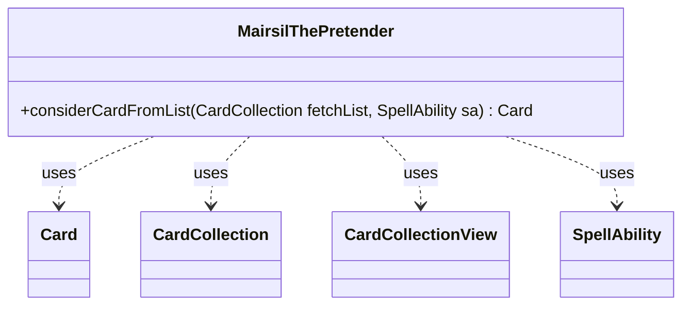

---
aliases:
  - MairsilThePretender
tags:
  - java/class
  - module/forge-ai
  - pkg/forge/ai
fqn: forge.ai.SpecialCardAi.MairsilThePretender
package: forge.ai
module: forge-ai
kind: Class
---

# MairsilThePretender

**Package:** `forge.ai`   **Module:** `forge-ai`   **Kind:** Class



## Relationships
**Uses:**
- [[forge.game.card.Card|Card]]
- [[forge.game.card.CardCollection|CardCollection]]
- [[forge.game.card.CardCollectionView|CardCollectionView]]
- [[forge.game.spellability.SpellAbility|SpellAbility]]

## Design Description

Mairsil, the Pretender provides specialized AI decision-making for the eponymous Magic: The Gathering card, encapsulated as a static nested helper within `SpecialCardAi`. Its single responsibility is selecting which card to fetch from a candidate list, scanning for an artifact or creature that carries at least one activated ability — the abilities Mairsil exiles and reuses — while skipping any card whose name duplicates one already exiled under a CAGE counter, avoiding redundant copies.

The class is a stateless utility collaborating with the core game model: it queries the activating player's Exile zone through `SpellAbility`, filters `CardCollection`/`CardCollectionView` instances via `CardLists` and `CardPredicates`, and returns a single `Card` (or null). Its functional stream-based filtering and the inline TODO signal a deliberately lightweight heuristic intended as a first approximation of fuller graveyard-then-hand consideration logic.

## Source
`forge-ai/src/main/java/forge/ai/SpecialCardAi.java` — declaration excerpt

```java
    // Mairsil, the Pretender
    public static class MairsilThePretender {
        // Scan the fetch list for a card with at least one activated ability.
        // TODO: can be improved to a full consider(sa, ai) logic which would scan the graveyard first and hand last
        public static Card considerCardFromList(final CardCollection fetchList, SpellAbility sa) {
            CardCollectionView caged = CardLists.filter(sa.getActivatingPlayer().getCardsIn(ZoneType.Exile),
                    CardPredicates.hasCounter(CounterType.getType("CAGE")));
            return fetchList.stream().filter(CardPredicates.ARTIFACTS.or(CardPredicates.CREATURES))
                .filter(c -> c.getSpellAbilities().stream().anyMatch(SpellAbility::isActivatedAbility))
                .filter(c -> caged.stream().noneMatch(CardPredicates.sharesNameWith(c)))
                .findFirst().orElse(null);
        }
    }
```
