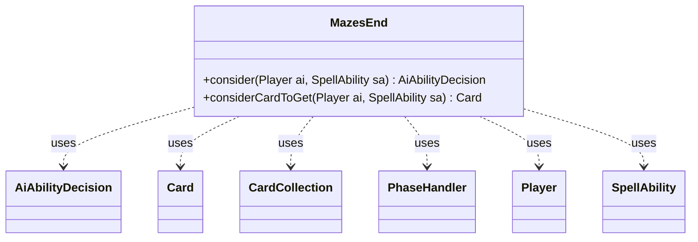

---
aliases:
  - MazesEnd
tags:
  - java/class
  - module/forge-ai
  - pkg/forge/ai
fqn: forge.ai.SpecialCardAi.MazesEnd
package: forge.ai
module: forge-ai
kind: Class
---

# MazesEnd

**Package:** `forge.ai`   **Module:** `forge-ai`   **Kind:** Class



## Relationships
**Uses:**
- [[forge.ai.AiAbilityDecision|AiAbilityDecision]]
- [[forge.game.card.Card|Card]]
- [[forge.game.card.CardCollection|CardCollection]]
- [[forge.game.phase.PhaseHandler|PhaseHandler]]
- [[forge.game.player.Player|Player]]
- [[forge.game.spellability.SpellAbility|SpellAbility]]

## Design Description

MazesEnd is a static nested AI helper within `SpecialCardAi` that encapsulates the computer player's decision logic for the card Maze's End, whose win condition depends on assembling Gate lands. Its two static methods take a `Player` and `SpellAbility` and collaborate with game-state types — querying the `PhaseHandler` for timing and filtering the player's `CardCollection`s by Gate type across library and battlefield zones.

The `consider` method returns an `AiAbilityDecision` weighing whether to activate the ability, favoring end-of-turn use before the AI's own turn while Gates remain in the library and declining when none are available. The `considerCardToGet` method selects which Gate to fetch, preferring a name not already on the battlefield to diversify the mana base and falling back to a random pick once all types are present. The design keeps this card-specific heuristic isolated and stateless, communicating intent purely through return values rather than mutating game state.

## Source
`forge-ai/src/main/java/forge/ai/SpecialCardAi.java` — declaration excerpt

```java
    // Maze's End
    public static class MazesEnd {
        public static AiAbilityDecision consider(final Player ai, final SpellAbility sa) {
            PhaseHandler ph = ai.getGame().getPhaseHandler();
            CardCollection availableGates = CardLists.filter(ai.getCardsIn(ZoneType.Library), CardPredicates.isType("Gate"));

            if (ph.is(PhaseType.END_OF_TURN) && ph.getNextTurn() == ai && !availableGates.isEmpty()) {
                return new AiAbilityDecision(100, AiPlayDecision.WillPlay);
            }

            if (availableGates.isEmpty()) {
                // No gates available, so don't activate Maze's End
                return new AiAbilityDecision(0, AiPlayDecision.MissingNeededCards);
            }

            return new AiAbilityDecision(0, AiPlayDecision.AnotherTime);
        }

        public static Card considerCardToGet(final Player ai, final SpellAbility sa) {
            CardCollection currentGates = CardLists.filter(ai.getCardsIn(ZoneType.Battlefield), CardPredicates.isType("Gate"));
            CardCollection availableGates = CardLists.filter(ai.getCardsIn(ZoneType.Library), CardPredicates.isType("Gate"));

            if (availableGates.isEmpty())
                return null; // shouldn't get here

            for (Card gate : availableGates) {
                if (!currentGates.anyMatch(CardPredicates.nameEquals(gate.getName()))) {
                    // Diversify our mana base
                    return gate;
                }
            }

            // Fetch a random gate if we already have all types
            return Aggregates.random(availableGates);
        }
    }
```
