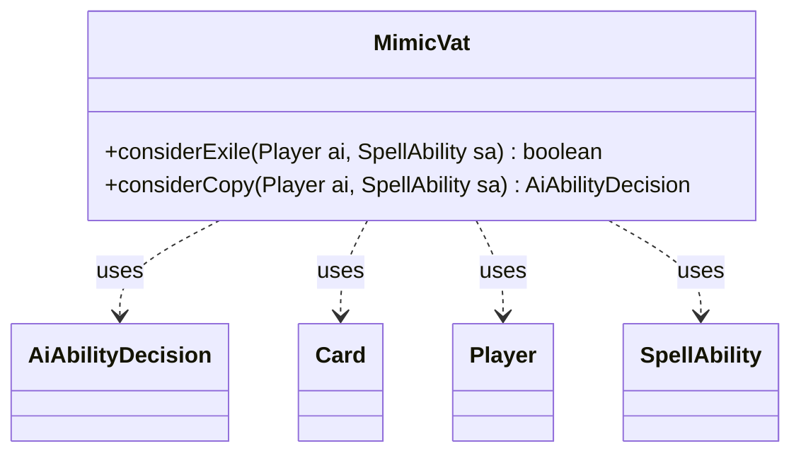

---
aliases:
  - MimicVat
tags:
  - java/class
  - module/forge-ai
  - pkg/forge/ai
fqn: forge.ai.SpecialCardAi.MimicVat
package: forge.ai
module: forge-ai
kind: Class
---

# MimicVat

**Package:** `forge.ai`   **Module:** `forge-ai`   **Kind:** Class



## Relationships
**Uses:**
- [[forge.ai.AiAbilityDecision|AiAbilityDecision]]
- [[forge.game.card.Card|Card]]
- [[forge.game.player.Player|Player]]
- [[forge.game.spellability.SpellAbility|SpellAbility]]

## Design Description

MimicVat is a static AI helper nested within `SpecialCardAi`, encapsulating the decision logic for the Mimic Vat card. It exposes two stateless utility methods that let the AI (`Player`) reason about a triggered or activated `SpellAbility`: `considerExile` decides whether a newly imprinted creature is worth replacing the currently exiled one by comparing their evaluated values, while `considerCopy` decides whether to spend the token-copy ability, returning an `AiAbilityDecision` paired with an `AiPlayDecision` rationale.

Acting purely as a behavioral collaborator rather than implementing an interface, it delegates creature valuation and combat queries to `ComputerUtilCard`, `AbilityUtils`, and the game's combat/phase state. The design intent is to favor copies that can attack immediately or stand as end-of-turn blockers, and to imprint only strictly stronger creatures—keeping card-specific heuristics isolated from the generic AI framework.

## Source
`forge-ai/src/main/java/forge/ai/SpecialCardAi.java` — declaration excerpt

```java
    // Mimic Vat
    public static class MimicVat {
        public static boolean considerExile(final Player ai, final SpellAbility sa) {
            final Card source = sa.getHostCard();
            final Card exiledWith = source.getImprintedCards().isEmpty() ? null : source.getImprintedCards().getFirst();
            final List<Card> defined = AbilityUtils.getDefinedCards(sa.getHostCard(), sa.getParam("Defined"), sa);
            final Card tgt = defined.isEmpty() ? null : defined.get(0);

            return exiledWith == null || (tgt != null && ComputerUtilCard.evaluateCreature(tgt) > ComputerUtilCard.evaluateCreature(exiledWith));
        }

        public static AiAbilityDecision considerCopy(final Player ai, final SpellAbility sa) {
            final Card source = sa.getHostCard();
            final Card exiledWith = source.getImprintedCards().isEmpty() ? null : source.getImprintedCards().getFirst();

            if (exiledWith == null) {
                return new AiAbilityDecision(0, AiPlayDecision.MissingNeededCards);
            }

            // We want to either be able to attack with the creature, or keep it until our opponent's end of turn as a
            // potential blocker
            if (ComputerUtilCard.doesSpecifiedCreatureAttackAI(ai, exiledWith)
                    || (ai.getGame().getPhaseHandler().getPlayerTurn().isOpponentOf(ai) && ai.getGame().getCombat() != null
                    && !ai.getGame().getCombat().getAttackers().isEmpty())) {
                return new AiAbilityDecision(100, AiPlayDecision.WillPlay);
            } else {
                return new AiAbilityDecision(0, AiPlayDecision.CantPlayAi);
            }
        }
    }
```
