---
aliases:
  - MomirVigAvatar
tags:
  - java/class
  - module/forge-ai
  - pkg/forge/ai
fqn: forge.ai.SpecialCardAi.MomirVigAvatar
package: forge.ai
module: forge-ai
kind: Class
---

# MomirVigAvatar

**Package:** `forge.ai`   **Module:** `forge-ai`   **Kind:** Class



```mermaid
classDiagram
    class MomirVigAvatar {
        +consider(Player ai, SpellAbility sa) AiAbilityDecision
    }
    MomirVigAvatar ..> AiAbilityDecision : uses
    MomirVigAvatar ..> AiController : uses
    MomirVigAvatar ..> Card : uses
    MomirVigAvatar ..> Player : uses
    MomirVigAvatar ..> PlayerControllerAi : uses
    MomirVigAvatar ..> SpellAbility : uses
```

## Relationships
**Uses:**
- [[forge.ai.AiAbilityDecision|AiAbilityDecision]]
- [[forge.ai.AiController|AiController]]
- [[forge.ai.PlayerControllerAi|PlayerControllerAi]]
- [[forge.game.card.Card|Card]]
- [[forge.game.player.Player|Player]]
- [[forge.game.spellability.SpellAbility|SpellAbility]]

## Design Description

MomirVigAvatar is a static nested AI strategy helper within `SpecialCardAi` that encapsulates the computer player's decision logic for the Momir Vig, Simic Visionary Avatar ability, which spends X mana to create a random creature token. Its sole responsibility is the `consider` method, which evaluates a candidate `SpellAbility` for a given `Player` and returns an `AiAbilityDecision` pairing a confidence score with a play verdict.

Acting as a self-contained policy object rather than implementing a shared interface, it collaborates with the host `Card` and game state to gate activation by phase and game variant—deferring in the MoJhoSto variant to occasionally favor Jhoira, and reaching the concrete `AiController` via a `PlayerControllerAi` cast to read tunable AI properties. It computes the maximum affordable X, declines tokens smaller than two, caps the value at eleven, and commits the payment. The design intent is to externalize per-card heuristics into focused, testable units keyed by tunable thresholds.

## Source
`forge-ai/src/main/java/forge/ai/SpecialCardAi.java` — declaration excerpt

```java
    // Momir Vig, Simic Visionary Avatar
    public static class MomirVigAvatar {
        public static AiAbilityDecision consider(final Player ai, final SpellAbility sa) {
            Card source = sa.getHostCard();

            if (source.getGame().getPhaseHandler().getPhase().isBefore(PhaseType.MAIN1)) {
                return new AiAbilityDecision(0, AiPlayDecision.AnotherTime);
            }

            // In MoJhoSto, prefer Jhoira sorcery ability from time to time
            if (source.getGame().getRules().hasAppliedVariant(GameType.MoJhoSto)
                    && CardLists.filter(ai.getLandsInPlay(), CardPredicates.UNTAPPED).size() >= 3) {
                AiController aic = ((PlayerControllerAi) ai.getController()).getAi();
                int chanceToPrefJhoira = aic.getIntProperty(AiProps.MOJHOSTO_CHANCE_TO_PREFER_JHOIRA_OVER_MOMIR);
                int numLandsForJhoira = aic.getIntProperty(AiProps.MOJHOSTO_NUM_LANDS_TO_ACTIVATE_JHOIRA);

                if (ai.getLandsInPlay().size() >= numLandsForJhoira && MyRandom.percentTrue(chanceToPrefJhoira)) {
                    return new AiAbilityDecision(0, AiPlayDecision.AnotherTime);
                }
            }

            // Set PayX here to maximum value.
            int tokenSize = ComputerUtilCost.setMaxXValue(sa, ai, false);

            // Some basic strategy for Momir
            if (tokenSize < 2) {
                return new AiAbilityDecision(0, AiPlayDecision.AnotherTime);
            }

            if (tokenSize > 11) {
                tokenSize = 11;
            }

            sa.setXManaCostPaid(tokenSize);

            return new AiAbilityDecision(100, AiPlayDecision.WillPlay);
        }
    }
```
