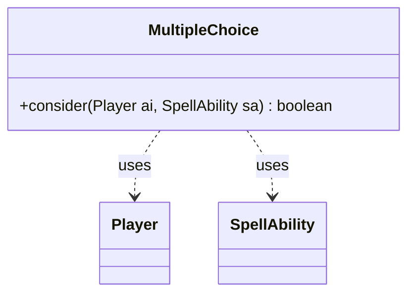

---
aliases:
  - MultipleChoice
tags:
  - java/class
  - module/forge-ai
  - pkg/forge/ai
fqn: forge.ai.SpecialCardAi.MultipleChoice
package: forge.ai
module: forge-ai
kind: Class
---

# MultipleChoice

**Package:** `forge.ai`   **Module:** `forge-ai`   **Kind:** Class



## Relationships
**Uses:**
- [[forge.game.player.Player|Player]]
- [[forge.game.spellability.SpellAbility|SpellAbility]]

## Design Description

The MultipleChoice class is a small, stateless AI helper nested within SpecialCardAi, encapsulating the decision logic for a specific Magic card whose X cost selects among escalating combined effects (scry/draw, bounce, token creation, or all). Its single static `consider` method evaluates whether the computer-controlled `Player` should cast the given `SpellAbility` and, if so, commits to a tier by setting the paid X value.

Acting as a pure utility rather than part of a class hierarchy, it has no supertype and collaborates only transiently with `Player` and `SpellAbility`, delegating affordability and board evaluation to cost and card-evaluation utilities. The cascading boolean guards encode a greedy preference for the highest worthwhile mode, with hardcoded heuristic thresholds (and TODO notes) revealing intent to later generalize these values into AI profiles.

## Source
`forge-ai/src/main/java/forge/ai/SpecialCardAi.java` — declaration excerpt

```java
    // Multiple Choice
    public static class MultipleChoice {
        public static boolean consider(final Player ai, final SpellAbility sa) {
            int maxX = ComputerUtilCost.setMaxXValue(sa, ai, false);

            if (maxX == 0) {
                return false;
            }

            boolean canScryDraw = maxX >= 1 && ai.getCardsIn(ZoneType.Library).size() >= 3; // TODO: generalize / use profile values
            boolean canBounce = maxX >= 2 && !ai.getOpponents().getCreaturesInPlay().isEmpty();
            boolean shouldBounce = canBounce && ComputerUtilCard.evaluateCreature(ComputerUtilCard.getWorstCreatureAI(ai.getOpponents().getCreaturesInPlay())) > 210; // 180 is the level of a 4/4 token creature
            boolean canMakeToken = maxX >= 3;
            boolean canDoAll = maxX >= 4 && canScryDraw && shouldBounce;

            if (canDoAll) {
                sa.setXManaCostPaid(4);
                return true;
            } else if (canMakeToken) {
                sa.setXManaCostPaid(3);
                return true;
            } else if (shouldBounce) {
                sa.setXManaCostPaid(2);
                return true;
            } else if (canScryDraw) {
                sa.setXManaCostPaid(1);
                return true;
            }

            return false;
        }
    }
```
