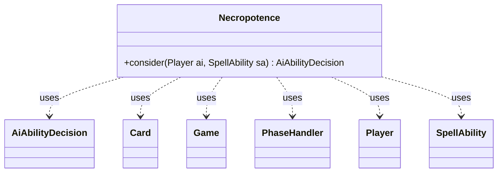

---
aliases:
  - Necropotence
tags:
  - java/class
  - module/forge-ai
  - pkg/forge/ai
fqn: forge.ai.SpecialCardAi.Necropotence
package: forge.ai
module: forge-ai
kind: Class
---

# Necropotence

**Package:** `forge.ai`   **Module:** `forge-ai`   **Kind:** Class



## Relationships
**Uses:**
- [[forge.ai.AiAbilityDecision|AiAbilityDecision]]
- [[forge.game.Game|Game]]
- [[forge.game.card.Card|Card]]
- [[forge.game.phase.PhaseHandler|PhaseHandler]]
- [[forge.game.player.Player|Player]]
- [[forge.game.spellability.SpellAbility|SpellAbility]]

## Design Description

Necropotence is a stateless AI helper, nested within `SpecialCardAi`, that decides whether the computer should activate the Necropotence card's draw-by-exile ability. Its sole `consider` method takes the controlling `Player` and the candidate `SpellAbility` and returns an `AiAbilityDecision` pairing a confidence score with an `AiPlayDecision` verdict (e.g. `WillPlay`, `CantPlayAi`, `WaitForMain2`). To reach that verdict it inspects game state—hand and library zones, max hand size, cards exiled face-down by Necropotence, and the current phase via `Game` and `PhaseHandler`—and collaborates with `Card` to detect interacting permanents such as Yawgmoth's Bargain and Black Vise.

The design intent is conservative, turn-aware play: it restricts activation to the AI's own second main phase, avoids over-drawing into hand-size discard or Black Vise damage, and only loots aggressively when stuck with nothing castable. Inline TODOs flag unhandled edge cases (draw-punisher effects), marking it as heuristic, evolving card-specific logic rather than a general framework.

## Source
`forge-ai/src/main/java/forge/ai/SpecialCardAi.java` — declaration excerpt

```java
    // Necropotence
    public static class Necropotence {
        public static AiAbilityDecision consider(final Player ai, final SpellAbility sa) {
            Game game = ai.getGame();
            int computerHandSize = ai.getZone(ZoneType.Hand).size();
            int maxHandSize = ai.getMaxHandSize();

            if (ai.getCardsIn(ZoneType.Library).isEmpty()) {
                return new AiAbilityDecision(0, AiPlayDecision.CantPlayAi);
            }

            if (ai.getCardsIn(ZoneType.Battlefield).anyMatch(CardPredicates.nameEquals("Yawgmoth's Bargain"))) {
                // Prefer Yawgmoth's Bargain because AI is generally better with it

                // TODO: in presence of bad effects which deal damage when a card is drawn, probably better to prefer Necropotence instead?
                // (not sure how to detect the presence of such effects yet)
                return new AiAbilityDecision(0, AiPlayDecision.CantPlayAi);
            }

            PhaseHandler ph = game.getPhaseHandler();

            int exiledWithNecro = 1; // start with 1 because if this succeeds, one extra card will be exiled with Necro
            for (Card c : ai.getCardsIn(ZoneType.Exile)) {
                if (c.getExiledWith() != null && "Necropotence".equals(c.getExiledWith().getName()) && c.isFaceDown()) {
                    exiledWithNecro++;
                }
            }

            // TODO: Any other bad effects like that?
            boolean blackViseOTB = game.getCardsIn(ZoneType.Battlefield).anyMatch(CardPredicates.nameEquals("Black Vise"));

            if (ph.getNextTurn().equals(ai) && ph.is(PhaseType.MAIN2)
                    && ai.getSpellsCastLastTurn() == 0
                    && ai.getSpellsCastThisTurn() == 0
                    && ai.getLandsPlayedLastTurn() == 0) {
                // We're in a situation when we have nothing castable in hand, something needs to be done
                if (!blackViseOTB) {
                    // exile-loot +1 card when at max hand size, hoping to get a workable spell or land
                    if (computerHandSize + exiledWithNecro - 1 == maxHandSize) {
                        return new AiAbilityDecision(100, AiPlayDecision.WillPlay);
                    } else {
                        return new AiAbilityDecision(0, AiPlayDecision.CantPlayAi);
                    }
                } else {
                    // Loot to 7 in presence of Black Vise, hoping to find what to do
                    // NOTE: can still currently get theoretically locked with 7 uncastable spells. Loot to 8 instead?
                    if (computerHandSize + exiledWithNecro <= maxHandSize) {
                        // Loot to 7, hoping to find something playable
                        return new AiAbilityDecision(100, AiPlayDecision.WillPlay);
                    } else {
                        // Loot to 8, hoping to find something playable
                        return new AiAbilityDecision(0, AiPlayDecision.CantPlayAi);
                    }
                }
            } else if (blackViseOTB && computerHandSize + exiledWithNecro - 1 >= 4) {
                // try not to overdraw in presence of Black Vise
                return new AiAbilityDecision(0, AiPlayDecision.CantPlayAi);
            } else if (computerHandSize + exiledWithNecro - 1 >= maxHandSize) {
                // Only draw until we reach max hand size
                return new AiAbilityDecision(0, AiPlayDecision.CantPlayAi);
            } else if (!ph.isPlayerTurn(ai) || !ph.is(PhaseType.MAIN2)) {
                // Only activate in AI's own turn (sans the exception above)
                return new AiAbilityDecision(0, AiPlayDecision.WaitForMain2);
            }
            return new AiAbilityDecision(100, AiPlayDecision.WillPlay);
        }
    }
```
