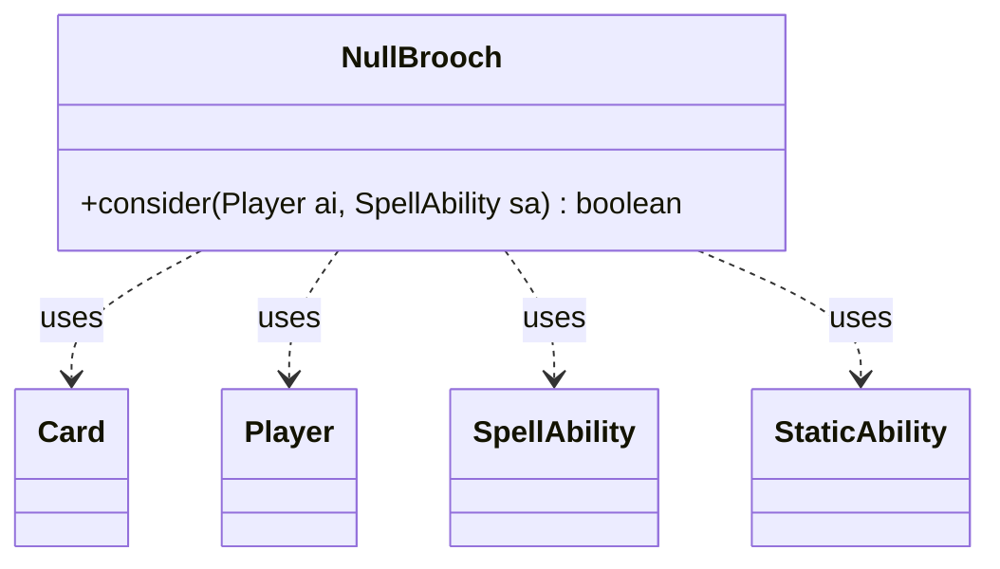

---
aliases:
  - NullBrooch
tags:
  - java/class
  - module/forge-ai
  - pkg/forge/ai
fqn: forge.ai.SpecialCardAi.NullBrooch
package: forge.ai
module: forge-ai
kind: Class
---

# NullBrooch

**Package:** `forge.ai`   **Module:** `forge-ai`   **Kind:** Class



## Relationships
**Uses:**
- [[forge.game.card.Card|Card]]
- [[forge.game.player.Player|Player]]
- [[forge.game.spellability.SpellAbility|SpellAbility]]
- [[forge.game.staticability.StaticAbility|StaticAbility]]

## Design Description

The NullBrooch class is a static AI helper nested within SpecialCardAi that encapsulates the decision logic for the Null Brooch card. Its sole responsibility is to evaluate, via the static `consider` method, whether the AI should activate the card's ability given a Player and SpellAbility. It collaborates with the game-state model—querying Player zones for cards in hand and on the battlefield, and inspecting each Card's StaticAbility entries—to detect an "Ensnaring Bridge"-style effect that penalizes a full hand.

As a self-contained utility holder rather than an implementer of a shared AI interface, it reflects Forge's pattern of isolating per-card special-case heuristics. The code returns true when the AI holds at most one card or such a bridge effect is present, deliberately favoring emptying the hand. Inline TODO comments flag the brittle, hard-coded effect detection ("GTX"/"X" SVar matching) as intended for future generalization.

## Source
`forge-ai/src/main/java/forge/ai/SpecialCardAi.java` — declaration excerpt

```java
    // Null Brooch
    public static class NullBrooch {
        public static boolean consider(final Player ai, final SpellAbility sa) {
            // TODO: improve the detection of Ensnaring Bridge type effects ("GTX", "X" need generalization)
            boolean hasEnsnaringBridgeEffect = false;
            for (Card otb : ai.getCardsIn(ZoneType.Battlefield)) {
                for (StaticAbility stab : otb.getStaticAbilities()) {
                    if ("CARDNAME can't attack.".equals(stab.getParam("AddHiddenKeyword"))
                            && "Creature.powerGTX".equals(stab.getParam("Affected"))
                            && "Count$InYourHand".equals(otb.getSVar("X"))) {
                        hasEnsnaringBridgeEffect = true;
                        break;
                    }
                }

            }
            // Maybe use it for some important high-impact spells even if there are more cards in hand?
            return ai.getCardsIn(ZoneType.Hand).size() <= 1 || hasEnsnaringBridgeEffect;
        }
    }
```

## Python
`forge/ai/SpecialCardAi/NullBrooch.py`

```python
from forge.game.card.Card import Card
from forge.game.player.Player import Player
from forge.game.spellability.SpellAbility import SpellAbility
from forge.game.staticability.StaticAbility import StaticAbility
from forge.game.zone.ZoneType import ZoneType


# Null Brooch
class NullBrooch:
    @staticmethod
    def consider(ai: Player, sa: SpellAbility) -> bool:
        # TODO: improve the detection of Ensnaring Bridge type effects ("GTX", "X" need generalization)
        hasEnsnaringBridgeEffect = False
        for otb in ai.getCardsIn(ZoneType.Battlefield):
            for stab in otb.getStaticAbilities():
                if ("CARDNAME can't attack." == stab.getParam("AddHiddenKeyword")
                        and "Creature.powerGTX" == stab.getParam("Affected")
                        and "Count$InYourHand" == otb.getSVar("X")):
                    hasEnsnaringBridgeEffect = True
                    break

        # Maybe use it for some important high-impact spells even if there are more cards in hand?
        return len(ai.getCardsIn(ZoneType.Hand)) <= 1 or hasEnsnaringBridgeEffect
```
