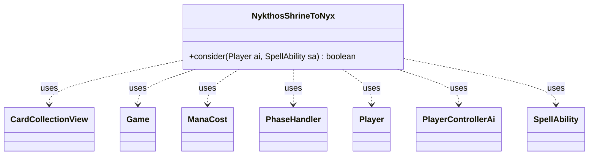

---
aliases:
  - NykthosShrineToNyx
tags:
  - java/class
  - module/forge-ai
  - pkg/forge/ai
fqn: forge.ai.SpecialCardAi.NykthosShrineToNyx
package: forge.ai
module: forge-ai
kind: Class
---

# NykthosShrineToNyx

**Package:** `forge.ai`   **Module:** `forge-ai`   **Kind:** Class



## Relationships
**Uses:**
- [[forge.ai.PlayerControllerAi|PlayerControllerAi]]
- [[forge.card.mana.ManaCost|ManaCost]]
- [[forge.game.Game|Game]]
- [[forge.game.card.CardCollectionView|CardCollectionView]]
- [[forge.game.phase.PhaseHandler|PhaseHandler]]
- [[forge.game.player.Player|Player]]
- [[forge.game.spellability.SpellAbility|SpellAbility]]

## Design Description

Nykthos, Shrine to Nyx is a special-case AI decision helper, implemented as a static nested class within `SpecialCardAi` exposing a single static `consider(Player, SpellAbility)` method. Its responsibility is to decide whether the AI should activate Nykthos's devotion-based mana ability, returning `true` only when doing so yields a usable advantage. It collaborates with the game model—querying `Game` and `PhaseHandler` for timing (restricted to the controller's Main 2), measuring devotion to the most prominent color, and weighing that mana against each candidate `SpellAbility`'s `ManaCost`.

The design intent is to avoid wasted activations: it gates on devotion exceeding activation cost, scans abilities across the player's `CardCollectionView` zones, filters by payability and color profile, guards against infinite recursion, and ultimately defers to `PlayerControllerAi`'s own play decision before committing. As a stateless utility, it encapsulates card-specific heuristics outside the engine's general AI logic.

## Source
`forge-ai/src/main/java/forge/ai/SpecialCardAi.java` — declaration excerpt

```java
    // Nykthos, Shrine to Nyx
    public static class NykthosShrineToNyx {
        public static boolean consider(final Player ai, final SpellAbility sa) {
            Game game = ai.getGame();
            PhaseHandler ph = game.getPhaseHandler();
            if (!ph.isPlayerTurn(ai) || ph.getPhase().isBefore(PhaseType.MAIN2)) {
                // TODO: currently limited to Main 2, somehow improve to let the AI use this SA at other time?
                return false;
            }
            String prominentColor = ComputerUtilCard.getMostProminentColor(ai.getCardsIn(ZoneType.Battlefield));
            int devotion = AbilityUtils.calculateAmount(sa.getHostCard(), "Count$Devotion." + prominentColor, sa);
            int activationCost = sa.getPayCosts().getTotalMana().getCMC() + (sa.getPayCosts().hasTapCost() ? 1 : 0);

            // do not use this SA if devotion to most prominent color is less than its own activation cost + 1 (to actually get advantage)
            if (devotion < activationCost + 1) {
                return false;
            }

            final CardCollectionView cards = ai.getCardsIn(Arrays.asList(ZoneType.Hand, ZoneType.Battlefield, ZoneType.Command));
            List<SpellAbility> all = ComputerUtilAbility.getSpellAbilities(cards, ai);

            int numManaSrcs = CardLists.filter(ComputerUtilMana.getAvailableManaSources(ai, true), CardPredicates.UNTAPPED).size();

            for (final SpellAbility testSa : ComputerUtilAbility.getOriginalAndAltCostAbilities(all, ai)) {
                ManaCost cost = testSa.getPayCosts().getTotalMana();
                boolean canPayWithAvailableColors = cost.canBePaidWithAvailable(ColorSet.fromNames(
                        ComputerUtilCost.getAvailableManaColors(ai, sa.getHostCard())).getColor());

                byte colorProfile = cost.getColorProfile();

                if (cost.getCMC() == 0 && cost.countX() == 0) {
                    // no mana cost, no need to activate this SA then (additional mana not needed)
                    continue;
                } else if (colorProfile != 0 && !canPayWithAvailableColors
                        && (cost.getColorProfile() & MagicColor.fromName(prominentColor)) == 0) {
                    // don't have at least one of each shard required to pay, so most likely won't be able to pay
                    continue;
                } else if ((testSa.getPayCosts().getTotalMana().getCMC() > devotion + numManaSrcs - activationCost)) {
                    // the cost may be too high even if we activate this SA
                    continue;
                }

                if (ComputerUtilAbility.getAbilitySourceName(testSa).equals(ComputerUtilAbility.getAbilitySourceName(sa))
                        || testSa.hasParam("AINoRecursiveCheck")) {
                    // prevent infinitely recursing abilities that are susceptible to reentry
                    continue;
                }

                testSa.setActivatingPlayer(ai);
                if (((PlayerControllerAi) ai.getController()).getAi().canPlaySa(testSa) == AiPlayDecision.WillPlay) {
                    // the AI is willing to play the spell
                    return true;
                }
            }

            return false; // haven't found anything to play with the excess generated mana
        }
    }
```

## Python
`forge/ai/SpecialCardAi/NykthosShrineToNyx.py`

```python
from forge.ai.PlayerControllerAi import PlayerControllerAi
from forge.card.mana.ManaCost import ManaCost
from forge.game.Game import Game
from forge.game.card.CardCollectionView import CardCollectionView
from forge.game.phase.PhaseHandler import PhaseHandler
from forge.game.player.Player import Player
from forge.game.spellability.SpellAbility import SpellAbility

from forge.ai.AbilityUtils import AbilityUtils
from forge.ai.AiPlayDecision import AiPlayDecision
from forge.ai.ComputerUtilAbility import ComputerUtilAbility
from forge.ai.ComputerUtilCard import ComputerUtilCard
from forge.ai.ComputerUtilCost import ComputerUtilCost
from forge.ai.ComputerUtilMana import ComputerUtilMana
from forge.card.ColorSet import ColorSet
from forge.card.MagicColor import MagicColor
from forge.game.card.CardLists import CardLists
from forge.game.card.CardPredicates import CardPredicates
from forge.game.phase.PhaseType import PhaseType
from forge.game.zone.ZoneType import ZoneType


# Nykthos, Shrine to Nyx
class NykthosShrineToNyx:
    @staticmethod
    def consider(ai: Player, sa: SpellAbility) -> bool:
        game = ai.getGame()
        ph = game.getPhaseHandler()
        if not ph.isPlayerTurn(ai) or ph.getPhase().isBefore(PhaseType.MAIN2):
            # TODO: currently limited to Main 2, somehow improve to let the AI use this SA at other time?
            return False
        prominentColor = ComputerUtilCard.getMostProminentColor(ai.getCardsIn(ZoneType.Battlefield))
        devotion = AbilityUtils.calculateAmount(sa.getHostCard(), "Count$Devotion." + prominentColor, sa)
        activationCost = sa.getPayCosts().getTotalMana().getCMC() + (1 if sa.getPayCosts().hasTapCost() else 0)

        # do not use this SA if devotion to most prominent color is less than its own activation cost + 1 (to actually get advantage)
        if devotion < activationCost + 1:
            return False

        cards = ai.getCardsIn([ZoneType.Hand, ZoneType.Battlefield, ZoneType.Command])
        all = ComputerUtilAbility.getSpellAbilities(cards, ai)

        numManaSrcs = len(CardLists.filter(ComputerUtilMana.getAvailableManaSources(ai, True), CardPredicates.UNTAPPED))

        for testSa in ComputerUtilAbility.getOriginalAndAltCostAbilities(all, ai):
            cost = testSa.getPayCosts().getTotalMana()
            canPayWithAvailableColors = cost.canBePaidWithAvailable(ColorSet.fromNames(
                    ComputerUtilCost.getAvailableManaColors(ai, sa.getHostCard())).getColor())

            colorProfile = cost.getColorProfile()

            if cost.getCMC() == 0 and cost.countX() == 0:
                # no mana cost, no need to activate this SA then (additional mana not needed)
                continue
            elif (colorProfile != 0 and not canPayWithAvailableColors
                    and (cost.getColorProfile() & MagicColor.fromName(prominentColor)) == 0):
                # don't have at least one of each shard required to pay, so most likely won't be able to pay
                continue
            elif testSa.getPayCosts().getTotalMana().getCMC() > devotion + numManaSrcs - activationCost:
                # the cost may be too high even if we activate this SA
                continue

            if (ComputerUtilAbility.getAbilitySourceName(testSa) == ComputerUtilAbility.getAbilitySourceName(sa)
                    or testSa.hasParam("AINoRecursiveCheck")):
                # prevent infinitely recursing abilities that are susceptible to reentry
                continue

            testSa.setActivatingPlayer(ai)
            if ai.getController().getAi().canPlaySa(testSa) == AiPlayDecision.WillPlay:
                # the AI is willing to play the spell
                return True

        return False  # haven't found anything to play with the excess generated mana
```
