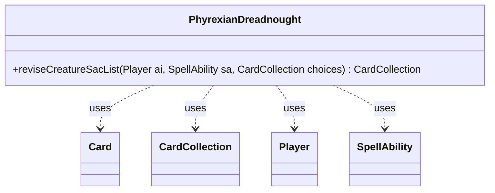

---
aliases:
  - PhyrexianDreadnought
tags:
  - java/class
  - module/forge-ai
  - pkg/forge/ai
fqn: forge.ai.SpecialCardAi.PhyrexianDreadnought
package: forge.ai
module: forge-ai
kind: Class
---

# PhyrexianDreadnought

**Package:** `forge.ai`   **Module:** `forge-ai`   **Kind:** Class



## Relationships
**Uses:**
- [[forge.game.card.Card|Card]]
- [[forge.game.card.CardCollection|CardCollection]]
- [[forge.game.player.Player|Player]]
- [[forge.game.spellability.SpellAbility|SpellAbility]]

## Design Description

PhyrexianDreadnought is a stateless AI helper nested within `SpecialCardAi`, encapsulating the card-specific sacrifice logic for the Phyrexian Dreadnought creature. Its single static method, `reviseCreatureSacList`, filters and prioritizes a `CardCollection` of sacrifice candidates so the AI surrenders just enough power to satisfy the Dreadnought's requirement (total net power of 12) without overpaying.

Acting as a pure utility rather than part of an inheritance hierarchy, it collaborates with the engine's core types—reading each `Card`'s net power, consulting the controlling `Player` and the triggering `SpellAbility` for context, and returning a new `CardCollection`. The design intent is evident in its greedy heuristic: candidates are sorted by a cached creature comparator, the Dreadnought itself and powerless creatures are skipped, and accumulation stops once the threshold is met—keeping the AI's sacrifice choices both legal and resource-efficient.

## Source
`forge-ai/src/main/java/forge/ai/SpecialCardAi.java` — declaration excerpt

```java
    // Phyrexian Dreadnought
    public static class PhyrexianDreadnought {
        public static CardCollection reviseCreatureSacList(final Player ai, final SpellAbility sa, final CardCollection choices) {
            choices.sort(ComputerUtilCard.getCachedCreatureComparator());
            int power = 0;
            List<Card> toKeep = Lists.newArrayList();
            for (Card c : choices) {
                if (c.getName().equals(ComputerUtilAbility.getAbilitySourceName(sa))) {
                    continue; // not worth it sac'ing another Dreadnaught
                }
                if (c.getNetPower() < 1) {
                    continue; // contributes nothing to Dreadnought requirements
                }
                if (power >= 12) {
                    break;
                }
                toKeep.add(c);
                power += c.getNetPower();
            }

            return new CardCollection(toKeep);
        }
    }
```

## Python
`forge/ai/SpecialCardAi/PhyrexianDreadnought.py`

```python
from forge.game.card.Card import Card
from forge.game.card.CardCollection import CardCollection
from forge.game.player.Player import Player
from forge.game.spellability.SpellAbility import SpellAbility
from forge.ai.ComputerUtilCard import ComputerUtilCard
from forge.ai.ComputerUtilAbility import ComputerUtilAbility


# Phyrexian Dreadnought
class PhyrexianDreadnought:
    @staticmethod
    def reviseCreatureSacList(ai: Player, sa: SpellAbility, choices: CardCollection) -> CardCollection:
        choices.sort(ComputerUtilCard.getCachedCreatureComparator())
        power = 0
        toKeep: list[Card] = []
        for c in choices:
            if c.getName() == ComputerUtilAbility.getAbilitySourceName(sa):
                continue  # not worth it sac'ing another Dreadnaught
            if c.getNetPower() < 1:
                continue  # contributes nothing to Dreadnought requirements
            if power >= 12:
                break
            toKeep.append(c)
            power += c.getNetPower()

        return CardCollection(toKeep)
```
