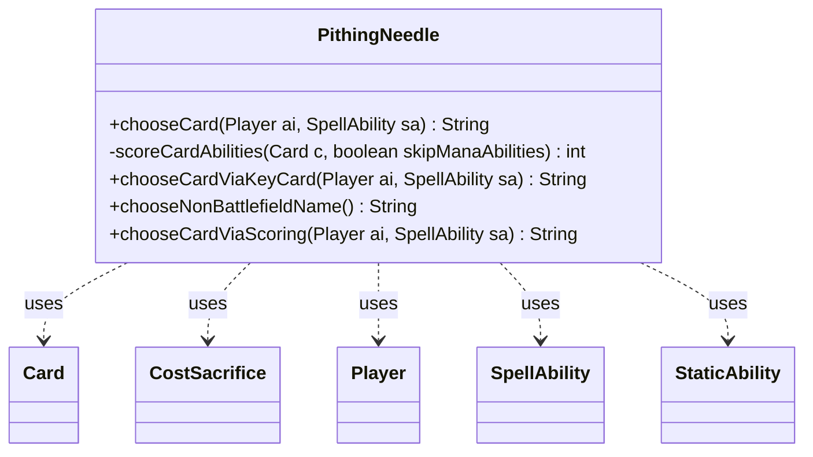

---
aliases:
  - PithingNeedle
tags:
  - java/class
  - module/forge-ai
  - pkg/forge/ai
fqn: forge.ai.SpecialCardAi.PithingNeedle
package: forge.ai
module: forge-ai
kind: Class
---

# PithingNeedle

**Package:** `forge.ai`   **Module:** `forge-ai`   **Kind:** Class



## Relationships
**Uses:**
- [[forge.game.card.Card|Card]]
- [[forge.game.cost.CostSacrifice|CostSacrifice]]
- [[forge.game.player.Player|Player]]
- [[forge.game.spellability.SpellAbility|SpellAbility]]
- [[forge.game.staticability.StaticAbility|StaticAbility]]

## Design Description

PithingNeedle is a nested static helper within `SpecialCardAi` that encapsulates the AI's logic for choosing which card name to declare when resolving name-naming effects such as Pithing Needle, Phyrexian Revoker, and Sorcerous Spyglass (distinguished via the `AILogic` parameter). As a stateless utility, it exposes `chooseCard` as the entry point, which cascades through three strategies: prioritizing an opponent's deck-registered key cards, then scoring all known opponent cards by threat, then falling back to a hardcoded default. Collaborating with `Player`, `Card`, `SpellAbility`, and `StaticAbility`, it inspects activated and static abilities—weighting dangerous APIs (WinsGame, DestroyAll), cheap mana costs, and `CostSacrifice` requirements—to rank candidates. The design intent is a reusable, heuristic scoring core (`scoreCardAbilities`) shared across strategies, with adjustments that avoid redundantly naming already-named or self-owned cards.

## Source
`forge-ai/src/main/java/forge/ai/SpecialCardAi.java` — declaration excerpt

```java
    public static class PithingNeedle {
        // TODO Build out exclusion list based off cards in my deck and cards that other needles have chosen
        public static String chooseCard(final Player ai, final SpellAbility sa) {
            String keyCardChoice = chooseCardViaKeyCard(ai, sa);
            if (keyCardChoice != null) {
                return keyCardChoice;
            }

            String choice = chooseCardViaScoring(ai, sa);
            if (choice != null) {
                return choice;
            }
            return chooseNonBattlefieldName();
        }

        // Helper method to score a card's abilities and static effects
        // Used by both chooseCardViaKeyCard and chooseCardViaScoring
        private static int scoreCardAbilities(final Card c, boolean skipManaAbilities) {
            int score = 0;

            for (SpellAbility ab : c.getSpellAbilities()) {
                if (!ab.isActivatedAbility()) {
                    continue;
                }
                if (skipManaAbilities && ab.isManaAbility()) {
                    continue;
                }

                // Alter this score based off the ApiType
                switch (ab.getApi()) {
                    case Destroy:
                        score += 20;
                        break;
                    case DamageAll:
                    case DestroyAll:
                        score += 30;
                        break;
                    case WinsGame:
                    case LosesGame:
                        score += 50;
                        break;
                    case Draw:
                        score += 10;
                        break;
                    case GainControl:
                    case Play:
                    case DealDamage:
                        score += 15;
                        break;
                    case ChangeZone:
                        if (ab.getParam("Destination") != null && ab.getParam("Destination").equals("Battlefield")) {
                            score += 15;
                        } else {
                            score += 5;
                        }
                        break;
                    default:
                        score += 5;
                }

                score += 10;

                // Give higher score to cheaper abilities, as they are more likely to be used and thus worth naming
                if (ab.getPayCosts().getCostMana() != null) {
                    if (ab.getPayCosts().hasXInAnyCostPart()) {
                        score += 15;
                    } else {
                        Integer convertedAmount = ab.getPayCosts().getCostMana().convertAmount();
                        if (convertedAmount != null) {
                            score += Math.max(0, 20 - Math.pow(convertedAmount, 2));
                        }
                    }
                }
                if (ab.getPayCosts().hasSpecificCostType(CostSacrifice.class)) {
                    score += 10;
                }
            }

            for (StaticAbility st : c.getStaticAbilities()) {
                if (st.hasParam("GainsAbilitiesOf") && st.getParamOrDefault("Affected", "Self").contains("Self")) {
                    score += 10;
                }

                if (st.hasParam("AddAbility") && st.getParamOrDefault("Affected", "Self").contains("Self")) {
                    score += 10;
                }
            }

            return score;
        }

        public static String chooseCardViaKeyCard(final Player ai, final SpellAbility sa) {
            boolean skipManaAbilities = sa.getParam("AILogic").equals("PithingNeedle");
            boolean skipLands = sa.getParam("AILogic").equals("PhyrexianRevoker");
            boolean knowHand = sa.getParam("AILogic").equals("SorcerousSpyglass");

            String bestKeyCard = null;
            int bestScore = Integer.MIN_VALUE;

            for (Player opp : ai.getOpponents()) {
                List<String> keyCards = opp.getRegisteredPlayer().getDeck().getKeyCards();

                for (Card c : opp.getAllCards()) {
                    String name = c.getName();
                    if (!keyCards.contains(name)) {
                        continue;
                    }

                    // Skip lands if required
                    if (skipLands && c.isLand()) {
                        continue;
                    }

                    // Base score for key cards
                    int score = 100;

                    // Add ability-based scoring
                    score += scoreCardAbilities(c, skipManaAbilities);

                    if (score == 100) {
                        // No activated abilities found, skip this key card
                        continue;
                    }

                    // Bonus for cards on battlefield (more likely to be a key card in play)
                    if (c.isInZone(ZoneType.Battlefield)) {
                        score += 20;
                    }

                    if (knowHand && c.isInZone(ZoneType.Hand)) {
                        score += 8;
                    }

                    if (score > bestScore) {
                        bestScore = score;
                        bestKeyCard = name;
                    }
                }
            }

            return bestKeyCard;
        }

        public static String chooseNonBattlefieldName() {
            return "Liliana of the Veil";
        }


        public static String chooseCardViaScoring(final Player ai, final SpellAbility sa) {
            // Look through opponents' known zones (library, hand, graveyard, exile) for dangerous
            // cards to name with Pithing Needle. Prefer planeswalkers, otherwise any card that
            // has a non-trigger, non-mana SpellAbility (activated/static abilities that are relevant).
            final Map<String, Integer> nameToScore = new HashMap<>();
            boolean skipManaAbilities = sa.getParam("AILogic").equals("PithingNeedle");
            boolean skipLands = sa.getParam("AILogic").equals("PhyrexianRevoker");
            boolean knowHand = sa.getParam("AILogic").equals("SorcerousSpyglass");

            for (Player opp : ai.getOpponents()) {
                for (Card c : opp.getAllCards()) {
                    if (skipLands && c.isLand()) {
                        continue;
                    }

                    String name = c.getName();
                    int score = scoreCardAbilities(c, skipManaAbilities);

                    if (score == 0) {
                        continue;
                    }

                    score += c.isInZone(ZoneType.Battlefield) ? 10 : 0;
                    if (knowHand && c.isInZone(ZoneType.Hand)) {
                        score += 5;
                    }

                    if (nameToScore.containsKey(name)) {
                        nameToScore.put(name, nameToScore.get(name) + score);
                    } else {
                        nameToScore.put(name, score);
                    }
                }
            }

            for (Card n : CardLists.filter(ai.getGame().getCardsIn(ZoneType.Battlefield), CardPredicates.nameEquals("Pithing Needle"))) {
                String named = n.getNamedCard();
                if (named != null && !named.isEmpty()) {
                    if (nameToScore.containsKey(named)) {
                        nameToScore.put(named, nameToScore.get(named) - 10);
                    } else {
                        nameToScore.put(named, -10);
                    }
                }
            }

            for (Card c : ai.getAllCards()) {
                String name = c.getName();
                int score = c.isInZone(ZoneType.Battlefield) ? -10 : -4;

                if (nameToScore.containsKey(name)) {
                    nameToScore.put(name, nameToScore.get(name) + score);
                } else {
                    nameToScore.put(name, score);
                }
            }

            if (nameToScore.isEmpty()) {
                return null;
            }

            return nameToScore.entrySet().stream().max(Map.Entry.comparingByValue()).get().getKey();
        }
    }
```
