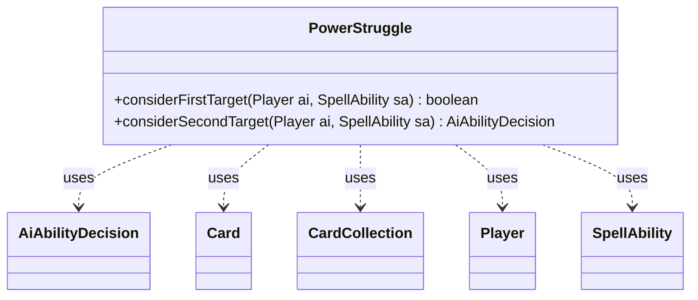

---
aliases:
  - PowerStruggle
tags:
  - java/class
  - module/forge-ai
  - pkg/forge/ai
fqn: forge.ai.SpecialCardAi.PowerStruggle
package: forge.ai
module: forge-ai
kind: Class
---

# PowerStruggle

**Package:** `forge.ai`   **Module:** `forge-ai`   **Kind:** Class



## Relationships
**Uses:**
- [[forge.ai.AiAbilityDecision|AiAbilityDecision]]
- [[forge.game.card.Card|Card]]
- [[forge.game.card.CardCollection|CardCollection]]
- [[forge.game.player.Player|Player]]
- [[forge.game.spellability.SpellAbility|SpellAbility]]

## Design Description

PowerStruggle is a static nested helper within `SpecialCardAi` that encapsulates the AI targeting logic for the "Power Struggle" card, whose effect pairs two same-type permanents. It exposes two stateless static methods that operate directly on a `SpellAbility`: `considerFirstTarget` picks and registers a random legal first target, while `considerSecondTarget` constrains candidates to opponents' battlefield cards sharing a type with the first target and returns an `AiAbilityDecision` signalling whether play is viable.

As a pure utility grouping (no state, no inheritance), it serves the broader AI decision framework, collaborating with `Card`, `CardCollection`, `Player`, and `SpellAbility` to inspect game state and using `CardPredicates` for filtering. The deliberate use of random selection over heuristic scoring reflects design intent that this symmetrical effect lacks a clear advantageous choice, so the AI settles for any legal, type-matched pairing rather than optimizing.

## Source
`forge-ai/src/main/java/forge/ai/SpecialCardAi.java` — declaration excerpt

```java
    // Power Struggle
    public static class PowerStruggle {
        public static boolean considerFirstTarget(final Player ai, final SpellAbility sa) {
            Card firstTgt = (Card) Aggregates.random(sa.getTargetRestrictions().getAllCandidates(sa, true));
            if (firstTgt != null) {
                sa.getTargets().add(firstTgt);
                return true;
            } else {
                return false;
            }
        }

        public static AiAbilityDecision considerSecondTarget(final Player ai, final SpellAbility sa) {
            Card firstTgt = sa.getParent().getTargetCard();
            CardCollection candidates = ai.getOpponents().getCardsIn(ZoneType.Battlefield).filter(
                    CardPredicates.sharesCardTypeWith(firstTgt).and(CardPredicates.isTargetableBy(sa)));
            Card secondTgt = Aggregates.random(candidates);
            if (secondTgt != null) {
                sa.resetTargets();
                sa.getTargets().add(secondTgt);
                return new AiAbilityDecision(100, AiPlayDecision.WillPlay);
            } else {
                return new AiAbilityDecision(0, AiPlayDecision.CantPlayAi);
            }
        }
    }
```
