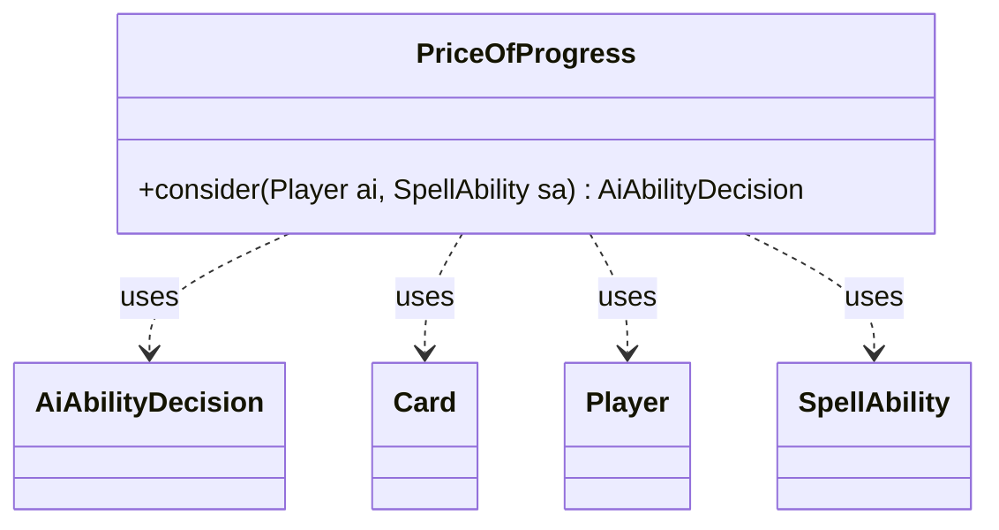

---
aliases:
  - PriceOfProgress
tags:
  - java/class
  - module/forge-ai
  - pkg/forge/ai
fqn: forge.ai.SpecialCardAi.PriceOfProgress
package: forge.ai
module: forge-ai
kind: Class
---

# PriceOfProgress

**Package:** `forge.ai`   **Module:** `forge-ai`   **Kind:** Class



## Relationships
**Uses:**
- [[forge.ai.AiAbilityDecision|AiAbilityDecision]]
- [[forge.game.card.Card|Card]]
- [[forge.game.player.Player|Player]]
- [[forge.game.spellability.SpellAbility|SpellAbility]]

## Design Description

PriceOfProgress is a static, stateless helper nested within `SpecialCardAi` that encapsulates the AI's decision logic for casting the card "Price of Progress," whose effect deals damage to each player proportional to their nonbasic lands. Its sole responsibility is exposing `consider(Player, SpellAbility)`, which weighs the symmetric damage and returns an `AiAbilityDecision` pairing a numeric score with an `AiPlayDecision` verdict (e.g., `WillPlay`, `AnotherTime`, `CantPlayAi`).

As a member of the engine's special-case AI dispatch, it collaborates with `Player` and `Card` to inspect battlefield and hand zones and with `SpellAbility` for cast context. The design intent is heuristic risk assessment: it defers in the early game, computes lethal thresholds for the AI and each opponent, exploits cards like Ensnaring Bridge that reward emptying the hand, and declines plays where the AI would proportionally lose more life than its opponents. Inline TODOs note that damage is approximated rather than precisely calculated.

## Source
`forge-ai/src/main/java/forge/ai/SpecialCardAi.java` — declaration excerpt

```java
    // Price of Progress
    public static class PriceOfProgress {
        public static AiAbilityDecision consider(final Player ai, final SpellAbility sa) {
            // Don't play in early game - opponent likely still has lands to play
            if (ai.getGame().getPhaseHandler().getTurn() < 10) {
                return new AiAbilityDecision(0, AiPlayDecision.AnotherTime);
            }

            int aiLands = CardLists.filter(ai.getCardsIn(ZoneType.Battlefield), CardPredicates.NONBASIC_LANDS).size();
            // TODO Better if we actually calculate the true damage
            boolean willDieToPCasting = (ai.getLife() <= aiLands * 2);
            if (!willDieToPCasting) {
                boolean hasBridge = false;
                for (Card c : ai.getCardsIn(ZoneType.Battlefield)) {
                    // Do we have a card in play that makes us want to empty out hand?
                    if (c.hasSVar("PreferredHandSize") && ai.getCardsIn(ZoneType.Hand).size() > Integer.parseInt(c.getSVar("PreferredHandSize"))) {
                        hasBridge = true;
                        break;
                    }
                }

                // Do if we need to lose cards to activate Ensnaring Bridge or Cursed Scroll
                // even if suboptimal play, but don't waste the card too early even then!
                if (hasBridge) {
                    return new AiAbilityDecision(100, AiPlayDecision.PlayToEmptyHand);
                }
            }

            boolean willPlay = true;
            for (Player opp : ai.getOpponents()) {
                int oppLands = CardLists.filter(opp.getCardsIn(ZoneType.Battlefield), CardPredicates.NONBASIC_LANDS).size();
                // Don't if no enemy nonbasic lands
                if (oppLands == 0) {
                    willPlay = false;
                    continue;
                }

                // Always if enemy would die and we don't!
                // TODO : predict actual damage instead of assuming it'll be 2*lands
                // Don't if we lose, unless we lose anyway to unblocked creatures next turn
                if (willDieToPCasting &&
                        (!(ComputerUtil.aiLifeInDanger(ai, true, 0)) && ((ai.getOpponentsSmallestLifeTotal()) <= oppLands * 2))) {
                    willPlay = false;
                }
                // Do if we can win
                if (opp.getLife() <= oppLands * 2) {
                    return new AiAbilityDecision(1000, AiPlayDecision.WillPlay);
                }
                // Don't if we'd lose a larger percentage of our remaining life than enemy
                if ((aiLands / ((double) ai.getLife())) >
                        (oppLands / ((double) ai.getOpponentsSmallestLifeTotal()))) {
                    willPlay = false;
                }

                // Don't if loss is equal in percentage but we lose more points
                if (((aiLands / ((double) ai.getLife())) == (oppLands / ((double) ai.getOpponentsSmallestLifeTotal())))
                        && (aiLands > oppLands)) {
                    willPlay = false;
                }

            }
            if (willPlay) {
                return new AiAbilityDecision(100, AiPlayDecision.WillPlay);
            }
            return new AiAbilityDecision(0, AiPlayDecision.CantPlayAi);
        }
    }
```
