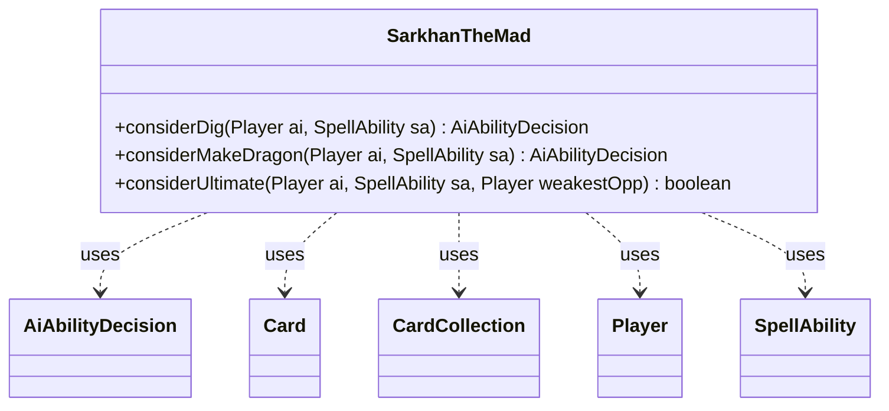

---
aliases:
  - SarkhanTheMad
tags:
  - java/class
  - module/forge-ai
  - pkg/forge/ai
fqn: forge.ai.SpecialCardAi.SarkhanTheMad
package: forge.ai
module: forge-ai
kind: Class
---

# SarkhanTheMad

**Package:** `forge.ai`   **Module:** `forge-ai`   **Kind:** Class



## Relationships
**Uses:**
- [[forge.ai.AiAbilityDecision|AiAbilityDecision]]
- [[forge.game.card.Card|Card]]
- [[forge.game.card.CardCollection|CardCollection]]
- [[forge.game.player.Player|Player]]
- [[forge.game.spellability.SpellAbility|SpellAbility]]

## Design Description

Sarkhan the Mad's AI decision logic, encapsulated as a static nested helper within `SpecialCardAi`. It groups the three loyalty-ability evaluators for the planeswalker—digging (+1), making a Dragon token from a creature (-2), and the ultimate (-4)—into one cohesive unit rather than scattering them across the general AI.

Each method is static and stateless, taking the AI `Player` and `SpellAbility` as inputs and reading game state (loyalty counters, `CardCollection`s of creatures filtered via `CardLists`/`CardPredicates`) to reach a verdict. The dig and make-Dragon methods return an `AiAbilityDecision` pairing a confidence score with an `AiPlayDecision` enum, signaling intent to the calling AI framework; `considerUltimate` returns a plain boolean gauging whether assembled Dragon power can close out the weakest opponent. The make-Dragon path also picks the worst creature via `ComputerUtilCard` and registers it as the spell's target, showing intent to minimize board sacrifice while triggering the ability.

## Source
`forge-ai/src/main/java/forge/ai/SpecialCardAi.java` — declaration excerpt

```java
    public static class SarkhanTheMad {
        public static AiAbilityDecision considerDig(final Player ai, final SpellAbility sa) {
            if (sa.getHostCard().getCounters(CounterEnumType.LOYALTY) == 1) {
                return new AiAbilityDecision(100, AiPlayDecision.WillPlay);
            } else {
                return new AiAbilityDecision(0, AiPlayDecision.CantPlayAi);
            }
        }

        public static AiAbilityDecision considerMakeDragon(final Player ai, final SpellAbility sa) {
            // TODO: expand this logic to make the AI force the opponent to sacrifice a big threat bigger than a 5/5 flier?
            CardCollection creatures = ai.getCreaturesInPlay();
            boolean hasValidTgt = !CardLists.filter(creatures, t -> t.getNetPower() < 5 && t.getNetToughness() < 5).isEmpty();
            if (hasValidTgt) {
                Card worstCreature = ComputerUtilCard.getWorstCreatureAI(creatures);
                sa.getTargets().add(worstCreature);
                return new AiAbilityDecision(100, AiPlayDecision.AddBoardPresence);
            }
            return new AiAbilityDecision(0, AiPlayDecision.CantPlayAi);
        }


        public static boolean considerUltimate(final Player ai, final SpellAbility sa, final Player weakestOpp) {
            int minLife = weakestOpp.getLife();

            int dragonPower = 0;
            CardCollection dragons = CardLists.filter(ai.getCreaturesInPlay(), CardPredicates.isType("Dragon"));
            for (Card c : dragons) {
                dragonPower += c.getNetPower();
            }

            return dragonPower >= minLife;
        }
    }
```

## Python
`forge/ai/SpecialCardAi/SarkhanTheMad.py`

```python
from forge.ai.AiAbilityDecision import AiAbilityDecision
from forge.ai.AiPlayDecision import AiPlayDecision
from forge.ai.ComputerUtilCard import ComputerUtilCard
from forge.game.card.Card import Card
from forge.game.card.CardCollection import CardCollection
from forge.game.card.CardLists import CardLists
from forge.game.card.CardPredicates import CardPredicates
from forge.game.card.CounterEnumType import CounterEnumType
from forge.game.player.Player import Player
from forge.game.spellability.SpellAbility import SpellAbility


class SarkhanTheMad:
    @staticmethod
    def considerDig(ai: Player, sa: SpellAbility) -> AiAbilityDecision:
        if sa.getHostCard().getCounters(CounterEnumType.LOYALTY) == 1:
            return AiAbilityDecision(100, AiPlayDecision.WillPlay)
        else:
            return AiAbilityDecision(0, AiPlayDecision.CantPlayAi)

    @staticmethod
    def considerMakeDragon(ai: Player, sa: SpellAbility) -> AiAbilityDecision:
        # TODO: expand this logic to make the AI force the opponent to sacrifice a big threat bigger than a 5/5 flier?
        creatures = ai.getCreaturesInPlay()
        hasValidTgt = not CardLists.filter(creatures, lambda t: t.getNetPower() < 5 and t.getNetToughness() < 5).isEmpty()
        if hasValidTgt:
            worstCreature = ComputerUtilCard.getWorstCreatureAI(creatures)
            sa.getTargets().add(worstCreature)
            return AiAbilityDecision(100, AiPlayDecision.AddBoardPresence)
        return AiAbilityDecision(0, AiPlayDecision.CantPlayAi)

    @staticmethod
    def considerUltimate(ai: Player, sa: SpellAbility, weakestOpp: Player) -> bool:
        minLife = weakestOpp.getLife()

        dragonPower = 0
        dragons = CardLists.filter(ai.getCreaturesInPlay(), CardPredicates.isType("Dragon"))
        for c in dragons:
            dragonPower += c.getNetPower()

        return dragonPower >= minLife
```
