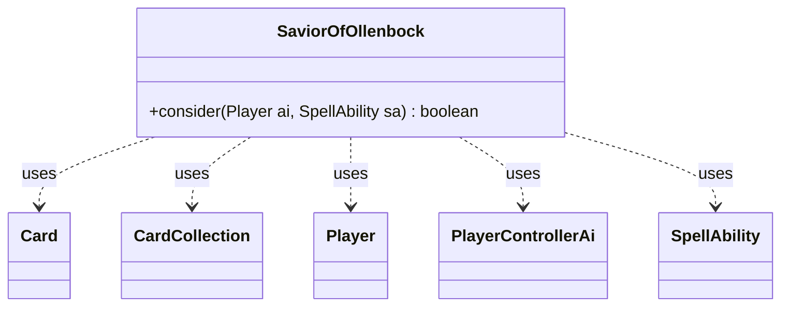

---
aliases:
  - SaviorOfOllenbock
tags:
  - java/class
  - module/forge-ai
  - pkg/forge/ai
fqn: forge.ai.SpecialCardAi.SaviorOfOllenbock
package: forge.ai
module: forge-ai
kind: Class
---

# SaviorOfOllenbock

**Package:** `forge.ai`   **Module:** `forge-ai`   **Kind:** Class



## Relationships
**Uses:**
- [[forge.ai.PlayerControllerAi|PlayerControllerAi]]
- [[forge.game.card.Card|Card]]
- [[forge.game.card.CardCollection|CardCollection]]
- [[forge.game.player.Player|Player]]
- [[forge.game.spellability.SpellAbility|SpellAbility]]

## Design Description

Savior of Ollenbock encapsulates the AI decision logic for a single Magic card, implemented as a static nested helper inside `SpecialCardAi`. Its sole `consider` method evaluates the current board state and, when appropriate, populates a `SpellAbility`'s targets, returning whether a valid target was chosen. It collaborates with `Card`, `CardCollection`, `Player`, `SpellAbility`, and reaches the AI's configurable properties through a `PlayerControllerAi` cast.

The design reflects a prioritized strategy: when the AI is threatened (low life or recent life loss with a live enemy creature), it exiles the opponent's best attacker; otherwise it reanimates its own best graveyard creature, comparing accumulated own-versus-opponent exiled value to flag the host card for sacrifice (`SacMe`) when reclaiming it would favor the AI. As a stateless, target-selecting strategy object, it keeps card-specific heuristics isolated from the general AI framework, and a `TODO` notes that its threat assessment remains deliberately simplistic.

## Source
`forge-ai/src/main/java/forge/ai/SpecialCardAi.java` — declaration excerpt

```java
    // Savior of Ollenbock
    public static class SaviorOfOllenbock {
        public static boolean consider(final Player ai, final SpellAbility sa) {
            CardCollection oppTargetables = CardLists.getTargetableCards(ai.getOpponents().getCreaturesInPlay(), sa);
            CardCollection threats = CardLists.filter(oppTargetables, card -> !ComputerUtilCard.isUselessCreature(card.getController(), card));
            CardCollection ownTgts = CardLists.filter(ai.getCardsIn(ZoneType.Graveyard), CardPredicates.CREATURES);

            // TODO: improve the conditions for when the AI is considered threatened (check the possibility of being attacked?)
            int lifeInDanger = (((PlayerControllerAi) ai.getController()).getAi().getIntProperty(AiProps.AI_IN_DANGER_THRESHOLD));
            boolean threatened = !threats.isEmpty() && ((ai.getLife() <= lifeInDanger && !ai.cantLoseForZeroOrLessLife()) || ai.getLifeLostLastTurn() + ai.getLifeLostThisTurn() > 0);

            if (threatened) {
                sa.getTargets().add(ComputerUtilCard.getBestCreatureAI(threats));
            } else if (!ownTgts.isEmpty()) {
                Card target = ComputerUtilCard.getBestCreatureAI(ownTgts);
                sa.getTargets().add(target);

                int ownExiledValue = ComputerUtilCard.evaluateCreature(target), oppExiledValue = 0;
                for (Card c : ai.getGame().getCardsIn(ZoneType.Exile)) {
                    if (c.getExiledWith() == sa.getHostCard()) {
                        if (c.getOwner() == ai) {
                            ownExiledValue += ComputerUtilCard.evaluateCreature(c);
                        } else {
                            oppExiledValue += ComputerUtilCard.evaluateCreature(c);
                        }
                    }
                }
                if (ownExiledValue > oppExiledValue + 150) {
                    sa.getHostCard().setSVar("SacMe", "5");
                } else {
                    sa.getHostCard().removeSVar("SacMe");
                }
            } else if (!threats.isEmpty()) {
                sa.getTargets().add(ComputerUtilCard.getBestCreatureAI(threats));
            }

            return sa.isTargetNumberValid();
        }
    }
```

## Python
`forge/ai/SpecialCardAi/SaviorOfOllenbock.py`

```python
from typing import cast

from forge.ai.PlayerControllerAi import PlayerControllerAi
from forge.ai.ComputerUtilCard import ComputerUtilCard
from forge.ai.AiProps import AiProps
from forge.game.card.Card import Card
from forge.game.card.CardCollection import CardCollection
from forge.game.card.CardLists import CardLists
from forge.game.card.CardPredicates import CardPredicates
from forge.game.player.Player import Player
from forge.game.spellability.SpellAbility import SpellAbility
from forge.game.zone.ZoneType import ZoneType


class SaviorOfOllenbock:
    @staticmethod
    def consider(ai: Player, sa: SpellAbility) -> bool:
        oppTargetables: CardCollection = CardLists.getTargetableCards(ai.getOpponents().getCreaturesInPlay(), sa)
        threats: CardCollection = CardLists.filter(oppTargetables, lambda card: not ComputerUtilCard.isUselessCreature(card.getController(), card))
        ownTgts: CardCollection = CardLists.filter(ai.getCardsIn(ZoneType.Graveyard), CardPredicates.CREATURES)

        # TODO: improve the conditions for when the AI is considered threatened (check the possibility of being attacked?)
        lifeInDanger = cast(PlayerControllerAi, ai.getController()).getAi().getIntProperty(AiProps.AI_IN_DANGER_THRESHOLD)
        threatened = not threats.isEmpty() and ((ai.getLife() <= lifeInDanger and not ai.cantLoseForZeroOrLessLife()) or ai.getLifeLostLastTurn() + ai.getLifeLostThisTurn() > 0)

        if threatened:
            sa.getTargets().add(ComputerUtilCard.getBestCreatureAI(threats))
        elif not ownTgts.isEmpty():
            target: Card = ComputerUtilCard.getBestCreatureAI(ownTgts)
            sa.getTargets().add(target)

            ownExiledValue = ComputerUtilCard.evaluateCreature(target)
            oppExiledValue = 0
            for c in ai.getGame().getCardsIn(ZoneType.Exile):
                if c.getExiledWith() == sa.getHostCard():
                    if c.getOwner() == ai:
                        ownExiledValue += ComputerUtilCard.evaluateCreature(c)
                    else:
                        oppExiledValue += ComputerUtilCard.evaluateCreature(c)
            if ownExiledValue > oppExiledValue + 150:
                sa.getHostCard().setSVar("SacMe", "5")
            else:
                sa.getHostCard().removeSVar("SacMe")
        elif not threats.isEmpty():
            sa.getTargets().add(ComputerUtilCard.getBestCreatureAI(threats))

        return sa.isTargetNumberValid()
```
