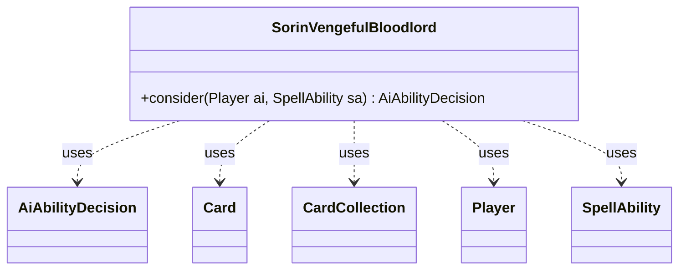

---
aliases:
  - SorinVengefulBloodlord
tags:
  - java/class
  - module/forge-ai
  - pkg/forge/ai
fqn: forge.ai.SpecialCardAi.SorinVengefulBloodlord
package: forge.ai
module: forge-ai
kind: Class
---

# SorinVengefulBloodlord

**Package:** `forge.ai`   **Module:** `forge-ai`   **Kind:** Class



## Relationships
**Uses:**
- [[forge.ai.AiAbilityDecision|AiAbilityDecision]]
- [[forge.game.card.Card|Card]]
- [[forge.game.card.CardCollection|CardCollection]]
- [[forge.game.player.Player|Player]]
- [[forge.game.spellability.SpellAbility|SpellAbility]]

## Design Description

SorinVengefulBloodlord is a static nested helper within `SpecialCardAi` that encapsulates the AI decision logic for playing the planeswalker card "Sorin, Vengeful Bloodlord." Its sole responsibility is the static `consider` method, which evaluates whether the AI should activate Sorin's reanimation ability and, if so, selects the optimal target. It collaborates with `Player` and `SpellAbility` to read game state, builds a `CardCollection` of eligible graveyard creatures (filtered by converted mana cost against Sorin's loyalty and by surviving static toughness effects), and returns an `AiAbilityDecision` conveying the chosen action and confidence score.

The design reflects Forge's per-card AI pattern: each tricky card gets a focused, stateless evaluator. Notable intent includes using an LKI copy to simulate static power/toughness modifications before committing, ranking candidates via `ComputerUtilCard.evaluateCreature` to maximize board value, and configuring the ability's targets and X mana cost in place before signalling `WillPlay`.

## Source
`forge-ai/src/main/java/forge/ai/SpecialCardAi.java` — declaration excerpt

```java
    // Sorin, Vengeful Bloodlord
    public static class SorinVengefulBloodlord {
        public static AiAbilityDecision consider(final Player ai, final SpellAbility sa) {
            int loyalty = sa.getHostCard().getCounters(CounterEnumType.LOYALTY);
            CardCollection creaturesToGet = CardLists.filter(ai.getCardsIn(ZoneType.Graveyard),
                    CardPredicates.CREATURES
                            .and(CardPredicates.lessCMC(loyalty - 1))
                            .and(card -> {
                                final Card copy = CardCopyService.getLKICopy(card);
                                ComputerUtilCard.applyStaticContPT(ai.getGame(), copy, null);
                                return copy.getNetToughness() > 0;
                            })
            );

            if (creaturesToGet.isEmpty()) {
                return new AiAbilityDecision(0, AiPlayDecision.CantPlayAi);
            }

            CardLists.sortByCmcDesc(creaturesToGet);

            // pick the best creature that will stay on the battlefield
            Card best = creaturesToGet.getFirst();
            for (Card c : creaturesToGet) {
                if (best != c && ComputerUtilCard.evaluateCreature(c, true, false) >
                        ComputerUtilCard.evaluateCreature(best, true, false)) {
                    best = c;
                }
            }

            if (best != null) {
                sa.resetTargets();
                sa.getTargets().add(best);
                sa.setXManaCostPaid(best.getCMC());
                return new AiAbilityDecision(100, AiPlayDecision.WillPlay);
            }

            return new AiAbilityDecision(0, AiPlayDecision.TargetingFailed);
        }
    }
```
