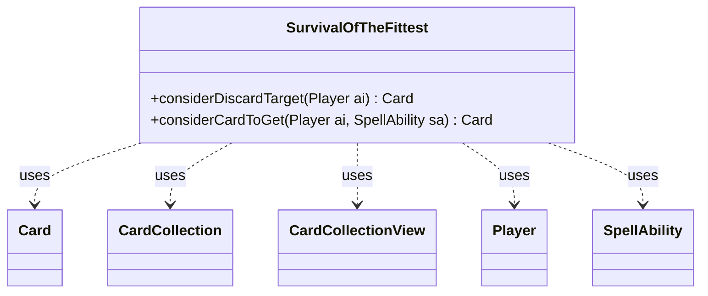

---
aliases:
  - SurvivalOfTheFittest
tags:
  - java/class
  - module/forge-ai
  - pkg/forge/ai
fqn: forge.ai.SpecialCardAi.SurvivalOfTheFittest
package: forge.ai
module: forge-ai
kind: Class
---

# SurvivalOfTheFittest

**Package:** `forge.ai`   **Module:** `forge-ai`   **Kind:** Class



## Relationships
**Uses:**
- [[forge.game.card.Card|Card]]
- [[forge.game.card.CardCollection|CardCollection]]
- [[forge.game.card.CardCollectionView|CardCollectionView]]
- [[forge.game.player.Player|Player]]
- [[forge.game.spellability.SpellAbility|SpellAbility]]

## Design Description

`SurvivalOfTheFittest` is a static nested helper within `SpecialCardAi` that encapsulates the AI's decision logic for playing Magic's *Survival of the Fittest*, which discards a creature to tutor another from the library. It exposes two stateless static methods: `considerDiscardTarget`, which chooses the least valuable creature in hand to pitch, and `considerCardToGet`, which selects the best fetchable creature. Both reason about mana availability and converted mana cost to weigh what is castable now versus later.

Holding no state of its own, the class collaborates with the game model—querying a `Player`'s zones for `Card` objects gathered into `CardCollection`/`CardCollectionView` filters—and delegates evaluation to utilities like `ComputerUtilMana` and `ComputerUtilCard`. Its design intent is heuristic: it estimates affordable CMC, prefers swapping weaker hand cards for stronger library targets, and special-cases Reanimator decks by deliberately discarding large creatures into the graveyard. The `SpellAbility` parameter ties the recommendation to the triggering ability.

## Source
`forge-ai/src/main/java/forge/ai/SpecialCardAi.java` — declaration excerpt

```java
    // Survival of the Fittest
    public static class SurvivalOfTheFittest {
        public static Card considerDiscardTarget(final Player ai) {
            // The AI here only checks the number of available creatures of various CMC, which is equivalent to knowing
            // your deck composition and checking (and counting) the cards in other zones so you know what you have left
            // in the library. As such, this does not cause unfair advantage, at least unless there are cards that are
            // face down (on the battlefield or in exile). Might need some kind of an update to consider hidden information
            // like that properly (probably by adding all those cards to the evaluation mix so the AI doesn't "know" which
            // ones are already face down in play and which are still in the library)
            CardCollectionView creatsInLib = CardLists.filter(ai.getCardsIn(ZoneType.Library), CardPredicates.CREATURES);
            CardCollectionView creatsInHand = CardLists.filter(ai.getCardsIn(ZoneType.Hand), CardPredicates.CREATURES);
            CardCollectionView manaSrcsInHand = CardLists.filter(ai.getCardsIn(ZoneType.Hand), CardPredicates.LANDS_PRODUCING_MANA);

            if (creatsInHand.isEmpty() || creatsInLib.isEmpty()) {
                return null;
            }

            int numManaSrcs = ComputerUtilMana.getAvailableManaEstimate(ai, false)
                    + Math.min(1, manaSrcsInHand.size());

            // Cards in library that are either below/at (preferred) or above the max CMC affordable by the AI
            // (the latter might happen if we're playing a Reanimator deck with lots of fatties)
            CardCollection atTargetCMCInLib = CardLists.filter(creatsInLib,
                    card -> ComputerUtilMana.hasEnoughManaSourcesToCast(card.getSpellPermanent(), ai)
            );
            if (atTargetCMCInLib.isEmpty()) {
                atTargetCMCInLib = CardLists.filter(creatsInLib, CardPredicates.greaterCMC(numManaSrcs));
            }
            atTargetCMCInLib.sort(CardLists.CmcComparatorInv);
            if (atTargetCMCInLib.isEmpty()) {
                // Nothing to aim for?
                return null;
            }

            // Cards in hand that are below the max CMC affordable by the AI
            CardCollection belowMaxCMC = CardLists.filter(creatsInHand, CardPredicates.lessCMC(numManaSrcs - 1));
            belowMaxCMC.sort(CardLists.CmcComparator);

            // Cards in hand that are above the max CMC affordable by the AI
            CardCollection aboveMaxCMC = CardLists.filter(creatsInHand, CardPredicates.greaterCMC(numManaSrcs + 1));
            aboveMaxCMC.sort(CardLists.CmcComparatorInv);

            Card maxCMC = !aboveMaxCMC.isEmpty() ? aboveMaxCMC.getFirst() : null;
            Card minCMC = !belowMaxCMC.isEmpty() ? belowMaxCMC.getFirst() : null;
            Card bestInLib = !atTargetCMCInLib.isEmpty() ? atTargetCMCInLib.getFirst() : null;

            int maxCMCdiff = 0;
            if (maxCMC != null) {
                maxCMCdiff = maxCMC.getCMC() - numManaSrcs; // how far are we from viably casting it?
            }

            // We have something too fat to viably cast in the nearest future, discard it hoping to
            // grab something more immediately valuable (or maybe we're playing Reanimator and we want
            // it to be in the graveyard anyway)
            if (maxCMCdiff >= 3) {
                return maxCMC;
            }
            // We have a card in hand that is worse than the one in library, so discard the worst card
            if (maxCMCdiff <= 0 && minCMC != null
                    && ComputerUtilCard.evaluateCreature(bestInLib) > ComputerUtilCard.evaluateCreature(minCMC)) {
                return minCMC;
            }
            // We have a card in the library that is closer to being castable than the one in hand, and
            // no options with smaller CMC, so discard the one that is harder to cast for the one that is
            // easier to cast right now, but only if the best card in the library is at least CMC 3
            // (probably not worth it to grab low mana cost cards this way)
            if (maxCMC != null && bestInLib != null && maxCMC.getCMC() < bestInLib.getCMC() && bestInLib.getCMC() >= 3) {
                return maxCMC;
            }
            // We appear to be playing Reanimator (or we have a reanimator card in hand already), so it's
            // worth to fill the graveyard now
            if (ComputerUtil.isPlayingReanimator(ai) && !creatsInLib.isEmpty()) {
                CardCollection creatsInHandByCMC = new CardCollection(creatsInHand);
                creatsInHandByCMC.sort(CardLists.CmcComparatorInv);
                return creatsInHandByCMC.getFirst();
            }

            // probably nothing that is worth changing, so bail
            return null;
        }

        public static Card considerCardToGet(final Player ai, final SpellAbility sa) {
            CardCollection creatsInLib = CardLists.filter(ai.getCardsIn(ZoneType.Library), CardPredicates.CREATURES);
            if (creatsInLib.isEmpty()) {
                return null;
            }

            CardCollectionView manaSrcsInHand = CardLists.filter(ai.getCardsIn(ZoneType.Hand), CardPredicates.LANDS_PRODUCING_MANA);
            int numManaSrcs = ComputerUtilMana.getAvailableManaEstimate(ai, false)
                    + Math.min(1, manaSrcsInHand.size());

            CardCollection atTargetCMCInLib = CardLists.filter(creatsInLib,
                    card -> ComputerUtilMana.hasEnoughManaSourcesToCast(card.getSpellPermanent(), ai)
            );
            if (atTargetCMCInLib.isEmpty()) {
                atTargetCMCInLib = CardLists.filter(creatsInLib, CardPredicates.greaterCMC(numManaSrcs));
            }
            atTargetCMCInLib.sort(CardLists.CmcComparatorInv);

            Card bestInLib = atTargetCMCInLib.getFirst();

            if (bestInLib == null && ComputerUtil.isPlayingReanimator(ai)) {
                // For Reanimator, we don't mind grabbing the biggest thing possible to recycle it again with SotF later.
                creatsInLib.sort(CardLists.CmcComparatorInv);
                return creatsInLib.getFirst();
            }

            return bestInLib;
        }
    }
```

## Python
`forge/ai/SpecialCardAi/SurvivalOfTheFittest.py`

```python
from forge.game.card.Card import Card
from forge.game.card.CardCollection import CardCollection
from forge.game.card.CardCollectionView import CardCollectionView
from forge.game.player.Player import Player
from forge.game.spellability.SpellAbility import SpellAbility


# Survival of the Fittest
class SurvivalOfTheFittest:
    @staticmethod
    def considerDiscardTarget(ai: Player) -> Card:
        # The AI here only checks the number of available creatures of various CMC, which is equivalent to knowing
        # your deck composition and checking (and counting) the cards in other zones so you know what you have left
        # in the library. As such, this does not cause unfair advantage, at least unless there are cards that are
        # face down (on the battlefield or in exile). Might need some kind of an update to consider hidden information
        # like that properly (probably by adding all those cards to the evaluation mix so the AI doesn't "know" which
        # ones are already face down in play and which are still in the library)
        creatsInLib = CardLists.filter(ai.getCardsIn(ZoneType.Library), CardPredicates.CREATURES)
        creatsInHand = CardLists.filter(ai.getCardsIn(ZoneType.Hand), CardPredicates.CREATURES)
        manaSrcsInHand = CardLists.filter(ai.getCardsIn(ZoneType.Hand), CardPredicates.LANDS_PRODUCING_MANA)

        if creatsInHand.isEmpty() or creatsInLib.isEmpty():
            return None

        numManaSrcs = ComputerUtilMana.getAvailableManaEstimate(ai, False) \
            + min(1, manaSrcsInHand.size())

        # Cards in library that are either below/at (preferred) or above the max CMC affordable by the AI
        # (the latter might happen if we're playing a Reanimator deck with lots of fatties)
        atTargetCMCInLib = CardLists.filter(creatsInLib,
            lambda card: ComputerUtilMana.hasEnoughManaSourcesToCast(card.getSpellPermanent(), ai)
        )
        if atTargetCMCInLib.isEmpty():
            atTargetCMCInLib = CardLists.filter(creatsInLib, CardPredicates.greaterCMC(numManaSrcs))
        atTargetCMCInLib.sort(CardLists.CmcComparatorInv)
        if atTargetCMCInLib.isEmpty():
            # Nothing to aim for?
            return None

        # Cards in hand that are below the max CMC affordable by the AI
        belowMaxCMC = CardLists.filter(creatsInHand, CardPredicates.lessCMC(numManaSrcs - 1))
        belowMaxCMC.sort(CardLists.CmcComparator)

        # Cards in hand that are above the max CMC affordable by the AI
        aboveMaxCMC = CardLists.filter(creatsInHand, CardPredicates.greaterCMC(numManaSrcs + 1))
        aboveMaxCMC.sort(CardLists.CmcComparatorInv)

        maxCMC = aboveMaxCMC.getFirst() if not aboveMaxCMC.isEmpty() else None
        minCMC = belowMaxCMC.getFirst() if not belowMaxCMC.isEmpty() else None
        bestInLib = atTargetCMCInLib.getFirst() if not atTargetCMCInLib.isEmpty() else None

        maxCMCdiff = 0
        if maxCMC is not None:
            maxCMCdiff = maxCMC.getCMC() - numManaSrcs  # how far are we from viably casting it?

        # We have something too fat to viably cast in the nearest future, discard it hoping to
        # grab something more immediately valuable (or maybe we're playing Reanimator and we want
        # it to be in the graveyard anyway)
        if maxCMCdiff >= 3:
            return maxCMC
        # We have a card in hand that is worse than the one in library, so discard the worst card
        if maxCMCdiff <= 0 and minCMC is not None \
                and ComputerUtilCard.evaluateCreature(bestInLib) > ComputerUtilCard.evaluateCreature(minCMC):
            return minCMC
        # We have a card in the library that is closer to being castable than the one in hand, and
        # no options with smaller CMC, so discard the one that is harder to cast for the one that is
        # easier to cast right now, but only if the best card in the library is at least CMC 3
        # (probably not worth it to grab low mana cost cards this way)
        if maxCMC is not None and bestInLib is not None and maxCMC.getCMC() < bestInLib.getCMC() and bestInLib.getCMC() >= 3:
            return maxCMC
        # We appear to be playing Reanimator (or we have a reanimator card in hand already), so it's
        # worth to fill the graveyard now
        if ComputerUtil.isPlayingReanimator(ai) and not creatsInLib.isEmpty():
            creatsInHandByCMC = CardCollection(creatsInHand)
            creatsInHandByCMC.sort(CardLists.CmcComparatorInv)
            return creatsInHandByCMC.getFirst()

        # probably nothing that is worth changing, so bail
        return None

    @staticmethod
    def considerCardToGet(ai: Player, sa: SpellAbility) -> Card:
        creatsInLib = CardLists.filter(ai.getCardsIn(ZoneType.Library), CardPredicates.CREATURES)
        if creatsInLib.isEmpty():
            return None

        manaSrcsInHand = CardLists.filter(ai.getCardsIn(ZoneType.Hand), CardPredicates.LANDS_PRODUCING_MANA)
        numManaSrcs = ComputerUtilMana.getAvailableManaEstimate(ai, False) \
            + min(1, manaSrcsInHand.size())

        atTargetCMCInLib = CardLists.filter(creatsInLib,
            lambda card: ComputerUtilMana.hasEnoughManaSourcesToCast(card.getSpellPermanent(), ai)
        )
        if atTargetCMCInLib.isEmpty():
            atTargetCMCInLib = CardLists.filter(creatsInLib, CardPredicates.greaterCMC(numManaSrcs))
        atTargetCMCInLib.sort(CardLists.CmcComparatorInv)

        bestInLib = atTargetCMCInLib.getFirst()

        if bestInLib is None and ComputerUtil.isPlayingReanimator(ai):
            # For Reanimator, we don't mind grabbing the biggest thing possible to recycle it again with SotF later.
            creatsInLib.sort(CardLists.CmcComparatorInv)
            return creatsInLib.getFirst()

        return bestInLib
```
