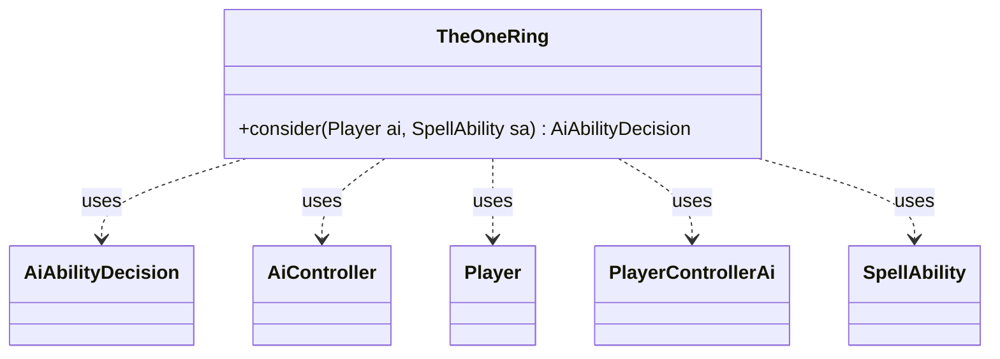

---
aliases:
  - TheOneRing
tags:
  - java/class
  - module/forge-ai
  - pkg/forge/ai
fqn: forge.ai.SpecialCardAi.TheOneRing
package: forge.ai
module: forge-ai
kind: Class
---

# TheOneRing

**Package:** `forge.ai`   **Module:** `forge-ai`   **Kind:** Class



## Relationships
**Uses:**
- [[forge.ai.AiAbilityDecision|AiAbilityDecision]]
- [[forge.ai.AiController|AiController]]
- [[forge.ai.PlayerControllerAi|PlayerControllerAi]]
- [[forge.game.player.Player|Player]]
- [[forge.game.spellability.SpellAbility|SpellAbility]]

## Design Description

TheOneRing is a static nested helper within `SpecialCardAi` that encapsulates the AI's decision logic for casting the card "The One Ring." Its sole public method, `consider`, evaluates a `Player` and `SpellAbility` and returns an `AiAbilityDecision` advising whether and how eagerly to play the ability. As a stateless, pure-function utility, it holds no fields and centralizes one card's quirky risk assessment apart from the generic AI engine.

The class collaborates with the core AI infrastructure to weigh self-inflicted life loss: it reaches the concrete `AiController` via a `PlayerControllerAi` cast to read the `AI_IN_DANGER_THRESHOLD` property, then compares the host card's accumulated BURDEN counters against the player's life total and hand-size limits. It greenlights the play (score 100, `WillPlay`) when the player cannot lose life or stays safely above the danger threshold, otherwise returning a zero-confidence `LifeInDanger` decision — reflecting design intent to avoid lethal self-damage from the card's stacking burden.

## Source
`forge-ai/src/main/java/forge/ai/SpecialCardAi.java` — declaration excerpt

```java
    // The One Ring
    public static class TheOneRing {
        public static AiAbilityDecision consider(final Player ai, final SpellAbility sa) {
            if (!ai.canLoseLife() || ai.cantLoseForZeroOrLessLife()) {
                return new AiAbilityDecision(100, AiPlayDecision.WillPlay);
            }

            AiController aic = ((PlayerControllerAi) ai.getController()).getAi();
            int lifeInDanger = aic.getIntProperty(AiProps.AI_IN_DANGER_THRESHOLD);
            int numCtrs = sa.getHostCard().getCounters(CounterType.getType("BURDEN"));

            if (ai.getLife() > numCtrs + 1 && ai.getLife() > lifeInDanger
                    && ai.getMaxHandSize() >= ai.getCardsIn(ZoneType.Hand).size() + numCtrs + 1) {
                return new AiAbilityDecision(100, AiPlayDecision.WillPlay);
            }

            return new AiAbilityDecision(0, AiPlayDecision.LifeInDanger);
        }
    }
```

## Python
`forge/ai/SpecialCardAi/TheOneRing.py`

```python
from forge.ai.AiAbilityDecision import AiAbilityDecision
from forge.ai.AiController import AiController
from forge.ai.AiPlayDecision import AiPlayDecision
from forge.ai.AiProps import AiProps
from forge.ai.PlayerControllerAi import PlayerControllerAi
from forge.game.card.CounterType import CounterType
from forge.game.player.Player import Player
from forge.game.spellability.SpellAbility import SpellAbility
from forge.game.zone.ZoneType import ZoneType


# The One Ring
class TheOneRing:
    @staticmethod
    def consider(ai: Player, sa: SpellAbility) -> AiAbilityDecision:
        if not ai.canLoseLife() or ai.cantLoseForZeroOrLessLife():
            return AiAbilityDecision(100, AiPlayDecision.WillPlay)

        aic = ai.getController().getAi()
        lifeInDanger = aic.getIntProperty(AiProps.AI_IN_DANGER_THRESHOLD)
        numCtrs = sa.getHostCard().getCounters(CounterType.getType("BURDEN"))

        if (ai.getLife() > numCtrs + 1 and ai.getLife() > lifeInDanger
                and ai.getMaxHandSize() >= len(ai.getCardsIn(ZoneType.Hand)) + numCtrs + 1):
            return AiAbilityDecision(100, AiPlayDecision.WillPlay)

        return AiAbilityDecision(0, AiPlayDecision.LifeInDanger)
```
