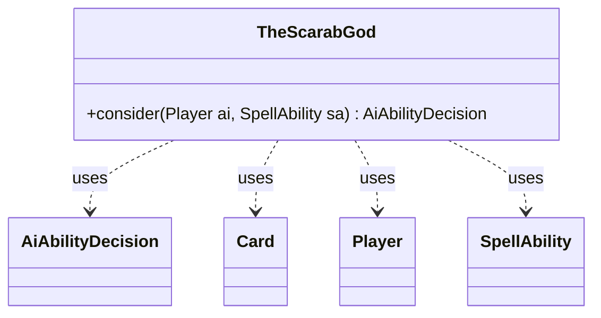

---
aliases:
  - TheScarabGod
tags:
  - java/class
  - module/forge-ai
  - pkg/forge/ai
fqn: forge.ai.SpecialCardAi.TheScarabGod
package: forge.ai
module: forge-ai
kind: Class
---

# TheScarabGod

**Package:** `forge.ai`   **Module:** `forge-ai`   **Kind:** Class



## Relationships
**Uses:**
- [[forge.ai.AiAbilityDecision|AiAbilityDecision]]
- [[forge.game.card.Card|Card]]
- [[forge.game.player.Player|Player]]
- [[forge.game.spellability.SpellAbility|SpellAbility]]

## Design Description

The Scarab God is a specialized AI helper, implemented as a static nested class within `SpecialCardAi`, that decides how Forge's computer-controlled player should use The Scarab God's reanimation ability. Its single static `consider` method evaluates the game state and returns an `AiAbilityDecision` expressing whether and how eagerly the AI should activate the ability.

The class collaborates with `Player`, `SpellAbility`, and `Card` to select a target, preferring the best creature in an opponent's graveyard and falling back to the AI's own weakest graveyard creature. It mutates the supplied `SpellAbility`'s targets directly, returning a high-confidence `WillPlay` decision when a target is secured or a `TargetingFailed` decision otherwise. The stateless, method-only design reflects its role as a pluggable, card-specific override within Forge's broader AI decision framework.

## Source
`forge-ai/src/main/java/forge/ai/SpecialCardAi.java` — declaration excerpt

```java
    // The Scarab God
    public static class TheScarabGod {
        public static AiAbilityDecision consider(final Player ai, final SpellAbility sa) {
            Card bestOppCreat = ComputerUtilCard.getBestAI(CardLists.filter(ai.getOpponents().getCardsIn(ZoneType.Graveyard), CardPredicates.CREATURES));
            Card worstOwnCreat = ComputerUtilCard.getWorstAI(CardLists.filter(ai.getCardsIn(ZoneType.Graveyard), CardPredicates.CREATURES));

            sa.resetTargets();
            if (bestOppCreat != null) {
                sa.getTargets().add(bestOppCreat);
            } else if (worstOwnCreat != null) {
                sa.getTargets().add(worstOwnCreat);
            }

            if (!sa.getTargets().isEmpty()) {
                // If we have a target, we can play this ability
                return new AiAbilityDecision(100, AiPlayDecision.WillPlay);
            } else {
                // No valid targets, can't play this ability
                return new AiAbilityDecision(0, AiPlayDecision.TargetingFailed);
            }
        }
    }
```

## Python
`forge/ai/SpecialCardAi/TheScarabGod.py`

```python
from forge.ai.AiAbilityDecision import AiAbilityDecision
from forge.ai.AiPlayDecision import AiPlayDecision
from forge.ai.ComputerUtilCard import ComputerUtilCard
from forge.game.card.Card import Card
from forge.game.card.CardLists import CardLists
from forge.game.card.CardPredicates import CardPredicates
from forge.game.player.Player import Player
from forge.game.spellability.SpellAbility import SpellAbility
from forge.game.zone.ZoneType import ZoneType


class TheScarabGod:
    @staticmethod
    def consider(ai: Player, sa: SpellAbility) -> AiAbilityDecision:
        bestOppCreat = ComputerUtilCard.getBestAI(CardLists.filter(ai.getOpponents().getCardsIn(ZoneType.Graveyard), CardPredicates.CREATURES))
        worstOwnCreat = ComputerUtilCard.getWorstAI(CardLists.filter(ai.getCardsIn(ZoneType.Graveyard), CardPredicates.CREATURES))

        sa.resetTargets()
        if bestOppCreat is not None:
            sa.getTargets().add(bestOppCreat)
        elif worstOwnCreat is not None:
            sa.getTargets().add(worstOwnCreat)

        if not sa.getTargets().isEmpty():
            # If we have a target, we can play this ability
            return AiAbilityDecision(100, AiPlayDecision.WillPlay)
        else:
            # No valid targets, can't play this ability
            return AiAbilityDecision(0, AiPlayDecision.TargetingFailed)
```
