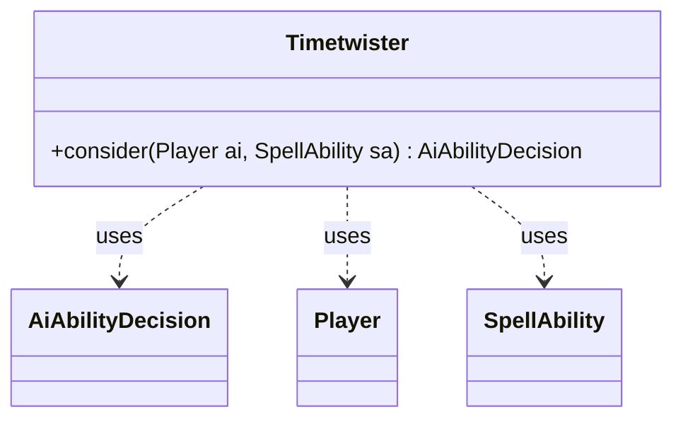

---
aliases:
  - Timetwister
tags:
  - java/class
  - module/forge-ai
  - pkg/forge/ai
fqn: forge.ai.SpecialCardAi.Timetwister
package: forge.ai
module: forge-ai
kind: Class
---

# Timetwister

**Package:** `forge.ai`   **Module:** `forge-ai`   **Kind:** Class



## Relationships
**Uses:**
- [[forge.ai.AiAbilityDecision|AiAbilityDecision]]
- [[forge.game.player.Player|Player]]
- [[forge.game.spellability.SpellAbility|SpellAbility]]

## Design Description

The `Timetwister` class is a static nested AI helper within `SpecialCardAi`, providing the decision logic for whether the AI should cast the Timetwister card (which shuffles all hands and graveyards into libraries and redraws seven). Its sole responsibility is exposed through the static `consider` method, which evaluates a `Player` and `SpellAbility` and returns an `AiAbilityDecision` encoding the AI's willingness to play.

Rather than holding state, the class acts as a pure decision function collaborating with the game model: it inspects hand sizes via `ZoneType.Hand` for both the AI and its opponents. The design intent is plainly heuristic — the AI commits to the play (confidence 100, `WillPlay`) only when running low on cards (below a `HAND_SIZE_THRESHOLD` of three) or when significantly behind an opponent's hand size, otherwise declining (`CantPlayAi`). This ensures the symmetric reset benefits the AI rather than refilling a leading opponent.

## Source
`forge-ai/src/main/java/forge/ai/SpecialCardAi.java` — declaration excerpt

```java
    // Timetwister
    public static class Timetwister {
        public static AiAbilityDecision consider(final Player ai, final SpellAbility sa) {
            final int aiHandSize = ai.getCardsIn(ZoneType.Hand).size();
            int maxOppHandSize = 0;

            final int HAND_SIZE_THRESHOLD = 3;

            for (Player p : ai.getOpponents()) {
                int handSize = p.getCardsIn(ZoneType.Hand).size();
                if (handSize > maxOppHandSize) {
                    maxOppHandSize = handSize;
                }
            }

            // use in case we're getting low on cards or if we're significantly behind our opponent in cards in hand
            if (aiHandSize < HAND_SIZE_THRESHOLD || maxOppHandSize - aiHandSize > HAND_SIZE_THRESHOLD) {
                // if the AI has less than 3 cards in hand or the opponent has more than 3 cards in hand than the AI
                // then the AI is willing to play this ability
                return new AiAbilityDecision(100, AiPlayDecision.WillPlay);
            } else {
                // otherwise, don't play this ability
                return new AiAbilityDecision(0, AiPlayDecision.CantPlayAi);
            }
        }
    }
```

## Python
`forge/ai/SpecialCardAi/Timetwister.py`

```python
from forge.ai.AiAbilityDecision import AiAbilityDecision
from forge.ai.AiPlayDecision import AiPlayDecision
from forge.game.player.Player import Player
from forge.game.spellability.SpellAbility import SpellAbility
from forge.game.zone.ZoneType import ZoneType


class Timetwister:
    @staticmethod
    def consider(ai: Player, sa: SpellAbility) -> AiAbilityDecision:
        aiHandSize = len(ai.getCardsIn(ZoneType.Hand))
        maxOppHandSize = 0

        HAND_SIZE_THRESHOLD = 3

        for p in ai.getOpponents():
            handSize = len(p.getCardsIn(ZoneType.Hand))
            if handSize > maxOppHandSize:
                maxOppHandSize = handSize

        # use in case we're getting low on cards or if we're significantly behind our opponent in cards in hand
        if aiHandSize < HAND_SIZE_THRESHOLD or maxOppHandSize - aiHandSize > HAND_SIZE_THRESHOLD:
            # if the AI has less than 3 cards in hand or the opponent has more than 3 cards in hand than the AI
            # then the AI is willing to play this ability
            return AiAbilityDecision(100, AiPlayDecision.WillPlay)
        else:
            # otherwise, don't play this ability
            return AiAbilityDecision(0, AiPlayDecision.CantPlayAi)
```
