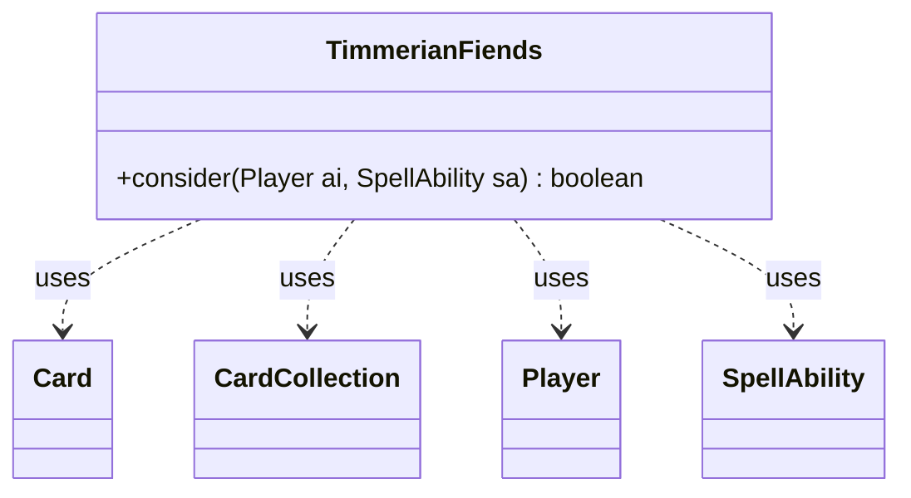

---
aliases:
  - TimmerianFiends
tags:
  - java/class
  - module/forge-ai
  - pkg/forge/ai
fqn: forge.ai.SpecialCardAi.TimmerianFiends
package: forge.ai
module: forge-ai
kind: Class
---

# TimmerianFiends

**Package:** `forge.ai`   **Module:** `forge-ai`   **Kind:** Class



## Relationships
**Uses:**
- [[forge.game.card.Card|Card]]
- [[forge.game.card.CardCollection|CardCollection]]
- [[forge.game.player.Player|Player]]
- [[forge.game.spellability.SpellAbility|SpellAbility]]

## Design Description

TimmerianFiends is a stateless AI helper—one of the nested static decision classes within `SpecialCardAi`—that encapsulates the computer player's heuristic for whether to activate Timmerian Fiends' card-theft ability. Its sole `consider` method inspects the spell's targeted `Card` and returns a boolean go/no-go verdict, delegating valuation to `ComputerUtilCard` and life-safety checks to `ComputerUtil`.

The class collaborates with `Player` and `SpellAbility` to read game context and resolve the target, and wraps non-creature permanents in a `CardCollection` for list-based evaluation. Its design intent is a simple threshold policy: steal a creature when the AI is in mortal danger or the creature scores highly, and otherwise steal permanents only above a CMC-based worth cutoff. Inline TODOs flag the value thresholds and the crude CMC comparison as deliberately provisional, isolating this card-specific quirk from the engine's general AI logic.

## Source
`forge-ai/src/main/java/forge/ai/SpecialCardAi.java` — declaration excerpt

```java
    // Timmerian Fiends
    public static class TimmerianFiends {
        public static boolean consider(final Player ai, final SpellAbility sa) {
            final Card targeted = sa.getParentTargetingCard().getTargetCard();
            if (targeted == null) {
                return false;
            }

            if (targeted.isCreature()) {
                if (ComputerUtil.aiLifeInDanger(ai, true, 0)) {
                    return true; // do it, hoping to save a valuable potential blocker etc.
                }
                return ComputerUtilCard.evaluateCreature(targeted) >= 200; // might need tweaking
            } else {
                // TODO: this currently compares purely by CMC. To be somehow improved, especially for stuff like the Power Nine etc.
                return ComputerUtilCard.evaluatePermanentList(new CardCollection(targeted)) >= 3;
            }
        }
    }
```
