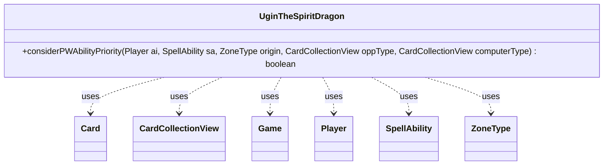

---
aliases:
  - UginTheSpiritDragon
tags:
  - java/class
  - module/forge-ai
  - pkg/forge/ai
fqn: forge.ai.SpecialCardAi.UginTheSpiritDragon
package: forge.ai
module: forge-ai
kind: Class
---

# UginTheSpiritDragon

**Package:** `forge.ai`   **Module:** `forge-ai`   **Kind:** Class



## Relationships
**Uses:**
- [[forge.game.Game|Game]]
- [[forge.game.card.Card|Card]]
- [[forge.game.card.CardCollectionView|CardCollectionView]]
- [[forge.game.player.Player|Player]]
- [[forge.game.spellability.SpellAbility|SpellAbility]]
- [[forge.game.zone.ZoneType|ZoneType]]

## Design Description

Ugin, the Spirit Dragon's AI helper is a small static utility nested within `SpecialCardAi`, encapsulating the decision logic for whether the computer should activate Ugin's X-based exile ability. Its sole method, `considerPWAbilityPriority`, inspects the host `Card`'s loyalty and iterates over candidate X values, using `CardCollectionView` filtering and `ComputerUtilCard.evaluatePermanentList` to find the X that maximizes the net board-state swing against opponents while accounting for the loyalty cost.

The class is a stateless strategy fragment rather than a type in any inheritance hierarchy; it collaborates with the broader AI evaluation framework (`ComputerUtilCard`, `ComputerUtilCombat`, `AbilityUtils`) and the game model (`Game`, `Player`, `SpellAbility`, `ZoneType`). Notable design intent includes a refinement check: when only a single opponent permanent would be exiled, it defers (returns false) if a cheaper direct-damage ability could instead kill the target or burn a low-loyalty planeswalker, preserving Ugin's loyalty for more impactful turns.

## Source
`forge-ai/src/main/java/forge/ai/SpecialCardAi.java` — declaration excerpt

```java
    // Ugin, the Spirit Dragon
    public static class UginTheSpiritDragon {
        public static boolean considerPWAbilityPriority(final Player ai, final SpellAbility sa, final ZoneType origin, CardCollectionView oppType, CardCollectionView computerType) {
            Card source = sa.getHostCard();
            Game game = source.getGame();

            final int loyalty = source.getCounters(CounterEnumType.LOYALTY);
            int x = -1, best = 0;
            Card single = null;
            for (int i = 0; i < loyalty; i++) {
                sa.setXManaCostPaid(i);
                oppType = CardLists.filterControlledBy(game.getCardsIn(origin), ai.getOpponents());
                oppType = AbilityUtils.filterListByType(oppType, sa.getParam("ChangeType"), sa);
                computerType = AbilityUtils.filterListByType(ai.getCardsIn(origin), sa.getParam("ChangeType"), sa);
                int net = ComputerUtilCard.evaluatePermanentList(oppType) - ComputerUtilCard.evaluatePermanentList(computerType) - i;
                if (net > best) {
                    x = i;
                    best = net;
                    if (oppType.size() == 1) {
                        single = oppType.getFirst();
                    } else {
                        single = null;
                    }
                }
            }
            // check if +1 would be sufficient
            if (single != null) {
                // TODO use better logic to find the right Deal Damage Effect?
                SpellAbility ugin_burn = IterableUtil.find(source.getSpellAbilities(), SpellAbilityPredicates.isApi(ApiType.DealDamage), null);
                if (ugin_burn != null) {
                    // basic logic copied from DamageDealAi::dealDamageChooseTgtC
                    if (ugin_burn.canTarget(single)) {
                        final boolean can_kill = single.getSVar("Targeting").equals("Dies")
                                || (ComputerUtilCombat.getEnoughDamageToKill(single, 3, source, false, false) <= 3)
                                && !ComputerUtil.canRegenerate(ai, single)
                                && !(single.getSVar("SacMe").length() > 0);
                        if (can_kill) {
                            return false;
                        }
                        // simple check to burn player instead of exiling planeswalker
                        if (single.isPlaneswalker() && single.getCurrentLoyalty() <= 3) {
                            return false;
                        }
                    }
                }
            }
            if (x == -1) {
                return false;
            }
            sa.setXManaCostPaid(x);
            return true;
        }
    }
```
