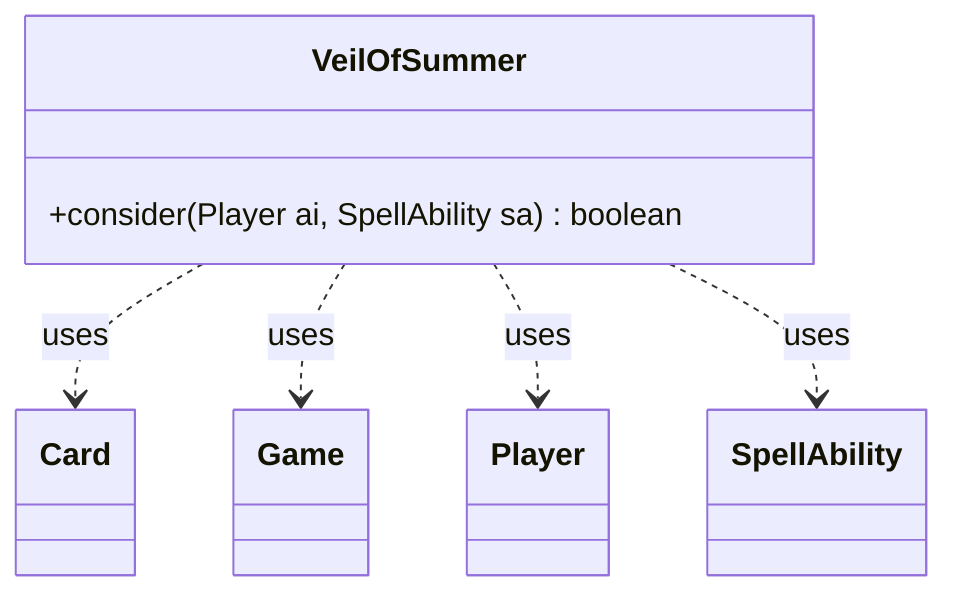

---
aliases:
  - VeilOfSummer
tags:
  - java/class
  - module/forge-ai
  - pkg/forge/ai
fqn: forge.ai.SpecialCardAi.VeilOfSummer
package: forge.ai
module: forge-ai
kind: Class
---

# VeilOfSummer

**Package:** `forge.ai`   **Module:** `forge-ai`   **Kind:** Class



## Relationships
**Uses:**
- [[forge.game.Game|Game]]
- [[forge.game.card.Card|Card]]
- [[forge.game.player.Player|Player]]
- [[forge.game.spellability.SpellAbility|SpellAbility]]

## Design Description

VeilOfSummer is a stateless AI helper, nested within `SpecialCardAi`, that encapsulates the casting heuristic for the Magic card Veil of Summer. Its sole public method, `consider`, decides whether the AI should play the card given the current board state, returning a boolean rather than holding any state of its own—consistent with the static-utility pattern used across `SpecialCardAi`.

It collaborates with the core game model to make this judgment: it queries the `Game` stack for the top `SpellAbility`, then inspects that ability's API type, host `Card` color, and targets relative to the controlling `Player`. The logic fires only when an opponent is resolving a counterspell aimed at the AI's own spell, or a black/blue spell targeting the AI or its permanents—mirroring the card's real-world protective intent. By reading rather than mutating these collaborators, the class cleanly separates timing evaluation from execution.

## Source
`forge-ai/src/main/java/forge/ai/SpecialCardAi.java` — declaration excerpt

```java
    // Veil of Summer
    public static class VeilOfSummer {
        public static boolean consider(final Player ai, final SpellAbility sa) {
            // check the top ability on stack if it's (a) an opponent's counterspell targeting the AI's spell;
            // (b) a black or a blue spell targeting something that belongs to the AI
            Game game = ai.getGame();
            if (game.getStack().isEmpty()) {
                return false;
            }

            SpellAbility topSA = game.getStack().peekAbility();
            if (topSA.usesTargeting() && topSA.getActivatingPlayer().isOpponentOf(ai)) {
                if (topSA.getApi() == ApiType.Counter) {
                    SpellAbility tgtSpell = topSA.getTargets().getFirstTargetedSpell();
                    if (tgtSpell != null && tgtSpell.getActivatingPlayer().equals(ai)) {
                        return true;
                    }
                } else if (topSA.getHostCard().isBlack() || topSA.getHostCard().isBlue()) {
                    for (Player tgtP : topSA.getTargets().getTargetPlayers()) {
                        if (tgtP.equals(ai)) {
                            return true;
                        }
                    }
                    for (Card tgtC : topSA.getTargets().getTargetCards()) {
                        if (tgtC.getController().equals(ai)) {
                            return true;
                        }
                    }
                }
            }
            return false;
        }
    }
```
