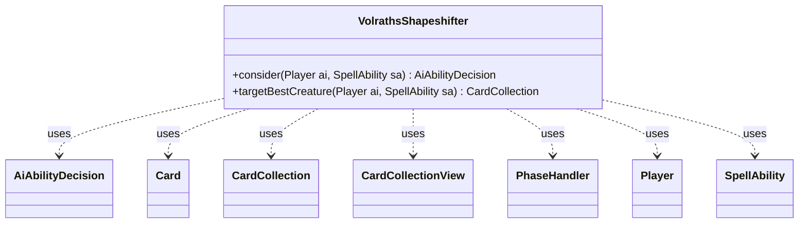

---
aliases:
  - VolrathsShapeshifter
tags:
  - java/class
  - module/forge-ai
  - pkg/forge/ai
fqn: forge.ai.SpecialCardAi.VolrathsShapeshifter
package: forge.ai
module: forge-ai
kind: Class
---

# VolrathsShapeshifter

**Package:** `forge.ai`   **Module:** `forge-ai`   **Kind:** Class



## Relationships
**Uses:**
- [[forge.ai.AiAbilityDecision|AiAbilityDecision]]
- [[forge.game.card.Card|Card]]
- [[forge.game.card.CardCollection|CardCollection]]
- [[forge.game.card.CardCollectionView|CardCollectionView]]
- [[forge.game.phase.PhaseHandler|PhaseHandler]]
- [[forge.game.player.Player|Player]]
- [[forge.game.spellability.SpellAbility|SpellAbility]]

## Design Description

VolrathsShapeshifter is a stateless AI helper, nested within `SpecialCardAi`, that encapsulates the decision logic for playing Volrath's Shapeshifter—a card whose identity mirrors the top creature of its controller's graveyard. Its two static methods serve the engine's AI layer: `consider` returns an `AiAbilityDecision` weighing whether the activation is worthwhile, and `targetBestCreature` selects the discard target that will define the shapeshifter's new form.

Rather than implementing an interface, the class collaborates with engine services and utilities—querying the `PhaseHandler` to defer action until combat, inspecting the `Player`'s hand and graveyard zones, and delegating creature valuation to `ComputerUtilCard`. The design intent is timing- and value-aware: it waits for second main phase, then commits only when a hand creature meaningfully outvalues the current graveyard top, returning the chosen `Card` wrapped in a `CardCollection` for the spell to consume.

## Source
`forge-ai/src/main/java/forge/ai/SpecialCardAi.java` — declaration excerpt

```java
    // Volrath's Shapeshifter
    public static class VolrathsShapeshifter {
        public static AiAbilityDecision consider(final Player ai, final SpellAbility sa) {
            PhaseHandler ph = ai.getGame().getPhaseHandler();
            if (ph.getPhase().isBefore(PhaseType.COMBAT_BEGIN)) {
                // try not to do this too early to at least attempt to avoid situations where the AI
                // would cast a spell which would ruin the shapeshifting
                return new AiAbilityDecision(0, AiPlayDecision.WaitForMain2);
            }

            CardCollectionView aiGY = ai.getCardsIn(ZoneType.Graveyard);
            Card topGY = null;
            Card creatHand = ComputerUtilCard.getBestCreatureAI(ai.getCardsIn(ZoneType.Hand));
            int numCreatsInHand = CardLists.filter(ai.getCardsIn(ZoneType.Hand), CardPredicates.CREATURES).size();

            if (!aiGY.isEmpty()) {
                topGY = ai.getCardsIn(ZoneType.Graveyard).get(0);
            }

            if (creatHand != null) {
                if (topGY == null
                        || !topGY.isCreature()
                        || ComputerUtilCard.evaluateCreature(creatHand) > ComputerUtilCard.evaluateCreature(topGY) + 80) {
                    if (numCreatsInHand > 1 || !ComputerUtilMana.canPayManaCost(creatHand.getSpellPermanent(), ai, 0, false)) {
                        return new AiAbilityDecision(100, AiPlayDecision.WillPlay);
                    } else {
                        return new AiAbilityDecision(0, AiPlayDecision.CantPlayAi);
                    }
                }
            }

            return new AiAbilityDecision(0, AiPlayDecision.CantPlayAi);
        }

        public static CardCollection targetBestCreature(final Player ai, final SpellAbility sa) {
            Card creatHand = ComputerUtilCard.getBestCreatureAI(ai.getCardsIn(ZoneType.Hand));
            if (creatHand != null) {
                CardCollection cc = new CardCollection();
                cc.add(creatHand);
                return cc;
            }

            // Should ideally never get here
            System.err.println("Volrath's Shapeshifter AI: Could not find a discard target despite the previous confirmation to proceed!");
            return null;
        }
    }
```

## Python
`forge/ai/SpecialCardAi/VolrathsShapeshifter.py`

```python
from forge.ai.AiAbilityDecision import AiAbilityDecision
from forge.ai.AiPlayDecision import AiPlayDecision
from forge.ai.ComputerUtilCard import ComputerUtilCard
from forge.ai.ComputerUtilMana import ComputerUtilMana
from forge.game.card.Card import Card
from forge.game.card.CardCollection import CardCollection
from forge.game.card.CardCollectionView import CardCollectionView
from forge.game.card.CardLists import CardLists
from forge.game.card.CardPredicates import CardPredicates
from forge.game.phase.PhaseHandler import PhaseHandler
from forge.game.phase.PhaseType import PhaseType
from forge.game.player.Player import Player
from forge.game.spellability.SpellAbility import SpellAbility
from forge.game.zone.ZoneType import ZoneType


class VolrathsShapeshifter:
    @staticmethod
    def consider(ai: Player, sa: SpellAbility) -> AiAbilityDecision:
        ph = ai.getGame().getPhaseHandler()
        if ph.getPhase().isBefore(PhaseType.COMBAT_BEGIN):
            # try not to do this too early to at least attempt to avoid situations where the AI
            # would cast a spell which would ruin the shapeshifting
            return AiAbilityDecision(0, AiPlayDecision.WaitForMain2)

        aiGY = ai.getCardsIn(ZoneType.Graveyard)
        topGY = None
        creatHand = ComputerUtilCard.getBestCreatureAI(ai.getCardsIn(ZoneType.Hand))
        numCreatsInHand = len(CardLists.filter(ai.getCardsIn(ZoneType.Hand), CardPredicates.CREATURES))

        if not aiGY.isEmpty():
            topGY = ai.getCardsIn(ZoneType.Graveyard).get(0)

        if creatHand is not None:
            if (topGY is None
                    or not topGY.isCreature()
                    or ComputerUtilCard.evaluateCreature(creatHand) > ComputerUtilCard.evaluateCreature(topGY) + 80):
                if numCreatsInHand > 1 or not ComputerUtilMana.canPayManaCost(creatHand.getSpellPermanent(), ai, 0, False):
                    return AiAbilityDecision(100, AiPlayDecision.WillPlay)
                else:
                    return AiAbilityDecision(0, AiPlayDecision.CantPlayAi)

        return AiAbilityDecision(0, AiPlayDecision.CantPlayAi)

    @staticmethod
    def targetBestCreature(ai: Player, sa: SpellAbility) -> CardCollection:
        creatHand = ComputerUtilCard.getBestCreatureAI(ai.getCardsIn(ZoneType.Hand))
        if creatHand is not None:
            cc = CardCollection()
            cc.add(creatHand)
            return cc

        # Should ideally never get here
        import sys
        print("Volrath's Shapeshifter AI: Could not find a discard target despite the previous confirmation to proceed!", file=sys.stderr)
        return None
```
