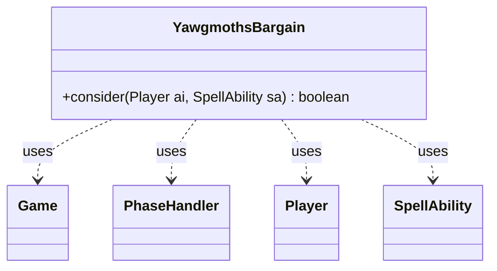

---
aliases:
  - YawgmothsBargain
tags:
  - java/class
  - module/forge-ai
  - pkg/forge/ai
fqn: forge.ai.SpecialCardAi.YawgmothsBargain
package: forge.ai
module: forge-ai
kind: Class
---

# YawgmothsBargain

**Package:** `forge.ai`   **Module:** `forge-ai`   **Kind:** Class



## Relationships
**Uses:**
- [[forge.game.Game|Game]]
- [[forge.game.phase.PhaseHandler|PhaseHandler]]
- [[forge.game.player.Player|Player]]
- [[forge.game.spellability.SpellAbility|SpellAbility]]

## Design Description

YawgmothsBargain is a stateless AI helper nested within `SpecialCardAi` that encapsulates the decision logic for whether the AI should activate Yawgmoth's Bargain, a "draw a card and lose life" effect. Its single static `consider` method evaluates the supplied `Player` and `SpellAbility` against current game state—querying the `Game` and its `PhaseHandler` for the active phase, turn ownership, and recent casting activity—to return a boolean go/no-go verdict.

As a pure decision utility it holds no fields and participates in no inheritance hierarchy; it simply collaborates with the game-model types it reads. The design intent is conservative card advantage: it avoids overdrawing past maximum hand size, guards against punisher cards like Black Vise, and otherwise only fires on the AI's own turn—except when the AI is stuck with nothing castable, where it draws proactively hoping to find a workable spell or land.

## Source
`forge-ai/src/main/java/forge/ai/SpecialCardAi.java` — declaration excerpt

```java
    // Yawgmoth's Bargain
    public static class YawgmothsBargain {
        public static boolean consider(final Player ai, final SpellAbility sa) {
            Game game = ai.getGame();
            PhaseHandler ph = game.getPhaseHandler();

            if (ai.getCardsIn(ZoneType.Library).isEmpty()) {
                return false; // nothing to draw from the library
            }

            int computerHandSize = ai.getZone(ZoneType.Hand).size();
            int maxHandSize = ai.getMaxHandSize();

            // TODO: Any other bad effects like that?
            boolean blackViseOTB = game.getCardsIn(ZoneType.Battlefield).anyMatch(CardPredicates.nameEquals("Black Vise"));

            // TODO: Consider effects like "whenever a player draws a card, he loses N life" (e.g. Nekusar, the Mindraiser),
            //       and effects that draw an additional card whenever a card is drawn.

            if (ph.getNextTurn().equals(ai) && ph.is(PhaseType.END_OF_TURN)
                    && ai.getSpellsCastLastTurn() == 0
                    && ai.getSpellsCastThisTurn() == 0
                    && ai.getLandsPlayedLastTurn() == 0) {
                // We're in a situation when we have nothing castable in hand, something needs to be done
                if (!blackViseOTB) {
                    // draw +1 card when at max hand size, hoping to draw a workable spell or land
                    return computerHandSize == maxHandSize;
                } else {
                    // draw cards hoping to draw answers even in presence of Black Vise if there's no valid play
                    // TODO: maybe limit to 1 or 2 cards at a time?
                    return computerHandSize + 1 <= maxHandSize; // currently draws to 7 cards
                }
            } else if (blackViseOTB && computerHandSize + 1 > 4) {
                // try not to overdraw in presence of Black Vise
                return false;
            } else if (computerHandSize + 1 > maxHandSize) {
                // Only draw until we reach max hand size
                return false;
            } else if (!ph.isPlayerTurn(ai)) {
                // Only activate in AI's own turn (sans the exception above)
                return false;
            }
            return true;
        }
    }
```

## Python
`forge/ai/SpecialCardAi/YawgmothsBargain.py`

```python
from forge.game.Game import Game
from forge.game.phase.PhaseHandler import PhaseHandler
from forge.game.player.Player import Player
from forge.game.spellability.SpellAbility import SpellAbility


class YawgmothsBargain:
    @staticmethod
    def consider(ai: Player, sa: SpellAbility) -> bool:
        game = ai.getGame()
        ph = game.getPhaseHandler()

        if ai.getCardsIn(ZoneType.Library).isEmpty():
            return False  # nothing to draw from the library

        computerHandSize = ai.getZone(ZoneType.Hand).size()
        maxHandSize = ai.getMaxHandSize()

        # TODO: Any other bad effects like that?
        blackViseOTB = game.getCardsIn(ZoneType.Battlefield).anyMatch(CardPredicates.nameEquals("Black Vise"))

        # TODO: Consider effects like "whenever a player draws a card, he loses N life" (e.g. Nekusar, the Mindraiser),
        #       and effects that draw an additional card whenever a card is drawn.

        if (ph.getNextTurn().equals(ai) and ph.is_(PhaseType.END_OF_TURN)
                and ai.getSpellsCastLastTurn() == 0
                and ai.getSpellsCastThisTurn() == 0
                and ai.getLandsPlayedLastTurn() == 0):
            # We're in a situation when we have nothing castable in hand, something needs to be done
            if not blackViseOTB:
                # draw +1 card when at max hand size, hoping to draw a workable spell or land
                return computerHandSize == maxHandSize
            else:
                # draw cards hoping to draw answers even in presence of Black Vise if there's no valid play
                # TODO: maybe limit to 1 or 2 cards at a time?
                return computerHandSize + 1 <= maxHandSize  # currently draws to 7 cards
        elif blackViseOTB and computerHandSize + 1 > 4:
            # try not to overdraw in presence of Black Vise
            return False
        elif computerHandSize + 1 > maxHandSize:
            # Only draw until we reach max hand size
            return False
        elif not ph.isPlayerTurn(ai):
            # Only activate in AI's own turn (sans the exception above)
            return False
        return True
```
