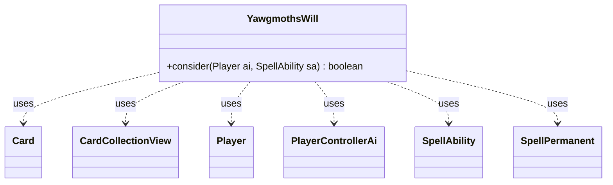

---
aliases:
  - YawgmothsWill
tags:
  - java/class
  - module/forge-ai
  - pkg/forge/ai
fqn: forge.ai.SpecialCardAi.YawgmothsWill
package: forge.ai
module: forge-ai
kind: Class
---

# YawgmothsWill

**Package:** `forge.ai`   **Module:** `forge-ai`   **Kind:** Class



## Relationships
**Uses:**
- [[forge.ai.PlayerControllerAi|PlayerControllerAi]]
- [[forge.game.card.Card|Card]]
- [[forge.game.card.CardCollectionView|CardCollectionView]]
- [[forge.game.player.Player|Player]]
- [[forge.game.spellability.SpellAbility|SpellAbility]]
- [[forge.game.spellability.SpellPermanent|SpellPermanent]]

## Design Description

Yawgmoth's Will determines whether the AI should cast an effect that lets it play cards from its graveyard this turn (Yawgmoth's Will, Magus of the Will, and similar). Implemented as a static nested helper class within `SpecialCardAi`, it exposes a single stateless `consider` method returning a play/no-play boolean rather than participating in any inheritance hierarchy.

The method gates on basic viability—a non-empty graveyard and that it is the AI's own turn (avoiding weak instant-speed decisions)—then surveys the graveyard's `SpellAbility` set to estimate value. Collaborating with `ComputerUtilAbility`, `ComputerUtilMana`, and the `PlayerControllerAi`'s `canPlaySa` decision, it counts how many graveyard cards are actually castable given remaining mana, weighting one-shot instants and sorceries at half value. It deliberately skips counterspells, lands, and self-referential abilities to prevent infinite recursion, recommending the effect only when enough castable value clears a threshold.

## Source
`forge-ai/src/main/java/forge/ai/SpecialCardAi.java` — declaration excerpt

```java
    // Yawgmoth's Will and other cards with similar effect, e.g. Magus of the Will
    public static class YawgmothsWill {
        public static boolean consider(final Player ai, final SpellAbility sa) {
            CardCollectionView cardsInGY = ai.getCardsIn(ZoneType.Graveyard);
            if (cardsInGY.size() == 0) {
                return false;
            } else if (ai.getGame().getPhaseHandler().getPlayerTurn() != ai) {
                // The AI is not very good at deciding for what to viably do during the opp's turn when this
                // comes from an instant speed effect (e.g. Magus of the Will)
                return false;
            }

            int minManaAdj = 2; // we want the AI to have some spare mana for possible other spells to cast
            float minCastableInGY = 3.0f; // we want the AI to have several castable cards in GY before attempting this effect
            List<SpellAbility> saList = ComputerUtilAbility.getSpellAbilities(cardsInGY, ai);
            int selfCMC = sa.getPayCosts().getCostMana().getMana().getCMC();

            float numCastable = 0.0f;
            for (SpellAbility ab : saList) {
                final Card src = ab.getHostCard();

                if (ab.getApi() == ApiType.Counter) {
                    // cut short considering to play counterspells via Yawgmoth's Will
                    continue;
                }

                if ((ComputerUtilAbility.getAbilitySourceName(ab).equals(ComputerUtilAbility.getAbilitySourceName(sa))
                        && !(ab instanceof SpellPermanent)) || ab.hasParam("AINoRecursiveCheck")) {
                    // prevent infinitely recursing abilities that are susceptible to reentry
                    continue;
                }

                // check to see if the AI is willing to play this card
                final SpellAbility testAb = ab.copy();
                testAb.getRestrictions().setZone(ZoneType.Graveyard);
                testAb.setActivatingPlayer(ai);

                boolean willPlayAb = ((PlayerControllerAi) ai.getController()).getAi().canPlaySa(testAb) == AiPlayDecision.WillPlay;

                // Land drops are generally made by the AI in main 1 before casting spells, so testing for them is iffy.
                if (!src.getType().isLand() && willPlayAb) {
                    int CMC = ab.getPayCosts().getTotalMana() != null ? ab.getPayCosts().getTotalMana().getCMC() : 0;
                    int Xcount = ab.getPayCosts().getTotalMana() != null ? ab.getPayCosts().getTotalMana().countX() : 0;

                    if ((Xcount == 0 && CMC == 0) || ComputerUtilMana.canPayManaCost(ab, ai, selfCMC + minManaAdj, false)) {
                        if (src.isInstant() || src.isSorcery()) {
                            // instants and sorceries are one-shot, so only treat them as 1/2 value for the purpose of meeting minimum 
                            // castable cards in graveyard requirements 
                            numCastable += 0.5f;
                        } else {
                            numCastable += 1.0f;
                        }
                    }
                }
            }

            return numCastable >= minCastableInGY;
        }
    }
```

## Python
`forge/ai/SpecialCardAi/YawgmothsWill.py`

```python
from forge.ai.PlayerControllerAi import PlayerControllerAi
from forge.ai.ComputerUtilAbility import ComputerUtilAbility
from forge.ai.ComputerUtilMana import ComputerUtilMana
from forge.ai.AiPlayDecision import AiPlayDecision
from forge.game.ability.ApiType import ApiType
from forge.game.card.Card import Card
from forge.game.card.CardCollectionView import CardCollectionView
from forge.game.player.Player import Player
from forge.game.spellability.SpellAbility import SpellAbility
from forge.game.spellability.SpellPermanent import SpellPermanent
from forge.game.zone.ZoneType import ZoneType


# Yawgmoth's Will and other cards with similar effect, e.g. Magus of the Will
class YawgmothsWill:
    @staticmethod
    def consider(ai: Player, sa: SpellAbility) -> bool:
        cardsInGY: CardCollectionView = ai.getCardsIn(ZoneType.Graveyard)
        if cardsInGY.size() == 0:
            return False
        elif ai.getGame().getPhaseHandler().getPlayerTurn() != ai:
            # The AI is not very good at deciding for what to viably do during the opp's turn when this
            # comes from an instant speed effect (e.g. Magus of the Will)
            return False

        minManaAdj = 2  # we want the AI to have some spare mana for possible other spells to cast
        minCastableInGY = 3.0  # we want the AI to have several castable cards in GY before attempting this effect
        saList: list[SpellAbility] = ComputerUtilAbility.getSpellAbilities(cardsInGY, ai)
        selfCMC = sa.getPayCosts().getCostMana().getMana().getCMC()

        numCastable = 0.0
        for ab in saList:
            src = ab.getHostCard()

            if ab.getApi() == ApiType.Counter:
                # cut short considering to play counterspells via Yawgmoth's Will
                continue

            if (ComputerUtilAbility.getAbilitySourceName(ab) == ComputerUtilAbility.getAbilitySourceName(sa)
                    and not isinstance(ab, SpellPermanent)) or ab.hasParam("AINoRecursiveCheck"):
                # prevent infinitely recursing abilities that are susceptible to reentry
                continue

            # check to see if the AI is willing to play this card
            testAb = ab.copy()
            testAb.getRestrictions().setZone(ZoneType.Graveyard)
            testAb.setActivatingPlayer(ai)

            willPlayAb = ai.getController().getAi().canPlaySa(testAb) == AiPlayDecision.WillPlay

            # Land drops are generally made by the AI in main 1 before casting spells, so testing for them is iffy.
            if not src.getType().isLand() and willPlayAb:
                CMC = ab.getPayCosts().getTotalMana().getCMC() if ab.getPayCosts().getTotalMana() is not None else 0
                Xcount = ab.getPayCosts().getTotalMana().countX() if ab.getPayCosts().getTotalMana() is not None else 0

                if (Xcount == 0 and CMC == 0) or ComputerUtilMana.canPayManaCost(ab, ai, selfCMC + minManaAdj, False):
                    if src.isInstant() or src.isSorcery():
                        # instants and sorceries are one-shot, so only treat them as 1/2 value for the purpose of meeting minimum
                        # castable cards in graveyard requirements
                        numCastable += 0.5
                    else:
                        numCastable += 1.0

        return numCastable >= minCastableInGY
```
