---
aliases:
  - SpecialCardAi
tags:
  - java/class
  - module/forge-ai
  - pkg/forge/ai
fqn: forge.ai.SpecialCardAi
package: forge.ai
module: forge-ai
kind: Class
---

# SpecialCardAi

**Package:** `forge.ai`   **Module:** `forge-ai`   **Kind:** Class



```mermaid
classDiagram
    class SpecialCardAi {
    }
    SpecialCardAi ..> AiAbilityDecision : uses
    SpecialCardAi ..> AiController : uses
    SpecialCardAi ..> Card : uses
    SpecialCardAi ..> CardCollection : uses
    SpecialCardAi ..> CardCollectionView : uses
    SpecialCardAi ..> Combat : uses
    SpecialCardAi ..> CostPart : uses
    SpecialCardAi ..> CostSacrifice : uses
    SpecialCardAi ..> Game : uses
    SpecialCardAi ..> GameEntity : uses
    SpecialCardAi ..> ManaCost : uses
    SpecialCardAi ..> ManaCostBeingPaid : uses
    SpecialCardAi ..> PhaseHandler : uses
    SpecialCardAi ..> Player : uses
    SpecialCardAi ..> PlayerCollection : uses
    SpecialCardAi ..> PlayerControllerAi : uses
    SpecialCardAi ..> SpellAbility : uses
    SpecialCardAi ..> SpellPermanent : uses
    SpecialCardAi ..> StaticAbility : uses
    SpecialCardAi ..> Trigger : uses
    SpecialCardAi ..> ZoneType : uses
```

## Relationships
**Uses:**
- [[forge.ai.AiAbilityDecision|AiAbilityDecision]]
- [[forge.ai.AiController|AiController]]
- [[forge.ai.PlayerControllerAi|PlayerControllerAi]]
- [[forge.card.mana.ManaCost|ManaCost]]
- [[forge.game.Game|Game]]
- [[forge.game.GameEntity|GameEntity]]
- [[forge.game.card.Card|Card]]
- [[forge.game.card.CardCollection|CardCollection]]
- [[forge.game.card.CardCollectionView|CardCollectionView]]
- [[forge.game.combat.Combat|Combat]]
- [[forge.game.cost.CostPart|CostPart]]
- [[forge.game.cost.CostSacrifice|CostSacrifice]]
- [[forge.game.mana.ManaCostBeingPaid|ManaCostBeingPaid]]
- [[forge.game.phase.PhaseHandler|PhaseHandler]]
- [[forge.game.player.Player|Player]]
- [[forge.game.player.PlayerCollection|PlayerCollection]]
- [[forge.game.spellability.SpellAbility|SpellAbility]]
- [[forge.game.spellability.SpellPermanent|SpellPermanent]]
- [[forge.game.staticability.StaticAbility|StaticAbility]]
- [[forge.game.trigger.Trigger|Trigger]]
- [[forge.game.zone.ZoneType|ZoneType]]


## Design Description

The `SpecialCardAi` class is a stateless utility container that centralizes the special-case AI decision logic for individual Magic cards whose behavior cannot be handled by Forge's generic ability evaluators. Rather than implementing an interface or extending a supertype, it groups per-card logic into nested static classes (e.g. `BlackLotus`, `Necropotence`, `UginTheSpiritDragon`), each named after the card it serves and exposing static `consider`/`considerXXXX` methods that return a play decision plus `getXXXX`/`chooseXXXX` helpers for utility computations.

These methods collaborate with the core game model — inspecting `Player`, `Card`/`CardCollection`, `Game`, `Combat`, and `PhaseHandler` state — and signal intent back to the engine by mutating `SpellAbility` targets and X-costs and returning `AiAbilityDecision` results (or boolean success flags). The design favors searchability and modular growth: each card's heuristics are isolated, documented by card name, and the class is explicitly intended to be split into a `forge.ai.cards` package should it grow unwieldy.

## Source
`forge-ai/src/main/java/forge/ai/SpecialCardAi.java`

```java
/*
 * Forge: Play Magic: the Gathering.
 * Copyright (C) 2011  Forge Team
 *
 * This program is free software: you can redistribute it and/or modify
 * it under the terms of the GNU General Public License as published by
 * the Free Software Foundation, either version 3 of the License, or
 * (at your option) any later version.
 *
 * This program is distributed in the hope that it will be useful,
 * but WITHOUT ANY WARRANTY; without even the implied warranty of
 * MERCHANTABILITY or FITNESS FOR A PARTICULAR PURPOSE.  See the
 * GNU General Public License for more details.
 *
 * You should have received a copy of the GNU General Public License
 * along with this program.  If not, see <http://www.gnu.org/licenses/>.
 */
package forge.ai;

import com.google.common.collect.Lists;
import forge.ai.ability.AnimateAi;
import forge.ai.ability.FightAi;
import forge.card.ColorSet;
import forge.card.MagicColor;
import forge.card.mana.ManaCost;
import forge.game.Game;
import forge.game.GameEntity;
import forge.game.GameType;
import forge.game.ability.AbilityUtils;
import forge.game.ability.ApiType;
import forge.game.card.*;
import forge.game.combat.Combat;
import forge.game.combat.CombatUtil;
import forge.game.cost.CostPart;
import forge.game.cost.CostSacrifice;
import forge.game.keyword.Keyword;
import forge.game.mana.ManaCostBeingPaid;
import forge.game.phase.PhaseHandler;
import forge.game.phase.PhaseType;
import forge.game.player.Player;
import forge.game.player.PlayerCollection;
import forge.game.player.PlayerPredicates;
import forge.game.spellability.SpellAbility;
import forge.game.spellability.SpellAbilityPredicates;
import forge.game.spellability.SpellPermanent;
import forge.game.staticability.StaticAbility;
import forge.game.trigger.Trigger;
import forge.game.zone.ZoneType;
import forge.util.Aggregates;
import forge.util.IterableUtil;
import forge.util.MyRandom;
import forge.util.TextUtil;
import org.apache.commons.lang3.tuple.Pair;

import java.util.*;
import java.util.stream.Collectors;

/**
 * Special logic for individual cards
 * <p>
 * Specific methods for each card that requires special handling are stored in inner classes
 * Each class should have a name based on the name of the card and ideally preceded with a
 * single-line comment with the full English card name to make searching for them easier.
 * <p>
 * Class methods should return "true" if they are successful and have completed their task in full,
 * otherwise should return "false" to signal that the AI should not use the card under current
 * circumstances. A good convention to follow is to call the method "consider" if it's the only
 * method necessary, or considerXXXX if several methods do different tasks, and use at least two
 * mandatory parameters (Player ai, SpellAbility sa, in this order) and, if necessary, additional
 * parameters later. Methods that perform utility tasks and return a certain value for further
 * processing should be called getXXXX. If they take Player and SpellAbility parameters, it is
 * good practice to put them in the same order as for considerXXXX methods (Player ai, SpellAbility
 * sa, followed by any additional parameters necessary).
 * <p>
 * If this class ends up being busy, consider splitting it into individual classes, each in its
 * own file, inside its own package, for example, forge.ai.cards.
 */
public class SpecialCardAi {

    // Arena and Magus of the Arena
    public static class Arena {
        public static AiAbilityDecision consider(final Player ai, final SpellAbility sa) {
            final Game game = ai.getGame();

            // TODO This is basically removal, so we may want to play this at other times
            if (!game.getPhaseHandler().is(PhaseType.END_OF_TURN) || game.getPhaseHandler().getNextTurn() != ai) {
                return new AiAbilityDecision(0, AiPlayDecision.WaitForEndOfTurn);
            }

            CardCollection aiCreatures = ai.getCreaturesInPlay();
            if (aiCreatures.isEmpty()) {
                return new AiAbilityDecision(0, AiPlayDecision.MissingNeededCards);
            }

            for (Player opp : ai.getOpponents()) {
                CardCollection oppCreatures = opp.getCreaturesInPlay();
                if (oppCreatures.isEmpty()) {
                    continue;
                }

                for (Card aiCreature : aiCreatures) {
                    boolean canKillAll = true;
                    for (Card oppCreature : oppCreatures) {
                        if (FightAi.canKill(oppCreature, aiCreature, 0)) {
                            canKillAll = false;
                            break;
                        }
                        if (!FightAi.canKill(aiCreature, oppCreature, 0)) {
                            canKillAll = false;
                            break;
                        }
                    }
                    if (canKillAll) {
                        sa.getTargets().clear();
                        sa.getTargets().add(aiCreature);
                        return new AiAbilityDecision(100, AiPlayDecision.Removal);
                    }
                }
            }
            return new AiAbilityDecision(0, AiPlayDecision.CantPlayAi);
        }
    }

    // Black Lotus and Lotus Bloom
    public static class BlackLotus {
        public static boolean consider(final Player ai, final SpellAbility sa, final ManaCostBeingPaid cost) {
            CardCollection manaSources = ComputerUtilMana.getAvailableManaSources(ai, true);
            int numManaSrcs = manaSources.size();

            CardCollection allCards = CardLists.filter(ai.getAllCards(), Arrays.asList(CardPredicates.NON_TOKEN,
                    CardPredicates.NON_LANDS, CardPredicates.isOwner(ai)));

            int numHighCMC = CardLists.count(allCards, CardPredicates.greaterCMC(5));
            int numLowCMC = CardLists.count(allCards, CardPredicates.lessCMC(3));

            boolean isLowCMCDeck = numHighCMC <= 6 && numLowCMC >= 25;

            int minCMC = isLowCMCDeck ? 3 : 4; // probably not worth wasting a lotus on a low-CMC spell (<4 CMC), except in low-CMC decks, where 3 CMC may be fine
            int paidCMC = cost.getConvertedManaCost();
            if (paidCMC < minCMC) {
                // if it's a CMC 3 spell and we're more than one mana source short for it, might be worth it anyway
                return paidCMC == 3 && numManaSrcs < 3;
            }

            return true;
        }
    }

    // Brain in a Jar
    public static class BrainInAJar {
        public static boolean consider(final Player ai, final SpellAbility sa) {
            final Card source = sa.getHostCard();

            int counterNum = source.getCounters(CounterEnumType.CHARGE);
            // no need for logic
            if (counterNum == 0) {
                return false;
            }
            int libsize = ai.getCardsIn(ZoneType.Library).size();

            final CardCollection hand = CardLists.filter(ai.getCardsIn(ZoneType.Hand),
                    CardPredicates.INSTANTS_AND_SORCERIES);
            if (!hand.isEmpty()) {
                // has spell that can be cast in hand with put ability
                if (hand.anyMatch(CardPredicates.hasCMC(counterNum + 1))) {
                    return false;
                }
                // has spell that can be cast if one counter is removed
                if (hand.anyMatch(CardPredicates.hasCMC(counterNum))) {
                    sa.setXManaCostPaid(1);
                    return true;
                }
            }
            final CardCollection library = CardLists.filter(ai.getCardsIn(ZoneType.Library),
                    CardPredicates.INSTANTS_AND_SORCERIES);
            if (!library.isEmpty()) {
                // get max cmc of instant or sorceries in the library
                int maxCMC = 0;
                for (final Card c : library) {
                    int v = c.getCMC();
                    if (c.isSplitCard()) {
                        v = Math.max(c.getCMC(Card.SplitCMCMode.LeftSplitCMC), c.getCMC(Card.SplitCMCMode.RightSplitCMC));
                    }
                    if (v > maxCMC) {
                        maxCMC = v;
                    }
                }
                // there is a spell with more CMC, no need to remove counter
                if (counterNum + 1 < maxCMC) {
                    return false;
                }
                int maxToRemove = counterNum - maxCMC + 1;
                // no Scry 0, even if its caught from later stuff
                if (maxToRemove <= 0) {
                    return false;
                }
                sa.setXManaCostPaid(maxToRemove);
            } else {
                // no Instant or Sorceries anymore, just scry
                sa.setXManaCostPaid(Math.min(counterNum, libsize));
            }
            return true;
        }
    }

    // Chain of Acid
    public static class ChainOfAcid {
        public static AiAbilityDecision consider(final Player ai, final SpellAbility sa) {
            List<Card> AiLandsOnly = CardLists.filter(ai.getCardsIn(ZoneType.Battlefield),
                    CardPredicates.LANDS);
            List<Card> OppPerms = CardLists.filter(ai.getOpponents().getCardsIn(ZoneType.Battlefield),
                    CardPredicates.NON_CREATURES);

            // TODO: improve this logic (currently the AI has difficulty evaluating non-creature permanents,
            // which it can only distinguish by their CMC, considering >CMC higher value).
            // Currently ensures that the AI will still have lands provided that the human player goes to
            // destroy all the AI's lands in order (to avoid manalock).
            if (!OppPerms.isEmpty() && AiLandsOnly.size() > OppPerms.size() + 2) {
                // If there are enough lands, target the worst non-creature permanent of the opponent
                Card worstOppPerm = ComputerUtilCard.getWorstAI(OppPerms);
                if (worstOppPerm != null) {
                    sa.resetTargets();
                    sa.getTargets().add(worstOppPerm);
                    return new AiAbilityDecision(100, AiPlayDecision.WillPlay);
                }
            }
            return new AiAbilityDecision(0, AiPlayDecision.TargetingFailed);
        }
    }

    // Chain of Smog
    public static class ChainOfSmog {
        public static AiAbilityDecision consider(final Player ai, final SpellAbility sa) {
            if (ai.getCardsIn(ZoneType.Hand).isEmpty()) {
                // to avoid failure to add to stack, provide a legal target opponent first (choosing random at this point)
                // TODO: this makes the AI target opponents with 0 cards in hand, but bailing from here causes a
                // "failed to add to stack" error, needs investigation and improvement.
                Player targOpp = Aggregates.random(ai.getOpponents());

                for (Player opp : ai.getOpponents()) {
                    if (!opp.getCardsIn(ZoneType.Hand).isEmpty()) {
                        targOpp = opp;
                        break;
                    }
                }

                sa.getParent().resetTargets();
                sa.getParent().getTargets().add(targOpp);
                return new AiAbilityDecision(100, AiPlayDecision.WillPlay);
            }

            return new AiAbilityDecision(0, AiPlayDecision.TargetingFailed);
        }
    }

    // Crawling Barrens
    public static class CrawlingBarrens {
        public static boolean consider(final Player ai, final SpellAbility sa) {
            final PhaseHandler ph = ai.getGame().getPhaseHandler();
            final Combat combat = ai.getGame().getCombat();

            Card animated = AnimateAi.becomeAnimated(sa.getHostCard(), sa.getSubAbility());
            if (sa.getHostCard().canReceiveCounters(CounterEnumType.P1P1)) {
                animated.addCounterInternal(CounterEnumType.P1P1, 2, ai, false, null, null);
            }
            boolean isOppEOT = ph.is(PhaseType.END_OF_TURN) && ph.getNextTurn() == ai;
            boolean isValuableAttacker = ph.is(PhaseType.MAIN1, ai) && ComputerUtilCard.doesSpecifiedCreatureAttackAI(ai, animated);
            boolean isValuableBlocker = combat != null && combat.getDefendingPlayers().contains(ai) && ComputerUtilCard.doesSpecifiedCreatureBlock(ai, animated);

            return isOppEOT || isValuableAttacker || isValuableBlocker;
        }
    }

    // Cursed Scroll
    public static class CursedScroll {
        public static boolean consider(final Player ai, final SpellAbility sa) {
            CardCollectionView hand = ai.getCardsIn(ZoneType.Hand);
            if (hand.isEmpty()) {
                return false;
            }

            // For now, see if all cards in hand have the same name, and then proceed if true
            return CardLists.filter(hand, CardPredicates.nameEquals(hand.getFirst().getName())).size() == hand.size();
        }

        public static String chooseCard(final Player ai, final SpellAbility sa) {
            int maxCount = 0;
            Card best = null;
            CardCollectionView hand = ai.getCardsIn(ZoneType.Hand);

            for (Card c : ai.getCardsIn(ZoneType.Hand)) {
                int count = CardLists.filter(hand, CardPredicates.nameEquals(c.getName())).size();
                if (count > maxCount) {
                    maxCount = count;
                    best = c;
                }
            }

            return best != null ? best.getName() : "";
        }
    }

    public static class PithingNeedle {
        // TODO Build out exclusion list based off cards in my deck and cards that other needles have chosen
        public static String chooseCard(final Player ai, final SpellAbility sa) {
            String keyCardChoice = chooseCardViaKeyCard(ai, sa);
            if (keyCardChoice != null) {
                return keyCardChoice;
            }

            String choice = chooseCardViaScoring(ai, sa);
            if (choice != null) {
                return choice;
            }
            return chooseNonBattlefieldName();
        }

        // Helper method to score a card's abilities and static effects
        // Used by both chooseCardViaKeyCard and chooseCardViaScoring
        private static int scoreCardAbilities(final Card c, boolean skipManaAbilities) {
            int score = 0;

            for (SpellAbility ab : c.getSpellAbilities()) {
                if (!ab.isActivatedAbility()) {
                    continue;
                }
                if (skipManaAbilities && ab.isManaAbility()) {
                    continue;
                }

                // Alter this score based off the ApiType
                switch (ab.getApi()) {
                    case Destroy:
                        score += 20;
                        break;
                    case DamageAll:
                    case DestroyAll:
                        score += 30;
                        break;
                    case WinsGame:
                    case LosesGame:
                        score += 50;
                        break;
                    case Draw:
                        score += 10;
                        break;
                    case GainControl:
                    case Play:
                    case DealDamage:
                        score += 15;
                        break;
                    case ChangeZone:
                        if (ab.getParam("Destination") != null && ab.getParam("Destination").equals("Battlefield")) {
                            score += 15;
                        } else {
                            score += 5;
                        }
                        break;
                    default:
                        score += 5;
                }

                score += 10;

                // Give higher score to cheaper abilities, as they are more likely to be used and thus worth naming
                if (ab.getPayCosts().getCostMana() != null) {
                    if (ab.getPayCosts().hasXInAnyCostPart()) {
                        score += 15;
                    } else {
                        Integer convertedAmount = ab.getPayCosts().getCostMana().convertAmount();
                        if (convertedAmount != null) {
                            score += Math.max(0, 20 - Math.pow(convertedAmount, 2));
                        }
                    }
                }
                if (ab.getPayCosts().hasSpecificCostType(CostSacrifice.class)) {
                    score += 10;
                }
            }

            for (StaticAbility st : c.getStaticAbilities()) {
                if (st.hasParam("GainsAbilitiesOf") && st.getParamOrDefault("Affected", "Self").contains("Self")) {
                    score += 10;
                }

                if (st.hasParam("AddAbility") && st.getParamOrDefault("Affected", "Self").contains("Self")) {
                    score += 10;
                }
            }

            return score;
        }

        public static String chooseCardViaKeyCard(final Player ai, final SpellAbility sa) {
            boolean skipManaAbilities = sa.getParam("AILogic").equals("PithingNeedle");
            boolean skipLands = sa.getParam("AILogic").equals("PhyrexianRevoker");
            boolean knowHand = sa.getParam("AILogic").equals("SorcerousSpyglass");

            String bestKeyCard = null;
            int bestScore = Integer.MIN_VALUE;

            for (Player opp : ai.getOpponents()) {
                List<String> keyCards = opp.getRegisteredPlayer().getDeck().getKeyCards();

                for (Card c : opp.getAllCards()) {
                    String name = c.getName();
                    if (!keyCards.contains(name)) {
                        continue;
                    }

                    // Skip lands if required
                    if (skipLands && c.isLand()) {
                        continue;
                    }

                    // Base score for key cards
                    int score = 100;

                    // Add ability-based scoring
                    score += scoreCardAbilities(c, skipManaAbilities);

                    if (score == 100) {
                        // No activated abilities found, skip this key card
                        continue;
                    }

                    // Bonus for cards on battlefield (more likely to be a key card in play)
                    if (c.isInZone(ZoneType.Battlefield)) {
                        score += 20;
                    }

                    if (knowHand && c.isInZone(ZoneType.Hand)) {
                        score += 8;
                    }

                    if (score > bestScore) {
                        bestScore = score;
                        bestKeyCard = name;
                    }
                }
            }

            return bestKeyCard;
        }

        public static String chooseNonBattlefieldName() {
            return "Liliana of the Veil";
        }


        public static String chooseCardViaScoring(final Player ai, final SpellAbility sa) {
            // Look through opponents' known zones (library, hand, graveyard, exile) for dangerous
            // cards to name with Pithing Needle. Prefer planeswalkers, otherwise any card that
            // has a non-trigger, non-mana SpellAbility (activated/static abilities that are relevant).
            final Map<String, Integer> nameToScore = new HashMap<>();
            boolean skipManaAbilities = sa.getParam("AILogic").equals("PithingNeedle");
            boolean skipLands = sa.getParam("AILogic").equals("PhyrexianRevoker");
            boolean knowHand = sa.getParam("AILogic").equals("SorcerousSpyglass");

            for (Player opp : ai.getOpponents()) {
                for (Card c : opp.getAllCards()) {
                    if (skipLands && c.isLand()) {
                        continue;
                    }

                    String name = c.getName();
                    int score = scoreCardAbilities(c, skipManaAbilities);

                    if (score == 0) {
                        continue;
                    }

                    score += c.isInZone(ZoneType.Battlefield) ? 10 : 0;
                    if (knowHand && c.isInZone(ZoneType.Hand)) {
                        score += 5;
                    }

                    if (nameToScore.containsKey(name)) {
                        nameToScore.put(name, nameToScore.get(name) + score);
                    } else {
                        nameToScore.put(name, score);
                    }
                }
            }

            for (Card n : CardLists.filter(ai.getGame().getCardsIn(ZoneType.Battlefield), CardPredicates.nameEquals("Pithing Needle"))) {
                String named = n.getNamedCard();
                if (named != null && !named.isEmpty()) {
                    if (nameToScore.containsKey(named)) {
                        nameToScore.put(named, nameToScore.get(named) - 10);
                    } else {
                        nameToScore.put(named, -10);
                    }
                }
            }

            for (Card c : ai.getAllCards()) {
                String name = c.getName();
                int score = c.isInZone(ZoneType.Battlefield) ? -10 : -4;

                if (nameToScore.containsKey(name)) {
                    nameToScore.put(name, nameToScore.get(name) + score);
                } else {
                    nameToScore.put(name, score);
                }
            }

            if (nameToScore.isEmpty()) {
                return null;
            }

            return nameToScore.entrySet().stream().max(Map.Entry.comparingByValue()).get().getKey();
        }
    }

    // Deathgorge Scavenger
    public static class DeathgorgeScavenger {
        public static boolean consider(final Player ai, final SpellAbility sa) {
            Card worstCreat = ComputerUtilCard.getWorstAI(CardLists.filter(ai.getOpponents().getCardsIn(ZoneType.Graveyard), CardPredicates.CREATURES));
            Card worstNonCreat = ComputerUtilCard.getWorstAI(CardLists.filter(ai.getOpponents().getCardsIn(ZoneType.Graveyard), CardPredicates.NON_CREATURES));
            if (worstCreat == null) {
                worstCreat = ComputerUtilCard.getWorstAI(CardLists.filter(ai.getCardsIn(ZoneType.Graveyard), CardPredicates.CREATURES));
            }
            if (worstNonCreat == null) {
                worstNonCreat = ComputerUtilCard.getWorstAI(CardLists.filter(ai.getCardsIn(ZoneType.Graveyard), CardPredicates.NON_CREATURES));
            }

            sa.resetTargets();
            if (worstCreat != null && ai.getLife() <= ai.getStartingLife() / 4) {
                sa.getTargets().add(worstCreat);
            } else if (worstNonCreat != null && ai.getGame().getCombat() != null
                    && ai.getGame().getCombat().isAttacking(sa.getHostCard())) {
                sa.getTargets().add(worstNonCreat);
            } else if (worstCreat != null) {
                sa.getTargets().add(worstCreat);
            }

            return sa.getTargets().size() > 0;
        }
    }

    // Desecration Demon
    public static class DesecrationDemon {
        private static final int demonSacThreshold = Integer.MAX_VALUE; // if we're in dire conditions, sac everything from worst to best hoping to find an answer

        public static boolean considerSacrificingCreature(final Player ai, final SpellAbility sa) {
            Card c = sa.getHostCard();

            // Only check for sacrifice if it's the owner's turn, and it can attack.
            // TODO: Maybe check if sacrificing a creature allows AI to kill the opponent with the rest on their turn?
            if (!CombatUtil.canAttack(c) ||
                    !ai.getGame().getPhaseHandler().isPlayerTurn(sa.getActivatingPlayer())) {
                return false;
            }

            CardCollection flyingCreatures = CardLists.filter(ai.getCardsIn(ZoneType.Battlefield),
                    CardPredicates.UNTAPPED.and(
                            CardPredicates.hasKeyword(Keyword.FLYING).or(CardPredicates.hasKeyword(Keyword.REACH))));
            boolean hasUsefulBlocker = false;

            for (Card fc : flyingCreatures) {
                if (!ComputerUtilCard.isUselessCreature(ai, fc)) {
                    hasUsefulBlocker = true;
                    break;
                }
            }

            return ai.getLife() <= c.getNetPower() && !hasUsefulBlocker;
        }

        public static int getSacThreshold() {
            return demonSacThreshold;
        }
    }

    // Donate
    public static class Donate {
        public static AiAbilityDecision considerTargetingOpponent(final Player ai, final SpellAbility sa) {
            final Card donateTarget = ComputerUtil.getCardPreference(ai, sa.getHostCard(), "DonateMe", CardLists.filter(
                    ai.getCardsIn(ZoneType.Battlefield).threadSafeIterable(), CardPredicates.hasSVar("DonateMe")));
            if (donateTarget != null) {
                // first filter for opponents which can be targeted by SA
                PlayerCollection oppList = ai.getOpponents().filter(PlayerPredicates.isTargetableBy(sa));

                // All opponents have hexproof or something like that
                if (oppList.isEmpty()) {
                    return new AiAbilityDecision(0, AiPlayDecision.TargetingFailed);
                }

                // filter for player who does not have donate target already
                PlayerCollection oppTarget = oppList.filter(PlayerPredicates.isNotCardInPlay(donateTarget.getName()));
                // fall back to previous list
                if (oppTarget.isEmpty()) {
                    oppTarget = oppList;
                }

                // select player with less lands on the field (helpful for Illusions of Grandeur and probably Pacts too)
                Player opp = Collections.min(oppTarget,
                        PlayerPredicates.compareByZoneSize(ZoneType.Battlefield, CardPredicates.LANDS));

                if (opp != null) {
                    sa.resetTargets();
                    sa.getTargets().add(opp);
                }
                return new AiAbilityDecision(100, AiPlayDecision.WillPlay);
            }
            // No targets found to donate, so do nothing.
            return new AiAbilityDecision(0, AiPlayDecision.TargetingFailed);
        }

        public static AiAbilityDecision considerDonatingPermanent(final Player ai, final SpellAbility sa) {
            Card donateTarget = ComputerUtil.getCardPreference(ai, sa.getHostCard(), "DonateMe", CardLists.filter(ai.getCardsIn(ZoneType.Battlefield).threadSafeIterable(), CardPredicates.hasSVar("DonateMe")));
            if (donateTarget != null) {
                sa.resetTargets();
                sa.getTargets().add(donateTarget);
                return new AiAbilityDecision(100, AiPlayDecision.WillPlay);
            }

            // Should never get here because targetOpponent, called before targetPermanentToDonate, should already have made the AI bail
            System.err.println("Warning: Donate AI failed at SpecialCardAi.Donate#targetPermanentToDonate despite successfully targeting an opponent first.");
            return new AiAbilityDecision(0, AiPlayDecision.TargetingFailed);
        }
    }

    // Electrostatic Pummeler
    public static class ElectrostaticPummeler {
        public static AiAbilityDecision consider(final Player ai, final SpellAbility sa) {
            final Card source = sa.getHostCard();
            Game game = ai.getGame();
            Combat combat = game.getCombat();
            Pair<Integer, Integer> predictedPT = getPumpedPT(ai, source.getNetCombatDamage(), source.getNetToughness());

            // Try to save the Pummeler from death by pumping it if it's threatened with a damage spell
            if (ComputerUtil.predictThreatenedObjects(ai, null, true).contains(source)) {
                SpellAbility saTop = game.getStack().peekAbility();

                if (saTop.getApi() == ApiType.DealDamage || saTop.getApi() == ApiType.DamageAll) {
                    int dmg = AbilityUtils.calculateAmount(saTop.getHostCard(), saTop.getParam("NumDmg"), saTop);
                    if (source.getNetToughness() - source.getDamage() <= dmg && predictedPT.getRight() - source.getDamage() > dmg)
                        return new AiAbilityDecision(100, AiPlayDecision.WillPlay);
                }
            }

            // Do not activate if damage will be prevented
            if (source.staticDamagePrevention(predictedPT.getLeft(), 0, source, true) == 0) {
                return new AiAbilityDecision(0, AiPlayDecision.DoesntImpactGame);
            }

            // Activate Electrostatic Pummeler's pump only as a combat trick
            if (game.getPhaseHandler().is(PhaseType.COMBAT_BEGIN)) {
                if (predictOverwhelmingDamage(ai, sa)) {
                    // We'll try to deal lethal trample/unblocked damage, so remember the card for attack
                    // and wait until declare blockers step.
                    AiCardMemory.rememberCard(ai, source, AiCardMemory.MemorySet.MANDATORY_ATTACKERS);
                    return new AiAbilityDecision(0, AiPlayDecision.CantPlayAi);
                }
            } else if (!game.getPhaseHandler().is(PhaseType.COMBAT_DECLARE_BLOCKERS)) {
                return new AiAbilityDecision(0, AiPlayDecision.WaitForCombat);
            }

            if (combat == null || !(combat.isAttacking(source) || combat.isBlocking(source))) {
                return new AiAbilityDecision(0, AiPlayDecision.CantPlayAi);
            }

            boolean isBlocking = combat.isBlocking(source);
            boolean cantDie = ComputerUtilCombat.combatantCantBeDestroyed(ai, source);

            CardCollection opposition = isBlocking ? combat.getAttackersBlockedBy(source) : combat.getBlockers(source);
            int oppP = Aggregates.sum(opposition, Card::getNetCombatDamage);
            int oppT = Aggregates.sum(opposition, Card::getNetToughness);

            boolean oppHasFirstStrike = false;
            boolean oppCantDie = true;
            boolean unblocked = opposition.isEmpty();
            boolean canTrample = source.hasKeyword(Keyword.TRAMPLE);

            if (!isBlocking && combat.getDefenderByAttacker(source) instanceof Card) {
                int loyalty = combat.getDefenderByAttacker(source).getCounters(CounterEnumType.LOYALTY);
                int totalDamageToPW = 0;
                for (Card atk : combat.getAttackersOf(combat.getDefenderByAttacker(source))) {
                    if (combat.isUnblocked(atk)) {
                        totalDamageToPW += atk.getNetCombatDamage();
                    }
                }
                if (totalDamageToPW >= oppT + loyalty) {
                    // Already enough damage to take care of the planeswalker
                    return new AiAbilityDecision(0, AiPlayDecision.DoesntImpactCombat);
                }
                if ((unblocked || canTrample) && predictedPT.getLeft() >= oppT + loyalty) {
                    // Can pump to kill the planeswalker, go for it
                    return new AiAbilityDecision(100, AiPlayDecision.ImpactCombat);
                }

            }

            for (Card c : opposition) {
                if (c.hasKeyword(Keyword.FIRST_STRIKE) || c.hasKeyword(Keyword.DOUBLE_STRIKE)) {
                    oppHasFirstStrike = true;
                }
                if (!ComputerUtilCombat.combatantCantBeDestroyed(c.getController(), c)) {
                    oppCantDie = false;
                }
            }

            if (!isBlocking) {
                int oppLife = combat.getDefendingPlayerRelatedTo(source).getLife();
                if (((unblocked || canTrample) && (predictedPT.getLeft() - oppT > oppLife / 2))
                        || (canTrample && predictedPT.getLeft() - oppT > 0 && predictedPT.getRight() > oppP)) {
                    // We can deal a lot of damage (either a lot of damage directly to the opponent,
                    // or kill the blocker(s) and damage the opponent at the same time, so go for it
                    AiCardMemory.rememberCard(ai, source, AiCardMemory.MemorySet.MANDATORY_ATTACKERS);
                    return new AiAbilityDecision(100, AiPlayDecision.ImpactCombat);
                }
            }

            if (predictedPT.getRight() - source.getDamage() <= oppP && oppHasFirstStrike && !cantDie) {
                // Can't survive first strike or double strike, don't pump
                return new AiAbilityDecision(0, AiPlayDecision.DoesntImpactCombat);
            }
            if (predictedPT.getLeft() < oppT && (!cantDie || predictedPT.getRight() - source.getDamage() <= oppP)) {
                // Can't pump enough to kill the blockers and survive, don't pump
                return new AiAbilityDecision(0, AiPlayDecision.DoesntImpactCombat);
            }
            if (source.getNetCombatDamage() > oppT && source.getNetToughness() > oppP) {
                // Already enough to kill the blockers and survive, don't overpump
                return new AiAbilityDecision(0, AiPlayDecision.DoesntImpactCombat);
            }
            if (oppCantDie && !source.hasKeyword(Keyword.TRAMPLE) && !source.isWitherDamage()
                    && predictedPT.getLeft() <= oppT) {
                // Can't kill or cripple anyone, as well as can't Trample over, so don't pump
                return new AiAbilityDecision(0, AiPlayDecision.DoesntImpactCombat);
            }

            // If we got here, it should be a favorable combat pump, resulting in at least one
            // opposing creature dying, and hopefully with the Pummeler surviving combat.
            return new AiAbilityDecision(100, AiPlayDecision.ImpactCombat);
        }

        public static boolean predictOverwhelmingDamage(final Player ai, final SpellAbility sa) {
            final Card source = sa.getHostCard();
            int oppLife = ai.getWeakestOpponent().getLife();
            CardCollection oppInPlay = ai.getWeakestOpponent().getCreaturesInPlay();
            CardCollection potentialBlockers = new CardCollection();

            for (Card b : oppInPlay) {
                if (CombatUtil.canBlock(source, b)) {
                    potentialBlockers.add(b);
                }
            }

            Pair<Integer, Integer> predictedPT = getPumpedPT(ai, source.getNetCombatDamage(), source.getNetToughness());
            int oppT = Aggregates.sum(potentialBlockers, Card::getNetToughness);

            return potentialBlockers.isEmpty() || (source.hasKeyword(Keyword.TRAMPLE) && predictedPT.getLeft() - oppT >= oppLife);
        }

        public static Pair<Integer, Integer> getPumpedPT(Player ai, int power, int toughness) {
            int energy = ai.getCounters(CounterEnumType.ENERGY);
            if (energy > 0) {
                int numActivations = energy / 3;
                for (int i = 0; i < numActivations; i++) {
                    power *= 2;
                    toughness *= 2;
                }
            }

            return Pair.of(power, toughness);
        }
    }

    // Extraplanar Lens
    public static class ExtraplanarLens {
        public static boolean consider(final Player ai, final SpellAbility sa) {
            Card bestBasic = null;
            Card bestBasicSelfOnly = null;

            CardCollection aiLands = CardLists.filter(ai.getCardsIn(ZoneType.Battlefield), CardPredicates.LANDS_PRODUCING_MANA);
            CardCollection oppLands = CardLists.filter(ai.getOpponents().getCardsIn(ZoneType.Battlefield),
                    CardPredicates.LANDS_PRODUCING_MANA);

            int bestCount = 0;
            int bestSelfOnlyCount = 0;
            for (String landType : MagicColor.Constant.BASIC_LANDS) {
                CardCollection landsOfType = CardLists.filter(aiLands, CardPredicates.nameEquals(landType));
                CardCollection oppLandsOfType = CardLists.filter(oppLands, CardPredicates.nameEquals(landType));

                int numCtrl = CardLists.filter(aiLands, CardPredicates.nameEquals(landType)).size();
                if (numCtrl > bestCount) {
                    bestCount = numCtrl;
                    bestBasic = ComputerUtilCard.getWorstLand(landsOfType);
                }
                if (numCtrl > bestSelfOnlyCount && numCtrl > 1 && oppLandsOfType.isEmpty() && bestBasicSelfOnly == null) {
                    bestSelfOnlyCount = numCtrl;
                    bestBasicSelfOnly = ComputerUtilCard.getWorstLand(landsOfType);
                }
            }

            sa.resetTargets();
            if (bestBasicSelfOnly != null) {
                sa.getTargets().add(bestBasicSelfOnly);
                return true;
            } else if (bestBasic != null) {
                sa.getTargets().add(bestBasic);
                return true;
            }

            return false;
        }
    }

    // Fell the Mighty
    public static class FellTheMighty {
        public static AiAbilityDecision consider(final Player ai, final SpellAbility sa) {
            CardCollection aiList = ai.getCreaturesInPlay();
            if (aiList.isEmpty()) {
                return new AiAbilityDecision(0, AiPlayDecision.MissingNeededCards);
            }
            CardLists.sortByPowerAsc(aiList);
            Card lowest = aiList.get(0);
            if (!sa.canTarget(lowest)) {
                return new AiAbilityDecision(0, AiPlayDecision.TargetingFailed);
            }

            CardCollection oppList = CardLists.filter(ai.getGame().getCardsIn(ZoneType.Battlefield),
                    CardPredicates.CREATURES, CardPredicates.isControlledByAnyOf(ai.getOpponents()));

            oppList = CardLists.filterPower(oppList, lowest.getNetPower() + 1);
            if (ComputerUtilCard.evaluateCreatureList(oppList) > 200) {
                sa.resetTargets();
                sa.getTargets().add(lowest);
                return new AiAbilityDecision(100, AiPlayDecision.WillPlay);
            }
            return new AiAbilityDecision(0, AiPlayDecision.TargetingFailed);
        }
    }

    // Force of Will
    public static class ForceOfWill {
        public static boolean consider(final Player ai, final SpellAbility sa) {
            CardCollection blueCards = CardLists.filter(ai.getCardsIn(ZoneType.Hand), CardPredicates.isColor(MagicColor.BLUE));

            boolean isExileMode = false;
            for (CostPart c : sa.getPayCosts().getCostParts()) {
                if (c.toString().contains("Exile")) {
                    isExileMode = true; // the AI is trying to go for the "exile and pay life" alt cost
                    break;
                }
            }

            if (isExileMode) {
                if (blueCards.size() < 2) {
                    // Need to have something else in hand that is blue in addition to Force of Will itself,
                    // otherwise the AI will fail to play the card and the card will disappear from the pool
                    return false;
                } else if (!blueCards.anyMatch(CardPredicates.lessCMC(3))) {
                    // We probably need a low-CMC card to exile to it, exiling a higher CMC spell may be suboptimal
                    // since the AI does not prioritize/value cards vs. permission at the moment.
                    return false;
                }
            }

            return true;
        }
    }

    // Gideon Blackblade
    public static class GideonBlackblade {
        public static AiAbilityDecision consider(final Player ai, final SpellAbility sa) {
            sa.resetTargets();
            CardCollectionView otb = CardLists.filter(ai.getCardsIn(ZoneType.Battlefield), CardPredicates.isTargetableBy(sa));
            if (!otb.isEmpty()) {
                sa.getTargets().add(ComputerUtilCard.getBestAI(otb));
            }
            return new AiAbilityDecision(100, AiPlayDecision.WillPlay);
        }
    }

    // Goblin Polka Band
    public static class GoblinPolkaBand {
        public static AiAbilityDecision consider(final Player ai, final SpellAbility sa) {
            int maxPotentialTgts = ai.getOpponents().getCreaturesInPlay().filter(CardPredicates.UNTAPPED).size();
            int maxPotentialPayment = ComputerUtilMana.determineLeftoverMana(sa, ai, "R", false);

            int numTgts = Math.min(maxPotentialPayment, maxPotentialTgts);
            if (numTgts == 0) {
                return new AiAbilityDecision(0, AiPlayDecision.TargetingFailed);
            }

            // Set Announce
            sa.getHostCard().setSVar("TgtNum", String.valueOf(numTgts));

            // Simulate random targeting
            List<GameEntity> validTgts = sa.getTargetRestrictions().getAllCandidates(sa, true);
            sa.resetTargets();
            sa.getTargets().addAll(Aggregates.random(validTgts, numTgts));
            return new AiAbilityDecision(100, AiPlayDecision.WillPlay);
        }
    }

    // Grisly Sigil
    public static class GrislySigil {
        public static boolean consider(final Player ai, final SpellAbility sa) {
            // TODO: improve targeting support for Casualty 1
            CardCollection potentialTgts = CardLists.filterControlledBy(CardUtil.getValidCardsToTarget(sa), ai.getOpponents());

            for (Card c : potentialTgts) {
                int potentialDamage = c.getAssignedDamage(false, null) > 0 ? 3 : 1; // TODO: account for damage reduction
                if (c.canBeDestroyed()) {
                    int damageToDeal = c.isCreature() ? c.getNetToughness() : c.getCurrentLoyalty();
                    if (damageToDeal <= c.getAssignedDamage() + potentialDamage) {
                        potentialTgts.add(c);
                    }
                }
            }

            if (!potentialTgts.isEmpty()) {
                sa.resetTargets();
                sa.getTargets().add(ComputerUtilCard.getBestAI(potentialTgts));
                return true;
            }

            return false;
        }
    }

    // Grothama, All-Devouring
    public static class GrothamaAllDevouring {
        public static boolean consider(final Player ai, final SpellAbility sa) {
            final Card fighter = sa.getHostCard();
            final Card devourer = sa.getOriginalHost();
            if (ai.getTeamMates(true).contains(devourer.getController())) {
                return false; // TODO: Currently, the AI doesn't ever fight its own (or allied) Grothama for card draw. This can be improved.
            }
            boolean goodTradeOrNoTrade = devourer.canBeDestroyed() && (devourer.getNetPower() < fighter.getNetToughness() || !fighter.canBeDestroyed()
                    || ComputerUtilCard.evaluateCreature(devourer) > ComputerUtilCard.evaluateCreature(fighter));
            return goodTradeOrNoTrade && fighter.getNetPower() >= devourer.getNetToughness();
        }
    }

    // Guilty Conscience
    public static class GuiltyConscience {
        public static Card getBestAttachTarget(final Player ai, final SpellAbility sa, final List<Card> list) {
            Card chosen = null;

            List<Card> aiStuffies = CardLists.filter(list, c -> {
                // Don't enchant creatures that can survive
                if (!c.getController().equals(ai)) {
                    return false;
                }
                final String name = c.getName();
                return name.equals("Stuffy Doll") || name.equals("Boros Reckoner") || name.equals("Spitemare");
            });
            if (!aiStuffies.isEmpty()) {
                chosen = aiStuffies.get(0);
            } else {
                List<Card> creatures = CardLists.filterControlledBy(list, ai.getOpponents());
                // Don't enchant creatures that can survive
                creatures = CardLists.filter(creatures, c -> c.canBeDestroyed()
                        && c.getNetCombatDamage() >= c.getNetToughness()
                        && !c.isEnchantedBy("Guilty Conscience")
                );
                chosen = ComputerUtilCard.getBestCreatureAI(creatures);
            }

            return chosen;
        }
    }

    // Intuition (and any other card that might potentially let you pick N cards from the library,
    // one of which will then be picked for you by the opponent)
    public static class Intuition {
        public static CardCollection considerMultiple(final Player ai, final SpellAbility sa) {
            if (ai.getController().isAI()) {
                if (!((PlayerControllerAi) ai.getController()).getAi().getBoolProperty(AiProps.INTUITION_ALTERNATIVE_LOGIC)) {
                    return new CardCollection(); // fall back to standard ChangeZoneAi considerations
                }
            }

            int changeNum = AbilityUtils.calculateAmount(sa.getHostCard(),
                    sa.getParamOrDefault("ChangeNum", "1"), sa);
            CardCollection lib = CardLists.filter(ai.getCardsIn(ZoneType.Library),
                    CardPredicates.nameNotEquals(sa.getHostCard().getName()));
            lib.sort(CardLists.CmcComparatorInv);

            // Additional cards which are difficult to auto-classify but which are generally good to Intuition for
            List<String> highPriorityNamedCards = Lists.newArrayList("Accumulated Knowledge", "Take Inventory");

            // figure out how many of each card we have in deck
            Map<String, Long> cardAmount = lib.stream().collect(Collectors.groupingBy(Card::getName, Collectors.counting()));

            // Trix: see if we can complete the combo (if it looks like we might win shortly or if we need to get a Donate stat)
            boolean donateComboMightWin = false;
            int numIllusionsOTB = CardLists.filter(ai.getCardsIn(ZoneType.Battlefield), CardPredicates.nameEquals("Illusions of Grandeur")).size();
            if (ai.getOpponentsSmallestLifeTotal() < 20 || numIllusionsOTB > 0) {
                donateComboMightWin = true;
                int numIllusionsInHand = CardLists.filter(ai.getCardsIn(ZoneType.Hand), CardPredicates.nameEquals("Illusions of Grandeur")).size();
                int numDonateInHand = CardLists.filter(ai.getCardsIn(ZoneType.Hand), CardPredicates.nameEquals("Donate")).size();
                int numIllusionsInLib = CardLists.filter(ai.getCardsIn(ZoneType.Library), CardPredicates.nameEquals("Illusions of Grandeur")).size();
                int numDonateInLib = CardLists.filter(ai.getCardsIn(ZoneType.Library), CardPredicates.nameEquals("Donate")).size();
                CardCollection comboList = new CardCollection();
                if ((numIllusionsInHand > 0 || numIllusionsOTB > 0) && numDonateInHand == 0 && numDonateInLib >= 3) {
                    for (Card c : lib) {
                        if (c.getName().equals("Donate")) {
                            comboList.add(c);
                        }
                    }
                    return comboList;
                } else if (numDonateInHand > 0 && numIllusionsInHand == 0 && numIllusionsInLib >= 3) {
                    for (Card c : lib) {
                        if (c.getName().equals("Illusions of Grandeur")) {
                            comboList.add(c);
                        }
                    }
                    return comboList;
                }
            }

            // Create a priority list for cards that we have no more than 4 of and that are not lands
            CardCollection libPriorityList = new CardCollection();
            CardCollection libHighPriorityList = new CardCollection();
            CardCollection libLowPriorityList = new CardCollection();
            List<String> processed = Lists.newArrayList();
            for (int i = 4; i > 0; i--) {
                for (Card c : lib) {
                    if (!donateComboMightWin && (c.getName().equals("Illusions of Grandeur") || c.getName().equals("Donate"))) {
                        // Probably not worth putting two of the combo pieces into the graveyard
                        // since one Illusions-Donate is likely to not be enough
                        continue;
                    }
                    if (cardAmount.get(c.getName()) == i && !c.isLand() && !processed.contains(c.getName())) {
                        // if it's a card that is generally good to place in the graveyard, also add it
                        // to the mix
                        boolean canRetFromGrave = false;
                        String name = c.getName().replace(',', ';');
                        for (Trigger t : c.getTriggers()) {
                            SpellAbility ab = t.ensureAbility();
                            if (ab == null) {
                                continue;
                            }

                            if (ab.getApi() == ApiType.ChangeZone
                                    && "Self".equals(ab.getParam("Defined"))
                                    && "Graveyard".equals(ab.getParam("Origin"))
                                    && "Battlefield".equals(ab.getParam("Destination"))) {
                                canRetFromGrave = true;
                            }
                            if (ab.getApi() == ApiType.ChangeZoneAll
                                    && TextUtil.concatNoSpace("Creature.named", name).equals(ab.getParam("ChangeType"))
                                    && "Graveyard".equals(ab.getParam("Origin"))
                                    && "Battlefield".equals(ab.getParam("Destination"))) {
                                canRetFromGrave = true;
                            }
                        }
                        boolean isGoodToPutInGrave = c.hasSVar("DiscardMe") || canRetFromGrave
                                || (ComputerUtil.isPlayingReanimator(ai) && c.isCreature());

                        for (Card c1 : lib) {
                            if (c1.getName().equals(c.getName())) {
                                if (!ai.getCardsIn(ZoneType.Hand).anyMatch(CardPredicates.nameEquals(c1.getName()))
                                        && ComputerUtilMana.hasEnoughManaSourcesToCast(c1.getFirstSpellAbility(), ai)) {
                                    // Try not to search for things we already have in hand or that we can't cast
                                    libPriorityList.add(c1);
                                } else {
                                    libLowPriorityList.add(c1);
                                }
                                if (isGoodToPutInGrave || highPriorityNamedCards.contains(c.getName())) {
                                    libHighPriorityList.add(c1);
                                }
                            }
                        }
                        processed.add(c.getName());
                    }
                }
            }

            // If we're playing Reanimator, we're really interested just in the highest CMC spells, not the
            // ones we necessarily have multiples of
            if (ComputerUtil.isPlayingReanimator(ai)) {
                libHighPriorityList.sort(CardLists.CmcComparatorInv);
            }

            // Otherwise, try to grab something that is hopefully decent to grab, in priority order
            CardCollection chosen = new CardCollection();
            if (libHighPriorityList.size() >= changeNum) {
                for (int i = 0; i < changeNum; i++) {
                    chosen.add(libHighPriorityList.get(i));
                }
            } else if (libPriorityList.size() >= changeNum) {
                for (int i = 0; i < changeNum; i++) {
                    chosen.add(libPriorityList.get(i));
                }
            } else if (libLowPriorityList.size() >= changeNum) {
                for (int i = 0; i < changeNum; i++) {
                    chosen.add(libLowPriorityList.get(i));
                }
            }

            return chosen;
        }
    }

    // Living Death (and other similar cards using AILogic LivingDeath or AILogic ReanimateAll)
    public static class LivingDeath {
        public static AiAbilityDecision consider(final Player ai, final SpellAbility sa) {
            // if there's another reanimator card currently suspended, don't cast a new one until the previous
            // one resolves, otherwise the reanimation attempt will be ruined (e.g. Living End)
            for (Card ex : ai.getCardsIn(ZoneType.Exile)) {
                if (ex.hasSVar("IsReanimatorCard") && ex.getCounters(CounterEnumType.TIME) > 0) {
                    return new AiAbilityDecision(0, AiPlayDecision.CantPlayAi);
                }
            }

            int aiBattlefieldPower = 0, aiGraveyardPower = 0;
            int threshold = 320; // approximately a 4/4 Flying creature worth of extra value

            CardCollection aiCreaturesInGY = CardLists.filter(ai.getZone(ZoneType.Graveyard).getCards(), CardPredicates.CREATURES);

            if (aiCreaturesInGY.isEmpty()) {
                // nothing in graveyard, so cut short
                return new AiAbilityDecision(0, AiPlayDecision.CantPlayAi);
            }

            for (Card c : ai.getCreaturesInPlay()) {
                if (!ComputerUtilCard.isUselessCreature(ai, c)) {
                    aiBattlefieldPower += ComputerUtilCard.evaluateCreature(c);
                }
            }
            for (Card c : aiCreaturesInGY) {
                aiGraveyardPower += ComputerUtilCard.evaluateCreature(c);
            }

            int oppBattlefieldPower = 0, oppGraveyardPower = 0;
            List<Player> opponents = ai.getOpponents();
            for (Player p : opponents) {
                int playerPower = 0;
                int tempGraveyardPower = 0;
                for (Card c : p.getCreaturesInPlay()) {
                    playerPower += ComputerUtilCard.evaluateCreature(c);
                }
                for (Card c : CardLists.filter(p.getZone(ZoneType.Graveyard).getCards(), CardPredicates.CREATURES)) {
                    tempGraveyardPower += ComputerUtilCard.evaluateCreature(c);
                }
                if (playerPower > oppBattlefieldPower) {
                    oppBattlefieldPower = playerPower;
                }
                if (tempGraveyardPower > oppGraveyardPower) {
                    oppGraveyardPower = tempGraveyardPower;
                }
            }

            // if we get more value out of this than our opponent does (hopefully), go for it
            if ((aiGraveyardPower - aiBattlefieldPower) > (oppGraveyardPower - oppBattlefieldPower + threshold)) {
                return new AiAbilityDecision(100, AiPlayDecision.WillPlay);
            } else {
                return new AiAbilityDecision(0, AiPlayDecision.CantPlayAi);
            }
        }
    }

    // Maze's End
    public static class MazesEnd {
        public static AiAbilityDecision consider(final Player ai, final SpellAbility sa) {
            PhaseHandler ph = ai.getGame().getPhaseHandler();
            CardCollection availableGates = CardLists.filter(ai.getCardsIn(ZoneType.Library), CardPredicates.isType("Gate"));

            if (ph.is(PhaseType.END_OF_TURN) && ph.getNextTurn() == ai && !availableGates.isEmpty()) {
                return new AiAbilityDecision(100, AiPlayDecision.WillPlay);
            }

            if (availableGates.isEmpty()) {
                // No gates available, so don't activate Maze's End
                return new AiAbilityDecision(0, AiPlayDecision.MissingNeededCards);
            }

            return new AiAbilityDecision(0, AiPlayDecision.AnotherTime);
        }

        public static Card considerCardToGet(final Player ai, final SpellAbility sa) {
            CardCollection currentGates = CardLists.filter(ai.getCardsIn(ZoneType.Battlefield), CardPredicates.isType("Gate"));
            CardCollection availableGates = CardLists.filter(ai.getCardsIn(ZoneType.Library), CardPredicates.isType("Gate"));

            if (availableGates.isEmpty())
                return null; // shouldn't get here

            for (Card gate : availableGates) {
                if (!currentGates.anyMatch(CardPredicates.nameEquals(gate.getName()))) {
                    // Diversify our mana base
                    return gate;
                }
            }

            // Fetch a random gate if we already have all types
            return Aggregates.random(availableGates);
        }
    }

    // Mairsil, the Pretender
    public static class MairsilThePretender {
        // Scan the fetch list for a card with at least one activated ability.
        // TODO: can be improved to a full consider(sa, ai) logic which would scan the graveyard first and hand last
        public static Card considerCardFromList(final CardCollection fetchList, SpellAbility sa) {
            CardCollectionView caged = CardLists.filter(sa.getActivatingPlayer().getCardsIn(ZoneType.Exile),
                    CardPredicates.hasCounter(CounterType.getType("CAGE")));
            return fetchList.stream().filter(CardPredicates.ARTIFACTS.or(CardPredicates.CREATURES))
                .filter(c -> c.getSpellAbilities().stream().anyMatch(SpellAbility::isActivatedAbility))
                .filter(c -> caged.stream().noneMatch(CardPredicates.sharesNameWith(c)))
                .findFirst().orElse(null);
        }
    }

    // Mimic Vat
    public static class MimicVat {
        public static boolean considerExile(final Player ai, final SpellAbility sa) {
            final Card source = sa.getHostCard();
            final Card exiledWith = source.getImprintedCards().isEmpty() ? null : source.getImprintedCards().getFirst();
            final List<Card> defined = AbilityUtils.getDefinedCards(sa.getHostCard(), sa.getParam("Defined"), sa);
            final Card tgt = defined.isEmpty() ? null : defined.get(0);

            return exiledWith == null || (tgt != null && ComputerUtilCard.evaluateCreature(tgt) > ComputerUtilCard.evaluateCreature(exiledWith));
        }

        public static AiAbilityDecision considerCopy(final Player ai, final SpellAbility sa) {
            final Card source = sa.getHostCard();
            final Card exiledWith = source.getImprintedCards().isEmpty() ? null : source.getImprintedCards().getFirst();

            if (exiledWith == null) {
                return new AiAbilityDecision(0, AiPlayDecision.MissingNeededCards);
            }

            // We want to either be able to attack with the creature, or keep it until our opponent's end of turn as a
            // potential blocker
            if (ComputerUtilCard.doesSpecifiedCreatureAttackAI(ai, exiledWith)
                    || (ai.getGame().getPhaseHandler().getPlayerTurn().isOpponentOf(ai) && ai.getGame().getCombat() != null
                    && !ai.getGame().getCombat().getAttackers().isEmpty())) {
                return new AiAbilityDecision(100, AiPlayDecision.WillPlay);
            } else {
                return new AiAbilityDecision(0, AiPlayDecision.CantPlayAi);
            }
        }
    }

    // Momir Vig, Simic Visionary Avatar
    public static class MomirVigAvatar {
        public static AiAbilityDecision consider(final Player ai, final SpellAbility sa) {
            Card source = sa.getHostCard();

            if (source.getGame().getPhaseHandler().getPhase().isBefore(PhaseType.MAIN1)) {
                return new AiAbilityDecision(0, AiPlayDecision.AnotherTime);
            }

            // In MoJhoSto, prefer Jhoira sorcery ability from time to time
            if (source.getGame().getRules().hasAppliedVariant(GameType.MoJhoSto)
                    && CardLists.filter(ai.getLandsInPlay(), CardPredicates.UNTAPPED).size() >= 3) {
                AiController aic = ((PlayerControllerAi) ai.getController()).getAi();
                int chanceToPrefJhoira = aic.getIntProperty(AiProps.MOJHOSTO_CHANCE_TO_PREFER_JHOIRA_OVER_MOMIR);
                int numLandsForJhoira = aic.getIntProperty(AiProps.MOJHOSTO_NUM_LANDS_TO_ACTIVATE_JHOIRA);

                if (ai.getLandsInPlay().size() >= numLandsForJhoira && MyRandom.percentTrue(chanceToPrefJhoira)) {
                    return new AiAbilityDecision(0, AiPlayDecision.AnotherTime);
                }
            }

            // Set PayX here to maximum value.
            int tokenSize = ComputerUtilCost.setMaxXValue(sa, ai, false);

            // Some basic strategy for Momir
            if (tokenSize < 2) {
                return new AiAbilityDecision(0, AiPlayDecision.AnotherTime);
            }

            if (tokenSize > 11) {
                tokenSize = 11;
            }

            sa.setXManaCostPaid(tokenSize);

            return new AiAbilityDecision(100, AiPlayDecision.WillPlay);
        }
    }

    // Multiple Choice
    public static class MultipleChoice {
        public static boolean consider(final Player ai, final SpellAbility sa) {
            int maxX = ComputerUtilCost.setMaxXValue(sa, ai, false);

            if (maxX == 0) {
                return false;
            }

            boolean canScryDraw = maxX >= 1 && ai.getCardsIn(ZoneType.Library).size() >= 3; // TODO: generalize / use profile values
            boolean canBounce = maxX >= 2 && !ai.getOpponents().getCreaturesInPlay().isEmpty();
            boolean shouldBounce = canBounce && ComputerUtilCard.evaluateCreature(ComputerUtilCard.getWorstCreatureAI(ai.getOpponents().getCreaturesInPlay())) > 210; // 180 is the level of a 4/4 token creature
            boolean canMakeToken = maxX >= 3;
            boolean canDoAll = maxX >= 4 && canScryDraw && shouldBounce;

            if (canDoAll) {
                sa.setXManaCostPaid(4);
                return true;
            } else if (canMakeToken) {
                sa.setXManaCostPaid(3);
                return true;
            } else if (shouldBounce) {
                sa.setXManaCostPaid(2);
                return true;
            } else if (canScryDraw) {
                sa.setXManaCostPaid(1);
                return true;
            }

            return false;
        }
    }

    // Necropotence
    public static class Necropotence {
        public static AiAbilityDecision consider(final Player ai, final SpellAbility sa) {
            Game game = ai.getGame();
            int computerHandSize = ai.getZone(ZoneType.Hand).size();
            int maxHandSize = ai.getMaxHandSize();

            if (ai.getCardsIn(ZoneType.Library).isEmpty()) {
                return new AiAbilityDecision(0, AiPlayDecision.CantPlayAi);
            }

            if (ai.getCardsIn(ZoneType.Battlefield).anyMatch(CardPredicates.nameEquals("Yawgmoth's Bargain"))) {
                // Prefer Yawgmoth's Bargain because AI is generally better with it

                // TODO: in presence of bad effects which deal damage when a card is drawn, probably better to prefer Necropotence instead?
                // (not sure how to detect the presence of such effects yet)
                return new AiAbilityDecision(0, AiPlayDecision.CantPlayAi);
            }

            PhaseHandler ph = game.getPhaseHandler();

            int exiledWithNecro = 1; // start with 1 because if this succeeds, one extra card will be exiled with Necro
            for (Card c : ai.getCardsIn(ZoneType.Exile)) {
                if (c.getExiledWith() != null && "Necropotence".equals(c.getExiledWith().getName()) && c.isFaceDown()) {
                    exiledWithNecro++;
                }
            }

            // TODO: Any other bad effects like that?
            boolean blackViseOTB = game.getCardsIn(ZoneType.Battlefield).anyMatch(CardPredicates.nameEquals("Black Vise"));

            if (ph.getNextTurn().equals(ai) && ph.is(PhaseType.MAIN2)
                    && ai.getSpellsCastLastTurn() == 0
                    && ai.getSpellsCastThisTurn() == 0
                    && ai.getLandsPlayedLastTurn() == 0) {
                // We're in a situation when we have nothing castable in hand, something needs to be done
                if (!blackViseOTB) {
                    // exile-loot +1 card when at max hand size, hoping to get a workable spell or land
                    if (computerHandSize + exiledWithNecro - 1 == maxHandSize) {
                        return new AiAbilityDecision(100, AiPlayDecision.WillPlay);
                    } else {
                        return new AiAbilityDecision(0, AiPlayDecision.CantPlayAi);
                    }
                } else {
                    // Loot to 7 in presence of Black Vise, hoping to find what to do
                    // NOTE: can still currently get theoretically locked with 7 uncastable spells. Loot to 8 instead?
                    if (computerHandSize + exiledWithNecro <= maxHandSize) {
                        // Loot to 7, hoping to find something playable
                        return new AiAbilityDecision(100, AiPlayDecision.WillPlay);
                    } else {
                        // Loot to 8, hoping to find something playable
                        return new AiAbilityDecision(0, AiPlayDecision.CantPlayAi);
                    }
                }
            } else if (blackViseOTB && computerHandSize + exiledWithNecro - 1 >= 4) {
                // try not to overdraw in presence of Black Vise
                return new AiAbilityDecision(0, AiPlayDecision.CantPlayAi);
            } else if (computerHandSize + exiledWithNecro - 1 >= maxHandSize) {
                // Only draw until we reach max hand size
                return new AiAbilityDecision(0, AiPlayDecision.CantPlayAi);
            } else if (!ph.isPlayerTurn(ai) || !ph.is(PhaseType.MAIN2)) {
                // Only activate in AI's own turn (sans the exception above)
                return new AiAbilityDecision(0, AiPlayDecision.WaitForMain2);
            }
            return new AiAbilityDecision(100, AiPlayDecision.WillPlay);
        }
    }

    // Null Brooch
    public static class NullBrooch {
        public static boolean consider(final Player ai, final SpellAbility sa) {
            // TODO: improve the detection of Ensnaring Bridge type effects ("GTX", "X" need generalization)
            boolean hasEnsnaringBridgeEffect = false;
            for (Card otb : ai.getCardsIn(ZoneType.Battlefield)) {
                for (StaticAbility stab : otb.getStaticAbilities()) {
                    if ("CARDNAME can't attack.".equals(stab.getParam("AddHiddenKeyword"))
                            && "Creature.powerGTX".equals(stab.getParam("Affected"))
                            && "Count$InYourHand".equals(otb.getSVar("X"))) {
                        hasEnsnaringBridgeEffect = true;
                        break;
                    }
                }

            }
            // Maybe use it for some important high-impact spells even if there are more cards in hand?
            return ai.getCardsIn(ZoneType.Hand).size() <= 1 || hasEnsnaringBridgeEffect;
        }
    }

    // Nykthos, Shrine to Nyx
    public static class NykthosShrineToNyx {
        public static boolean consider(final Player ai, final SpellAbility sa) {
            Game game = ai.getGame();
            PhaseHandler ph = game.getPhaseHandler();
            if (!ph.isPlayerTurn(ai) || ph.getPhase().isBefore(PhaseType.MAIN2)) {
                // TODO: currently limited to Main 2, somehow improve to let the AI use this SA at other time?
                return false;
            }
            String prominentColor = ComputerUtilCard.getMostProminentColor(ai.getCardsIn(ZoneType.Battlefield));
            int devotion = AbilityUtils.calculateAmount(sa.getHostCard(), "Count$Devotion." + prominentColor, sa);
            int activationCost = sa.getPayCosts().getTotalMana().getCMC() + (sa.getPayCosts().hasTapCost() ? 1 : 0);

            // do not use this SA if devotion to most prominent color is less than its own activation cost + 1 (to actually get advantage)
            if (devotion < activationCost + 1) {
                return false;
            }

            final CardCollectionView cards = ai.getCardsIn(Arrays.asList(ZoneType.Hand, ZoneType.Battlefield, ZoneType.Command));
            List<SpellAbility> all = ComputerUtilAbility.getSpellAbilities(cards, ai);

            int numManaSrcs = CardLists.filter(ComputerUtilMana.getAvailableManaSources(ai, true), CardPredicates.UNTAPPED).size();

            for (final SpellAbility testSa : ComputerUtilAbility.getOriginalAndAltCostAbilities(all, ai)) {
                ManaCost cost = testSa.getPayCosts().getTotalMana();
                boolean canPayWithAvailableColors = cost.canBePaidWithAvailable(ColorSet.fromNames(
                        ComputerUtilCost.getAvailableManaColors(ai, sa.getHostCard())).getColor());

                byte colorProfile = cost.getColorProfile();

                if (cost.getCMC() == 0 && cost.countX() == 0) {
                    // no mana cost, no need to activate this SA then (additional mana not needed)
                    continue;
                } else if (colorProfile != 0 && !canPayWithAvailableColors
                        && (cost.getColorProfile() & MagicColor.fromName(prominentColor)) == 0) {
                    // don't have at least one of each shard required to pay, so most likely won't be able to pay
                    continue;
                } else if ((testSa.getPayCosts().getTotalMana().getCMC() > devotion + numManaSrcs - activationCost)) {
                    // the cost may be too high even if we activate this SA
                    continue;
                }

                if (ComputerUtilAbility.getAbilitySourceName(testSa).equals(ComputerUtilAbility.getAbilitySourceName(sa))
                        || testSa.hasParam("AINoRecursiveCheck")) {
                    // prevent infinitely recursing abilities that are susceptible to reentry
                    continue;
                }

                testSa.setActivatingPlayer(ai);
                if (((PlayerControllerAi) ai.getController()).getAi().canPlaySa(testSa) == AiPlayDecision.WillPlay) {
                    // the AI is willing to play the spell
                    return true;
                }
            }

            return false; // haven't found anything to play with the excess generated mana
        }
    }

    // Phyrexian Dreadnought
    public static class PhyrexianDreadnought {
        public static CardCollection reviseCreatureSacList(final Player ai, final SpellAbility sa, final CardCollection choices) {
            choices.sort(ComputerUtilCard.getCachedCreatureComparator());
            int power = 0;
            List<Card> toKeep = Lists.newArrayList();
            for (Card c : choices) {
                if (c.getName().equals(ComputerUtilAbility.getAbilitySourceName(sa))) {
                    continue; // not worth it sac'ing another Dreadnaught
                }
                if (c.getNetPower() < 1) {
                    continue; // contributes nothing to Dreadnought requirements
                }
                if (power >= 12) {
                    break;
                }
                toKeep.add(c);
                power += c.getNetPower();
            }

            return new CardCollection(toKeep);
        }
    }

    // Power Struggle
    public static class PowerStruggle {
        public static boolean considerFirstTarget(final Player ai, final SpellAbility sa) {
            Card firstTgt = (Card) Aggregates.random(sa.getTargetRestrictions().getAllCandidates(sa, true));
            if (firstTgt != null) {
                sa.getTargets().add(firstTgt);
                return true;
            } else {
                return false;
            }
        }

        public static AiAbilityDecision considerSecondTarget(final Player ai, final SpellAbility sa) {
            Card firstTgt = sa.getParent().getTargetCard();
            CardCollection candidates = ai.getOpponents().getCardsIn(ZoneType.Battlefield).filter(
                    CardPredicates.sharesCardTypeWith(firstTgt).and(CardPredicates.isTargetableBy(sa)));
            Card secondTgt = Aggregates.random(candidates);
            if (secondTgt != null) {
                sa.resetTargets();
                sa.getTargets().add(secondTgt);
                return new AiAbilityDecision(100, AiPlayDecision.WillPlay);
            } else {
                return new AiAbilityDecision(0, AiPlayDecision.CantPlayAi);
            }
        }
    }

    // Price of Progress
    public static class PriceOfProgress {
        public static AiAbilityDecision consider(final Player ai, final SpellAbility sa) {
            // Don't play in early game - opponent likely still has lands to play
            if (ai.getGame().getPhaseHandler().getTurn() < 10) {
                return new AiAbilityDecision(0, AiPlayDecision.AnotherTime);
            }

            int aiLands = CardLists.filter(ai.getCardsIn(ZoneType.Battlefield), CardPredicates.NONBASIC_LANDS).size();
            // TODO Better if we actually calculate the true damage
            boolean willDieToPCasting = (ai.getLife() <= aiLands * 2);
            if (!willDieToPCasting) {
                boolean hasBridge = false;
                for (Card c : ai.getCardsIn(ZoneType.Battlefield)) {
                    // Do we have a card in play that makes us want to empty out hand?
                    if (c.hasSVar("PreferredHandSize") && ai.getCardsIn(ZoneType.Hand).size() > Integer.parseInt(c.getSVar("PreferredHandSize"))) {
                        hasBridge = true;
                        break;
                    }
                }

                // Do if we need to lose cards to activate Ensnaring Bridge or Cursed Scroll
                // even if suboptimal play, but don't waste the card too early even then!
                if (hasBridge) {
                    return new AiAbilityDecision(100, AiPlayDecision.PlayToEmptyHand);
                }
            }

            boolean willPlay = true;
            for (Player opp : ai.getOpponents()) {
                int oppLands = CardLists.filter(opp.getCardsIn(ZoneType.Battlefield), CardPredicates.NONBASIC_LANDS).size();
                // Don't if no enemy nonbasic lands
                if (oppLands == 0) {
                    willPlay = false;
                    continue;
                }

                // Always if enemy would die and we don't!
                // TODO : predict actual damage instead of assuming it'll be 2*lands
                // Don't if we lose, unless we lose anyway to unblocked creatures next turn
                if (willDieToPCasting &&
                        (!(ComputerUtil.aiLifeInDanger(ai, true, 0)) && ((ai.getOpponentsSmallestLifeTotal()) <= oppLands * 2))) {
                    willPlay = false;
                }
                // Do if we can win
                if (opp.getLife() <= oppLands * 2) {
                    return new AiAbilityDecision(1000, AiPlayDecision.WillPlay);
                }
                // Don't if we'd lose a larger percentage of our remaining life than enemy
                if ((aiLands / ((double) ai.getLife())) >
                        (oppLands / ((double) ai.getOpponentsSmallestLifeTotal()))) {
                    willPlay = false;
                }

                // Don't if loss is equal in percentage but we lose more points
                if (((aiLands / ((double) ai.getLife())) == (oppLands / ((double) ai.getOpponentsSmallestLifeTotal())))
                        && (aiLands > oppLands)) {
                    willPlay = false;
                }

            }
            if (willPlay) {
                return new AiAbilityDecision(100, AiPlayDecision.WillPlay);
            }
            return new AiAbilityDecision(0, AiPlayDecision.CantPlayAi);
        }
    }

    public static class SarkhanTheMad {
        public static AiAbilityDecision considerDig(final Player ai, final SpellAbility sa) {
            if (sa.getHostCard().getCounters(CounterEnumType.LOYALTY) == 1) {
                return new AiAbilityDecision(100, AiPlayDecision.WillPlay);
            } else {
                return new AiAbilityDecision(0, AiPlayDecision.CantPlayAi);
            }
        }

        public static AiAbilityDecision considerMakeDragon(final Player ai, final SpellAbility sa) {
            // TODO: expand this logic to make the AI force the opponent to sacrifice a big threat bigger than a 5/5 flier?
            CardCollection creatures = ai.getCreaturesInPlay();
            boolean hasValidTgt = !CardLists.filter(creatures, t -> t.getNetPower() < 5 && t.getNetToughness() < 5).isEmpty();
            if (hasValidTgt) {
                Card worstCreature = ComputerUtilCard.getWorstCreatureAI(creatures);
                sa.getTargets().add(worstCreature);
                return new AiAbilityDecision(100, AiPlayDecision.AddBoardPresence);
            }
            return new AiAbilityDecision(0, AiPlayDecision.CantPlayAi);
        }


        public static boolean considerUltimate(final Player ai, final SpellAbility sa, final Player weakestOpp) {
            int minLife = weakestOpp.getLife();

            int dragonPower = 0;
            CardCollection dragons = CardLists.filter(ai.getCreaturesInPlay(), CardPredicates.isType("Dragon"));
            for (Card c : dragons) {
                dragonPower += c.getNetPower();
            }

            return dragonPower >= minLife;
        }
    }

    // Savior of Ollenbock
    public static class SaviorOfOllenbock {
        public static boolean consider(final Player ai, final SpellAbility sa) {
            CardCollection oppTargetables = CardLists.getTargetableCards(ai.getOpponents().getCreaturesInPlay(), sa);
            CardCollection threats = CardLists.filter(oppTargetables, card -> !ComputerUtilCard.isUselessCreature(card.getController(), card));
            CardCollection ownTgts = CardLists.filter(ai.getCardsIn(ZoneType.Graveyard), CardPredicates.CREATURES);

            // TODO: improve the conditions for when the AI is considered threatened (check the possibility of being attacked?)
            int lifeInDanger = (((PlayerControllerAi) ai.getController()).getAi().getIntProperty(AiProps.AI_IN_DANGER_THRESHOLD));
            boolean threatened = !threats.isEmpty() && ((ai.getLife() <= lifeInDanger && !ai.cantLoseForZeroOrLessLife()) || ai.getLifeLostLastTurn() + ai.getLifeLostThisTurn() > 0);

            if (threatened) {
                sa.getTargets().add(ComputerUtilCard.getBestCreatureAI(threats));
            } else if (!ownTgts.isEmpty()) {
                Card target = ComputerUtilCard.getBestCreatureAI(ownTgts);
                sa.getTargets().add(target);

                int ownExiledValue = ComputerUtilCard.evaluateCreature(target), oppExiledValue = 0;
                for (Card c : ai.getGame().getCardsIn(ZoneType.Exile)) {
                    if (c.getExiledWith() == sa.getHostCard()) {
                        if (c.getOwner() == ai) {
                            ownExiledValue += ComputerUtilCard.evaluateCreature(c);
                        } else {
                            oppExiledValue += ComputerUtilCard.evaluateCreature(c);
                        }
                    }
                }
                if (ownExiledValue > oppExiledValue + 150) {
                    sa.getHostCard().setSVar("SacMe", "5");
                } else {
                    sa.getHostCard().removeSVar("SacMe");
                }
            } else if (!threats.isEmpty()) {
                sa.getTargets().add(ComputerUtilCard.getBestCreatureAI(threats));
            }

            return sa.isTargetNumberValid();
        }
    }

    // Sorin, Vengeful Bloodlord
    public static class SorinVengefulBloodlord {
        public static AiAbilityDecision consider(final Player ai, final SpellAbility sa) {
            int loyalty = sa.getHostCard().getCounters(CounterEnumType.LOYALTY);
            CardCollection creaturesToGet = CardLists.filter(ai.getCardsIn(ZoneType.Graveyard),
                    CardPredicates.CREATURES
                            .and(CardPredicates.lessCMC(loyalty - 1))
                            .and(card -> {
                                final Card copy = CardCopyService.getLKICopy(card);
                                ComputerUtilCard.applyStaticContPT(ai.getGame(), copy, null);
                                return copy.getNetToughness() > 0;
                            })
            );

            if (creaturesToGet.isEmpty()) {
                return new AiAbilityDecision(0, AiPlayDecision.CantPlayAi);
            }

            CardLists.sortByCmcDesc(creaturesToGet);

            // pick the best creature that will stay on the battlefield
            Card best = creaturesToGet.getFirst();
            for (Card c : creaturesToGet) {
                if (best != c && ComputerUtilCard.evaluateCreature(c, true, false) >
                        ComputerUtilCard.evaluateCreature(best, true, false)) {
                    best = c;
                }
            }

            if (best != null) {
                sa.resetTargets();
                sa.getTargets().add(best);
                sa.setXManaCostPaid(best.getCMC());
                return new AiAbilityDecision(100, AiPlayDecision.WillPlay);
            }

            return new AiAbilityDecision(0, AiPlayDecision.TargetingFailed);
        }
    }

    // Survival of the Fittest
    public static class SurvivalOfTheFittest {
        public static Card considerDiscardTarget(final Player ai) {
            // The AI here only checks the number of available creatures of various CMC, which is equivalent to knowing
            // your deck composition and checking (and counting) the cards in other zones so you know what you have left
            // in the library. As such, this does not cause unfair advantage, at least unless there are cards that are
            // face down (on the battlefield or in exile). Might need some kind of an update to consider hidden information
            // like that properly (probably by adding all those cards to the evaluation mix so the AI doesn't "know" which
            // ones are already face down in play and which are still in the library)
            CardCollectionView creatsInLib = CardLists.filter(ai.getCardsIn(ZoneType.Library), CardPredicates.CREATURES);
            CardCollectionView creatsInHand = CardLists.filter(ai.getCardsIn(ZoneType.Hand), CardPredicates.CREATURES);
            CardCollectionView manaSrcsInHand = CardLists.filter(ai.getCardsIn(ZoneType.Hand), CardPredicates.LANDS_PRODUCING_MANA);

            if (creatsInHand.isEmpty() || creatsInLib.isEmpty()) {
                return null;
            }

            int numManaSrcs = ComputerUtilMana.getAvailableManaEstimate(ai, false)
                    + Math.min(1, manaSrcsInHand.size());

            // Cards in library that are either below/at (preferred) or above the max CMC affordable by the AI
            // (the latter might happen if we're playing a Reanimator deck with lots of fatties)
            CardCollection atTargetCMCInLib = CardLists.filter(creatsInLib,
                    card -> ComputerUtilMana.hasEnoughManaSourcesToCast(card.getSpellPermanent(), ai)
            );
            if (atTargetCMCInLib.isEmpty()) {
                atTargetCMCInLib = CardLists.filter(creatsInLib, CardPredicates.greaterCMC(numManaSrcs));
            }
            atTargetCMCInLib.sort(CardLists.CmcComparatorInv);
            if (atTargetCMCInLib.isEmpty()) {
                // Nothing to aim for?
                return null;
            }

            // Cards in hand that are below the max CMC affordable by the AI
            CardCollection belowMaxCMC = CardLists.filter(creatsInHand, CardPredicates.lessCMC(numManaSrcs - 1));
            belowMaxCMC.sort(CardLists.CmcComparator);

            // Cards in hand that are above the max CMC affordable by the AI
            CardCollection aboveMaxCMC = CardLists.filter(creatsInHand, CardPredicates.greaterCMC(numManaSrcs + 1));
            aboveMaxCMC.sort(CardLists.CmcComparatorInv);

            Card maxCMC = !aboveMaxCMC.isEmpty() ? aboveMaxCMC.getFirst() : null;
            Card minCMC = !belowMaxCMC.isEmpty() ? belowMaxCMC.getFirst() : null;
            Card bestInLib = !atTargetCMCInLib.isEmpty() ? atTargetCMCInLib.getFirst() : null;

            int maxCMCdiff = 0;
            if (maxCMC != null) {
                maxCMCdiff = maxCMC.getCMC() - numManaSrcs; // how far are we from viably casting it?
            }

            // We have something too fat to viably cast in the nearest future, discard it hoping to
            // grab something more immediately valuable (or maybe we're playing Reanimator and we want
            // it to be in the graveyard anyway)
            if (maxCMCdiff >= 3) {
                return maxCMC;
            }
            // We have a card in hand that is worse than the one in library, so discard the worst card
            if (maxCMCdiff <= 0 && minCMC != null
                    && ComputerUtilCard.evaluateCreature(bestInLib) > ComputerUtilCard.evaluateCreature(minCMC)) {
                return minCMC;
            }
            // We have a card in the library that is closer to being castable than the one in hand, and
            // no options with smaller CMC, so discard the one that is harder to cast for the one that is
            // easier to cast right now, but only if the best card in the library is at least CMC 3
            // (probably not worth it to grab low mana cost cards this way)
            if (maxCMC != null && bestInLib != null && maxCMC.getCMC() < bestInLib.getCMC() && bestInLib.getCMC() >= 3) {
                return maxCMC;
            }
            // We appear to be playing Reanimator (or we have a reanimator card in hand already), so it's
            // worth to fill the graveyard now
            if (ComputerUtil.isPlayingReanimator(ai) && !creatsInLib.isEmpty()) {
                CardCollection creatsInHandByCMC = new CardCollection(creatsInHand);
                creatsInHandByCMC.sort(CardLists.CmcComparatorInv);
                return creatsInHandByCMC.getFirst();
            }

            // probably nothing that is worth changing, so bail
            return null;
        }

        public static Card considerCardToGet(final Player ai, final SpellAbility sa) {
            CardCollection creatsInLib = CardLists.filter(ai.getCardsIn(ZoneType.Library), CardPredicates.CREATURES);
            if (creatsInLib.isEmpty()) {
                return null;
            }

            CardCollectionView manaSrcsInHand = CardLists.filter(ai.getCardsIn(ZoneType.Hand), CardPredicates.LANDS_PRODUCING_MANA);
            int numManaSrcs = ComputerUtilMana.getAvailableManaEstimate(ai, false)
                    + Math.min(1, manaSrcsInHand.size());

            CardCollection atTargetCMCInLib = CardLists.filter(creatsInLib,
                    card -> ComputerUtilMana.hasEnoughManaSourcesToCast(card.getSpellPermanent(), ai)
            );
            if (atTargetCMCInLib.isEmpty()) {
                atTargetCMCInLib = CardLists.filter(creatsInLib, CardPredicates.greaterCMC(numManaSrcs));
            }
            atTargetCMCInLib.sort(CardLists.CmcComparatorInv);

            Card bestInLib = atTargetCMCInLib.getFirst();

            if (bestInLib == null && ComputerUtil.isPlayingReanimator(ai)) {
                // For Reanimator, we don't mind grabbing the biggest thing possible to recycle it again with SotF later.
                creatsInLib.sort(CardLists.CmcComparatorInv);
                return creatsInLib.getFirst();
            }

            return bestInLib;
        }
    }

    // The One Ring
    public static class TheOneRing {
        public static AiAbilityDecision consider(final Player ai, final SpellAbility sa) {
            if (!ai.canLoseLife() || ai.cantLoseForZeroOrLessLife()) {
                return new AiAbilityDecision(100, AiPlayDecision.WillPlay);
            }

            AiController aic = ((PlayerControllerAi) ai.getController()).getAi();
            int lifeInDanger = aic.getIntProperty(AiProps.AI_IN_DANGER_THRESHOLD);
            int numCtrs = sa.getHostCard().getCounters(CounterType.getType("BURDEN"));

            if (ai.getLife() > numCtrs + 1 && ai.getLife() > lifeInDanger
                    && ai.getMaxHandSize() >= ai.getCardsIn(ZoneType.Hand).size() + numCtrs + 1) {
                return new AiAbilityDecision(100, AiPlayDecision.WillPlay);
            }

            return new AiAbilityDecision(0, AiPlayDecision.LifeInDanger);
        }
    }

    // The Scarab God
    public static class TheScarabGod {
        public static AiAbilityDecision consider(final Player ai, final SpellAbility sa) {
            Card bestOppCreat = ComputerUtilCard.getBestAI(CardLists.filter(ai.getOpponents().getCardsIn(ZoneType.Graveyard), CardPredicates.CREATURES));
            Card worstOwnCreat = ComputerUtilCard.getWorstAI(CardLists.filter(ai.getCardsIn(ZoneType.Graveyard), CardPredicates.CREATURES));

            sa.resetTargets();
            if (bestOppCreat != null) {
                sa.getTargets().add(bestOppCreat);
            } else if (worstOwnCreat != null) {
                sa.getTargets().add(worstOwnCreat);
            }

            if (!sa.getTargets().isEmpty()) {
                // If we have a target, we can play this ability
                return new AiAbilityDecision(100, AiPlayDecision.WillPlay);
            } else {
                // No valid targets, can't play this ability
                return new AiAbilityDecision(0, AiPlayDecision.TargetingFailed);
            }
        }
    }

    // Timetwister
    public static class Timetwister {
        public static AiAbilityDecision consider(final Player ai, final SpellAbility sa) {
            final int aiHandSize = ai.getCardsIn(ZoneType.Hand).size();
            int maxOppHandSize = 0;

            final int HAND_SIZE_THRESHOLD = 3;

            for (Player p : ai.getOpponents()) {
                int handSize = p.getCardsIn(ZoneType.Hand).size();
                if (handSize > maxOppHandSize) {
                    maxOppHandSize = handSize;
                }
            }

            // use in case we're getting low on cards or if we're significantly behind our opponent in cards in hand
            if (aiHandSize < HAND_SIZE_THRESHOLD || maxOppHandSize - aiHandSize > HAND_SIZE_THRESHOLD) {
                // if the AI has less than 3 cards in hand or the opponent has more than 3 cards in hand than the AI
                // then the AI is willing to play this ability
                return new AiAbilityDecision(100, AiPlayDecision.WillPlay);
            } else {
                // otherwise, don't play this ability
                return new AiAbilityDecision(0, AiPlayDecision.CantPlayAi);
            }
        }
    }

    // Timmerian Fiends
    public static class TimmerianFiends {
        public static boolean consider(final Player ai, final SpellAbility sa) {
            final Card targeted = sa.getParentTargetingCard().getTargetCard();
            if (targeted == null) {
                return false;
            }

            if (targeted.isCreature()) {
                if (ComputerUtil.aiLifeInDanger(ai, true, 0)) {
                    return true; // do it, hoping to save a valuable potential blocker etc.
                }
                return ComputerUtilCard.evaluateCreature(targeted) >= 200; // might need tweaking
            } else {
                // TODO: this currently compares purely by CMC. To be somehow improved, especially for stuff like the Power Nine etc.
                return ComputerUtilCard.evaluatePermanentList(new CardCollection(targeted)) >= 3;
            }
        }
    }

    // Veil of Summer
    public static class VeilOfSummer {
        public static boolean consider(final Player ai, final SpellAbility sa) {
            // check the top ability on stack if it's (a) an opponent's counterspell targeting the AI's spell;
            // (b) a black or a blue spell targeting something that belongs to the AI
            Game game = ai.getGame();
            if (game.getStack().isEmpty()) {
                return false;
            }

            SpellAbility topSA = game.getStack().peekAbility();
            if (topSA.usesTargeting() && topSA.getActivatingPlayer().isOpponentOf(ai)) {
                if (topSA.getApi() == ApiType.Counter) {
                    SpellAbility tgtSpell = topSA.getTargets().getFirstTargetedSpell();
                    if (tgtSpell != null && tgtSpell.getActivatingPlayer().equals(ai)) {
                        return true;
                    }
                } else if (topSA.getHostCard().isBlack() || topSA.getHostCard().isBlue()) {
                    for (Player tgtP : topSA.getTargets().getTargetPlayers()) {
                        if (tgtP.equals(ai)) {
                            return true;
                        }
                    }
                    for (Card tgtC : topSA.getTargets().getTargetCards()) {
                        if (tgtC.getController().equals(ai)) {
                            return true;
                        }
                    }
                }
            }
            return false;
        }
    }


    // Volrath's Shapeshifter
    public static class VolrathsShapeshifter {
        public static AiAbilityDecision consider(final Player ai, final SpellAbility sa) {
            PhaseHandler ph = ai.getGame().getPhaseHandler();
            if (ph.getPhase().isBefore(PhaseType.COMBAT_BEGIN)) {
                // try not to do this too early to at least attempt to avoid situations where the AI
                // would cast a spell which would ruin the shapeshifting
                return new AiAbilityDecision(0, AiPlayDecision.WaitForMain2);
            }

            CardCollectionView aiGY = ai.getCardsIn(ZoneType.Graveyard);
            Card topGY = null;
            Card creatHand = ComputerUtilCard.getBestCreatureAI(ai.getCardsIn(ZoneType.Hand));
            int numCreatsInHand = CardLists.filter(ai.getCardsIn(ZoneType.Hand), CardPredicates.CREATURES).size();

            if (!aiGY.isEmpty()) {
                topGY = ai.getCardsIn(ZoneType.Graveyard).get(0);
            }

            if (creatHand != null) {
                if (topGY == null
                        || !topGY.isCreature()
                        || ComputerUtilCard.evaluateCreature(creatHand) > ComputerUtilCard.evaluateCreature(topGY) + 80) {
                    if (numCreatsInHand > 1 || !ComputerUtilMana.canPayManaCost(creatHand.getSpellPermanent(), ai, 0, false)) {
                        return new AiAbilityDecision(100, AiPlayDecision.WillPlay);
                    } else {
                        return new AiAbilityDecision(0, AiPlayDecision.CantPlayAi);
                    }
                }
            }

            return new AiAbilityDecision(0, AiPlayDecision.CantPlayAi);
        }

        public static CardCollection targetBestCreature(final Player ai, final SpellAbility sa) {
            Card creatHand = ComputerUtilCard.getBestCreatureAI(ai.getCardsIn(ZoneType.Hand));
            if (creatHand != null) {
                CardCollection cc = new CardCollection();
                cc.add(creatHand);
                return cc;
            }

            // Should ideally never get here
            System.err.println("Volrath's Shapeshifter AI: Could not find a discard target despite the previous confirmation to proceed!");
            return null;
        }
    }

    // Ugin, the Spirit Dragon
    public static class UginTheSpiritDragon {
        public static boolean considerPWAbilityPriority(final Player ai, final SpellAbility sa, final ZoneType origin, CardCollectionView oppType, CardCollectionView computerType) {
            Card source = sa.getHostCard();
            Game game = source.getGame();

            final int loyalty = source.getCounters(CounterEnumType.LOYALTY);
            int x = -1, best = 0;
            Card single = null;
            for (int i = 0; i < loyalty; i++) {
                sa.setXManaCostPaid(i);
                oppType = CardLists.filterControlledBy(game.getCardsIn(origin), ai.getOpponents());
                oppType = AbilityUtils.filterListByType(oppType, sa.getParam("ChangeType"), sa);
                computerType = AbilityUtils.filterListByType(ai.getCardsIn(origin), sa.getParam("ChangeType"), sa);
                int net = ComputerUtilCard.evaluatePermanentList(oppType) - ComputerUtilCard.evaluatePermanentList(computerType) - i;
                if (net > best) {
                    x = i;
                    best = net;
                    if (oppType.size() == 1) {
                        single = oppType.getFirst();
                    } else {
                        single = null;
                    }
                }
            }
            // check if +1 would be sufficient
            if (single != null) {
                // TODO use better logic to find the right Deal Damage Effect?
                SpellAbility ugin_burn = IterableUtil.find(source.getSpellAbilities(), SpellAbilityPredicates.isApi(ApiType.DealDamage), null);
                if (ugin_burn != null) {
                    // basic logic copied from DamageDealAi::dealDamageChooseTgtC
                    if (ugin_burn.canTarget(single)) {
                        final boolean can_kill = single.getSVar("Targeting").equals("Dies")
                                || (ComputerUtilCombat.getEnoughDamageToKill(single, 3, source, false, false) <= 3)
                                && !ComputerUtil.canRegenerate(ai, single)
                                && !(single.getSVar("SacMe").length() > 0);
                        if (can_kill) {
                            return false;
                        }
                        // simple check to burn player instead of exiling planeswalker
                        if (single.isPlaneswalker() && single.getCurrentLoyalty() <= 3) {
                            return false;
                        }
                    }
                }
            }
            if (x == -1) {
                return false;
            }
            sa.setXManaCostPaid(x);
            return true;
        }
    }

    // Yawgmoth's Bargain
    public static class YawgmothsBargain {
        public static boolean consider(final Player ai, final SpellAbility sa) {
            Game game = ai.getGame();
            PhaseHandler ph = game.getPhaseHandler();

            if (ai.getCardsIn(ZoneType.Library).isEmpty()) {
                return false; // nothing to draw from the library
            }

            int computerHandSize = ai.getZone(ZoneType.Hand).size();
            int maxHandSize = ai.getMaxHandSize();

            // TODO: Any other bad effects like that?
            boolean blackViseOTB = game.getCardsIn(ZoneType.Battlefield).anyMatch(CardPredicates.nameEquals("Black Vise"));

            // TODO: Consider effects like "whenever a player draws a card, he loses N life" (e.g. Nekusar, the Mindraiser),
            //       and effects that draw an additional card whenever a card is drawn.

            if (ph.getNextTurn().equals(ai) && ph.is(PhaseType.END_OF_TURN)
                    && ai.getSpellsCastLastTurn() == 0
                    && ai.getSpellsCastThisTurn() == 0
                    && ai.getLandsPlayedLastTurn() == 0) {
                // We're in a situation when we have nothing castable in hand, something needs to be done
                if (!blackViseOTB) {
                    // draw +1 card when at max hand size, hoping to draw a workable spell or land
                    return computerHandSize == maxHandSize;
                } else {
                    // draw cards hoping to draw answers even in presence of Black Vise if there's no valid play
                    // TODO: maybe limit to 1 or 2 cards at a time?
                    return computerHandSize + 1 <= maxHandSize; // currently draws to 7 cards
                }
            } else if (blackViseOTB && computerHandSize + 1 > 4) {
                // try not to overdraw in presence of Black Vise
                return false;
            } else if (computerHandSize + 1 > maxHandSize) {
                // Only draw until we reach max hand size
                return false;
            } else if (!ph.isPlayerTurn(ai)) {
                // Only activate in AI's own turn (sans the exception above)
                return false;
            }
            return true;
        }
    }

    // Yawgmoth's Will and other cards with similar effect, e.g. Magus of the Will
    public static class YawgmothsWill {
        public static boolean consider(final Player ai, final SpellAbility sa) {
            CardCollectionView cardsInGY = ai.getCardsIn(ZoneType.Graveyard);
            if (cardsInGY.size() == 0) {
                return false;
            } else if (ai.getGame().getPhaseHandler().getPlayerTurn() != ai) {
                // The AI is not very good at deciding for what to viably do during the opp's turn when this
                // comes from an instant speed effect (e.g. Magus of the Will)
                return false;
            }

            int minManaAdj = 2; // we want the AI to have some spare mana for possible other spells to cast
            float minCastableInGY = 3.0f; // we want the AI to have several castable cards in GY before attempting this effect
            List<SpellAbility> saList = ComputerUtilAbility.getSpellAbilities(cardsInGY, ai);
            int selfCMC = sa.getPayCosts().getCostMana().getMana().getCMC();

            float numCastable = 0.0f;
            for (SpellAbility ab : saList) {
                final Card src = ab.getHostCard();

                if (ab.getApi() == ApiType.Counter) {
                    // cut short considering to play counterspells via Yawgmoth's Will
                    continue;
                }

                if ((ComputerUtilAbility.getAbilitySourceName(ab).equals(ComputerUtilAbility.getAbilitySourceName(sa))
                        && !(ab instanceof SpellPermanent)) || ab.hasParam("AINoRecursiveCheck")) {
                    // prevent infinitely recursing abilities that are susceptible to reentry
                    continue;
                }

                // check to see if the AI is willing to play this card
                final SpellAbility testAb = ab.copy();
                testAb.getRestrictions().setZone(ZoneType.Graveyard);
                testAb.setActivatingPlayer(ai);

                boolean willPlayAb = ((PlayerControllerAi) ai.getController()).getAi().canPlaySa(testAb) == AiPlayDecision.WillPlay;

                // Land drops are generally made by the AI in main 1 before casting spells, so testing for them is iffy.
                if (!src.getType().isLand() && willPlayAb) {
                    int CMC = ab.getPayCosts().getTotalMana() != null ? ab.getPayCosts().getTotalMana().getCMC() : 0;
                    int Xcount = ab.getPayCosts().getTotalMana() != null ? ab.getPayCosts().getTotalMana().countX() : 0;

                    if ((Xcount == 0 && CMC == 0) || ComputerUtilMana.canPayManaCost(ab, ai, selfCMC + minManaAdj, false)) {
                        if (src.isInstant() || src.isSorcery()) {
                            // instants and sorceries are one-shot, so only treat them as 1/2 value for the purpose of meeting minimum 
                            // castable cards in graveyard requirements 
                            numCastable += 0.5f;
                        } else {
                            numCastable += 1.0f;
                        }
                    }
                }
            }

            return numCastable >= minCastableInGY;
        }
    }

}
```

## Python
`forge/ai/SpecialCardAi.py`

```python
package forge.ai → forge/ai/SpecialCardAi.py

I'll output the Python port directly.

import sys
from functools import cmp_to_key

from forge.ai.AiAbilityDecision import AiAbilityDecision
from forge.ai.AiPlayDecision import AiPlayDecision
from forge.ai.AiController import AiController
from forge.ai.AiProps import AiProps
from forge.ai.AiCardMemory import AiCardMemory
from forge.ai.PlayerControllerAi import PlayerControllerAi
from forge.ai.ComputerUtil import ComputerUtil
from forge.ai.ComputerUtilCard import ComputerUtilCard
from forge.ai.ComputerUtilCombat import ComputerUtilCombat
from forge.ai.ComputerUtilCost import ComputerUtilCost
from forge.ai.ComputerUtilMana import ComputerUtilMana
from forge.ai.ComputerUtilAbility import ComputerUtilAbility
from forge.ai.ability.AnimateAi import AnimateAi
from forge.ai.ability.FightAi import FightAi
from forge.card.ColorSet import ColorSet
from forge.card.MagicColor import MagicColor
from forge.card.mana.ManaCost import ManaCost
from forge.game.Game import Game
from forge.game.GameEntity import GameEntity
from forge.game.GameType import GameType
from forge.game.ability.AbilityUtils import AbilityUtils
from forge.game.ability.ApiType import ApiType
from forge.game.card.Card import Card
from forge.game.card.CardCollection import CardCollection
from forge.game.card.CardCollectionView import CardCollectionView
from forge.game.card.CardLists import CardLists
from forge.game.card.CardPredicates import CardPredicates
from forge.game.card.CardUtil import CardUtil
from forge.game.card.CardCopyService import CardCopyService
from forge.game.card.CounterEnumType import CounterEnumType
from forge.game.card.CounterType import CounterType
from forge.game.combat.Combat import Combat
from forge.game.combat.CombatUtil import CombatUtil
from forge.game.cost.CostPart import CostPart
from forge.game.cost.CostSacrifice import CostSacrifice
from forge.game.keyword.Keyword import Keyword
from forge.game.mana.ManaCostBeingPaid import ManaCostBeingPaid
from forge.game.phase.PhaseHandler import PhaseHandler
from forge.game.phase.PhaseType import PhaseType
from forge.game.player.Player import Player
from forge.game.player.PlayerCollection import PlayerCollection
from forge.game.player.PlayerPredicates import PlayerPredicates
from forge.game.spellability.SpellAbility import SpellAbility
from forge.game.spellability.SpellAbilityPredicates import SpellAbilityPredicates
from forge.game.spellability.SpellPermanent import SpellPermanent
from forge.game.staticability.StaticAbility import StaticAbility
from forge.game.trigger.Trigger import Trigger
from forge.game.zone.ZoneType import ZoneType
from forge.util.Aggregates import Aggregates
from forge.util.IterableUtil import IterableUtil
from forge.util.MyRandom import MyRandom
from forge.util.TextUtil import TextUtil


class SpecialCardAi:

    # Arena and Magus of the Arena
    class Arena:
        @staticmethod
        def consider(ai, sa):
            game = ai.getGame()

            # TODO This is basically removal, so we may want to play this at other times
            if not game.getPhaseHandler().is_(PhaseType.END_OF_TURN) or game.getPhaseHandler().getNextTurn() != ai:
                return AiAbilityDecision(0, AiPlayDecision.WaitForEndOfTurn)

            aiCreatures = ai.getCreaturesInPlay()
            if aiCreatures.isEmpty():
                return AiAbilityDecision(0, AiPlayDecision.MissingNeededCards)

            for opp in ai.getOpponents():
                oppCreatures = opp.getCreaturesInPlay()
                if oppCreatures.isEmpty():
                    continue

                for aiCreature in aiCreatures:
                    canKillAll = True
                    for oppCreature in oppCreatures:
                        if FightAi.canKill(oppCreature, aiCreature, 0):
                            canKillAll = False
                            break
                        if not FightAi.canKill(aiCreature, oppCreature, 0):
                            canKillAll = False
                            break
                    if canKillAll:
                        sa.getTargets().clear()
                        sa.getTargets().add(aiCreature)
                        return AiAbilityDecision(100, AiPlayDecision.Removal)
            return AiAbilityDecision(0, AiPlayDecision.CantPlayAi)

    # Black Lotus and Lotus Bloom
    class BlackLotus:
        @staticmethod
        def consider(ai, sa, cost):
            manaSources = ComputerUtilMana.getAvailableManaSources(ai, True)
            numManaSrcs = manaSources.size()

            allCards = CardLists.filter(ai.getAllCards(), [CardPredicates.NON_TOKEN,
                    CardPredicates.NON_LANDS, CardPredicates.isOwner(ai)])

            numHighCMC = CardLists.count(allCards, CardPredicates.greaterCMC(5))
            numLowCMC = CardLists.count(allCards, CardPredicates.lessCMC(3))

            isLowCMCDeck = numHighCMC <= 6 and numLowCMC >= 25

            minCMC = 3 if isLowCMCDeck else 4  # probably not worth wasting a lotus on a low-CMC spell (<4 CMC), except in low-CMC decks, where 3 CMC may be fine
            paidCMC = cost.getConvertedManaCost()
            if paidCMC < minCMC:
                # if it's a CMC 3 spell and we're more than one mana source short for it, might be worth it anyway
                return paidCMC == 3 and numManaSrcs < 3

            return True

    # Brain in a Jar
    class BrainInAJar:
        @staticmethod
        def consider(ai, sa):
            source = sa.getHostCard()

            counterNum = source.getCounters(CounterEnumType.CHARGE)
            # no need for logic
            if counterNum == 0:
                return False
            libsize = ai.getCardsIn(ZoneType.Library).size()

            hand = CardLists.filter(ai.getCardsIn(ZoneType.Hand),
                    CardPredicates.INSTANTS_AND_SORCERIES)
            if not hand.isEmpty():
                # has spell that can be cast in hand with put ability
                if hand.anyMatch(CardPredicates.hasCMC(counterNum + 1)):
                    return False
                # has spell that can be cast if one counter is removed
                if hand.anyMatch(CardPredicates.hasCMC(counterNum)):
                    sa.setXManaCostPaid(1)
                    return True
            library = CardLists.filter(ai.getCardsIn(ZoneType.Library),
                    CardPredicates.INSTANTS_AND_SORCERIES)
            if not library.isEmpty():
                # get max cmc of instant or sorceries in the library
                maxCMC = 0
                for c in library:
                    v = c.getCMC()
                    if c.isSplitCard():
                        v = max(c.getCMC(Card.SplitCMCMode.LeftSplitCMC), c.getCMC(Card.SplitCMCMode.RightSplitCMC))
                    if v > maxCMC:
                        maxCMC = v
                # there is a spell with more CMC, no need to remove counter
                if counterNum + 1 < maxCMC:
                    return False
                maxToRemove = counterNum - maxCMC + 1
                # no Scry 0, even if its caught from later stuff
                if maxToRemove <= 0:
                    return False
                sa.setXManaCostPaid(maxToRemove)
            else:
                # no Instant or Sorceries anymore, just scry
                sa.setXManaCostPaid(min(counterNum, libsize))
            return True

    # Chain of Acid
    class ChainOfAcid:
        @staticmethod
        def consider(ai, sa):
            AiLandsOnly = CardLists.filter(ai.getCardsIn(ZoneType.Battlefield),
                    CardPredicates.LANDS)
            OppPerms = CardLists.filter(ai.getOpponents().getCardsIn(ZoneType.Battlefield),
                    CardPredicates.NON_CREATURES)

            # TODO: improve this logic (currently the AI has difficulty evaluating non-creature permanents,
            # which it can only distinguish by their CMC, considering >CMC higher value).
            # Currently ensures that the AI will still have lands provided that the human player goes to
            # destroy all the AI's lands in order (to avoid manalock).
            if not OppPerms.isEmpty() and AiLandsOnly.size() > OppPerms.size() + 2:
                # If there are enough lands, target the worst non-creature permanent of the opponent
                worstOppPerm = ComputerUtilCard.getWorstAI(OppPerms)
                if worstOppPerm is not None:
                    sa.resetTargets()
                    sa.getTargets().add(worstOppPerm)
                    return AiAbilityDecision(100, AiPlayDecision.WillPlay)
            return AiAbilityDecision(0, AiPlayDecision.TargetingFailed)

    # Chain of Smog
    class ChainOfSmog:
        @staticmethod
        def consider(ai, sa):
            if ai.getCardsIn(ZoneType.Hand).isEmpty():
                # to avoid failure to add to stack, provide a legal target opponent first (choosing random at this point)
                # TODO: this makes the AI target opponents with 0 cards in hand, but bailing from here causes a
                # "failed to add to stack" error, needs investigation and improvement.
                targOpp = Aggregates.random(ai.getOpponents())

                for opp in ai.getOpponents():
                    if not opp.getCardsIn(ZoneType.Hand).isEmpty():
                        targOpp = opp
                        break

                sa.getParent().resetTargets()
                sa.getParent().getTargets().add(targOpp)
                return AiAbilityDecision(100, AiPlayDecision.WillPlay)

            return AiAbilityDecision(0, AiPlayDecision.TargetingFailed)

    # Crawling Barrens
    class CrawlingBarrens:
        @staticmethod
        def consider(ai, sa):
            ph = ai.getGame().getPhaseHandler()
            combat = ai.getGame().getCombat()

            animated = AnimateAi.becomeAnimated(sa.getHostCard(), sa.getSubAbility())
            if sa.getHostCard().canReceiveCounters(CounterEnumType.P1P1):
                animated.addCounterInternal(CounterEnumType.P1P1, 2, ai, False, None, None)
            isOppEOT = ph.is_(PhaseType.END_OF_TURN) and ph.getNextTurn() == ai
            isValuableAttacker = ph.is_(PhaseType.MAIN1, ai) and ComputerUtilCard.doesSpecifiedCreatureAttackAI(ai, animated)
            isValuableBlocker = combat is not None and combat.getDefendingPlayers().contains(ai) and ComputerUtilCard.doesSpecifiedCreatureBlock(ai, animated)

            return isOppEOT or isValuableAttacker or isValuableBlocker

    # Cursed Scroll
    class CursedScroll:
        @staticmethod
        def consider(ai, sa):
            hand = ai.getCardsIn(ZoneType.Hand)
            if hand.isEmpty():
                return False

            # For now, see if all cards in hand have the same name, and then proceed if true
            return CardLists.filter(hand, CardPredicates.nameEquals(hand.getFirst().getName())).size() == hand.size()

        @staticmethod
        def chooseCard(ai, sa):
            maxCount = 0
            best = None
            hand = ai.getCardsIn(ZoneType.Hand)

            for c in ai.getCardsIn(ZoneType.Hand):
                count = CardLists.filter(hand, CardPredicates.nameEquals(c.getName())).size()
                if count > maxCount:
                    maxCount = count
                    best = c

            return best.getName() if best is not None else ""

    class PithingNeedle:
        # TODO Build out exclusion list based off cards in my deck and cards that other needles have chosen
        @staticmethod
        def chooseCard(ai, sa):
            keyCardChoice = SpecialCardAi.PithingNeedle.chooseCardViaKeyCard(ai, sa)
            if keyCardChoice is not None:
                return keyCardChoice

            choice = SpecialCardAi.PithingNeedle.chooseCardViaScoring(ai, sa)
            if choice is not None:
                return choice
            return SpecialCardAi.PithingNeedle.chooseNonBattlefieldName()

        # Helper method to score a card's abilities and static effects
        # Used by both chooseCardViaKeyCard and chooseCardViaScoring
        @staticmethod
        def scoreCardAbilities(c, skipManaAbilities):
            score = 0

            for ab in c.getSpellAbilities():
                if not ab.isActivatedAbility():
                    continue
                if skipManaAbilities and ab.isManaAbility():
                    continue

                # Alter this score based off the ApiType
                api = ab.getApi()
                if api == ApiType.Destroy:
                    score += 20
                elif api in (ApiType.DamageAll, ApiType.DestroyAll):
                    score += 30
                elif api in (ApiType.WinsGame, ApiType.LosesGame):
                    score += 50
                elif api == ApiType.Draw:
                    score += 10
                elif api in (ApiType.GainControl, ApiType.Play, ApiType.DealDamage):
                    score += 15
                elif api == ApiType.ChangeZone:
                    if ab.getParam("Destination") is not None and ab.getParam("Destination") == "Battlefield":
                        score += 15
                    else:
                        score += 5
                else:
                    score += 5

                score += 10

                # Give higher score to cheaper abilities, as they are more likely to be used and thus worth naming
                if ab.getPayCosts().getCostMana() is not None:
                    if ab.getPayCosts().hasXInAnyCostPart():
                        score += 15
                    else:
                        convertedAmount = ab.getPayCosts().getCostMana().convertAmount()
                        if convertedAmount is not None:
                            score += max(0, 20 - convertedAmount ** 2)
                if ab.getPayCosts().hasSpecificCostType(CostSacrifice):
                    score += 10

            for st in c.getStaticAbilities():
                if st.hasParam("GainsAbilitiesOf") and "Self" in st.getParamOrDefault("Affected", "Self"):
                    score += 10

                if st.hasParam("AddAbility") and "Self" in st.getParamOrDefault("Affected", "Self"):
                    score += 10

            return score

        @staticmethod
        def chooseCardViaKeyCard(ai, sa):
            skipManaAbilities = sa.getParam("AILogic") == "PithingNeedle"
            skipLands = sa.getParam("AILogic") == "PhyrexianRevoker"
            knowHand = sa.getParam("AILogic") == "SorcerousSpyglass"

            bestKeyCard = None
            bestScore = -2147483648

            for opp in ai.getOpponents():
                keyCards = opp.getRegisteredPlayer().getDeck().getKeyCards()

                for c in opp.getAllCards():
                    name = c.getName()
                    if name not in keyCards:
                        continue

                    # Skip lands if required
                    if skipLands and c.isLand():
                        continue

                    # Base score for key cards
                    score = 100

                    # Add ability-based scoring
                    score += SpecialCardAi.PithingNeedle.scoreCardAbilities(c, skipManaAbilities)

                    if score == 100:
                        # No activated abilities found, skip this key card
                        continue

                    # Bonus for cards on battlefield (more likely to be a key card in play)
                    if c.isInZone(ZoneType.Battlefield):
                        score += 20

                    if knowHand and c.isInZone(ZoneType.Hand):
                        score += 8

                    if score > bestScore:
                        bestScore = score
                        bestKeyCard = name

            return bestKeyCard

        @staticmethod
        def chooseNonBattlefieldName():
            return "Liliana of the Veil"

        @staticmethod
        def chooseCardViaScoring(ai, sa):
            # Look through opponents' known zones (library, hand, graveyard, exile) for dangerous
            # cards to name with Pithing Needle. Prefer planeswalkers, otherwise any card that
            # has a non-trigger, non-mana SpellAbility (activated/static abilities that are relevant).
            nameToScore = {}
            skipManaAbilities = sa.getParam("AILogic") == "PithingNeedle"
            skipLands = sa.getParam("AILogic") == "PhyrexianRevoker"
            knowHand = sa.getParam("AILogic") == "SorcerousSpyglass"

            for opp in ai.getOpponents():
                for c in opp.getAllCards():
                    if skipLands and c.isLand():
                        continue

                    name = c.getName()
                    score = SpecialCardAi.PithingNeedle.scoreCardAbilities(c, skipManaAbilities)

                    if score == 0:
                        continue

                    score += 10 if c.isInZone(ZoneType.Battlefield) else 0
                    if knowHand and c.isInZone(ZoneType.Hand):
                        score += 5

                    if name in nameToScore:
                        nameToScore[name] = nameToScore[name] + score
                    else:
                        nameToScore[name] = score

            for n in CardLists.filter(ai.getGame().getCardsIn(ZoneType.Battlefield), CardPredicates.nameEquals("Pithing Needle")):
                named = n.getNamedCard()
                if named is not None and named != "":
                    if named in nameToScore:
                        nameToScore[named] = nameToScore[named] - 10
                    else:
                        nameToScore[named] = -10

            for c in ai.getAllCards():
                name = c.getName()
                score = -10 if c.isInZone(ZoneType.Battlefield) else -4

                if name in nameToScore:
                    nameToScore[name] = nameToScore[name] + score
                else:
                    nameToScore[name] = score

            if not nameToScore:
                return None

            return max(nameToScore.items(), key=lambda e: e[1])[0]

    # Deathgorge Scavenger
    class DeathgorgeScavenger:
        @staticmethod
        def consider(ai, sa):
            worstCreat = ComputerUtilCard.getWorstAI(CardLists.filter(ai.getOpponents().getCardsIn(ZoneType.Graveyard), CardPredicates.CREATURES))
            worstNonCreat = ComputerUtilCard.getWorstAI(CardLists.filter(ai.getOpponents().getCardsIn(ZoneType.Graveyard), CardPredicates.NON_CREATURES))
            if worstCreat is None:
                worstCreat = ComputerUtilCard.getWorstAI(CardLists.filter(ai.getCardsIn(ZoneType.Graveyard), CardPredicates.CREATURES))
            if worstNonCreat is None:
                worstNonCreat = ComputerUtilCard.getWorstAI(CardLists.filter(ai.getCardsIn(ZoneType.Graveyard), CardPredicates.NON_CREATURES))

            sa.resetTargets()
            if worstCreat is not None and ai.getLife() <= ai.getStartingLife() / 4:
                sa.getTargets().add(worstCreat)
            elif worstNonCreat is not None and ai.getGame().getCombat() is not None \
                    and ai.getGame().getCombat().isAttacking(sa.getHostCard()):
                sa.getTargets().add(worstNonCreat)
            elif worstCreat is not None:
                sa.getTargets().add(worstCreat)

            return sa.getTargets().size() > 0

    # Desecration Demon
    class DesecrationDemon:
        demonSacThreshold = 2147483647  # if we're in dire conditions, sac everything from worst to best hoping to find an answer

        @staticmethod
        def considerSacrificingCreature(ai, sa):
            c = sa.getHostCard()

            # Only check for sacrifice if it's the owner's turn, and it can attack.
            # TODO: Maybe check if sacrificing a creature allows AI to kill the opponent with the rest on their turn?
            if not CombatUtil.canAttack(c) or \
                    not ai.getGame().getPhaseHandler().isPlayerTurn(sa.getActivatingPlayer()):
                return False

            flyingCreatures = CardLists.filter(ai.getCardsIn(ZoneType.Battlefield),
                    CardPredicates.UNTAPPED & (
                            CardPredicates.hasKeyword(Keyword.FLYING) | CardPredicates.hasKeyword(Keyword.REACH)))
            hasUsefulBlocker = False

            for fc in flyingCreatures:
                if not ComputerUtilCard.isUselessCreature(ai, fc):
                    hasUsefulBlocker = True
                    break

            return ai.getLife() <= c.getNetPower() and not hasUsefulBlocker

        @staticmethod
        def getSacThreshold():
            return SpecialCardAi.DesecrationDemon.demonSacThreshold

    # Donate
    class Donate:
        @staticmethod
        def considerTargetingOpponent(ai, sa):
            donateTarget = ComputerUtil.getCardPreference(ai, sa.getHostCard(), "DonateMe", CardLists.filter(
                    ai.getCardsIn(ZoneType.Battlefield).threadSafeIterable(), CardPredicates.hasSVar("DonateMe")))
            if donateTarget is not None:
                # first filter for opponents which can be targeted by SA
                oppList = ai.getOpponents().filter(PlayerPredicates.isTargetableBy(sa))

                # All opponents have hexproof or something like that
                if oppList.isEmpty():
                    return AiAbilityDecision(0, AiPlayDecision.TargetingFailed)

                # filter for player who does not have donate target already
                oppTarget = oppList.filter(PlayerPredicates.isNotCardInPlay(donateTarget.getName()))
                # fall back to previous list
                if oppTarget.isEmpty():
                    oppTarget = oppList

                # select player with less lands on the field (helpful for Illusions of Grandeur and probably Pacts too)
                opp = min(oppTarget,
                        key=cmp_to_key(PlayerPredicates.compareByZoneSize(ZoneType.Battlefield, CardPredicates.LANDS)))

                if opp is not None:
                    sa.resetTargets()
                    sa.getTargets().add(opp)
                return AiAbilityDecision(100, AiPlayDecision.WillPlay)
            # No targets found to donate, so do nothing.
            return AiAbilityDecision(0, AiPlayDecision.TargetingFailed)

        @staticmethod
        def considerDonatingPermanent(ai, sa):
            donateTarget = ComputerUtil.getCardPreference(ai, sa.getHostCard(), "DonateMe", CardLists.filter(ai.getCardsIn(ZoneType.Battlefield).threadSafeIterable(), CardPredicates.hasSVar("DonateMe")))
            if donateTarget is not None:
                sa.resetTargets()
                sa.getTargets().add(donateTarget)
                return AiAbilityDecision(100, AiPlayDecision.WillPlay)

            # Should never get here because targetOpponent, called before targetPermanentToDonate, should already have made the AI bail
            print("Warning: Donate AI failed at SpecialCardAi.Donate#targetPermanentToDonate despite successfully targeting an opponent first.", file=sys.stderr)
            return AiAbilityDecision(0, AiPlayDecision.TargetingFailed)

    # Electrostatic Pummeler
    class ElectrostaticPummeler:
        @staticmethod
        def consider(ai, sa):
            source = sa.getHostCard()
            game = ai.getGame()
            combat = game.getCombat()
            predictedPT = SpecialCardAi.ElectrostaticPummeler.getPumpedPT(ai, source.getNetCombatDamage(), source.getNetToughness())

            # Try to save the Pummeler from death by pumping it if it's threatened with a damage spell
            if ComputerUtil.predictThreatenedObjects(ai, None, True).contains(source):
                saTop = game.getStack().peekAbility()

                if saTop.getApi() == ApiType.DealDamage or saTop.getApi() == ApiType.DamageAll:
                    dmg = AbilityUtils.calculateAmount(saTop.getHostCard(), saTop.getParam("NumDmg"), saTop)
                    if source.getNetToughness() - source.getDamage() <= dmg and predictedPT[1] - source.getDamage() > dmg:
                        return AiAbilityDecision(100, AiPlayDecision.WillPlay)

            # Do not activate if damage will be prevented
            if source.staticDamagePrevention(predictedPT[0], 0, source, True) == 0:
                return AiAbilityDecision(0, AiPlayDecision.DoesntImpactGame)

            # Activate Electrostatic Pummeler's pump only as a combat trick
            if game.getPhaseHandler().is_(PhaseType.COMBAT_BEGIN):
                if SpecialCardAi.ElectrostaticPummeler.predictOverwhelmingDamage(ai, sa):
                    # We'll try to deal lethal trample/unblocked damage, so remember the card for attack
                    # and wait until declare blockers step.
                    AiCardMemory.rememberCard(ai, source, AiCardMemory.MemorySet.MANDATORY_ATTACKERS)
                    return AiAbilityDecision(0, AiPlayDecision.CantPlayAi)
            elif not game.getPhaseHandler().is_(PhaseType.COMBAT_DECLARE_BLOCKERS):
                return AiAbilityDecision(0, AiPlayDecision.WaitForCombat)

            if combat is None or not (combat.isAttacking(source) or combat.isBlocking(source)):
                return AiAbilityDecision(0, AiPlayDecision.CantPlayAi)

            isBlocking = combat.isBlocking(source)
            cantDie = ComputerUtilCombat.combatantCantBeDestroyed(ai, source)

            opposition = combat.getAttackersBlockedBy(source) if isBlocking else combat.getBlockers(source)
            oppP = Aggregates.sum(opposition, lambda c: c.getNetCombatDamage())
            oppT = Aggregates.sum(opposition, lambda c: c.getNetToughness())

            oppHasFirstStrike = False
            oppCantDie = True
            unblocked = opposition.isEmpty()
            canTrample = source.hasKeyword(Keyword.TRAMPLE)

            if not isBlocking and isinstance(combat.getDefenderByAttacker(source), Card):
                loyalty = combat.getDefenderByAttacker(source).getCounters(CounterEnumType.LOYALTY)
                totalDamageToPW = 0
                for atk in combat.getAttackersOf(combat.getDefenderByAttacker(source)):
                    if combat.isUnblocked(atk):
                        totalDamageToPW += atk.getNetCombatDamage()
                if totalDamageToPW >= oppT + loyalty:
                    # Already enough damage to take care of the planeswalker
                    return AiAbilityDecision(0, AiPlayDecision.DoesntImpactCombat)
                if (unblocked or canTrample) and predictedPT[0] >= oppT + loyalty:
                    # Can pump to kill the planeswalker, go for it
                    return AiAbilityDecision(100, AiPlayDecision.ImpactCombat)

            for c in opposition:
                if c.hasKeyword(Keyword.FIRST_STRIKE) or c.hasKeyword(Keyword.DOUBLE_STRIKE):
                    oppHasFirstStrike = True
                if not ComputerUtilCombat.combatantCantBeDestroyed(c.getController(), c):
                    oppCantDie = False

            if not isBlocking:
                oppLife = combat.getDefendingPlayerRelatedTo(source).getLife()
                if ((unblocked or canTrample) and (predictedPT[0] - oppT > oppLife / 2)) \
                        or (canTrample and predictedPT[0] - oppT > 0 and predictedPT[1] > oppP):
                    # We can deal a lot of damage (either a lot of damage directly to the opponent,
                    # or kill the blocker(s) and damage the opponent at the same time, so go for it
                    AiCardMemory.rememberCard(ai, source, AiCardMemory.MemorySet.MANDATORY_ATTACKERS)
                    return AiAbilityDecision(100, AiPlayDecision.ImpactCombat)

            if predictedPT[1] - source.getDamage() <= oppP and oppHasFirstStrike and not cantDie:
                # Can't survive first strike or double strike, don't pump
                return AiAbilityDecision(0, AiPlayDecision.DoesntImpactCombat)
            if predictedPT[0] < oppT and (not cantDie or predictedPT[1] - source.getDamage() <= oppP):
                # Can't pump enough to kill the blockers and survive, don't pump
                return AiAbilityDecision(0, AiPlayDecision.DoesntImpactCombat)
            if source.getNetCombatDamage() > oppT and source.getNetToughness() > oppP:
                # Already enough to kill the blockers and survive, don't overpump
                return AiAbilityDecision(0, AiPlayDecision.DoesntImpactCombat)
            if oppCantDie and not source.hasKeyword(Keyword.TRAMPLE) and not source.isWitherDamage() \
                    and predictedPT[0] <= oppT:
                # Can't kill or cripple anyone, as well as can't Trample over, so don't pump
                return AiAbilityDecision(0, AiPlayDecision.DoesntImpactCombat)

            # If we got here, it should be a favorable combat pump, resulting in at least one
            # opposing creature dying, and hopefully with the Pummeler surviving combat.
            return AiAbilityDecision(100, AiPlayDecision.ImpactCombat)

        @staticmethod
        def predictOverwhelmingDamage(ai, sa):
            source = sa.getHostCard()
            oppLife = ai.getWeakestOpponent().getLife()
            oppInPlay = ai.getWeakestOpponent().getCreaturesInPlay()
            potentialBlockers = CardCollection()

            for b in oppInPlay:
                if CombatUtil.canBlock(source, b):
                    potentialBlockers.add(b)

            predictedPT = SpecialCardAi.ElectrostaticPummeler.getPumpedPT(ai, source.getNetCombatDamage(), source.getNetToughness())
            oppT = Aggregates.sum(potentialBlockers, lambda c: c.getNetToughness())

            return potentialBlockers.isEmpty() or (source.hasKeyword(Keyword.TRAMPLE) and predictedPT[0] - oppT >= oppLife)

        @staticmethod
        def getPumpedPT(ai, power, toughness):
            energy = ai.getCounters(CounterEnumType.ENERGY)
            if energy > 0:
                numActivations = energy // 3
                for i in range(numActivations):
                    power *= 2
                    toughness *= 2

            return (power, toughness)

    # Extraplanar Lens
    class ExtraplanarLens:
        @staticmethod
        def consider(ai, sa):
            bestBasic = None
            bestBasicSelfOnly = None

            aiLands = CardLists.filter(ai.getCardsIn(ZoneType.Battlefield), CardPredicates.LANDS_PRODUCING_MANA)
            oppLands = CardLists.filter(ai.getOpponents().getCardsIn(ZoneType.Battlefield),
                    CardPredicates.LANDS_PRODUCING_MANA)

            bestCount = 0
            bestSelfOnlyCount = 0
            for landType in MagicColor.Constant.BASIC_LANDS:
                landsOfType = CardLists.filter(aiLands, CardPredicates.nameEquals(landType))
                oppLandsOfType = CardLists.filter(oppLands, CardPredicates.nameEquals(landType))

                numCtrl = CardLists.filter(aiLands, CardPredicates.nameEquals(landType)).size()
                if numCtrl > bestCount:
                    bestCount = numCtrl
                    bestBasic = ComputerUtilCard.getWorstLand(landsOfType)
                if numCtrl > bestSelfOnlyCount and numCtrl > 1 and oppLandsOfType.isEmpty() and bestBasicSelfOnly is None:
                    bestSelfOnlyCount = numCtrl
                    bestBasicSelfOnly = ComputerUtilCard.getWorstLand(landsOfType)

            sa.resetTargets()
            if bestBasicSelfOnly is not None:
                sa.getTargets().add(bestBasicSelfOnly)
                return True
            elif bestBasic is not None:
                sa.getTargets().add(bestBasic)
                return True

            return False

    # Fell the Mighty
    class FellTheMighty:
        @staticmethod
        def consider(ai, sa):
            aiList = ai.getCreaturesInPlay()
            if aiList.isEmpty():
                return AiAbilityDecision(0, AiPlayDecision.MissingNeededCards)
            CardLists.sortByPowerAsc(aiList)
            lowest = aiList.get(0)
            if not sa.canTarget(lowest):
                return AiAbilityDecision(0, AiPlayDecision.TargetingFailed)

            oppList = CardLists.filter(ai.getGame().getCardsIn(ZoneType.Battlefield),
                    CardPredicates.CREATURES, CardPredicates.isControlledByAnyOf(ai.getOpponents()))

            oppList = CardLists.filterPower(oppList, lowest.getNetPower() + 1)
            if ComputerUtilCard.evaluateCreatureList(oppList) > 200:
                sa.resetTargets()
                sa.getTargets().add(lowest)
                return AiAbilityDecision(100, AiPlayDecision.WillPlay)
            return AiAbilityDecision(0, AiPlayDecision.TargetingFailed)

    # Force of Will
    class ForceOfWill:
        @staticmethod
        def consider(ai, sa):
            blueCards = CardLists.filter(ai.getCardsIn(ZoneType.Hand), CardPredicates.isColor(MagicColor.BLUE))

            isExileMode = False
            for c in sa.getPayCosts().getCostParts():
                if "Exile" in c.toString():
                    isExileMode = True  # the AI is trying to go for the "exile and pay life" alt cost
                    break

            if isExileMode:
                if blueCards.size() < 2:
                    # Need to have something else in hand that is blue in addition to Force of Will itself,
                    # otherwise the AI will fail to play the card and the card will disappear from the pool
                    return False
                elif not blueCards.anyMatch(CardPredicates.lessCMC(3)):
                    # We probably need a low-CMC card to exile to it, exiling a higher CMC spell may be suboptimal
                    # since the AI does not prioritize/value cards vs. permission at the moment.
                    return False

            return True

    # Gideon Blackblade
    class GideonBlackblade:
        @staticmethod
        def consider(ai, sa):
            sa.resetTargets()
            otb = CardLists.filter(ai.getCardsIn(ZoneType.Battlefield), CardPredicates.isTargetableBy(sa))
            if not otb.isEmpty():
                sa.getTargets().add(ComputerUtilCard.getBestAI(otb))
            return AiAbilityDecision(100, AiPlayDecision.WillPlay)

    # Goblin Polka Band
    class GoblinPolkaBand:
        @staticmethod
        def consider(ai, sa):
            maxPotentialTgts = ai.getOpponents().getCreaturesInPlay().filter(CardPredicates.UNTAPPED).size()
            maxPotentialPayment = ComputerUtilMana.determineLeftoverMana(sa, ai, "R", False)

            numTgts = min(maxPotentialPayment, maxPotentialTgts)
            if numTgts == 0:
                return AiAbilityDecision(0, AiPlayDecision.TargetingFailed)

            # Set Announce
            sa.getHostCard().setSVar("TgtNum", str(numTgts))

            # Simulate random targeting
            validTgts = sa.getTargetRestrictions().getAllCandidates(sa, True)
            sa.resetTargets()
            sa.getTargets().addAll(Aggregates.random(validTgts, numTgts))
            return AiAbilityDecision(100, AiPlayDecision.WillPlay)

    # Grisly Sigil
    class GrislySigil:
        @staticmethod
        def consider(ai, sa):
            # TODO: improve targeting support for Casualty 1
            potentialTgts = CardLists.filterControlledBy(CardUtil.getValidCardsToTarget(sa), ai.getOpponents())

            for c in potentialTgts:
                potentialDamage = 3 if c.getAssignedDamage(False, None) > 0 else 1  # TODO: account for damage reduction
                if c.canBeDestroyed():
                    damageToDeal = c.getNetToughness() if c.isCreature() else c.getCurrentLoyalty()
                    if damageToDeal <= c.getAssignedDamage() + potentialDamage:
                        potentialTgts.add(c)

            if not potentialTgts.isEmpty():
                sa.resetTargets()
                sa.getTargets().add(ComputerUtilCard.getBestAI(potentialTgts))
                return True

            return False

    # Grothama, All-Devouring
    class GrothamaAllDevouring:
        @staticmethod
        def consider(ai, sa):
            fighter = sa.getHostCard()
            devourer = sa.getOriginalHost()
            if ai.getTeamMates(True).contains(devourer.getController()):
                return False  # TODO: Currently, the AI doesn't ever fight its own (or allied) Grothama for card draw. This can be improved.
            goodTradeOrNoTrade = devourer.canBeDestroyed() and (devourer.getNetPower() < fighter.getNetToughness() or not fighter.canBeDestroyed()
                    or ComputerUtilCard.evaluateCreature(devourer) > ComputerUtilCard.evaluateCreature(fighter))
            return goodTradeOrNoTrade and fighter.getNetPower() >= devourer.getNetToughness()

    # Guilty Conscience
    class GuiltyConscience:
        @staticmethod
        def getBestAttachTarget(ai, sa, list):
            chosen = None

            def _isAiStuffy(c):
                # Don't enchant creatures that can survive
                if not c.getController().equals(ai):
                    return False
                name = c.getName()
                return name == "Stuffy Doll" or name == "Boros Reckoner" or name == "Spitemare"

            aiStuffies = CardLists.filter(list, _isAiStuffy)
            if not aiStuffies.isEmpty():
                chosen = aiStuffies.get(0)
            else:
                creatures = CardLists.filterControlledBy(list, ai.getOpponents())
                # Don't enchant creatures that can survive
                creatures = CardLists.filter(creatures, lambda c: c.canBeDestroyed()
                        and c.getNetCombatDamage() >= c.getNetToughness()
                        and not c.isEnchantedBy("Guilty Conscience"))
                chosen = ComputerUtilCard.getBestCreatureAI(creatures)

            return chosen

    # Intuition (and any other card that might potentially let you pick N cards from the library,
    # one of which will then be picked for you by the opponent)
    class Intuition:
        @staticmethod
        def considerMultiple(ai, sa):
            if ai.getController().isAI():
                if not ai.getController().getAi().getBoolProperty(AiProps.INTUITION_ALTERNATIVE_LOGIC):
                    return CardCollection()  # fall back to standard ChangeZoneAi considerations

            changeNum = AbilityUtils.calculateAmount(sa.getHostCard(),
                    sa.getParamOrDefault("ChangeNum", "1"), sa)
            lib = CardLists.filter(ai.getCardsIn(ZoneType.Library),
                    CardPredicates.nameNotEquals(sa.getHostCard().getName()))
            lib.sort(CardLists.CmcComparatorInv)

            # Additional cards which are difficult to auto-classify but which are generally good to Intuition for
            highPriorityNamedCards = ["Accumulated Knowledge", "Take Inventory"]

            # figure out how many of each card we have in deck
            cardAmount = {}
            for c in lib:
                cardAmount[c.getName()] = cardAmount.get(c.getName(), 0) + 1

            # Trix: see if we can complete the combo (if it looks like we might win shortly or if we need to get a Donate stat)
            donateComboMightWin = False
            numIllusionsOTB = CardLists.filter(ai.getCardsIn(ZoneType.Battlefield), CardPredicates.nameEquals("Illusions of Grandeur")).size()
            if ai.getOpponentsSmallestLifeTotal() < 20 or numIllusionsOTB > 0:
                donateComboMightWin = True
                numIllusionsInHand = CardLists.filter(ai.getCardsIn(ZoneType.Hand), CardPredicates.nameEquals("Illusions of Grandeur")).size()
                numDonateInHand = CardLists.filter(ai.getCardsIn(ZoneType.Hand), CardPredicates.nameEquals("Donate")).size()
                numIllusionsInLib = CardLists.filter(ai.getCardsIn(ZoneType.Library), CardPredicates.nameEquals("Illusions of Grandeur")).size()
                numDonateInLib = CardLists.filter(ai.getCardsIn(ZoneType.Library), CardPredicates.nameEquals("Donate")).size()
                comboList = CardCollection()
                if (numIllusionsInHand > 0 or numIllusionsOTB > 0) and numDonateInHand == 0 and numDonateInLib >= 3:
                    for c in lib:
                        if c.getName() == "Donate":
                            comboList.add(c)
                    return comboList
                elif numDonateInHand > 0 and numIllusionsInHand == 0 and numIllusionsInLib >= 3:
                    for c in lib:
                        if c.getName() == "Illusions of Grandeur":
                            comboList.add(c)
                    return comboList

            # Create a priority list for cards that we have no more than 4 of and that are not lands
            libPriorityList = CardCollection()
            libHighPriorityList = CardCollection()
            libLowPriorityList = CardCollection()
            processed = []
            for i in range(4, 0, -1):
                for c in lib:
                    if not donateComboMightWin and (c.getName() == "Illusions of Grandeur" or c.getName() == "Donate"):
                        # Probably not worth putting two of the combo pieces into the graveyard
                        # since one Illusions-Donate is likely to not be enough
                        continue
                    if cardAmount.get(c.getName()) == i and not c.isLand() and c.getName() not in processed:
                        # if it's a card that is generally good to place in the graveyard, also add it
                        # to the mix
                        canRetFromGrave = False
                        name = c.getName().replace(',', ';')
                        for t in c.getTriggers():
                            ab = t.ensureAbility()
                            if ab is None:
                                continue

                            if ab.getApi() == ApiType.ChangeZone \
                                    and "Self" == ab.getParam("Defined") \
                                    and "Graveyard" == ab.getParam("Origin") \
                                    and "Battlefield" == ab.getParam("Destination"):
                                canRetFromGrave = True
                            if ab.getApi() == ApiType.ChangeZoneAll \
                                    and TextUtil.concatNoSpace("Creature.named", name) == ab.getParam("ChangeType") \
                                    and "Graveyard" == ab.getParam("Origin") \
                                    and "Battlefield" == ab.getParam("Destination"):
                                canRetFromGrave = True
                        isGoodToPutInGrave = c.hasSVar("DiscardMe") or canRetFromGrave \
                                or (ComputerUtil.isPlayingReanimator(ai) and c.isCreature())

                        for c1 in lib:
                            if c1.getName() == c.getName():
                                if not ai.getCardsIn(ZoneType.Hand).anyMatch(CardPredicates.nameEquals(c1.getName())) \
                                        and ComputerUtilMana.hasEnoughManaSourcesToCast(c1.getFirstSpellAbility(), ai):
                                    # Try not to search for things we already have in hand or that we can't cast
                                    libPriorityList.add(c1)
                                else:
                                    libLowPriorityList.add(c1)
                                if isGoodToPutInGrave or c.getName() in highPriorityNamedCards:
                                    libHighPriorityList.add(c1)
                        processed.append(c.getName())

            # If we're playing Reanimator, we're really interested just in the highest CMC spells, not the
            # ones we necessarily have multiples of
            if ComputerUtil.isPlayingReanimator(ai):
                libHighPriorityList.sort(CardLists.CmcComparatorInv)

            # Otherwise, try to grab something that is hopefully decent to grab, in priority order
            chosen = CardCollection()
            if libHighPriorityList.size() >= changeNum:
                for i in range(changeNum):
                    chosen.add(libHighPriorityList.get(i))
            elif libPriorityList.size() >= changeNum:
                for i in range(changeNum):
                    chosen.add(libPriorityList.get(i))
            elif libLowPriorityList.size() >= changeNum:
                for i in range(changeNum):
                    chosen.add(libLowPriorityList.get(i))

            return chosen

    # Living Death (and other similar cards using AILogic LivingDeath or AILogic ReanimateAll)
    class LivingDeath:
        @staticmethod
        def consider(ai, sa):
            # if there's another reanimator card currently suspended, don't cast a new one until the previous
            # one resolves, otherwise the reanimation attempt will be ruined (e.g. Living End)
            for ex in ai.getCardsIn(ZoneType.Exile):
                if ex.hasSVar("IsReanimatorCard") and ex.getCounters(CounterEnumType.TIME) > 0:
                    return AiAbilityDecision(0, AiPlayDecision.CantPlayAi)

            aiBattlefieldPower = 0
            aiGraveyardPower = 0
            threshold = 320  # approximately a 4/4 Flying creature worth of extra value

            aiCreaturesInGY = CardLists.filter(ai.getZone(ZoneType.Graveyard).getCards(), CardPredicates.CREATURES)

            if aiCreaturesInGY.isEmpty():
                # nothing in graveyard, so cut short
                return AiAbilityDecision(0, AiPlayDecision.CantPlayAi)

            for c in ai.getCreaturesInPlay():
                if not ComputerUtilCard.isUselessCreature(ai, c):
                    aiBattlefieldPower += ComputerUtilCard.evaluateCreature(c)
            for c in aiCreaturesInGY:
                aiGraveyardPower += ComputerUtilCard.evaluateCreature(c)

            oppBattlefieldPower = 0
            oppGraveyardPower = 0
            opponents = ai.getOpponents()
            for p in opponents:
                playerPower = 0
                tempGraveyardPower = 0
                for c in p.getCreaturesInPlay():
                    playerPower += ComputerUtilCard.evaluateCreature(c)
                for c in CardLists.filter(p.getZone(ZoneType.Graveyard).getCards(), CardPredicates.CREATURES):
                    tempGraveyardPower += ComputerUtilCard.evaluateCreature(c)
                if playerPower > oppBattlefieldPower:
                    oppBattlefieldPower = playerPower
                if tempGraveyardPower > oppGraveyardPower:
                    oppGraveyardPower = tempGraveyardPower

            # if we get more value out of this than our opponent does (hopefully), go for it
            if (aiGraveyardPower - aiBattlefieldPower) > (oppGraveyardPower - oppBattlefieldPower + threshold):
                return AiAbilityDecision(100, AiPlayDecision.WillPlay)
            else:
                return AiAbilityDecision(0, AiPlayDecision.CantPlayAi)

    # Maze's End
    class MazesEnd:
        @staticmethod
        def consider(ai, sa):
            ph = ai.getGame().getPhaseHandler()
            availableGates = CardLists.filter(ai.getCardsIn(ZoneType.Library), CardPredicates.isType("Gate"))

            if ph.is_(PhaseType.END_OF_TURN) and ph.getNextTurn() == ai and not availableGates.isEmpty():
                return AiAbilityDecision(100, AiPlayDecision.WillPlay)

            if availableGates.isEmpty():
                # No gates available, so don't activate Maze's End
                return AiAbilityDecision(0, AiPlayDecision.MissingNeededCards)

            return AiAbilityDecision(0, AiPlayDecision.AnotherTime)

        @staticmethod
        def considerCardToGet(ai, sa):
            currentGates = CardLists.filter(ai.getCardsIn(ZoneType.Battlefield), CardPredicates.isType("Gate"))
            availableGates = CardLists.filter(ai.getCardsIn(ZoneType.Library), CardPredicates.isType("Gate"))

            if availableGates.isEmpty():
                return None  # shouldn't get here

            for gate in availableGates:
                if not currentGates.anyMatch(CardPredicates.nameEquals(gate.getName())):
                    # Diversify our mana base
                    return gate

            # Fetch a random gate if we already have all types
            return Aggregates.random(availableGates)

    # Mairsil, the Pretender
    class MairsilThePretender:
        # Scan the fetch list for a card with at least one activated ability.
        # TODO: can be improved to a full consider(sa, ai) logic which would scan the graveyard first and hand last
        @staticmethod
        def considerCardFromList(fetchList, sa):
            caged = CardLists.filter(sa.getActivatingPlayer().getCardsIn(ZoneType.Exile),
                    CardPredicates.hasCounter(CounterType.getType("CAGE")))
            typePred = CardPredicates.ARTIFACTS | CardPredicates.CREATURES
            for c in fetchList:
                if not typePred.test(c):
                    continue
                if not any(ab.isActivatedAbility() for ab in c.getSpellAbilities()):
                    continue
                sharesName = CardPredicates.sharesNameWith(c)
                if any(sharesName.test(cg) for cg in caged):
                    continue
                return c
            return None

    # Mimic Vat
    class MimicVat:
        @staticmethod
        def considerExile(ai, sa):
            source = sa.getHostCard()
            exiledWith = None if source.getImprintedCards().isEmpty() else source.getImprintedCards().getFirst()
            defined = AbilityUtils.getDefinedCards(sa.getHostCard(), sa.getParam("Defined"), sa)
            tgt = None if defined.isEmpty() else defined.get(0)

            return exiledWith is None or (tgt is not None and ComputerUtilCard.evaluateCreature(tgt) > ComputerUtilCard.evaluateCreature(exiledWith))

        @staticmethod
        def considerCopy(ai, sa):
            source = sa.getHostCard()
            exiledWith = None if source.getImprintedCards().isEmpty() else source.getImprintedCards().getFirst()

            if exiledWith is None:
                return AiAbilityDecision(0, AiPlayDecision.MissingNeededCards)

            # We want to either be able to attack with the creature, or keep it until our opponent's end of turn as a
            # potential blocker
            if ComputerUtilCard.doesSpecifiedCreatureAttackAI(ai, exiledWith) \
                    or (ai.getGame().getPhaseHandler().getPlayerTurn().isOpponentOf(ai) and ai.getGame().getCombat() is not None
                        and not ai.getGame().getCombat().getAttackers().isEmpty()):
                return AiAbilityDecision(100, AiPlayDecision.WillPlay)
            else:
                return AiAbilityDecision(0, AiPlayDecision.CantPlayAi)

    # Momir Vig, Simic Visionary Avatar
    class MomirVigAvatar:
        @staticmethod
        def consider(ai, sa):
            source = sa.getHostCard()

            if source.getGame().getPhaseHandler().getPhase().isBefore(PhaseType.MAIN1):
                return AiAbilityDecision(0, AiPlayDecision.AnotherTime)

            # In MoJhoSto, prefer Jhoira sorcery ability from time to time
            if source.getGame().getRules().hasAppliedVariant(GameType.MoJhoSto) \
                    and CardLists.filter(ai.getLandsInPlay(), CardPredicates.UNTAPPED).size() >= 3:
                aic = ai.getController().getAi()
                chanceToPrefJhoira = aic.getIntProperty(AiProps.MOJHOSTO_CHANCE_TO_PREFER_JHOIRA_OVER_MOMIR)
                numLandsForJhoira = aic.getIntProperty(AiProps.MOJHOSTO_NUM_LANDS_TO_ACTIVATE_JHOIRA)

                if ai.getLandsInPlay().size() >= numLandsForJhoira and MyRandom.percentTrue(chanceToPrefJhoira):
                    return AiAbilityDecision(0, AiPlayDecision.AnotherTime)

            # Set PayX here to maximum value.
            tokenSize = ComputerUtilCost.setMaxXValue(sa, ai, False)

            # Some basic strategy for Momir
            if tokenSize < 2:
                return AiAbilityDecision(0, AiPlayDecision.AnotherTime)

            if tokenSize > 11:
                tokenSize = 11

            sa.setXManaCostPaid(tokenSize)

            return AiAbilityDecision(100, AiPlayDecision.WillPlay)

    # Multiple Choice
    class MultipleChoice:
        @staticmethod
        def consider(ai, sa):
            maxX = ComputerUtilCost.setMaxXValue(sa, ai, False)

            if maxX == 0:
                return False

            canScryDraw = maxX >= 1 and ai.getCardsIn(ZoneType.Library).size() >= 3  # TODO: generalize / use profile values
            canBounce = maxX >= 2 and not ai.getOpponents().getCreaturesInPlay().isEmpty()
            shouldBounce = canBounce and ComputerUtilCard.evaluateCreature(ComputerUtilCard.getWorstCreatureAI(ai.getOpponents().getCreaturesInPlay())) > 210  # 180 is the level of a 4/4 token creature
            canMakeToken = maxX >= 3
            canDoAll = maxX >= 4 and canScryDraw and shouldBounce

            if canDoAll:
                sa.setXManaCostPaid(4)
                return True
            elif canMakeToken:
                sa.setXManaCostPaid(3)
                return True
            elif shouldBounce:
                sa.setXManaCostPaid(2)
                return True
            elif canScryDraw:
                sa.setXManaCostPaid(1)
                return True

            return False

    # Necropotence
    class Necropotence:
        @staticmethod
        def consider(ai, sa):
            game = ai.getGame()
            computerHandSize = ai.getZone(ZoneType.Hand).size()
            maxHandSize = ai.getMaxHandSize()

            if ai.getCardsIn(ZoneType.Library).isEmpty():
                return AiAbilityDecision(0, AiPlayDecision.CantPlayAi)

            if ai.getCardsIn(ZoneType.Battlefield).anyMatch(CardPredicates.nameEquals("Yawgmoth's Bargain")):
                # Prefer Yawgmoth's Bargain because AI is generally better with it

                # TODO: in presence of bad effects which deal damage when a card is drawn, probably better to prefer Necropotence instead?
                # (not sure how to detect the presence of such effects yet)
                return AiAbilityDecision(0, AiPlayDecision.CantPlayAi)

            ph = game.getPhaseHandler()

            exiledWithNecro = 1  # start with 1 because if this succeeds, one extra card will be exiled with Necro
            for c in ai.getCardsIn(ZoneType.Exile):
                if c.getExiledWith() is not None and c.getExiledWith().getName() == "Necropotence" and c.isFaceDown():
                    exiledWithNecro += 1

            # TODO: Any other bad effects like that?
            blackViseOTB = game.getCardsIn(ZoneType.Battlefield).anyMatch(CardPredicates.nameEquals("Black Vise"))

            if ph.getNextTurn().equals(ai) and ph.is_(PhaseType.MAIN2) \
                    and ai.getSpellsCastLastTurn() == 0 \
                    and ai.getSpellsCastThisTurn() == 0 \
                    and ai.getLandsPlayedLastTurn() == 0:
                # We're in a situation when we have nothing castable in hand, something needs to be done
                if not blackViseOTB:
                    # exile-loot +1 card when at max hand size, hoping to get a workable spell or land
                    if computerHandSize + exiledWithNecro - 1 == maxHandSize:
                        return AiAbilityDecision(100, AiPlayDecision.WillPlay)
                    else:
                        return AiAbilityDecision(0, AiPlayDecision.CantPlayAi)
                else:
                    # Loot to 7 in presence of Black Vise, hoping to find what to do
                    # NOTE: can still currently get theoretically locked with 7 uncastable spells. Loot to 8 instead?
                    if computerHandSize + exiledWithNecro <= maxHandSize:
                        # Loot to 7, hoping to find something playable
                        return AiAbilityDecision(100, AiPlayDecision.WillPlay)
                    else:
                        # Loot to 8, hoping to find something playable
                        return AiAbilityDecision(0, AiPlayDecision.CantPlayAi)
            elif blackViseOTB and computerHandSize + exiledWithNecro - 1 >= 4:
                # try not to overdraw in presence of Black Vise
                return AiAbilityDecision(0, AiPlayDecision.CantPlayAi)
            elif computerHandSize + exiledWithNecro - 1 >= maxHandSize:
                # Only draw until we reach max hand size
                return AiAbilityDecision(0, AiPlayDecision.CantPlayAi)
            elif not ph.isPlayerTurn(ai) or not ph.is_(PhaseType.MAIN2):
                # Only activate in AI's own turn (sans the exception above)
                return AiAbilityDecision(0, AiPlayDecision.WaitForMain2)
            return AiAbilityDecision(100, AiPlayDecision.WillPlay)

    # Null Brooch
    class NullBrooch:
        @staticmethod
        def consider(ai, sa):
            # TODO: improve the detection of Ensnaring Bridge type effects ("GTX", "X" need generalization)
            hasEnsnaringBridgeEffect = False
            for otb in ai.getCardsIn(ZoneType.Battlefield):
                for stab in otb.getStaticAbilities():
                    if "CARDNAME can't attack." == stab.getParam("AddHiddenKeyword") \
                            and "Creature.powerGTX" == stab.getParam("Affected") \
                            and "Count$InYourHand" == otb.getSVar("X"):
                        hasEnsnaringBridgeEffect = True
                        break

            # Maybe use it for some important high-impact spells even if there are more cards in hand?
            return ai.getCardsIn(ZoneType.Hand).size() <= 1 or hasEnsnaringBridgeEffect

    # Nykthos, Shrine to Nyx
    class NykthosShrineToNyx:
        @staticmethod
        def consider(ai, sa):
            game = ai.getGame()
            ph = game.getPhaseHandler()
            if not ph.isPlayerTurn(ai) or ph.getPhase().isBefore(PhaseType.MAIN2):
                # TODO: currently limited to Main 2, somehow improve to let the AI use this SA at other time?
                return False
            prominentColor = ComputerUtilCard.getMostProminentColor(ai.getCardsIn(ZoneType.Battlefield))
            devotion = AbilityUtils.calculateAmount(sa.getHostCard(), "Count$Devotion." + prominentColor, sa)
            activationCost = sa.getPayCosts().getTotalMana().getCMC() + (1 if sa.getPayCosts().hasTapCost() else 0)

            # do not use this SA if devotion to most prominent color is less than its own activation cost + 1 (to actually get advantage)
            if devotion < activationCost + 1:
                return False

            cards = ai.getCardsIn([ZoneType.Hand, ZoneType.Battlefield, ZoneType.Command])
            all_ = ComputerUtilAbility.getSpellAbilities(cards, ai)

            numManaSrcs = CardLists.filter(ComputerUtilMana.getAvailableManaSources(ai, True), CardPredicates.UNTAPPED).size()

            for testSa in ComputerUtilAbility.getOriginalAndAltCostAbilities(all_, ai):
                cost = testSa.getPayCosts().getTotalMana()
                canPayWithAvailableColors = cost.canBePaidWithAvailable(ColorSet.fromNames(
                        ComputerUtilCost.getAvailableManaColors(ai, sa.getHostCard())).getColor())

                colorProfile = cost.getColorProfile()

                if cost.getCMC() == 0 and cost.countX() == 0:
                    # no mana cost, no need to activate this SA then (additional mana not needed)
                    continue
                elif colorProfile != 0 and not canPayWithAvailableColors \
                        and (cost.getColorProfile() & MagicColor.fromName(prominentColor)) == 0:
                    # don't have at least one of each shard required to pay, so most likely won't be able to pay
                    continue
                elif testSa.getPayCosts().getTotalMana().getCMC() > devotion + numManaSrcs - activationCost:
                    # the cost may be too high even if we activate this SA
                    continue

                if ComputerUtilAbility.getAbilitySourceName(testSa) == ComputerUtilAbility.getAbilitySourceName(sa) \
                        or testSa.hasParam("AINoRecursiveCheck"):
                    # prevent infinitely recursing abilities that are susceptible to reentry
                    continue

                testSa.setActivatingPlayer(ai)
                if ai.getController().getAi().canPlaySa(testSa) == AiPlayDecision.WillPlay:
                    # the AI is willing to play the spell
                    return True

            return False  # haven't found anything to play with the excess generated mana

    # Phyrexian Dreadnought
    class PhyrexianDreadnought:
        @staticmethod
        def reviseCreatureSacList(ai, sa, choices):
            choices.sort(ComputerUtilCard.getCachedCreatureComparator())
            power = 0
            toKeep = []
            for c in choices:
                if c.getName() == ComputerUtilAbility.getAbilitySourceName(sa):
                    continue  # not worth it sac'ing another Dreadnaught
                if c.getNetPower() < 1:
                    continue  # contributes nothing to Dreadnought requirements
                if power >= 12:
                    break
                toKeep.append(c)
                power += c.getNetPower()

            return CardCollection(toKeep)

    # Power Struggle
    class PowerStruggle:
        @staticmethod
        def considerFirstTarget(ai, sa):
            firstTgt = Aggregates.random(sa.getTargetRestrictions().getAllCandidates(sa, True))
            if firstTgt is not None:
                sa.getTargets().add(firstTgt)
                return True
            else:
                return False

        @staticmethod
        def considerSecondTarget(ai, sa):
            firstTgt = sa.getParent().getTargetCard()
            candidates = ai.getOpponents().getCardsIn(ZoneType.Battlefield).filter(
                    CardPredicates.sharesCardTypeWith(firstTgt) & CardPredicates.isTargetableBy(sa))
            secondTgt = Aggregates.random(candidates)
            if secondTgt is not None:
                sa.resetTargets()
                sa.getTargets().add(secondTgt)
                return AiAbilityDecision(100, AiPlayDecision.WillPlay)
            else:
                return AiAbilityDecision(0, AiPlayDecision.CantPlayAi)

    # Price of Progress
    class PriceOfProgress:
        @staticmethod
        def consider(ai, sa):
            # Don't play in early game - opponent likely still has lands to play
            if ai.getGame().getPhaseHandler().getTurn() < 10:
                return AiAbilityDecision(0, AiPlayDecision.AnotherTime)

            aiLands = CardLists.filter(ai.getCardsIn(ZoneType.Battlefield), CardPredicates.NONBASIC_LANDS).size()
            # TODO Better if we actually calculate the true damage
            willDieToPCasting = (ai.getLife() <= aiLands * 2)
            if not willDieToPCasting:
                hasBridge = False
                for c in ai.getCardsIn(ZoneType.Battlefield):
                    # Do we have a card in play that makes us want to empty out hand?
                    if c.hasSVar("PreferredHandSize") and ai.getCardsIn(ZoneType.Hand).size() > int(c.getSVar("PreferredHandSize")):
                        hasBridge = True
                        break

                # Do if we need to lose cards to activate Ensnaring Bridge or Cursed Scroll
                # even if suboptimal play, but don't waste the card too early even then!
                if hasBridge:
                    return AiAbilityDecision(100, AiPlayDecision.PlayToEmptyHand)

            willPlay = True
            for opp in ai.getOpponents():
                oppLands = CardLists.filter(opp.getCardsIn(ZoneType.Battlefield), CardPredicates.NONBASIC_LANDS).size()
                # Don't if no enemy nonbasic lands
                if oppLands == 0:
                    willPlay = False
                    continue

                # Always if enemy would die and we don't!
                # TODO : predict actual damage instead of assuming it'll be 2*lands
                # Don't if we lose, unless we lose anyway to unblocked creatures next turn
                if willDieToPCasting and \
                        (not (ComputerUtil.aiLifeInDanger(ai, True, 0)) and ((ai.getOpponentsSmallestLifeTotal()) <= oppLands * 2)):
                    willPlay = False
                # Do if we can win
                if opp.getLife() <= oppLands * 2:
                    return AiAbilityDecision(1000, AiPlayDecision.WillPlay)
                # Don't if we'd lose a larger percentage of our remaining life than enemy
                if (aiLands / float(ai.getLife())) > \
                        (oppLands / float(ai.getOpponentsSmallestLifeTotal())):
                    willPlay = False

                # Don't if loss is equal in percentage but we lose more points
                if ((aiLands / float(ai.getLife())) == (oppLands / float(ai.getOpponentsSmallestLifeTotal()))) \
                        and (aiLands > oppLands):
                    willPlay = False

            if willPlay:
                return AiAbilityDecision(100, AiPlayDecision.WillPlay)
            return AiAbilityDecision(0, AiPlayDecision.CantPlayAi)

    class SarkhanTheMad:
        @staticmethod
        def considerDig(ai, sa):
            if sa.getHostCard().getCounters(CounterEnumType.LOYALTY) == 1:
                return AiAbilityDecision(100, AiPlayDecision.WillPlay)
            else:
                return AiAbilityDecision(0, AiPlayDecision.CantPlayAi)

        @staticmethod
        def considerMakeDragon(ai, sa):
            # TODO: expand this logic to make the AI force the opponent to sacrifice a big threat bigger than a 5/5 flier?
            creatures = ai.getCreaturesInPlay()
            hasValidTgt = not CardLists.filter(creatures, lambda t: t.getNetPower() < 5 and t.getNetToughness() < 5).isEmpty()
            if hasValidTgt:
                worstCreature = ComputerUtilCard.getWorstCreatureAI(creatures)
                sa.getTargets().add(worstCreature)
                return AiAbilityDecision(100, AiPlayDecision.AddBoardPresence)
            return AiAbilityDecision(0, AiPlayDecision.CantPlayAi)

        @staticmethod
        def considerUltimate(ai, sa, weakestOpp):
            minLife = weakestOpp.getLife()

            dragonPower = 0
            dragons = CardLists.filter(ai.getCreaturesInPlay(), CardPredicates.isType("Dragon"))
            for c in dragons:
                dragonPower += c.getNetPower()

            return dragonPower >= minLife

    # Savior of Ollenbock
    class SaviorOfOllenbock:
        @staticmethod
        def consider(ai, sa):
            oppTargetables = CardLists.getTargetableCards(ai.getOpponents().getCreaturesInPlay(), sa)
            threats = CardLists.filter(oppTargetables, lambda card: not ComputerUtilCard.isUselessCreature(card.getController(), card))
            ownTgts = CardLists.filter(ai.getCardsIn(ZoneType.Graveyard), CardPredicates.CREATURES)

            # TODO: improve the conditions for when the AI is considered threatened (check the possibility of being attacked?)
            lifeInDanger = ai.getController().getAi().getIntProperty(AiProps.AI_IN_DANGER_THRESHOLD)
            threatened = not threats.isEmpty() and ((ai.getLife() <= lifeInDanger and not ai.cantLoseForZeroOrLessLife()) or ai.getLifeLostLastTurn() + ai.getLifeLostThisTurn() > 0)

            if threatened:
                sa.getTargets().add(ComputerUtilCard.getBestCreatureAI(threats))
            elif not ownTgts.isEmpty():
                target = ComputerUtilCard.getBestCreatureAI(ownTgts)
                sa.getTargets().add(target)

                ownExiledValue = ComputerUtilCard.evaluateCreature(target)
                oppExiledValue = 0
                for c in ai.getGame().getCardsIn(ZoneType.Exile):
                    if c.getExiledWith() == sa.getHostCard():
                        if c.getOwner() == ai:
                            ownExiledValue += ComputerUtilCard.evaluateCreature(c)
                        else:
                            oppExiledValue += ComputerUtilCard.evaluateCreature(c)
                if ownExiledValue > oppExiledValue + 150:
                    sa.getHostCard().setSVar("SacMe", "5")
                else:
                    sa.getHostCard().removeSVar("SacMe")
            elif not threats.isEmpty():
                sa.getTargets().add(ComputerUtilCard.getBestCreatureAI(threats))

            return sa.isTargetNumberValid()

    # Sorin, Vengeful Bloodlord
    class SorinVengefulBloodlord:
        @staticmethod
        def consider(ai, sa):
            loyalty = sa.getHostCard().getCounters(CounterEnumType.LOYALTY)

            def _stays(card):
                copy = CardCopyService.getLKICopy(card)
                ComputerUtilCard.applyStaticContPT(ai.getGame(), copy, None)
                return copy.getNetToughness() > 0

            creaturesToGet = CardLists.filter(ai.getCardsIn(ZoneType.Graveyard),
                    CardPredicates.CREATURES,
                    CardPredicates.lessCMC(loyalty - 1),
                    _stays)

            if creaturesToGet.isEmpty():
                return AiAbilityDecision(0, AiPlayDecision.CantPlayAi)

            CardLists.sortByCmcDesc(creaturesToGet)

            # pick the best creature that will stay on the battlefield
            best = creaturesToGet.getFirst()
            for c in creaturesToGet:
                if best != c and ComputerUtilCard.evaluateCreature(c, True, False) > \
                        ComputerUtilCard.evaluateCreature(best, True, False):
                    best = c

            if best is not None:
                sa.resetTargets()
                sa.getTargets().add(best)
                sa.setXManaCostPaid(best.getCMC())
                return AiAbilityDecision(100, AiPlayDecision.WillPlay)

            return AiAbilityDecision(0, AiPlayDecision.TargetingFailed)

    # Survival of the Fittest
    class SurvivalOfTheFittest:
        @staticmethod
        def considerDiscardTarget(ai):
            # The AI here only checks the number of available creatures of various CMC, which is equivalent to knowing
            # your deck composition and checking (and counting) the cards in other zones so you know what you have left
            # in the library. As such, this does not cause unfair advantage, at least unless there are cards that are
            # face down (on the battlefield or in exile). Might need some kind of an update to consider hidden information
            # like that properly (probably by adding all those cards to the evaluation mix so the AI doesn't "know" which
            # ones are already face down in play and which are still in the library)
            creatsInLib = CardLists.filter(ai.getCardsIn(ZoneType.Library), CardPredicates.CREATURES)
            creatsInHand = CardLists.filter(ai.getCardsIn(ZoneType.Hand), CardPredicates.CREATURES)
            manaSrcsInHand = CardLists.filter(ai.getCardsIn(ZoneType.Hand), CardPredicates.LANDS_PRODUCING_MANA)

            if creatsInHand.isEmpty() or creatsInLib.isEmpty():
                return None

            numManaSrcs = ComputerUtilMana.getAvailableManaEstimate(ai, False) \
                    + min(1, manaSrcsInHand.size())

            # Cards in library that are either below/at (preferred) or above the max CMC affordable by the AI
            # (the latter might happen if we're playing a Reanimator deck with lots of fatties)
            atTargetCMCInLib = CardLists.filter(creatsInLib,
                    lambda card: ComputerUtilMana.hasEnoughManaSourcesToCast(card.getSpellPermanent(), ai))
            if atTargetCMCInLib.isEmpty():
                atTargetCMCInLib = CardLists.filter(creatsInLib, CardPredicates.greaterCMC(numManaSrcs))
            atTargetCMCInLib.sort(CardLists.CmcComparatorInv)
            if atTargetCMCInLib.isEmpty():
                # Nothing to aim for?
                return None

            # Cards in hand that are below the max CMC affordable by the AI
            belowMaxCMC = CardLists.filter(creatsInHand, CardPredicates.lessCMC(numManaSrcs - 1))
            belowMaxCMC.sort(CardLists.CmcComparator)

            # Cards in hand that are above the max CMC affordable by the AI
            aboveMaxCMC = CardLists.filter(creatsInHand, CardPredicates.greaterCMC(numManaSrcs + 1))
            aboveMaxCMC.sort(CardLists.CmcComparatorInv)

            maxCMC = aboveMaxCMC.getFirst() if not aboveMaxCMC.isEmpty() else None
            minCMC = belowMaxCMC.getFirst() if not belowMaxCMC.isEmpty() else None
            bestInLib = atTargetCMCInLib.getFirst() if not atTargetCMCInLib.isEmpty() else None

            maxCMCdiff = 0
            if maxCMC is not None:
                maxCMCdiff = maxCMC.getCMC() - numManaSrcs  # how far are we from viably casting it?

            # We have something too fat to viably cast in the nearest future, discard it hoping to
            # grab something more immediately valuable (or maybe we're playing Reanimator and we want
            # it to be in the graveyard anyway)
            if maxCMCdiff >= 3:
                return maxCMC
            # We have a card in hand that is worse than the one in library, so discard the worst card
            if maxCMCdiff <= 0 and minCMC is not None \
                    and ComputerUtilCard.evaluateCreature(bestInLib) > ComputerUtilCard.evaluateCreature(minCMC):
                return minCMC
            # We have a card in the library that is closer to being castable than the one in hand, and
            # no options with smaller CMC, so discard the one that is harder to cast for the one that is
            # easier to cast right now, but only if the best card in the library is at least CMC 3
            # (probably not worth it to grab low mana cost cards this way)
            if maxCMC is not None and bestInLib is not None and maxCMC.getCMC() < bestInLib.getCMC() and bestInLib.getCMC() >= 3:
                return maxCMC
            # We appear to be playing Reanimator (or we have a reanimator card in hand already), so it's
            # worth to fill the graveyard now
            if ComputerUtil.isPlayingReanimator(ai) and not creatsInLib.isEmpty():
                creatsInHandByCMC = CardCollection(creatsInHand)
                creatsInHandByCMC.sort(CardLists.CmcComparatorInv)
                return creatsInHandByCMC.getFirst()

            # probably nothing that is worth changing, so bail
            return None

        @staticmethod
        def considerCardToGet(ai, sa):
            creatsInLib = CardLists.filter(ai.getCardsIn(ZoneType.Library), CardPredicates.CREATURES)
            if creatsInLib.isEmpty():
                return None

            manaSrcsInHand = CardLists.filter(ai.getCardsIn(ZoneType.Hand), CardPredicates.LANDS_PRODUCING_MANA)
            numManaSrcs = ComputerUtilMana.getAvailableManaEstimate(ai, False) \
                    + min(1, manaSrcsInHand.size())

            atTargetCMCInLib = CardLists.filter(creatsInLib,
                    lambda card: ComputerUtilMana.hasEnoughManaSourcesToCast(card.getSpellPermanent(), ai))
            if atTargetCMCInLib.isEmpty():
                atTargetCMCInLib = CardLists.filter(creatsInLib, CardPredicates.greaterCMC(numManaSrcs))
            atTargetCMCInLib.sort(CardLists.CmcComparatorInv)

            bestInLib = atTargetCMCInLib.getFirst()

            if bestInLib is None and ComputerUtil.isPlayingReanimator(ai):
                # For Reanimator, we don't mind grabbing the biggest thing possible to recycle it again with SotF later.
                creatsInLib.sort(CardLists.CmcComparatorInv)
                return creatsInLib.getFirst()

            return bestInLib

    # The One Ring
    class TheOneRing:
        @staticmethod
        def consider(ai, sa):
            if not ai.canLoseLife() or ai.cantLoseForZeroOrLessLife():
                return AiAbilityDecision(100, AiPlayDecision.WillPlay)

            aic = ai.getController().getAi()
            lifeInDanger = aic.getIntProperty(AiProps.AI_IN_DANGER_THRESHOLD)
            numCtrs = sa.getHostCard().getCounters(CounterType.getType("BURDEN"))

            if ai.getLife() > numCtrs + 1 and ai.getLife() > lifeInDanger \
                    and ai.getMaxHandSize() >= ai.getCardsIn(ZoneType.Hand).size() + numCtrs + 1:
                return AiAbilityDecision(100, AiPlayDecision.WillPlay)

            return AiAbilityDecision(0, AiPlayDecision.LifeInDanger)

    # The Scarab God
    class TheScarabGod:
        @staticmethod
        def consider(ai, sa):
            bestOppCreat = ComputerUtilCard.getBestAI(CardLists.filter(ai.getOpponents().getCardsIn(ZoneType.Graveyard), CardPredicates.CREATURES))
            worstOwnCreat = ComputerUtilCard.getWorstAI(CardLists.filter(ai.getCardsIn(ZoneType.Graveyard), CardPredicates.CREATURES))

            sa.resetTargets()
            if bestOppCreat is not None:
                sa.getTargets().add(bestOppCreat)
            elif worstOwnCreat is not None:
                sa.getTargets().add(worstOwnCreat)

            if not sa.getTargets().isEmpty():
                # If we have a target, we can play this ability
                return AiAbilityDecision(100, AiPlayDecision.WillPlay)
            else:
                # No valid targets, can't play this ability
                return AiAbilityDecision(0, AiPlayDecision.TargetingFailed)

    # Timetwister
    class Timetwister:
        @staticmethod
        def consider(ai, sa):
            aiHandSize = ai.getCardsIn(ZoneType.Hand).size()
            maxOppHandSize = 0

            HAND_SIZE_THRESHOLD = 3

            for p in ai.getOpponents():
                handSize = p.getCardsIn(ZoneType.Hand).size()
                if handSize > maxOppHandSize:
                    maxOppHandSize = handSize

            # use in case we're getting low on cards or if we're significantly behind our opponent in cards in hand
            if aiHandSize < HAND_SIZE_THRESHOLD or maxOppHandSize - aiHandSize > HAND_SIZE_THRESHOLD:
                # if the AI has less than 3 cards in hand or the opponent has more than 3 cards in hand than the AI
                # then the AI is willing to play this ability
                return AiAbilityDecision(100, AiPlayDecision.WillPlay)
            else:
                # otherwise, don't play this ability
                return AiAbilityDecision(0, AiPlayDecision.CantPlayAi)

    # Timmerian Fiends
    class TimmerianFiends:
        @staticmethod
        def consider(ai, sa):
            targeted = sa.getParentTargetingCard().getTargetCard()
            if targeted is None:
                return False

            if targeted.isCreature():
                if ComputerUtil.aiLifeInDanger(ai, True, 0):
                    return True  # do it, hoping to save a valuable potential blocker etc.
                return ComputerUtilCard.evaluateCreature(targeted) >= 200  # might need tweaking
            else:
                # TODO: this currently compares purely by CMC. To be somehow improved, especially for stuff like the Power Nine etc.
                return ComputerUtilCard.evaluatePermanentList(CardCollection(targeted)) >= 3

    # Veil of Summer
    class VeilOfSummer:
        @staticmethod
        def consider(ai, sa):
            # check the top ability on stack if it's (a) an opponent's counterspell targeting the AI's spell;
            # (b) a black or a blue spell targeting something that belongs to the AI
            game = ai.getGame()
            if game.getStack().isEmpty():
                return False

            topSA = game.getStack().peekAbility()
            if topSA.usesTargeting() and topSA.getActivatingPlayer().isOpponentOf(ai):
                if topSA.getApi() == ApiType.Counter:
                    tgtSpell = topSA.getTargets().getFirstTargetedSpell()
                    if tgtSpell is not None and tgtSpell.getActivatingPlayer().equals(ai):
                        return True
                elif topSA.getHostCard().isBlack() or topSA.getHostCard().isBlue():
                    for tgtP in topSA.getTargets().getTargetPlayers():
                        if tgtP.equals(ai):
                            return True
                    for tgtC in topSA.getTargets().getTargetCards():
                        if tgtC.getController().equals(ai):
                            return True
            return False

    # Volrath's Shapeshifter
    class VolrathsShapeshifter:
        @staticmethod
        def consider(ai, sa):
            ph = ai.getGame().getPhaseHandler()
            if ph.getPhase().isBefore(PhaseType.COMBAT_BEGIN):
                # try not to do this too early to at least attempt to avoid situations where the AI
                # would cast a spell which would ruin the shapeshifting
                return AiAbilityDecision(0, AiPlayDecision.WaitForMain2)

            aiGY = ai.getCardsIn(ZoneType.Graveyard)
            topGY = None
            creatHand = ComputerUtilCard.getBestCreatureAI(ai.getCardsIn(ZoneType.Hand))
            numCreatsInHand = CardLists.filter(ai.getCardsIn(ZoneType.Hand), CardPredicates.CREATURES).size()

            if not aiGY.isEmpty():
                topGY = ai.getCardsIn(ZoneType.Graveyard).get(0)

            if creatHand is not None:
                if topGY is None \
                        or not topGY.isCreature() \
                        or ComputerUtilCard.evaluateCreature(creatHand) > ComputerUtilCard.evaluateCreature(topGY) + 80:
                    if numCreatsInHand > 1 or not ComputerUtilMana.canPayManaCost(creatHand.getSpellPermanent(), ai, 0, False):
                        return AiAbilityDecision(100, AiPlayDecision.WillPlay)
                    else:
                        return AiAbilityDecision(0, AiPlayDecision.CantPlayAi)

            return AiAbilityDecision(0, AiPlayDecision.CantPlayAi)

        @staticmethod
        def targetBestCreature(ai, sa):
            creatHand = ComputerUtilCard.getBestCreatureAI(ai.getCardsIn(ZoneType.Hand))
            if creatHand is not None:
                cc = CardCollection()
                cc.add(creatHand)
                return cc

            # Should ideally never get here
            print("Volrath's Shapeshifter AI: Could not find a discard target despite the previous confirmation to proceed!", file=sys.stderr)
            return None

    # Ugin, the Spirit Dragon
    class UginTheSpiritDragon:
        @staticmethod
        def considerPWAbilityPriority(ai, sa, origin, oppType, computerType):
            source = sa.getHostCard()
            game = source.getGame()

            loyalty = source.getCounters(CounterEnumType.LOYALTY)
            x = -1
            best = 0
            single = None
            for i in range(loyalty):
                sa.setXManaCostPaid(i)
                oppType = CardLists.filterControlledBy(game.getCardsIn(origin), ai.getOpponents())
                oppType = AbilityUtils.filterListByType(oppType, sa.getParam("ChangeType"), sa)
                computerType = AbilityUtils.filterListByType(ai.getCardsIn(origin), sa.getParam("ChangeType"), sa)
                net = ComputerUtilCard.evaluatePermanentList(oppType) - ComputerUtilCard.evaluatePermanentList(computerType) - i
                if net > best:
                    x = i
                    best = net
                    if oppType.size() == 1:
                        single = oppType.getFirst()
                    else:
                        single = None
            # check if +1 would be sufficient
            if single is not None:
                # TODO use better logic to find the right Deal Damage Effect?
                ugin_burn = IterableUtil.find(source.getSpellAbilities(), SpellAbilityPredicates.isApi(ApiType.DealDamage), None)
                if ugin_burn is not None:
                    # basic logic copied from DamageDealAi::dealDamageChooseTgtC
                    if ugin_burn.canTarget(single):
                        can_kill = single.getSVar("Targeting") == "Dies" \
                                or (ComputerUtilCombat.getEnoughDamageToKill(single, 3, source, False, False) <= 3) \
                                and not ComputerUtil.canRegenerate(ai, single) \
                                and not (len(single.getSVar("SacMe")) > 0)
                        if can_kill:
                            return False
                        # simple check to burn player instead of exiling planeswalker
                        if single.isPlaneswalker() and single.getCurrentLoyalty() <= 3:
                            return False
            if x == -1:
                return False
            sa.setXManaCostPaid(x)
            return True

    # Yawgmoth's Bargain
    class YawgmothsBargain:
        @staticmethod
        def consider(ai, sa):
            game = ai.getGame()
            ph = game.getPhaseHandler()

            if ai.getCardsIn(ZoneType.Library).isEmpty():
                return False  # nothing to draw from the library

            computerHandSize = ai.getZone(ZoneType.Hand).size()
            maxHandSize = ai.getMaxHandSize()

            # TODO: Any other bad effects like that?
            blackViseOTB = game.getCardsIn(ZoneType.Battlefield).anyMatch(CardPredicates.nameEquals("Black Vise"))

            # TODO: Consider effects like "whenever a player draws a card, he loses N life" (e.g. Nekusar, the Mindraiser),
            #       and effects that draw an additional card whenever a card is drawn.

            if ph.getNextTurn().equals(ai) and ph.is_(PhaseType.END_OF_TURN) \
                    and ai.getSpellsCastLastTurn() == 0 \
                    and ai.getSpellsCastThisTurn() == 0 \
                    and ai.getLandsPlayedLastTurn() == 0:
                # We're in a situation when we have nothing castable in hand, something needs to be done
                if not blackViseOTB:
                    # draw +1 card when at max hand size, hoping to draw a workable spell or land
                    return computerHandSize == maxHandSize
                else:
                    # draw cards hoping to draw answers even in presence of Black Vise if there's no valid play
                    # TODO: maybe limit to 1 or 2 cards at a time?
                    return computerHandSize + 1 <= maxHandSize  # currently draws to 7 cards
            elif blackViseOTB and computerHandSize + 1 > 4:
                # try not to overdraw in presence of Black Vise
                return False
            elif computerHandSize + 1 > maxHandSize:
                # Only draw until we reach max hand size
                return False
            elif not ph.isPlayerTurn(ai):
                # Only activate in AI's own turn (sans the exception above)
                return False
            return True

    # Yawgmoth's Will and other cards with similar effect, e.g. Magus of the Will
    class YawgmothsWill:
        @staticmethod
        def consider(ai, sa):
            cardsInGY = ai.getCardsIn(ZoneType.Graveyard)
            if cardsInGY.size() == 0:
                return False
            elif ai.getGame().getPhaseHandler().getPlayerTurn() != ai:
                # The AI is not very good at deciding for what to viably do during the opp's turn when this
                # comes from an instant speed effect (e.g. Magus of the Will)
                return False

            minManaAdj = 2  # we want the AI to have some spare mana for possible other spells to cast
            minCastableInGY = 3.0  # we want the AI to have several castable cards in GY before attempting this effect
            saList = ComputerUtilAbility.getSpellAbilities(cardsInGY, ai)
            selfCMC = sa.getPayCosts().getCostMana().getMana().getCMC()

            numCastable = 0.0
            for ab in saList:
                src = ab.getHostCard()

                if ab.getApi() == ApiType.Counter:
                    # cut short considering to play counterspells via Yawgmoth's Will
                    continue

                if (ComputerUtilAbility.getAbilitySourceName(ab) == ComputerUtilAbility.getAbilitySourceName(sa)
                        and not isinstance(ab, SpellPermanent)) or ab.hasParam("AINoRecursiveCheck"):
                    # prevent infinitely recursing abilities that are susceptible to reentry
                    continue

                # check to see if the AI is willing to play this card
                testAb = ab.copy()
                testAb.getRestrictions().setZone(ZoneType.Graveyard)
                testAb.setActivatingPlayer(ai)

                willPlayAb = ai.getController().getAi().canPlaySa(testAb) == AiPlayDecision.WillPlay

                # Land drops are generally made by the AI in main 1 before casting spells, so testing for them is iffy.
                if not src.getType().isLand() and willPlayAb:
                    CMC = ab.getPayCosts().getTotalMana().getCMC() if ab.getPayCosts().getTotalMana() is not None else 0
                    Xcount = ab.getPayCosts().getTotalMana().countX() if ab.getPayCosts().getTotalMana() is not None else 0

                    if (Xcount == 0 and CMC == 0) or ComputerUtilMana.canPayManaCost(ab, ai, selfCMC + minManaAdj, False):
                        if src.isInstant() or src.isSorcery():
                            # instants and sorceries are one-shot, so only treat them as 1/2 value for the purpose of meeting minimum
                            # castable cards in graveyard requirements
                            numCastable += 0.5
                        else:
                            numCastable += 1.0

            return numCastable >= minCastableInGY
```
