---
aliases:
  - SpellAbilityAi
tags:
  - java/class
  - module/forge-ai
  - pkg/forge/ai
fqn: forge.ai.SpellAbilityAi
package: forge.ai
module: forge-ai
kind: Class
---

# SpellAbilityAi

**Package:** `forge.ai`   **Module:** `forge-ai`   **Kind:** Class



```mermaid
classDiagram
    class SpellAbilityAi {
        +Predicate~Card~ CREATURE_OR_TAP_ABILITY
        +canPlayWithSubs(Player aiPlayer, SpellAbility sa) AiAbilityDecision
        #canPlay(Player ai, SpellAbility sa) AiAbilityDecision
        #canPlayWithoutRestrict(Player ai, SpellAbility sa) AiAbilityDecision
        #checkConditions(Player ai, SpellAbility sa) boolean
        #checkPhaseRestrictions(Player ai, SpellAbility sa, PhaseHandler ph) boolean
        #checkPhaseRestrictions(Player ai, SpellAbility sa, PhaseHandler ph, String logic) boolean
        #checkAiLogic(Player ai, SpellAbility sa, String aiLogic) boolean
        #checkApiLogic(Player ai, SpellAbility sa) AiAbilityDecision
        +doTrigger(Player aiPlayer, SpellAbility sa, boolean mandatory) boolean
        +doTriggerNoCostWithSubs(Player aiPlayer, SpellAbility sa, boolean mandatory) AiAbilityDecision
        #doTriggerNoCost(Player aiPlayer, SpellAbility sa, boolean mandatory) AiAbilityDecision
        +chkDrawbackWithSubs(Player aiPlayer, AbilitySub ab) AiAbilityDecision
        +chkDrawback(Player aiPlayer, SpellAbility sa) AiAbilityDecision
        +confirmAction(Player player, SpellAbility sa, PlayerActionConfirmMode mode, String message, Map~String,Object~ params) boolean
        +chooseSingleEntity(Player ai, SpellAbility sa, Collection~T~ options, boolean isOptional, Player targetedPlayer, Map~String,Object~ params) T
        +chooseSingleSpellAbility(Player player, SpellAbility sa, List~SpellAbility~ spells, Map~String,Object~ params) SpellAbility
        #chooseSingleCard(Player ai, SpellAbility sa, Iterable~Card~ options, boolean isOptional, Player targetedPlayer, Map~String,Object~ params) Card
        #chooseSinglePlayer(Player ai, SpellAbility sa, Iterable~Player~ options, Map~String,Object~ params) Player
        #chooseSingleAttackableEntity(Player ai, SpellAbility sa, Iterable~GameEntity~ options, Map~String,Object~ params) GameEntity
        +chooseCardName(Player ai, SpellAbility sa, List~ICardFace~ faces) String
        +chooseCardFace(Player ai, SpellAbility sa, List~ICardFace~ faces) ICardFace
        +chooseCardState(Player ai, SpellAbility sa, List~CardState~ faces, Map~String,Object~ params) CardState
        +chooseNumber(Player player, SpellAbility sa, int min, int max, Map~String,Object~ params) int
        +chooseCounterType(List~CounterType~ options, SpellAbility sa, Map~String,Object~ params) CounterType
        +chooseBinary(BinaryChoiceType kindOfChoice, SpellAbility sa, Map~String,Object~ params) boolean
        #willPayCosts(Player payer, SpellAbility sa, Cost cost, Card source) boolean
        +willPayUnlessCost(Player payer, SpellAbility sa, Cost cost, boolean alreadyPaid, FCollectionView~Player~ payers) boolean
        +chooseOptionalCosts(Player payer, SpellAbility chosen, List~OptionalCostValue~ optionalCostValues) List~OptionalCostValue~
        +isSorcerySpeed(SpellAbility sa, Player ai) boolean
        #playReusable(Player ai, SpellAbility sa) boolean
    }
    SpellAbilityAi ..> AbilitySub : uses
    SpellAbilityAi ..> AiAbilityDecision : uses
    SpellAbilityAi ..> BinaryChoiceType : uses
    SpellAbilityAi ..> Card : uses
    SpellAbilityAi ..> CardState : uses
    SpellAbilityAi ..> Cost : uses
    SpellAbilityAi ..> CounterType : uses
    SpellAbilityAi ..> FCollectionView : uses
    SpellAbilityAi ..> GameEntity : uses
    SpellAbilityAi ..> ICardFace : uses
    SpellAbilityAi ..> ManaCost : uses
    SpellAbilityAi ..> ManaCostBeingPaid : uses
    SpellAbilityAi ..> OptionalCostValue : uses
    SpellAbilityAi ..> PhaseHandler : uses
    SpellAbilityAi ..> Player : uses
    SpellAbilityAi ..> PlayerActionConfirmMode : uses
    SpellAbilityAi ..> SpellAbility : uses
    SpellAbilityAi ..> SpellAbilityCondition : uses
```

## Relationships
**Uses:**
- [[forge.ai.AiAbilityDecision|AiAbilityDecision]]
- [[forge.card.ICardFace|ICardFace]]
- [[forge.card.mana.ManaCost|ManaCost]]
- [[forge.game.GameEntity|GameEntity]]
- [[forge.game.card.Card|Card]]
- [[forge.game.card.CardState|CardState]]
- [[forge.game.card.CounterType|CounterType]]
- [[forge.game.cost.Cost|Cost]]
- [[forge.game.mana.ManaCostBeingPaid|ManaCostBeingPaid]]
- [[forge.game.phase.PhaseHandler|PhaseHandler]]
- [[forge.game.player.Player|Player]]
- [[forge.game.player.PlayerActionConfirmMode|PlayerActionConfirmMode]]
- [[forge.game.player.PlayerController.BinaryChoiceType|BinaryChoiceType]]
- [[forge.game.spellability.AbilitySub|AbilitySub]]
- [[forge.game.spellability.OptionalCostValue|OptionalCostValue]]
- [[forge.game.spellability.SpellAbility|SpellAbility]]
- [[forge.game.spellability.SpellAbilityCondition|SpellAbilityCondition]]
- [[forge.util.collect.FCollectionView|FCollectionView]]


## Design Description

SpellAbilityAi is the abstract base class for all API-specific AI decision logic in the Forge engine. Each concrete subclass corresponds to a particular spell/ability effect type and decides, on behalf of an AI Player, whether and how to play a given SpellAbility. Its responsibilities cluster into three areas: deciding to play a main ability (canPlay/canPlayWithoutRestrict, returning an AiAbilityDecision), handling triggered abilities and drawbacks (doTrigger*, chkDrawback*), and resolving the many choices an effect may demand—targets, cards, players, numbers, counters, names, and optional or "unless" costs.

The class follows a template-method design: it sequences shared gating steps (AI logic, phase restrictions, runaway-activation guards, condition and cost checks) while delegating effect-specific judgment to overridable protected hooks. Most choose* methods supply deliberately naive defaults (first option, random binary) and emit warnings urging subclasses to override, signalling that real intelligence lives downstream. It collaborates broadly with the game model (Player, Card, Cost, PhaseHandler, SpellAbility) and ComputerUtil* helpers, and dispatches sub-abilities through SpellApiToAi.Converter, keeping per-effect AI cohesive yet uniformly invoked.

## Source
`forge-ai/src/main/java/forge/ai/SpellAbilityAi.java`

```java
package forge.ai;

import java.util.Collection;
import java.util.List;
import java.util.Map;
import java.util.function.Predicate;

import com.google.common.collect.Iterables;
import com.google.common.collect.Lists;

import forge.card.ICardFace;
import forge.card.mana.ManaCost;
import forge.game.GameEntity;
import forge.game.card.Card;
import forge.game.card.CardCopyService;
import forge.game.card.CardState;
import forge.game.card.CounterType;
import forge.game.cost.Cost;
import forge.game.mana.ManaCostBeingPaid;
import forge.game.phase.PhaseHandler;
import forge.game.phase.PhaseType;
import forge.game.player.Player;
import forge.game.player.PlayerActionConfirmMode;
import forge.game.player.PlayerController.BinaryChoiceType;
import forge.game.spellability.AbilitySub;
import forge.game.spellability.OptionalCost;
import forge.game.spellability.OptionalCostValue;
import forge.game.spellability.SpellAbility;
import forge.game.spellability.SpellAbilityCondition;
import forge.game.zone.ZoneType;
import forge.util.MyRandom;
import forge.util.collect.FCollectionView;

/**
 * Base class for API-specific AI logic
 * <p>
 * The three main methods are canPlayAI(), chkAIDrawback and doTriggerAINoCost.
 */
public abstract class SpellAbilityAi {

    public Predicate<Card> CREATURE_OR_TAP_ABILITY = c -> {
        if (c.isCreature()) {
            return true;
        }

        for (final SpellAbility sa : c.getSpellAbilities()) {
            if (sa.isAbility() && sa.getPayCosts().hasTapCost()) {
                return true;
            }
        }
        return false;
    };

    public final AiAbilityDecision canPlayWithSubs(final Player aiPlayer, final SpellAbility sa) {
        AiAbilityDecision decision = canPlay(aiPlayer, sa);
        if (!decision.willingToPlay() && !"PlayForSub".equals(sa.getParam("AILogic"))) {
            return decision;
        }
        final AbilitySub subAb = sa.getSubAbility();
        if (subAb == null) {
            return decision;
        }

        return chkDrawbackWithSubs(aiPlayer, subAb);
    }

    /**
     * Handles the AI decision to play a "main" SpellAbility
     */
    protected AiAbilityDecision canPlay(final Player ai, final SpellAbility sa) {
        // TODO this is redundant when reached from canPlayAndPayForFace
        if (sa.getRestrictions() != null && !sa.getRestrictions().canPlay(sa.getHostCard(), sa)) {
            return new AiAbilityDecision(0, AiPlayDecision.CantPlaySa);
        }

        return canPlayWithoutRestrict(ai, sa);
    }

    protected AiAbilityDecision canPlayWithoutRestrict(final Player ai, final SpellAbility sa) {
        final Card source = sa.getHostCard();

        if (sa.hasParam("AILogic")) {
            final String logic = sa.getParam("AILogic");
            final boolean alwaysOnDiscard = "AlwaysOnDiscard".equals(logic) && ai.getGame().getPhaseHandler().is(PhaseType.END_OF_TURN, ai)
                    && !ai.isUnlimitedHandSize() && ai.getCardsIn(ZoneType.Hand).size() > ai.getMaxHandSize();
            if (!checkAiLogic(ai, sa, logic)) {
                return new AiAbilityDecision(0, AiPlayDecision.CantPlayAi);
            }
            if (!alwaysOnDiscard && !checkPhaseRestrictions(ai, sa, ai.getGame().getPhaseHandler(), logic)) {
                return new AiAbilityDecision(0, AiPlayDecision.MissingPhaseRestrictions);
            }
        } else if (!checkPhaseRestrictions(ai, sa, ai.getGame().getPhaseHandler())) {
            return new AiAbilityDecision(0, AiPlayDecision.MissingPhaseRestrictions);
        } else if (ComputerUtil.preventRunAwayActivations(sa)) {
            return new AiAbilityDecision(0, AiPlayDecision.StopRunawayActivations);
        }

        AiAbilityDecision decision = checkApiLogic(ai, sa);
        if (!decision.willingToPlay()) {
            return decision;
        }

        // needs to be after API logic because needs to check possible X Cost
        final Cost cost = sa.getPayCosts();
        if (cost != null && !willPayCosts(ai, sa, cost, source)) {
            return new AiAbilityDecision(0, AiPlayDecision.CostNotAcceptable);
        }

        // for cards like Figure of Destiny
        // (it's unlikely many valid effect would work like this -
        // and while in theory AI could turn some conditions true in response that's far too advanced as default)
        if (!checkConditions(ai, sa)) {
            SpellAbility sub = sa.getSubAbility();
            if (sub == null || !checkConditions(ai, sub)) {
                return new AiAbilityDecision(0, AiPlayDecision.NeedsToPlayCriteriaNotMet);
            }
        }
        return decision;
    }

    protected boolean checkConditions(final Player ai, final SpellAbility sa) {
        // copy it to disable some checks that the AI need to check extra
        SpellAbilityCondition con = (SpellAbilityCondition) sa.getConditions().copy();

        // if manaspent, check if AI can pay the colored mana as cost
        if (!con.getManaSpent().isEmpty()) {
            // need to use ManaCostBeingPaid check, can't use Cost#canPay
            ManaCostBeingPaid paid = new ManaCostBeingPaid(new ManaCost(con.getManaSpent()));
            if (ComputerUtilMana.canPayManaCost(paid, sa, ai, sa.isTrigger())) {
                con.setManaSpent("");
            }
        }

        return con.areMet(sa);
    }

    /**
     * Checks if the AI will play a SpellAbility based on its phase restrictions
     */
    protected boolean checkPhaseRestrictions(final Player ai, final SpellAbility sa, final PhaseHandler ph) {
        return true;
    }

    protected boolean checkPhaseRestrictions(final Player ai, final SpellAbility sa, final PhaseHandler ph,
            final String logic) {
         if (logic.equals("AtOppEOT")) {
            return ph.getNextTurn() == ai && ph.is(PhaseType.END_OF_TURN);
         }
        return checkPhaseRestrictions(ai, sa, ph);
    }

    /**
     * Checks if the AI will play a SpellAbility with the specified AiLogic
     */
    protected boolean checkAiLogic(final Player ai, final SpellAbility sa, final String aiLogic) {
        if ("Never".equals(aiLogic)) {
            return false;
        } else if ("Once".equals(aiLogic)) {
            return !sa.getHostCard().getAbilityActivatedThisTurn().getActivators(sa).contains(ai);
        }
        return true;
    }

    /**
     * The rest of the logic not covered by the canPlayAI template is defined here
     */
    protected AiAbilityDecision checkApiLogic(final Player ai, final SpellAbility sa) {
        if (sa.getActivationsThisTurn() == 0 || MyRandom.getRandom().nextFloat() < .8f) {
            // 80% chance to play the ability
            return new AiAbilityDecision(100, AiPlayDecision.WillPlay);
        }

        return new AiAbilityDecision(0, AiPlayDecision.CantPlayAi);
    }

    public final boolean doTrigger(final Player aiPlayer, final SpellAbility sa, final boolean mandatory) {
        // this evaluation order is currently intentional as it does more stuff that helps avoiding some crashes
        if (!ComputerUtilCost.canPayCost(sa, aiPlayer, true) && !mandatory) {
            return false;
        }

        // a mandatory SpellAbility with targeting but without candidates,
        // does not need to go any deeper
        if (sa.usesTargeting() && mandatory && sa.getTargetRestrictions().getNumCandidates(sa, true) == 0) {
            return sa.isTargetNumberValid();
        }

        return doTriggerNoCostWithSubs(aiPlayer, sa, mandatory).willingToPlay();
    }

    public final AiAbilityDecision doTriggerNoCostWithSubs(final Player aiPlayer, final SpellAbility sa, final boolean mandatory) {
        AiAbilityDecision decision = doTriggerNoCost(aiPlayer, sa, mandatory);
        if (!decision.willingToPlay() && !"Always".equals(sa.getParam("AILogic"))) {
            return decision;
        }
        final AbilitySub subAb = sa.getSubAbility();
        if (subAb == null) {
            if (decision.willingToPlay()) {
                return decision;
            }

            return new AiAbilityDecision(100, AiPlayDecision.WillPlay);
        }

        decision = chkDrawbackWithSubs(aiPlayer, subAb);
        if (decision.willingToPlay()) {
            return decision;
        }

        if (mandatory) {
            return new AiAbilityDecision(50, AiPlayDecision.MandatoryPlay);
        }

        return new AiAbilityDecision(0, AiPlayDecision.CantPlayAi);
     }

    /**
     * Handles the AI decision to play a triggered SpellAbility
     */
    protected AiAbilityDecision doTriggerNoCost(final Player aiPlayer, final SpellAbility sa, final boolean mandatory) {
        AiAbilityDecision decision = canPlayWithoutRestrict(aiPlayer, sa);
        if (decision.willingToPlay() && (!mandatory || sa.isTargetNumberValid())) {
            // This is a weird check. Why do we care if its not mandatory if we WANT to do it?
            return decision;
        }

        // not mandatory, short way out
        if (!mandatory) {
            return new AiAbilityDecision(0, AiPlayDecision.CantPlayAi);
        }

        // invalid target might prevent it
        if (sa.usesTargeting()) {
            // make list of players it does try to target
            List<Player> players = Lists.newArrayList();
            players.addAll(aiPlayer.getOpponents());
            players.addAll(aiPlayer.getAllies());
            players.add(aiPlayer);

            // try to target opponent, then ally, then itself
            for (final Player p : players) {
                if (sa.canTarget(p)) {
                    sa.resetTargets();
                    sa.getTargets().add(p);
                    return new AiAbilityDecision(100, AiPlayDecision.WillPlay);
                }
            }

            return new AiAbilityDecision(0, AiPlayDecision.TargetingFailed);
        }
        return new AiAbilityDecision(100, AiPlayDecision.WillPlay);
    }

    /**
     * TODO: Write javadoc for this method.
     * @param aiPlayer
     * @param ab
     * @return
     */
    public AiAbilityDecision chkDrawbackWithSubs(Player aiPlayer, AbilitySub ab) {
        final AbilitySub subAb = ab.getSubAbility();
        AiAbilityDecision decision = SpellApiToAi.Converter.get(ab).chkDrawback(aiPlayer, ab);
        if (!decision.willingToPlay()) {
            return decision;
        }

        if (subAb == null) {
            return decision;
        }

        return chkDrawbackWithSubs(aiPlayer, subAb);
    }

    /**
     * Handles the AI decision to play a sub-SpellAbility
     */
    public AiAbilityDecision chkDrawback(final Player aiPlayer, final SpellAbility sa) {
        // sub-SpellAbility might use targets too
        if (sa.usesTargeting()) {
            // no Candidates, no adding to Stack
            if (!sa.getTargetRestrictions().hasCandidates(sa)) {
                return new AiAbilityDecision(0, AiPlayDecision.TargetingFailed);
            }
            // but if it does, it should override this function
            System.err.println("Warning: default (ie. inherited from base class) implementation of chkAIDrawback is used by " + sa.getHostCard().getName() + " for " + this.getClass().getName() + ". Consider declaring an overloaded method");
            return new AiAbilityDecision(0, AiPlayDecision.CantPlayAi);
        }
        return new AiAbilityDecision(100, AiPlayDecision.WillPlay);
    }

    public boolean confirmAction(Player player, SpellAbility sa, PlayerActionConfirmMode mode, String message, Map<String, Object> params) {
        System.err.println("Warning: default (ie. inherited from base class) implementation of confirmAction is used by " + sa.getHostCard().getName() + " for " + this.getClass().getName() + ". Consider declaring an overloaded method");
        return true;
    }

    @SuppressWarnings("unchecked")
    public <T extends GameEntity> T chooseSingleEntity(Player ai, SpellAbility sa, Collection<T> options, boolean isOptional, Player targetedPlayer, Map<String, Object> params) {
        boolean hasPlayer = false;
        boolean hasCard = false;
        boolean hasAttackableCard = false;

        for (T ent : options) {
            if (ent instanceof Player) {
                hasPlayer = true;
            } else if (ent instanceof Card card) {
                hasCard = true;
                if (card.isPlaneswalker() || card.isBattle()) {
                    hasAttackableCard = true;
                }
            }
        }

        if (hasPlayer && hasAttackableCard) {
            return (T) chooseSingleAttackableEntity(ai, sa, (Collection<GameEntity>) options, params);
        } else if (hasCard) {
            return (T) chooseSingleCard(ai, sa, (Collection<Card>) options, isOptional, targetedPlayer, params);
        } else if (hasPlayer) {
            return (T) chooseSinglePlayer(ai, sa, (Collection<Player>) options, params);
        }

        return null;
    }

    public SpellAbility chooseSingleSpellAbility(Player player, SpellAbility sa, List<SpellAbility> spells, Map<String, Object> params) {
        System.err.println("Warning: default (ie. inherited from base class) implementation of chooseSingleSpellAbility is used by " + sa.getHostCard().getName() + " for " + this.getClass().getName() + ". Consider declaring an overloaded method");
        return spells.get(0);
    }

    protected Card chooseSingleCard(Player ai, SpellAbility sa, Iterable<Card> options, boolean isOptional, Player targetedPlayer, Map<String, Object> params) {
        System.err.println("Warning: default (ie. inherited from base class) implementation of chooseSingleCard is used by " + sa.getHostCard().getName() + " for " + this.getClass().getName() + ". Consider declaring an overloaded method");
        return Iterables.getFirst(options, null);
    }

    protected Player chooseSinglePlayer(Player ai, SpellAbility sa, Iterable<Player> options, Map<String, Object> params) {
        System.err.println("Warning: default (ie. inherited from base class) implementation of chooseSinglePlayer is used by " + sa.getHostCard().getName() + " for " + this.getClass().getName() + ". Consider declaring an overloaded method");
        return Iterables.getFirst(options, null);
    }

    protected GameEntity chooseSingleAttackableEntity(Player ai, SpellAbility sa, Iterable<GameEntity> options, Map<String, Object> params) {
        System.err.println("Warning: default (ie. inherited from base class) implementation of chooseSinglePlayerOrPlaneswalker is used for " + this.getClass().getName() + ". Consider declaring an overloaded method");
        return Iterables.getFirst(options, null);
    }

    public String chooseCardName(Player ai, SpellAbility sa, List<ICardFace> faces) {
        System.err.println("Warning: default (ie. inherited from base class) implementation of chooseCardName is used for " + this.getClass().getName() + ". Consider declaring an overloaded method");

        final ICardFace face = Iterables.getFirst(faces, null);
        return face == null ? "" : face.getName();
    }

    public ICardFace chooseCardFace(Player ai, SpellAbility sa, List<ICardFace> faces) {
        System.err.println("Warning: default (ie. inherited from base class) implementation of chooseCardFace is used for " + this.getClass().getName() + ". Consider declaring an overloaded method");

        return Iterables.getFirst(faces, null);
    }

    public CardState chooseCardState(Player ai, SpellAbility sa, List<CardState> faces, Map<String, Object> params) {
        System.err.println("Warning: default (ie. inherited from base class) implementation of chooseCardState is used for " + this.getClass().getName() + ". Consider declaring an overloaded method");

        return Iterables.getFirst(faces, null);
    }

    public int chooseNumber(Player player, SpellAbility sa, int min, int max, Map<String, Object> params) {
        return max;
    }

    public CounterType chooseCounterType(List<CounterType> options, SpellAbility sa, Map<String, Object> params) {
        return Iterables.getFirst(options, null);
    }

    public boolean chooseBinary(BinaryChoiceType kindOfChoice, SpellAbility sa, Map<String, Object> params) {
        return MyRandom.getRandom().nextBoolean();
    }

    /**
     * Checks if the AI is willing to pay for additional costs
     * <p>
     * Evaluated costs are: life, discard, sacrifice and counter-removal
     */
    protected boolean willPayCosts(final Player payer, final SpellAbility sa, final Cost cost, final Card source) {
        if (!ComputerUtilCost.checkLifeCost(payer, cost, source, 4, sa)) {
            return false;
        }
        if (!ComputerUtilCost.checkDiscardCost(payer, cost, source, sa)) {
            return false;
        }
        if (!ComputerUtilCost.checkSacrificeCost(payer, cost, source, sa)) {
            return false;
        }
        if (!ComputerUtilCost.checkRemoveCounterCost(cost, source, sa)) {
            return false;
        }
        return true;
    }

    public boolean willPayUnlessCost(Player payer, SpellAbility sa, Cost cost, boolean alreadyPaid, FCollectionView<Player> payers) {
        final Card source = sa.getHostCard();
        final String aiLogic = sa.getParam("UnlessAI");
        boolean payNever = "Never".equals(aiLogic);
        boolean isMine = sa.getActivatingPlayer().equals(payer);

        if (payNever) { return false; }

        // AI will only pay when it's not already paid and only opponents abilities
        if (alreadyPaid || (payers.size() > 1 && isMine)) {
            return false;
        }

        return ComputerUtilCost.checkLifeCost(payer, cost, source, 4, sa)
                && ComputerUtilCost.checkDamageCost(payer, cost, source, 4, sa)
                && (isMine || ComputerUtilCost.checkSacrificeCost(payer, cost, source, sa))
                && (isMine || ComputerUtilCost.checkDiscardCost(payer, cost, source, sa));
    }

    public List<OptionalCostValue> chooseOptionalCosts(Player payer, SpellAbility chosen, List<OptionalCostValue> optionalCostValues) {
        List<OptionalCostValue> chosenOptCosts = Lists.newArrayList();
        Cost costSoFar = chosen.getPayCosts().copy();

        for (OptionalCostValue opt : optionalCostValues) {
            // Choose the optional cost if it can be paid (to be improved later, check for playability and other conditions perhaps)
            Cost fullCost = opt.getCost().copy().add(costSoFar);
            SpellAbility fullCostSa = chosen.copyWithDefinedCost(fullCost);

            if (opt.getType() == OptionalCost.Kicker1 || opt.getType() == OptionalCost.Kicker2) {
                SpellAbility kickedSaCopy = fullCostSa.copy();
                kickedSaCopy.addOptionalCost(opt.getType());
                Card copy = CardCopyService.getLKICopy(chosen.getHostCard());
                copy.setCastSA(kickedSaCopy);
                if (ComputerUtilCard.checkNeedsToPlayReqs(copy, kickedSaCopy) != AiPlayDecision.WillPlay) {
                    // don't choose kickers we don't want to play
                    continue;
                }
            }

            if (ComputerUtilCost.canPayCost(fullCostSa, payer, false)) {
                chosenOptCosts.add(opt);
                costSoFar.add(opt.getCost());
            }
        }

        return chosenOptCosts;
    }

    /**
     * <p>
     * isSorcerySpeed.
     * </p>
     *
     * @param sa
     *            a {@link forge.game.spellability.SpellAbility} object.
     * @return a boolean.
     */
    public static boolean isSorcerySpeed(SpellAbility sa, Player ai) {
        sa = sa.getRootAbility();
        if (sa.isLandAbility()) {
            return true;
        }
        if (sa.isSpell() || sa.isPwAbility()) {
            return !sa.withFlash(sa.getHostCard(), ai);
        }
        return sa.isActivatedAbility() && sa.getRestrictions().isSorcerySpeed();
    }

    /**
     * <p>
     * playReusable.
     * </p>
     *
     * @param sa
     *            a {@link forge.game.spellability.SpellAbility} object.
     * @return a boolean.
     */
    protected static boolean playReusable(final Player ai, final SpellAbility sa) {
        PhaseHandler phase = ai.getGame().getPhaseHandler();

        // TODO probably also consider if winter orb or similar are out

        if (sa instanceof AbilitySub) {
            return true; // This is only true for Drawbacks and triggers
        }

        if (!sa.getPayCosts().isReusuableResource()) {
            return false;
        }

        if (ComputerUtil.playImmediately(ai, sa)) {
            return true;
        }

        if (sa.isPwAbility() && phase.is(PhaseType.MAIN2)) {
            return true;
        }
        if (sa.isSpell() && !sa.isBuyback()) {
            return false;
        }

        return phase.is(PhaseType.END_OF_TURN) && phase.getNextTurn().equals(ai);
    }
}
```

## Python
`forge/ai/SpellAbilityAi.py`

```python
from typing import Collection, List, Map, Iterable, Callable
from forge.ai.AiAbilityDecision import AiAbilityDecision
from forge.ai.AiPlayDecision import AiPlayDecision
from forge.ai.ComputerUtil import ComputerUtil
from forge.ai.ComputerUtilCard import ComputerUtilCard
from forge.ai.ComputerUtilCost import ComputerUtilCost
from forge.ai.ComputerUtilMana import ComputerUtilMana
from forge.ai.SpellApiToAi import SpellApiToAi
from forge.card.ICardFace import ICardFace
from forge.card.mana.ManaCost import ManaCost
from forge.game.GameEntity import GameEntity
from forge.game.card.Card import Card
from forge.game.card.CardCopyService import CardCopyService
from forge.game.card.CardState import CardState
from forge.game.card.CounterType import CounterType
from forge.game.cost.Cost import Cost
from forge.game.mana.ManaCostBeingPaid import ManaCostBeingPaid
from forge.game.phase.PhaseHandler import PhaseHandler
from forge.game.phase.PhaseType import PhaseType
from forge.game.player.Player import Player
from forge.game.player.PlayerActionConfirmMode import PlayerActionConfirmMode
from forge.game.player.PlayerController import BinaryChoiceType
from forge.game.spellability.AbilitySub import AbilitySub
from forge.game.spellability.OptionalCost import OptionalCost
from forge.game.spellability.OptionalCostValue import OptionalCostValue
from forge.game.spellability.SpellAbility import SpellAbility
from forge.game.spellability.SpellAbilityCondition import SpellAbilityCondition
from forge.game.zone.ZoneType import ZoneType
from forge.util.MyRandom import MyRandom
from forge.util.collect.FCollectionView import FCollectionView

import sys


class SpellAbilityAi:
    """
    Base class for API-specific AI logic

    The three main methods are canPlayAI(), chkAIDrawback and doTriggerAINoCost.
    """

    def __init__(self):
        def _creature_or_tap_ability(c):
            if c.isCreature():
                return True

            for sa in c.getSpellAbilities():
                if sa.isAbility() and sa.getPayCosts().hasTapCost():
                    return True
            return False

        self.CREATURE_OR_TAP_ABILITY = _creature_or_tap_ability

    def canPlayWithSubs(self, aiPlayer: Player, sa: SpellAbility) -> AiAbilityDecision:
        decision = self.canPlay(aiPlayer, sa)
        if not decision.willingToPlay() and "PlayForSub" != sa.getParam("AILogic"):
            return decision
        subAb = sa.getSubAbility()
        if subAb is None:
            return decision

        return self.chkDrawbackWithSubs(aiPlayer, subAb)

    def canPlay(self, ai: Player, sa: SpellAbility) -> AiAbilityDecision:
        """
        Handles the AI decision to play a "main" SpellAbility
        """
        # TODO this is redundant when reached from canPlayAndPayForFace
        if sa.getRestrictions() is not None and not sa.getRestrictions().canPlay(sa.getHostCard(), sa):
            return AiAbilityDecision(0, AiPlayDecision.CantPlaySa)

        return self.canPlayWithoutRestrict(ai, sa)

    def canPlayWithoutRestrict(self, ai: Player, sa: SpellAbility) -> AiAbilityDecision:
        source = sa.getHostCard()

        if sa.hasParam("AILogic"):
            logic = sa.getParam("AILogic")
            alwaysOnDiscard = "AlwaysOnDiscard" == logic and ai.getGame().getPhaseHandler().is_(PhaseType.END_OF_TURN, ai) \
                and not ai.isUnlimitedHandSize() and ai.getCardsIn(ZoneType.Hand).size() > ai.getMaxHandSize()
            if not self.checkAiLogic(ai, sa, logic):
                return AiAbilityDecision(0, AiPlayDecision.CantPlayAi)
            if not alwaysOnDiscard and not self.checkPhaseRestrictions(ai, sa, ai.getGame().getPhaseHandler(), logic):
                return AiAbilityDecision(0, AiPlayDecision.MissingPhaseRestrictions)
        elif not self.checkPhaseRestrictions(ai, sa, ai.getGame().getPhaseHandler()):
            return AiAbilityDecision(0, AiPlayDecision.MissingPhaseRestrictions)
        elif ComputerUtil.preventRunAwayActivations(sa):
            return AiAbilityDecision(0, AiPlayDecision.StopRunawayActivations)

        decision = self.checkApiLogic(ai, sa)
        if not decision.willingToPlay():
            return decision

        # needs to be after API logic because needs to check possible X Cost
        cost = sa.getPayCosts()
        if cost is not None and not self.willPayCosts(ai, sa, cost, source):
            return AiAbilityDecision(0, AiPlayDecision.CostNotAcceptable)

        # for cards like Figure of Destiny
        # (it's unlikely many valid effect would work like this -
        # and while in theory AI could turn some conditions true in response that's far too advanced as default)
        if not self.checkConditions(ai, sa):
            sub = sa.getSubAbility()
            if sub is None or not self.checkConditions(ai, sub):
                return AiAbilityDecision(0, AiPlayDecision.NeedsToPlayCriteriaNotMet)
        return decision

    def checkConditions(self, ai: Player, sa: SpellAbility) -> bool:
        # copy it to disable some checks that the AI need to check extra
        con = sa.getConditions().copy()

        # if manaspent, check if AI can pay the colored mana as cost
        if not con.getManaSpent().isEmpty():
            # need to use ManaCostBeingPaid check, can't use Cost#canPay
            paid = ManaCostBeingPaid(ManaCost(con.getManaSpent()))
            if ComputerUtilMana.canPayManaCost(paid, sa, ai, sa.isTrigger()):
                con.setManaSpent("")

        return con.areMet(sa)

    def checkPhaseRestrictions(self, ai: Player, sa: SpellAbility, ph: PhaseHandler, logic: str = None) -> bool:
        """
        Checks if the AI will play a SpellAbility based on its phase restrictions
        """
        if logic is None:
            return True

        if logic == "AtOppEOT":
            return ph.getNextTurn() == ai and ph.is_(PhaseType.END_OF_TURN)
        return self.checkPhaseRestrictions(ai, sa, ph)

    def checkAiLogic(self, ai: Player, sa: SpellAbility, aiLogic: str) -> bool:
        """
        Checks if the AI will play a SpellAbility with the specified AiLogic
        """
        if "Never" == aiLogic:
            return False
        elif "Once" == aiLogic:
            return ai not in sa.getHostCard().getAbilityActivatedThisTurn().getActivators(sa)
        return True

    def checkApiLogic(self, ai: Player, sa: SpellAbility) -> AiAbilityDecision:
        """
        The rest of the logic not covered by the canPlayAI template is defined here
        """
        if sa.getActivationsThisTurn() == 0 or MyRandom.getRandom().nextFloat() < .8:
            # 80% chance to play the ability
            return AiAbilityDecision(100, AiPlayDecision.WillPlay)

        return AiAbilityDecision(0, AiPlayDecision.CantPlayAi)

    def doTrigger(self, aiPlayer: Player, sa: SpellAbility, mandatory: bool) -> bool:
        # this evaluation order is currently intentional as it does more stuff that helps avoiding some crashes
        if not ComputerUtilCost.canPayCost(sa, aiPlayer, True) and not mandatory:
            return False

        # a mandatory SpellAbility with targeting but without candidates,
        # does not need to go any deeper
        if sa.usesTargeting() and mandatory and sa.getTargetRestrictions().getNumCandidates(sa, True) == 0:
            return sa.isTargetNumberValid()

        return self.doTriggerNoCostWithSubs(aiPlayer, sa, mandatory).willingToPlay()

    def doTriggerNoCostWithSubs(self, aiPlayer: Player, sa: SpellAbility, mandatory: bool) -> AiAbilityDecision:
        decision = self.doTriggerNoCost(aiPlayer, sa, mandatory)
        if not decision.willingToPlay() and "Always" != sa.getParam("AILogic"):
            return decision
        subAb = sa.getSubAbility()
        if subAb is None:
            if decision.willingToPlay():
                return decision

            return AiAbilityDecision(100, AiPlayDecision.WillPlay)

        decision = self.chkDrawbackWithSubs(aiPlayer, subAb)
        if decision.willingToPlay():
            return decision

        if mandatory:
            return AiAbilityDecision(50, AiPlayDecision.MandatoryPlay)

        return AiAbilityDecision(0, AiPlayDecision.CantPlayAi)

    def doTriggerNoCost(self, aiPlayer: Player, sa: SpellAbility, mandatory: bool) -> AiAbilityDecision:
        """
        Handles the AI decision to play a triggered SpellAbility
        """
        decision = self.canPlayWithoutRestrict(aiPlayer, sa)
        if decision.willingToPlay() and (not mandatory or sa.isTargetNumberValid()):
            # This is a weird check. Why do we care if its not mandatory if we WANT to do it?
            return decision

        # not mandatory, short way out
        if not mandatory:
            return AiAbilityDecision(0, AiPlayDecision.CantPlayAi)

        # invalid target might prevent it
        if sa.usesTargeting():
            # make list of players it does try to target
            players = []
            players.extend(aiPlayer.getOpponents())
            players.extend(aiPlayer.getAllies())
            players.append(aiPlayer)

            # try to target opponent, then ally, then itself
            for p in players:
                if sa.canTarget(p):
                    sa.resetTargets()
                    sa.getTargets().add(p)
                    return AiAbilityDecision(100, AiPlayDecision.WillPlay)

            return AiAbilityDecision(0, AiPlayDecision.TargetingFailed)
        return AiAbilityDecision(100, AiPlayDecision.WillPlay)

    def chkDrawbackWithSubs(self, aiPlayer: Player, ab: AbilitySub) -> AiAbilityDecision:
        """
        TODO: Write javadoc for this method.
        @param aiPlayer
        @param ab
        @return
        """
        subAb = ab.getSubAbility()
        decision = SpellApiToAi.Converter.get(ab).chkDrawback(aiPlayer, ab)
        if not decision.willingToPlay():
            return decision

        if subAb is None:
            return decision

        return self.chkDrawbackWithSubs(aiPlayer, subAb)

    def chkDrawback(self, aiPlayer: Player, sa: SpellAbility) -> AiAbilityDecision:
        """
        Handles the AI decision to play a sub-SpellAbility
        """
        # sub-SpellAbility might use targets too
        if sa.usesTargeting():
            # no Candidates, no adding to Stack
            if not sa.getTargetRestrictions().hasCandidates(sa):
                return AiAbilityDecision(0, AiPlayDecision.TargetingFailed)
            # but if it does, it should override this function
            print("Warning: default (ie. inherited from base class) implementation of chkAIDrawback is used by " + sa.getHostCard().getName() + " for " + type(self).__name__ + ". Consider declaring an overloaded method", file=sys.stderr)
            return AiAbilityDecision(0, AiPlayDecision.CantPlayAi)
        return AiAbilityDecision(100, AiPlayDecision.WillPlay)

    def confirmAction(self, player: Player, sa: SpellAbility, mode: PlayerActionConfirmMode, message: str, params: dict) -> bool:
        print("Warning: default (ie. inherited from base class) implementation of confirmAction is used by " + sa.getHostCard().getName() + " for " + type(self).__name__ + ". Consider declaring an overloaded method", file=sys.stderr)
        return True

    def chooseSingleEntity(self, ai: Player, sa: SpellAbility, options, isOptional: bool, targetedPlayer: Player, params: dict):
        hasPlayer = False
        hasCard = False
        hasAttackableCard = False

        for ent in options:
            if isinstance(ent, Player):
                hasPlayer = True
            elif isinstance(ent, Card):
                card = ent
                hasCard = True
                if card.isPlaneswalker() or card.isBattle():
                    hasAttackableCard = True

        if hasPlayer and hasAttackableCard:
            return self.chooseSingleAttackableEntity(ai, sa, options, params)
        elif hasCard:
            return self.chooseSingleCard(ai, sa, options, isOptional, targetedPlayer, params)
        elif hasPlayer:
            return self.chooseSinglePlayer(ai, sa, options, params)

        return None

    def chooseSingleSpellAbility(self, player: Player, sa: SpellAbility, spells: list, params: dict) -> SpellAbility:
        print("Warning: default (ie. inherited from base class) implementation of chooseSingleSpellAbility is used by " + sa.getHostCard().getName() + " for " + type(self).__name__ + ". Consider declaring an overloaded method", file=sys.stderr)
        return spells[0]

    def chooseSingleCard(self, ai: Player, sa: SpellAbility, options, isOptional: bool, targetedPlayer: Player, params: dict) -> Card:
        print("Warning: default (ie. inherited from base class) implementation of chooseSingleCard is used by " + sa.getHostCard().getName() + " for " + type(self).__name__ + ". Consider declaring an overloaded method", file=sys.stderr)
        return next(iter(options), None)

    def chooseSinglePlayer(self, ai: Player, sa: SpellAbility, options, params: dict) -> Player:
        print("Warning: default (ie. inherited from base class) implementation of chooseSinglePlayer is used by " + sa.getHostCard().getName() + " for " + type(self).__name__ + ". Consider declaring an overloaded method", file=sys.stderr)
        return next(iter(options), None)

    def chooseSingleAttackableEntity(self, ai: Player, sa: SpellAbility, options, params: dict) -> GameEntity:
        print("Warning: default (ie. inherited from base class) implementation of chooseSinglePlayerOrPlaneswalker is used for " + type(self).__name__ + ". Consider declaring an overloaded method", file=sys.stderr)
        return next(iter(options), None)

    def chooseCardName(self, ai: Player, sa: SpellAbility, faces: list) -> str:
        print("Warning: default (ie. inherited from base class) implementation of chooseCardName is used for " + type(self).__name__ + ". Consider declaring an overloaded method", file=sys.stderr)

        face = next(iter(faces), None)
        return "" if face is None else face.getName()

    def chooseCardFace(self, ai: Player, sa: SpellAbility, faces: list) -> ICardFace:
        print("Warning: default (ie. inherited from base class) implementation of chooseCardFace is used for " + type(self).__name__ + ". Consider declaring an overloaded method", file=sys.stderr)

        return next(iter(faces), None)

    def chooseCardState(self, ai: Player, sa: SpellAbility, faces: list, params: dict) -> CardState:
        print("Warning: default (ie. inherited from base class) implementation of chooseCardState is used for " + type(self).__name__ + ". Consider declaring an overloaded method", file=sys.stderr)

        return next(iter(faces), None)

    def chooseNumber(self, player: Player, sa: SpellAbility, min: int, max: int, params: dict) -> int:
        return max

    def chooseCounterType(self, options: list, sa: SpellAbility, params: dict) -> CounterType:
        return next(iter(options), None)

    def chooseBinary(self, kindOfChoice: BinaryChoiceType, sa: SpellAbility, params: dict) -> bool:
        return MyRandom.getRandom().nextBoolean()

    def willPayCosts(self, payer: Player, sa: SpellAbility, cost: Cost, source: Card) -> bool:
        """
        Checks if the AI is willing to pay for additional costs

        Evaluated costs are: life, discard, sacrifice and counter-removal
        """
        if not ComputerUtilCost.checkLifeCost(payer, cost, source, 4, sa):
            return False
        if not ComputerUtilCost.checkDiscardCost(payer, cost, source, sa):
            return False
        if not ComputerUtilCost.checkSacrificeCost(payer, cost, source, sa):
            return False
        if not ComputerUtilCost.checkRemoveCounterCost(cost, source, sa):
            return False
        return True

    def willPayUnlessCost(self, payer: Player, sa: SpellAbility, cost: Cost, alreadyPaid: bool, payers: FCollectionView) -> bool:
        source = sa.getHostCard()
        aiLogic = sa.getParam("UnlessAI")
        payNever = "Never" == aiLogic
        isMine = sa.getActivatingPlayer().equals(payer)

        if payNever:
            return False

        # AI will only pay when it's not already paid and only opponents abilities
        if alreadyPaid or (payers.size() > 1 and isMine):
            return False

        return ComputerUtilCost.checkLifeCost(payer, cost, source, 4, sa) \
            and ComputerUtilCost.checkDamageCost(payer, cost, source, 4, sa) \
            and (isMine or ComputerUtilCost.checkSacrificeCost(payer, cost, source, sa)) \
            and (isMine or ComputerUtilCost.checkDiscardCost(payer, cost, source, sa))

    def chooseOptionalCosts(self, payer: Player, chosen: SpellAbility, optionalCostValues: list) -> list:
        chosenOptCosts = []
        costSoFar = chosen.getPayCosts().copy()

        for opt in optionalCostValues:
            # Choose the optional cost if it can be paid (to be improved later, check for playability and other conditions perhaps)
            fullCost = opt.getCost().copy().add(costSoFar)
            fullCostSa = chosen.copyWithDefinedCost(fullCost)

            if opt.getType() == OptionalCost.Kicker1 or opt.getType() == OptionalCost.Kicker2:
                kickedSaCopy = fullCostSa.copy()
                kickedSaCopy.addOptionalCost(opt.getType())
                copy = CardCopyService.getLKICopy(chosen.getHostCard())
                copy.setCastSA(kickedSaCopy)
                if ComputerUtilCard.checkNeedsToPlayReqs(copy, kickedSaCopy) != AiPlayDecision.WillPlay:
                    # don't choose kickers we don't want to play
                    continue

            if ComputerUtilCost.canPayCost(fullCostSa, payer, False):
                chosenOptCosts.add(opt)
                costSoFar.add(opt.getCost())

        return chosenOptCosts

    @staticmethod
    def isSorcerySpeed(sa: SpellAbility, ai: Player) -> bool:
        """
        isSorcerySpeed.

        @param sa
                   a {@link forge.game.spellability.SpellAbility} object.
        @return a boolean.
        """
        sa = sa.getRootAbility()
        if sa.isLandAbility():
            return True
        if sa.isSpell() or sa.isPwAbility():
            return not sa.withFlash(sa.getHostCard(), ai)
        return sa.isActivatedAbility() and sa.getRestrictions().isSorcerySpeed()

    @staticmethod
    def playReusable(ai: Player, sa: SpellAbility) -> bool:
        """
        playReusable.

        @param sa
                   a {@link forge.game.spellability.SpellAbility} object.
        @return a boolean.
        """
        phase = ai.getGame().getPhaseHandler()

        # TODO probably also consider if winter orb or similar are out

        if isinstance(sa, AbilitySub):
            return True  # This is only true for Drawbacks and triggers

        if not sa.getPayCosts().isReusuableResource():
            return False

        if ComputerUtil.playImmediately(ai, sa):
            return True

        if sa.isPwAbility() and phase.is_(PhaseType.MAIN2):
            return True
        if sa.isSpell() and not sa.isBuyback():
            return False

        return phase.is_(PhaseType.END_OF_TURN) and phase.getNextTurn().equals(ai)
```
