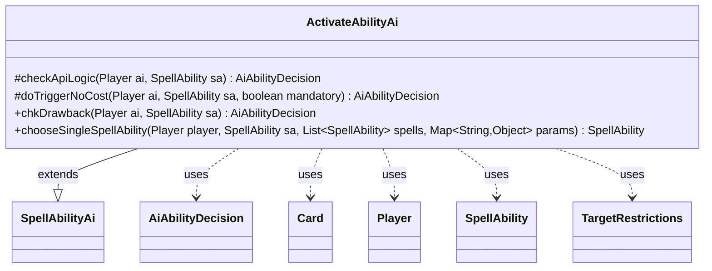

---
aliases:
  - ActivateAbilityAi
tags:
  - java/class
  - module/forge-ai
  - pkg/forge/ai/ability
fqn: forge.ai.ability.ActivateAbilityAi
package: forge.ai.ability
module: forge-ai
kind: Class
---

# ActivateAbilityAi

**Package:** `forge.ai.ability` &nbsp; **Module:** `forge-ai` &nbsp; **Kind:** Class



## Relationships
**Extends:**
- [[forge.ai.SpellAbilityAi|SpellAbilityAi]]
**Uses:**
- [[forge.ai.AiAbilityDecision|AiAbilityDecision]]
- [[forge.game.card.Card|Card]]
- [[forge.game.player.Player|Player]]
- [[forge.game.spellability.SpellAbility|SpellAbility]]
- [[forge.game.spellability.TargetRestrictions|TargetRestrictions]]

## Design Description

`ActivateAbilityAi` is the AI decision-handler for spell abilities whose effect activates or manipulates abilities targeting an opponent, residing in the `forge.ai.ability` package alongside Forge's other per-API AI helpers. As a concrete subclass of `SpellAbilityAi`, it overrides the framework's hook methods—`checkApiLogic`, `doTriggerNoCost`, `chkDrawback`, and `chooseSingleSpellAbility`—to supply ability-specific reasoning rather than the inherited defaults. Its consistent design intent is opponent-directed targeting: it queries the strongest opponent, filters that player's battlefield by the ability's `Type` parameter, and either validates `Defined` players or resets and assigns targets through the `SpellAbility`/`TargetRestrictions` API.

Each decision is returned as an `AiAbilityDecision` pairing a numeric score with an `AiPlayDecision` enum, signaling outcomes like `MissingNeededCards`, `TargetingFailed`, or `WillPlay`. Collaborating with `Card`, `Player`, and `AbilityUtils`, the class encapsulates a focused heuristic—favor disrupting the opponent, decline self-targeting—while delegating cost and broader play evaluation upward to its supertype.

## Source
`forge-ai/src/main/java/forge/ai/ability/ActivateAbilityAi.java`

```java
package forge.ai.ability;

import forge.ai.AiAbilityDecision;
import forge.ai.AiPlayDecision;
import forge.ai.SpellAbilityAi;
import forge.game.ability.AbilityUtils;
import forge.game.card.Card;
import forge.game.card.CardLists;
import forge.game.player.Player;
import forge.game.spellability.SpellAbility;
import forge.game.spellability.TargetRestrictions;
import forge.game.zone.ZoneType;

import java.util.List;
import java.util.Map;

public class ActivateAbilityAi extends SpellAbilityAi {

    @Override
    protected AiAbilityDecision checkApiLogic(Player ai, SpellAbility sa) {
        final Card source = sa.getHostCard();
        final Player opp = ai.getStrongestOpponent();

        List<Card> list = CardLists.getType(opp.getCardsIn(ZoneType.Battlefield), sa.getParamOrDefault("Type", "Card"));
        if (list.isEmpty()) {
            return new AiAbilityDecision(0, AiPlayDecision.MissingNeededCards);
        }

        if (!sa.usesTargeting()) {
            final List<Player> defined = AbilityUtils.getDefinedPlayers(source, sa.getParam("Defined"), sa);
            if (!defined.contains(opp)) {
                return new AiAbilityDecision(0, AiPlayDecision.MissingNeededCards);
            }
        } else {
            sa.resetTargets();
            if (sa.canTarget(opp)) {
                sa.getTargets().add(opp);
            } else {
                return new AiAbilityDecision(0, AiPlayDecision.TargetingFailed);
            }
        }

        return super.checkApiLogic(ai, sa);
    }

    @Override
    protected AiAbilityDecision doTriggerNoCost(Player ai, SpellAbility sa, boolean mandatory) {
        final Player opp = ai.getStrongestOpponent();
        final TargetRestrictions tgt = sa.getTargetRestrictions();
        final Card source = sa.getHostCard();

        if (null == tgt) {
            if (mandatory) {
                return new AiAbilityDecision(100, AiPlayDecision.WillPlay);
            } else {
                final List<Player> defined = AbilityUtils.getDefinedPlayers(source, sa.getParam("Defined"), sa);
                if (defined.contains(opp)) {
                    return new AiAbilityDecision(100, AiPlayDecision.WillPlay);
                } else {
                    return new AiAbilityDecision(0, AiPlayDecision.CantPlayAi);
                }
            }
        } else {
            sa.resetTargets();
            sa.getTargets().add(opp);
        }
        return new AiAbilityDecision(100, AiPlayDecision.WillPlay);
    }

    @Override
    public AiAbilityDecision chkDrawback(Player ai, SpellAbility sa) {
        final Card source = sa.getHostCard();
        if (!sa.usesTargeting()) {
            final List<Player> defined = AbilityUtils.getDefinedPlayers(source, sa.getParam("Defined"), sa);
            if (defined.contains(ai)) {
                return new AiAbilityDecision(0, AiPlayDecision.CantPlayAi);
            }
        } else {
            sa.resetTargets();
            sa.getTargets().add(ai.getWeakestOpponent());
        }
        return new AiAbilityDecision(100, AiPlayDecision.WillPlay);
    }

    @Override
    public SpellAbility chooseSingleSpellAbility(Player player, SpellAbility sa, List<SpellAbility> spells,
            Map<String, Object> params) {
        return spells.get(0);
    }
}
```
