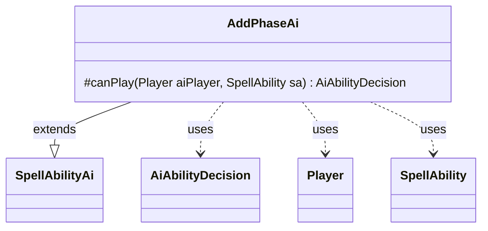

---
aliases:
  - AddPhaseAi
tags:
  - java/class
  - module/forge-ai
  - pkg/forge/ai/ability
fqn: forge.ai.ability.AddPhaseAi
package: forge.ai.ability
module: forge-ai
kind: Class
---

# AddPhaseAi

**Package:** `forge.ai.ability`   **Module:** `forge-ai`   **Kind:** Class



## Relationships
**Extends:**
- [[forge.ai.SpellAbilityAi|SpellAbilityAi]]
**Uses:**
- [[forge.ai.AiAbilityDecision|AiAbilityDecision]]
- [[forge.game.player.Player|Player]]
- [[forge.game.spellability.SpellAbility|SpellAbility]]

## Design Description

AddPhaseAi is the AI decision handler for the "AddPhase" spell ability, determining whether the computer-controlled player should cast or activate effects that grant additional turn phases. As a concrete subclass of `SpellAbilityAi`, it overrides the `canPlay` hook that the AI evaluation framework invokes, receiving the deliberating `Player` and the candidate `SpellAbility` and returning an `AiAbilityDecision` that bundles a numeric score with a play verdict.

The current implementation is effectively a stub: it unconditionally returns a decision of `0` paired with `AiPlayDecision.CantPlayAi`, meaning the AI will never voluntarily play these abilities. This reflects deliberate conservatism—rather than risk misusing a complex effect, the class defers entirely, leaving a clear extension point (and an outstanding javadoc TODO) for future heuristics that would assess board state and timing before granting an extra phase.

## Source
`forge-ai/src/main/java/forge/ai/ability/AddPhaseAi.java`

```java
package forge.ai.ability;

import forge.ai.AiAbilityDecision;
import forge.ai.AiPlayDecision;
import forge.ai.SpellAbilityAi;
import forge.game.player.Player;
import forge.game.spellability.SpellAbility;

/** 
 * TODO: Write javadoc for this type.
 *
 */
public class AddPhaseAi extends SpellAbilityAi {

    @Override
    protected AiAbilityDecision canPlay(Player aiPlayer, SpellAbility sa) {
        return new AiAbilityDecision(0, AiPlayDecision.CantPlayAi);
    }

}
```

## Python
`forge/ai/ability/AddPhaseAi.py`

```python
from forge.ai.AiAbilityDecision import AiAbilityDecision
from forge.ai.AiPlayDecision import AiPlayDecision
from forge.ai.SpellAbilityAi import SpellAbilityAi
from forge.game.player.Player import Player
from forge.game.spellability.SpellAbility import SpellAbility


# TODO: Write javadoc for this type.
#
class AddPhaseAi(SpellAbilityAi):

    def canPlay(self, aiPlayer: Player, sa: SpellAbility) -> AiAbilityDecision:
        return AiAbilityDecision(0, AiPlayDecision.CantPlayAi)
```
