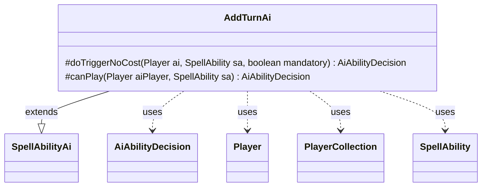

---
aliases:
  - AddTurnAi
tags:
  - java/class
  - module/forge-ai
  - pkg/forge/ai/ability
fqn: forge.ai.ability.AddTurnAi
package: forge.ai.ability
module: forge-ai
kind: Class
---

# AddTurnAi

**Package:** `forge.ai.ability` &nbsp; **Module:** `forge-ai` &nbsp; **Kind:** Class



## Relationships
**Extends:**
- [[forge.ai.SpellAbilityAi|SpellAbilityAi]]
**Uses:**
- [[forge.ai.AiAbilityDecision|AiAbilityDecision]]
- [[forge.game.player.Player|Player]]
- [[forge.game.player.PlayerCollection|PlayerCollection]]
- [[forge.game.spellability.SpellAbility|SpellAbility]]

## Design Description

AddTurnAi supplies the computer-opponent decision logic for spell abilities that grant extra turns (the AddTurn effect). Extending the `SpellAbilityAi` base class, it overrides `canPlay` and `doTriggerNoCost` to determine whether and how the AI should resolve such an ability, returning an `AiAbilityDecision` that pairs a score with an `AiPlayDecision` outcome. When the ability uses targeting, it prefers granting the extra turn to itself—unless a replacement effect would cause that turn to be skipped—and falls back to allies or, under mandatory resolution, the weakest targetable opponent (chosen via `PlayerCollection` life comparison). For non-targeted variants it inspects the defined players and `NumTurns` parameter, declining cases it cannot evaluate. The design intent is conservative, never voluntarily handing extra turns to opponents and only doing so when forced.

## Source
`forge-ai/src/main/java/forge/ai/ability/AddTurnAi.java`

```java
/*
 * Forge: Play Magic: the Gathering.
 * Copyright (C) 2011  Forge Team
 *
 * This program is free software: you can redistribute it and/or modify
 * it under the terms of the GNU General Public License as published by
 * the Free Software Foundation, either version 3 of the License, or
 * (at your option) any later version.
 * 
 * This program is distributed in the hope that it will be useful,
 * but WITHOUT ANY WARRANTY; without even the implied warranty of
 * MERCHANTABILITY or FITNESS FOR A PARTICULAR PURPOSE.  See the
 * GNU General Public License for more details.
 * 
 * You should have received a copy of the GNU General Public License
 * along with this program.  If not, see <http://www.gnu.org/licenses/>.
 */
package forge.ai.ability;

import forge.ai.AiAbilityDecision;
import forge.ai.AiPlayDecision;
import forge.ai.SpellAbilityAi;
import forge.game.ability.AbilityUtils;
import forge.game.player.Player;
import forge.game.player.PlayerCollection;
import forge.game.player.PlayerPredicates;
import forge.game.spellability.SpellAbility;
import org.apache.commons.lang3.StringUtils;

import java.util.List;

/**
 * <p>
 * AbilityFactory_Turns class.
 * </p>
 * 
 * @author Forge
 * @version $Id$
 */
public class AddTurnAi extends SpellAbilityAi {

    @Override
    protected AiAbilityDecision doTriggerNoCost(Player ai, SpellAbility sa, boolean mandatory) {
        PlayerCollection targetableOpps = ai.getOpponents().filter(PlayerPredicates.isTargetableBy(sa));
        Player opp = targetableOpps.min(PlayerPredicates.compareByLife());

        if (sa.usesTargeting()) {
            sa.resetTargets();
            if (sa.canTarget(ai) && (mandatory || !ai.getGame().getReplacementHandler().wouldExtraTurnBeSkipped(ai))) {
                sa.getTargets().add(ai);
            } else if (mandatory) {
                for (final Player ally : ai.getAllies()) {
                    if (sa.canTarget(ally)) {
                        sa.getTargets().add(ally);
                        break;
                    }
                }
                if (!sa.getTargetRestrictions().isMinTargetsChosen(sa.getHostCard(), sa) && opp != null) {
                    sa.getTargets().add(opp);
                } else {
                    return new AiAbilityDecision(0, AiPlayDecision.TargetingFailed);
                }
            } else {
                return new AiAbilityDecision(0, AiPlayDecision.TargetingFailed);
            }
        } else {
            final List<Player> tgtPlayers = AbilityUtils.getDefinedPlayers(sa.getHostCard(), sa.getParam("Defined"), sa);
            for (final Player p : tgtPlayers) {
                if (p.isOpponentOf(ai) && !mandatory) {
                    return new AiAbilityDecision(0, AiPlayDecision.CantPlayAi);
                }
            }
            // TODO: improve ai for Sage of Hours
            if (!StringUtils.isNumeric(sa.getParam("NumTurns"))) {
                return new AiAbilityDecision(0, AiPlayDecision.CantPlayAi);
            }
        }
        return new AiAbilityDecision(100, AiPlayDecision.WillPlay);
    }

    /* (non-Javadoc)
     * @see forge.card.abilityfactory.SpellAiLogic#canPlayAI(forge.game.player.Player, java.util.Map, forge.card.spellability.SpellAbility)
     */
    @Override
    protected AiAbilityDecision canPlay(Player aiPlayer, SpellAbility sa) {
        return doTriggerNoCost(aiPlayer, sa, false);
    }

}
```
