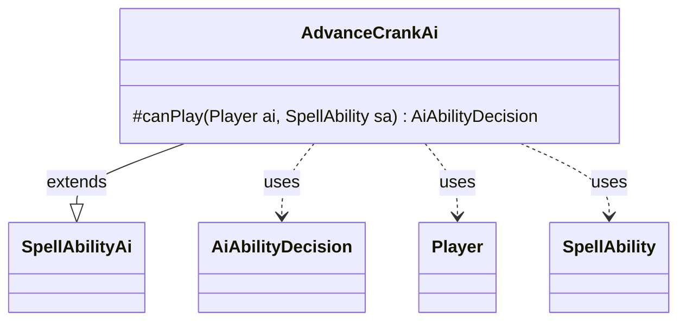

---
aliases:
  - AdvanceCrankAi
tags:
  - java/class
  - module/forge-ai
  - pkg/forge/ai/ability
fqn: forge.ai.ability.AdvanceCrankAi
package: forge.ai.ability
module: forge-ai
kind: Class
---

# AdvanceCrankAi

**Package:** `forge.ai.ability` &nbsp; **Module:** `forge-ai` &nbsp; **Kind:** Class



## Relationships
**Extends:**
- [[forge.ai.SpellAbilityAi|SpellAbilityAi]]
**Uses:**
- [[forge.ai.AiAbilityDecision|AiAbilityDecision]]
- [[forge.game.player.Player|Player]]
- [[forge.game.spellability.SpellAbility|SpellAbility]]

## Design Description

AdvanceCrankAi is the AI decision-making companion for the "Advance the Crank" ability, determining whether the computer player should activate the crank that advances the contraption sprocket sequence. As a concrete subclass of SpellAbilityAi, it overrides the protected `canPlay` hook to inject domain-specific reasoning: it computes the next sprocket (cycling 1–3 from the player's crank counter) and counts how many contraptions on the battlefield sit on that sprocket. If fewer than two would be triggered, it returns an AiAbilityDecision declining to play; otherwise it defers to the superclass's default evaluation.

The class collaborates with Player and SpellAbility as the actors being evaluated, and wraps its verdict in AiAbilityDecision paired with an AiPlayDecision enum. The design keeps the heuristic narrowly scoped—only acting when cranking yields meaningful value—while delegating all generic playability checks upward, a clean example of the template-method pattern used throughout Forge's AI ability hierarchy.

## Source
`forge-ai/src/main/java/forge/ai/ability/AdvanceCrankAi.java`

```java
package forge.ai.ability;

import forge.ai.AiAbilityDecision;
import forge.ai.AiPlayDecision;
import forge.ai.SpellAbilityAi;
import forge.game.card.CardLists;
import forge.game.card.CardPredicates;
import forge.game.player.Player;
import forge.game.spellability.SpellAbility;
import forge.game.zone.ZoneType;

public class AdvanceCrankAi extends SpellAbilityAi {
    @Override
    protected AiAbilityDecision canPlay(Player ai, SpellAbility sa) {
        int nextSprocket = (ai.getCrankCounter() % 3) + 1;
        int crankCount = CardLists.count(ai.getCardsIn(ZoneType.Battlefield), CardPredicates.isContraptionOnSprocket(nextSprocket));
        if (crankCount < 2) {
            return new AiAbilityDecision(0, AiPlayDecision.CantPlayAi);
        }
        return super.canPlay(ai, sa);
    }

}
```
