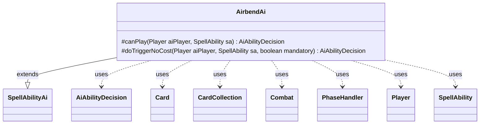

---
aliases:
  - AirbendAi
tags:
  - java/class
  - module/forge-ai
  - pkg/forge/ai/ability
fqn: forge.ai.ability.AirbendAi
package: forge.ai.ability
module: forge-ai
kind: Class
---

# AirbendAi

**Package:** `forge.ai.ability` &nbsp; **Module:** `forge-ai` &nbsp; **Kind:** Class



## Relationships
**Extends:**
- [[forge.ai.SpellAbilityAi|SpellAbilityAi]]
**Uses:**
- [[forge.ai.AiAbilityDecision|AiAbilityDecision]]
- [[forge.game.card.Card|Card]]
- [[forge.game.card.CardCollection|CardCollection]]
- [[forge.game.combat.Combat|Combat]]
- [[forge.game.phase.PhaseHandler|PhaseHandler]]
- [[forge.game.player.Player|Player]]
- [[forge.game.spellability.SpellAbility|SpellAbility]]


## Design Description

AirbendAi provides the AI decision logic for the "Airbend" bounce ability. As a concrete subclass of `SpellAbilityAi`, it overrides `canPlay` and `doTriggerNoCost` to return an `AiAbilityDecision` signaling whether and how strongly the computer should activate the ability. Its central job is target selection: it first scans the AI's own non-token, higher-CMC creatures that are threatened—via `ComputerUtil.predictThreatenedObjects` or imminent combat loss (`ComputerUtilCombat`)—and bounces the most valuable one to save it; otherwise, during its own main phase one or the opponent's end step, it bounces the opponent's best blocker via `ComputerUtilCard.getBestAI`.

Following Forge's ability-AI pattern, it reads game state through `Combat`, `PhaseHandler`/`PhaseType`, `Player`, and `CardCollection` while delegating valuation to shared `ComputerUtil*` helpers. `doTriggerNoCost` reuses `canPlay`'s analysis but respects a `mandatory` flag, and a TODO marks unimplemented spell-targeting logic.

## Source
`forge-ai/src/main/java/forge/ai/ability/AirbendAi.java`

```java
package forge.ai.ability;

import forge.ai.*;
import forge.game.card.Card;
import forge.game.card.CardCollection;
import forge.game.card.CardLists;
import forge.game.combat.Combat;
import forge.game.phase.PhaseHandler;
import forge.game.phase.PhaseType;
import forge.game.player.Player;
import forge.game.spellability.SpellAbility;

public class AirbendAi extends SpellAbilityAi {
    @Override
    protected AiAbilityDecision canPlay(Player aiPlayer, SpellAbility sa) {
        // Check own cards that need saving, non-token, above CMC 2 so that it's hopefully worth saving this one
        final Combat combat = aiPlayer.getGame().getCombat();
        final CardCollection threatenedTgts = CardLists.filter(CardLists.getTargetableCards(aiPlayer.getCreaturesInPlay(), sa),
                card -> !card.isToken() && card.getCMC() > 2 &&
                        (ComputerUtil.predictThreatenedObjects(aiPlayer, null, true).contains(card)
                        || (combat != null && ComputerUtilCombat.combatantWouldBeDestroyed(aiPlayer, card, combat))));
        if (!threatenedTgts.isEmpty()) {
            Card bestSaved = ComputerUtilCard.getBestAI(threatenedTgts);
            sa.resetTargets();
            sa.getTargets().add(bestSaved);
            return new AiAbilityDecision(100, AiPlayDecision.WillPlay);
        }

        // Check opponent's cards that need bouncing (only in the AI's own turn, main phase 1, or at the end of opponent's
        // turn, to get rid of potential blockers)
        PhaseHandler ph = aiPlayer.getGame().getPhaseHandler();
        if (ph.is(PhaseType.MAIN1, aiPlayer) || (ph.is(PhaseType.END_OF_TURN) && ph.getNextTurn() == aiPlayer)) {
            final CardCollection opposingThreats = CardLists.getTargetableCards(aiPlayer.getOpponents().getCreaturesInPlay(), sa);
            if (!opposingThreats.isEmpty()) {
                sa.resetTargets();
                sa.getTargets().add(ComputerUtilCard.getBestAI(opposingThreats));
                return new AiAbilityDecision(100, AiPlayDecision.WillPlay);
            }
        }

        // TODO: add logic to use it to remove threatening spells when the ability allows to target spells?

        return new AiAbilityDecision(0, AiPlayDecision.CantPlayAi);
    }

    @Override
    protected AiAbilityDecision doTriggerNoCost(Player aiPlayer, SpellAbility sa, boolean mandatory) {
        AiAbilityDecision decision = canPlay(aiPlayer, sa);
        if (decision.willingToPlay() || mandatory) {
            return new AiAbilityDecision(100, AiPlayDecision.WillPlay);
        }
        return new AiAbilityDecision(0, AiPlayDecision.CantPlayAi);
    }

}
```
