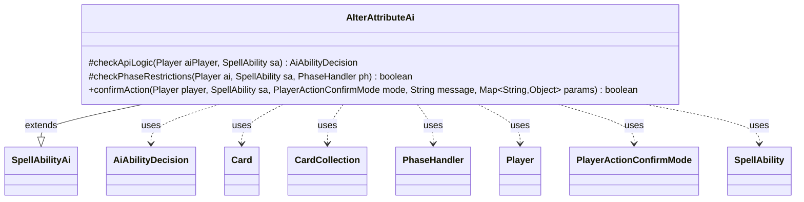

---
aliases:
  - AlterAttributeAi
tags:
  - java/class
  - module/forge-ai
  - pkg/forge/ai/ability
fqn: forge.ai.ability.AlterAttributeAi
package: forge.ai.ability
module: forge-ai
kind: Class
---

# AlterAttributeAi

**Package:** `forge.ai.ability`   **Module:** `forge-ai`   **Kind:** Class



## Relationships
**Extends:**
- [[forge.ai.SpellAbilityAi|SpellAbilityAi]]
**Uses:**
- [[forge.ai.AiAbilityDecision|AiAbilityDecision]]
- [[forge.game.card.Card|Card]]
- [[forge.game.card.CardCollection|CardCollection]]
- [[forge.game.phase.PhaseHandler|PhaseHandler]]
- [[forge.game.player.Player|Player]]
- [[forge.game.player.PlayerActionConfirmMode|PlayerActionConfirmMode]]
- [[forge.game.spellability.SpellAbility|SpellAbility]]

## Design Description

AlterAttributeAi provides the AI's reasoning for spell abilities that change card attributes—Solve, Suspect, Saddle, and Prepare. As a concrete subclass of `SpellAbilityAi`, it overrides the framework's decision hooks: `checkApiLogic` decides whether (and on which card) to activate, `checkPhaseRestrictions` gates timing, and `confirmAction` answers runtime prompts. Each returns through `AiAbilityDecision`/`AiPlayDecision` verdicts the engine consumes. It reads parameters and targets from `SpellAbility`, and inspects `Card`/`CardCollection` via `CardLists`, `CardPredicates`, and `ComputerUtilCard` to score creatures.

The design embeds per-attribute heuristics keyed off the `Attributes` parameter: it treats Suspected as beneficial, preferring to grant Menace to its own or allied creatures and otherwise saddling weak opposing blockers (those with Defender or Vigilance); it skips redundant Solve/Saddle/Prepare on already-affected cards; and it enforces Saddle's sorcery-speed, pre-combat, must-be-able-to-attack timing through `PhaseHandler` and `CombatUtil`. Targeting remains partially unimplemented, flagged by an explicit TODO.

## Source
`forge-ai/src/main/java/forge/ai/ability/AlterAttributeAi.java`

```java
package forge.ai.ability;

import forge.ai.AiAbilityDecision;
import forge.ai.AiPlayDecision;
import forge.ai.ComputerUtilCard;
import forge.ai.SpellAbilityAi;
import forge.game.ability.AbilityUtils;
import forge.game.card.Card;
import forge.game.card.CardCollection;
import forge.game.card.CardLists;
import forge.game.card.CardPredicates;
import forge.game.combat.CombatUtil;
import forge.game.keyword.Keyword;
import forge.game.phase.PhaseHandler;
import forge.game.phase.PhaseType;
import forge.game.player.Player;
import forge.game.player.PlayerActionConfirmMode;
import forge.game.spellability.SpellAbility;

import java.util.List;
import java.util.Map;

public class AlterAttributeAi extends SpellAbilityAi {

    @Override
    protected AiAbilityDecision checkApiLogic(Player aiPlayer, SpellAbility sa) {
        final Card source = sa.getHostCard();
        boolean activate = Boolean.parseBoolean(sa.getParamOrDefault("Activate", "true"));
        String[] attributes = sa.getParam("Attributes").split(",");

        if (sa.usesTargeting()) {
            // TODO add targeting logic
            // needed for Suspected
            for (String attr : attributes) {
                switch (attr.trim()) {
                    case "Suspect":
                    case "Suspected":
                        // below, Suspected is treated as better, so target own beefy stuff to give it Menace if possible
                        // first, check our own and our teammates' cards
                        CardCollection targetableCards = CardLists.getTargetableCards(aiPlayer.getCreaturesInPlay(), sa);
                        if (targetableCards.isEmpty()) {
                            // look for allied stuff if we have nothing
                            targetableCards = CardLists.getTargetableCards(aiPlayer.getAllies().getCreaturesInPlay(), sa);
                        }
                        if (!targetableCards.isEmpty()) {
                            Card bestTgt = ComputerUtilCard.getBestAI(CardLists.filter(targetableCards,
                                    CardPredicates.hasKeyword(Keyword.MENACE).negate()));
                            if (bestTgt == null) {
                                bestTgt = ComputerUtilCard.getBestAI(targetableCards);
                            }
                            sa.resetTargets();
                            sa.getTargets().add(bestTgt);
                            return new AiAbilityDecision(100, AiPlayDecision.WillPlay);
                        }
                        // still no target, so look at the opposing stuff, try to target things that have Defender, Vigilance, or are weak
                        // in general, target worst stuff here, hopefully chump blockers and the like
                        targetableCards = CardLists.getTargetableCards(aiPlayer.getOpponents().getCreaturesInPlay(), sa);
                        if (!targetableCards.isEmpty()) {
                            Card bestTgt = ComputerUtilCard.getWorstAI(CardLists.filter(targetableCards,
                                    CardPredicates.hasKeyword(Keyword.VIGILANCE).or(CardPredicates.hasKeyword(Keyword.DEFENDER))));
                            if (bestTgt == null) {
                                bestTgt = ComputerUtilCard.getWorstAI(targetableCards);
                            }
                            sa.resetTargets();
                            sa.getTargets().add(bestTgt);
                            return new AiAbilityDecision(100, AiPlayDecision.WillPlay);
                        }
                        // still no target, so bail, because nothing is targetable at this point
                        break;
                }
            }
            return new AiAbilityDecision(0, AiPlayDecision.TargetingFailed);
        }

        final List<Card> defined = AbilityUtils.getDefinedCards(source, sa.getParam("Defined"), sa);

        for (Card c : defined) {
            for (String attr : attributes) {
                switch (attr.trim()) {
                    case "Solve":
                    case "Solved":
                        // there is currently no effect that would un-solve something
                        if (!c.isSolved() && activate) {
                            return new AiAbilityDecision(100, AiPlayDecision.WillPlay);
                        }
                        break;
                    case "Suspect":
                    case "Suspected":
                        // is Suspected good or bad?
                        // currently Suspected is better
                        if (!activate) {
                            return new AiAbilityDecision(0, AiPlayDecision.CantPlayAi);
                        }
                        return new AiAbilityDecision(100, AiPlayDecision.WillPlay);

                    case "Saddle":
                    case "Saddled":
                        // AI should not try to Saddle again?
                        if (c.isSaddled()) {
                            return new AiAbilityDecision(0, AiPlayDecision.CantPlayAi);
                        }
                        return new AiAbilityDecision(100, AiPlayDecision.WillPlay);
                    case "Prepare":
                    case "Prepared":
                        // AI should not try to Prepare creatures that are already Prepared
                        if (c.isPrepared()) {
                            return new AiAbilityDecision(0, AiPlayDecision.CantPlayAi);
                        }
                        return new AiAbilityDecision(100, AiPlayDecision.WillPlay);
                }
            }
        }
        return new AiAbilityDecision(0, AiPlayDecision.CantPlayAi);
    }

    @Override
    protected boolean checkPhaseRestrictions(final Player ai, final SpellAbility sa, final PhaseHandler ph) {
        final Card source = sa.getHostCard();
        String[] attributes = sa.getParam("Attributes").split(",");

        // currently Phase is only checked for Saddled

        for (String attr : attributes) {
            switch (attr.trim()) {
                case "Saddle":
                case "Saddled":
                    if (!ph.isPlayerTurn(ai)) {
                        return false;
                    }
                    // it is too late for combat, Saddle is Sorcery Speed
                    if (!ph.getPhase().isBefore(PhaseType.COMBAT_BEGIN)) {
                        return false;
                    }
                    // would card attack?
                    if (!CombatUtil.canAttack(source)) {
                        return false;
                    }
            }
        }

        return true;
    }

    @Override
    public boolean confirmAction(Player player, SpellAbility sa, PlayerActionConfirmMode mode, String message, Map<String, Object> params) {
        boolean activate = Boolean.parseBoolean(sa.getParamOrDefault("Activate", "true"));
        String[] attributes = sa.getParam("Attributes").split(",");

        for (String attr : attributes) {
            switch (attr.trim()) {
                case "Suspect":
                case "Suspected":
                    return activate;
            }
        }

        return true;
    }
}
```

## Python
`forge/ai/ability/AlterAttributeAi.py`

```python
from forge.ai.AiAbilityDecision import AiAbilityDecision
from forge.ai.AiPlayDecision import AiPlayDecision
from forge.ai.ComputerUtilCard import ComputerUtilCard
from forge.ai.SpellAbilityAi import SpellAbilityAi
from forge.game.ability.AbilityUtils import AbilityUtils
from forge.game.card.Card import Card
from forge.game.card.CardCollection import CardCollection
from forge.game.card.CardLists import CardLists
from forge.game.card.CardPredicates import CardPredicates
from forge.game.combat.CombatUtil import CombatUtil
from forge.game.keyword.Keyword import Keyword
from forge.game.phase.PhaseHandler import PhaseHandler
from forge.game.phase.PhaseType import PhaseType
from forge.game.player.Player import Player
from forge.game.player.PlayerActionConfirmMode import PlayerActionConfirmMode
from forge.game.spellability.SpellAbility import SpellAbility

from typing import List, Map


class AlterAttributeAi(SpellAbilityAi):

    def checkApiLogic(self, aiPlayer: Player, sa: SpellAbility) -> AiAbilityDecision:
        source = sa.getHostCard()
        activate = sa.getParamOrDefault("Activate", "true").lower() == "true"
        attributes = sa.getParam("Attributes").split(",")

        if sa.usesTargeting():
            # TODO add targeting logic
            # needed for Suspected
            for attr in attributes:
                match attr.strip():
                    case "Suspect" | "Suspected":
                        # below, Suspected is treated as better, so target own beefy stuff to give it Menace if possible
                        # first, check our own and our teammates' cards
                        targetableCards = CardLists.getTargetableCards(aiPlayer.getCreaturesInPlay(), sa)
                        if targetableCards.isEmpty():
                            # look for allied stuff if we have nothing
                            targetableCards = CardLists.getTargetableCards(aiPlayer.getAllies().getCreaturesInPlay(), sa)
                        if not targetableCards.isEmpty():
                            bestTgt = ComputerUtilCard.getBestAI(CardLists.filter(targetableCards,
                                    CardPredicates.hasKeyword(Keyword.MENACE).negate()))
                            if bestTgt is None:
                                bestTgt = ComputerUtilCard.getBestAI(targetableCards)
                            sa.resetTargets()
                            sa.getTargets().add(bestTgt)
                            return AiAbilityDecision(100, AiPlayDecision.WillPlay)
                        # still no target, so look at the opposing stuff, try to target things that have Defender, Vigilance, or are weak
                        # in general, target worst stuff here, hopefully chump blockers and the like
                        targetableCards = CardLists.getTargetableCards(aiPlayer.getOpponents().getCreaturesInPlay(), sa)
                        if not targetableCards.isEmpty():
                            bestTgt = ComputerUtilCard.getWorstAI(CardLists.filter(targetableCards,
                                    CardPredicates.hasKeyword(Keyword.VIGILANCE).or_(CardPredicates.hasKeyword(Keyword.DEFENDER))))
                            if bestTgt is None:
                                bestTgt = ComputerUtilCard.getWorstAI(targetableCards)
                            sa.resetTargets()
                            sa.getTargets().add(bestTgt)
                            return AiAbilityDecision(100, AiPlayDecision.WillPlay)
                        # still no target, so bail, because nothing is targetable at this point
            return AiAbilityDecision(0, AiPlayDecision.TargetingFailed)

        defined = AbilityUtils.getDefinedCards(source, sa.getParam("Defined"), sa)

        for c in defined:
            for attr in attributes:
                match attr.strip():
                    case "Solve" | "Solved":
                        # there is currently no effect that would un-solve something
                        if not c.isSolved() and activate:
                            return AiAbilityDecision(100, AiPlayDecision.WillPlay)
                    case "Suspect" | "Suspected":
                        # is Suspected good or bad?
                        # currently Suspected is better
                        if not activate:
                            return AiAbilityDecision(0, AiPlayDecision.CantPlayAi)
                        return AiAbilityDecision(100, AiPlayDecision.WillPlay)
                    case "Saddle" | "Saddled":
                        # AI should not try to Saddle again?
                        if c.isSaddled():
                            return AiAbilityDecision(0, AiPlayDecision.CantPlayAi)
                        return AiAbilityDecision(100, AiPlayDecision.WillPlay)
                    case "Prepare" | "Prepared":
                        # AI should not try to Prepare creatures that are already Prepared
                        if c.isPrepared():
                            return AiAbilityDecision(0, AiPlayDecision.CantPlayAi)
                        return AiAbilityDecision(100, AiPlayDecision.WillPlay)
        return AiAbilityDecision(0, AiPlayDecision.CantPlayAi)

    def checkPhaseRestrictions(self, ai: Player, sa: SpellAbility, ph: PhaseHandler) -> bool:
        source = sa.getHostCard()
        attributes = sa.getParam("Attributes").split(",")

        # currently Phase is only checked for Saddled

        for attr in attributes:
            match attr.strip():
                case "Saddle" | "Saddled":
                    if not ph.isPlayerTurn(ai):
                        return False
                    # it is too late for combat, Saddle is Sorcery Speed
                    if not ph.getPhase().isBefore(PhaseType.COMBAT_BEGIN):
                        return False
                    # would card attack?
                    if not CombatUtil.canAttack(source):
                        return False

        return True

    def confirmAction(self, player: Player, sa: SpellAbility, mode: PlayerActionConfirmMode, message: str, params: Map[str, object]) -> bool:
        activate = sa.getParamOrDefault("Activate", "true").lower() == "true"
        attributes = sa.getParam("Attributes").split(",")

        for attr in attributes:
            match attr.strip():
                case "Suspect" | "Suspected":
                    return activate

        return True
```
