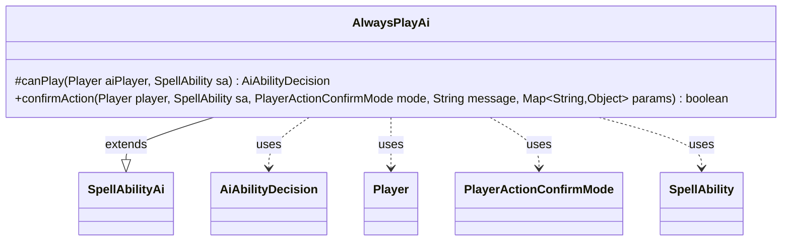

---
aliases:
  - AlwaysPlayAi
tags:
  - java/class
  - module/forge-ai
  - pkg/forge/ai/ability
fqn: forge.ai.ability.AlwaysPlayAi
package: forge.ai.ability
module: forge-ai
kind: Class
---

# AlwaysPlayAi

**Package:** `forge.ai.ability` &nbsp; **Module:** `forge-ai` &nbsp; **Kind:** Class



## Relationships
**Extends:**
- [[forge.ai.SpellAbilityAi|SpellAbilityAi]]
**Uses:**
- [[forge.ai.AiAbilityDecision|AiAbilityDecision]]
- [[forge.game.player.Player|Player]]
- [[forge.game.player.PlayerActionConfirmMode|PlayerActionConfirmMode]]
- [[forge.game.spellability.SpellAbility|SpellAbility]]

## Design Description

AlwaysPlayAi is a minimal AI decision strategy in Forge's ability-AI layer that unconditionally favors playing its associated spell or ability. Extending the abstract `SpellAbilityAi` base, it overrides just two of the framework's decision hooks: `canPlay` returns an `AiAbilityDecision` with maximum confidence (100) and a `WillPlay` verdict, and `confirmAction` returns `true` for every confirmation mode, message, or parameter map. It touches `Player`, `SpellAbility`, and `PlayerActionConfirmMode` purely as method inputs and keeps no internal state.

The design intent is a reusable, stateless "always say yes" policy that ability factories can attach to effects the AI should never decline—typically strictly beneficial or mandatory abilities. By hard-coding affirmative answers, it acts as a trivial default that delegates all remaining timing, targeting, and resolution logic to the surrounding `SpellAbilityAi` machinery rather than implementing any evaluation of its own.

## Source
`forge-ai/src/main/java/forge/ai/ability/AlwaysPlayAi.java`

```java
package forge.ai.ability;

import forge.ai.AiAbilityDecision;
import forge.ai.AiPlayDecision;
import forge.ai.SpellAbilityAi;
import forge.game.player.Player;
import forge.game.player.PlayerActionConfirmMode;
import forge.game.spellability.SpellAbility;

import java.util.Map;

public class AlwaysPlayAi extends SpellAbilityAi {
    /* (non-Javadoc)
     * @see forge.card.abilityfactory.SpellAiLogic#canPlayAI(forge.game.player.Player, java.util.Map, forge.card.spellability.SpellAbility)
     */
    @Override
    protected AiAbilityDecision canPlay(Player aiPlayer, SpellAbility sa) {
        return new AiAbilityDecision(100, AiPlayDecision.WillPlay);
    }

    @Override
    public boolean confirmAction(Player player, SpellAbility sa, PlayerActionConfirmMode mode, String message, Map<String, Object> params) {
        return true;
    }
}
```
