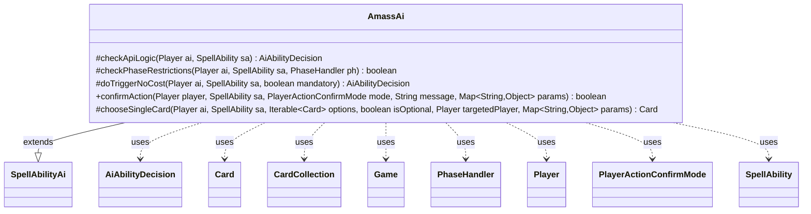

---
aliases:
  - AmassAi
tags:
  - java/class
  - module/forge-ai
  - pkg/forge/ai/ability
fqn: forge.ai.ability.AmassAi
package: forge.ai.ability
module: forge-ai
kind: Class
---

# AmassAi

**Package:** `forge.ai.ability` &nbsp; **Module:** `forge-ai` &nbsp; **Kind:** Class



## Relationships
**Extends:**
- [[forge.ai.SpellAbilityAi|SpellAbilityAi]]
**Uses:**
- [[forge.ai.AiAbilityDecision|AiAbilityDecision]]
- [[forge.game.Game|Game]]
- [[forge.game.card.Card|Card]]
- [[forge.game.card.CardCollection|CardCollection]]
- [[forge.game.phase.PhaseHandler|PhaseHandler]]
- [[forge.game.player.Player|Player]]
- [[forge.game.player.PlayerActionConfirmMode|PlayerActionConfirmMode]]
- [[forge.game.spellability.SpellAbility|SpellAbility]]

## Design Description

AmassAi provides the AI decision logic for Amass abilities, extending `SpellAbilityAi` and overriding its evaluation hooks to judge whether the computer player should use an Amass effect. Its central method, `checkApiLogic`, prefers feeding an existing Army on the battlefield when one can still receive +1/+1 counters; lacking that, it builds a prototype Army token via `TokenInfo`, runs static abilities, and applies counters to confirm the resulting creature would be viable before committing to play.

The class collaborates with `Player`, `SpellAbility`, `Card`/`CardCollection`, `Game`, and `PhaseHandler` to read game state, returning verdicts as `AiAbilityDecision` values. Notable design intent includes a non-mutating dry run that checks static abilities on a prelist to avoid firing events, `chooseSingleCard` favoring Armies that can take counters (falling back to the best available card via `ComputerUtilCard`), and a stubbed `checkPhaseRestrictions` reserved for future instant-speed handling.

## Source
`forge-ai/src/main/java/forge/ai/ability/AmassAi.java`

```java
package forge.ai.ability;

import com.google.common.collect.Iterables;
import com.google.common.collect.Lists;
import com.google.common.collect.Sets;
import forge.ai.AiAbilityDecision;
import forge.ai.AiPlayDecision;
import forge.ai.ComputerUtilCard;
import forge.ai.SpellAbilityAi;
import forge.game.Game;
import forge.game.ability.AbilityUtils;
import forge.game.card.*;
import forge.game.card.token.TokenInfo;
import forge.game.phase.PhaseHandler;
import forge.game.player.Player;
import forge.game.player.PlayerActionConfirmMode;
import forge.game.spellability.SpellAbility;
import forge.game.zone.ZoneType;

import java.util.Map;

public class AmassAi extends SpellAbilityAi {
    @Override
    protected AiAbilityDecision checkApiLogic(Player ai, final SpellAbility sa) {
        CardCollection aiArmies = CardLists.getType(ai.getCardsIn(ZoneType.Battlefield), "Army");
        Card host = sa.getHostCard();
        final Game game = ai.getGame();

        if (!aiArmies.isEmpty()) {
            if (aiArmies.anyMatch(CardPredicates.canReceiveCounters(CounterEnumType.P1P1))) {
                // If AI has an Army that can receive counters, play the ability
                return new AiAbilityDecision(100, AiPlayDecision.WillPlay);
            }
            // AI has Armies but none can receive counters, so don't play
            return new AiAbilityDecision(0, AiPlayDecision.DoesntImpactGame);
        }
        final String type = sa.getParam("Type");
        final String tokenScript = "b_0_0_" + sa.getOriginalParam("Type").toLowerCase() + "_army";
        final int amount = AbilityUtils.calculateAmount(host, sa.getParamOrDefault("Num", "1"), sa);

        Card token = TokenInfo.getProtoType(tokenScript, sa, ai, false);

        if (token == null) {
            return new AiAbilityDecision(0, AiPlayDecision.CantPlayAi);
        }

        token.setController(ai, 0);
        token.setLastKnownZone(ai.getZone(ZoneType.Battlefield));
        token.setCreatureTypes(Lists.newArrayList(type, "Army"));
        token.setName(type + " Army Token");
        token.setTokenSpawningAbility(sa);

        boolean result = true;

        // need to check what the cards would be on the battlefield
        // do not attach yet, that would cause Events
        CardCollection preList = new CardCollection(token);
        game.getAction().checkStaticAbilities(false, Sets.newHashSet(token), preList);

        if (token.canReceiveCounters(CounterEnumType.P1P1)) {
            token.setCounters(CounterEnumType.P1P1, amount);
        }

        if (token.isCreature() && token.getNetToughness() < 1) {
            result = false;
        }

        //reset static abilities
        game.getAction().checkStaticAbilities(false);

        if (result) {
            return new AiAbilityDecision(100, AiPlayDecision.WillPlay);
        }
        return new AiAbilityDecision(0, AiPlayDecision.CantPlayAi);
    }

    @Override
    protected boolean checkPhaseRestrictions(final Player ai, final SpellAbility sa, final PhaseHandler ph) {
        // TODO: Special check for instant speed logic? Something like Lazotep Plating.
        /*
        boolean isInstant = sa.getRestrictions().isInstantSpeed();
        CardCollection aiArmies = CardLists.filter(ai.getCardsIn(ZoneType.Battlefield), CardPredicates.isType("Army"));

        if (isInstant) {

        }
        */

        return true;
    }

    @Override
    protected AiAbilityDecision doTriggerNoCost(Player ai, SpellAbility sa, boolean mandatory) {
        if (mandatory) {
            return new AiAbilityDecision(50, AiPlayDecision.MandatoryPlay);
        }

        return checkApiLogic(ai, sa);
    }

    @Override
    public boolean confirmAction(Player player, SpellAbility sa, PlayerActionConfirmMode mode, String message, Map<String, Object> params) {
        return true;
    }

    @Override
    protected Card chooseSingleCard(Player ai, SpellAbility sa, Iterable<Card> options, boolean isOptional, Player targetedPlayer, Map<String, Object> params) {
        Iterable<Card> better = CardLists.filter(options, CardPredicates.canReceiveCounters(CounterEnumType.P1P1));
        if (Iterables.isEmpty(better)) {
            better = options;
        }
        return ComputerUtilCard.getBestAI(better);
    }
}
```
