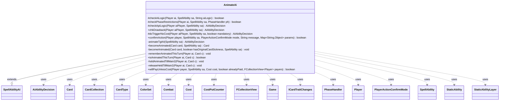

---
aliases:
  - AnimateAi
tags:
  - java/class
  - module/forge-ai
  - pkg/forge/ai/ability
fqn: forge.ai.ability.AnimateAi
package: forge.ai.ability
module: forge-ai
kind: Class
---

# AnimateAi

**Package:** `forge.ai.ability`   **Module:** `forge-ai`   **Kind:** Class



## Relationships
**Extends:**
- [[forge.ai.SpellAbilityAi|SpellAbilityAi]]
**Uses:**
- [[forge.ai.AiAbilityDecision|AiAbilityDecision]]
- [[forge.card.CardType|CardType]]
- [[forge.card.ColorSet|ColorSet]]
- [[forge.game.Game|Game]]
- [[forge.game.card.Card|Card]]
- [[forge.game.card.CardCollection|CardCollection]]
- [[forge.game.card.ICardTraitChanges|ICardTraitChanges]]
- [[forge.game.combat.Combat|Combat]]
- [[forge.game.cost.Cost|Cost]]
- [[forge.game.cost.CostPutCounter|CostPutCounter]]
- [[forge.game.phase.PhaseHandler|PhaseHandler]]
- [[forge.game.player.Player|Player]]
- [[forge.game.player.PlayerActionConfirmMode|PlayerActionConfirmMode]]
- [[forge.game.spellability.SpellAbility|SpellAbility]]
- [[forge.game.staticability.StaticAbility|StaticAbility]]
- [[forge.game.staticability.StaticAbilityLayer|StaticAbilityLayer]]
- [[forge.util.collect.FCollectionView|FCollectionView]]

## Design Description

AnimateAi is the forge-ai decision module backing the Animate spell-ability API, encapsulating the artificial intelligence that judges whether and how the engine should turn a permanent—typically a land or other noncreature—into a creature. Extending `SpellAbilityAi`, it overrides the standard decision hooks (`checkAiLogic`, `checkPhaseRestrictions`, `checkApiLogic`, `chkDrawback`, `doTriggerNoCost`, `confirmAction`, and `willPayUnlessCost`) to gate activation by phase, combat state, stack contents, and named AI logics, returning `AiAbilityDecision` verdicts to the playing framework.

Its defining design intent is speculative evaluation: `becomeAnimated` constructs a throwaway LKI copy and runs it through `AnimateEffectBase.doAnimate`, replaying the real resolution so the prospective creature can be scored with `ComputerUtilCard` before any commitment. It collaborates widely with `Card`/`CardCollection`, `Combat`, `PhaseHandler`, `CardType`, `ColorSet`, and `StaticAbility` continuous layers, and leans on `AiCardMemory` to record creatures animated this turn and to hold animated lands until Main 2, preventing wasted mana and self-interference.

## Source
`forge-ai/src/main/java/forge/ai/ability/AnimateAi.java`

```java
package forge.ai.ability;

import com.google.common.collect.Lists;
import com.google.common.collect.Maps;

import forge.ai.*;
import forge.card.CardType;
import forge.card.ColorSet;
import forge.game.CardTraitPredicates;
import forge.game.Game;
import forge.game.ability.AbilityUtils;
import forge.game.ability.ApiType;
import forge.game.ability.effects.AnimateEffectBase;
import forge.game.card.*;
import forge.game.combat.Combat;
import forge.game.cost.Cost;
import forge.game.cost.CostPutCounter;
import forge.game.keyword.Keyword;
import forge.game.phase.PhaseHandler;
import forge.game.phase.PhaseType;
import forge.game.player.Player;
import forge.game.player.PlayerActionConfirmMode;
import forge.game.spellability.SpellAbility;
import forge.game.staticability.StaticAbility;
import forge.game.staticability.StaticAbilityContinuous;
import forge.game.staticability.StaticAbilityLayer;
import forge.game.staticability.StaticAbilityMode;
import forge.game.zone.ZoneType;
import forge.util.FileSection;
import forge.util.collect.FCollectionView;

import java.util.Arrays;
import java.util.List;
import java.util.Map;

/**
 * <p>
 * AbilityFactoryAnimate class.
 * </p>
 *
 * @author Forge
 * @version $Id: AbilityFactoryAnimate.java 17608 2012-10-20 22:27:27Z Max mtg $
 */

public class AnimateAi extends SpellAbilityAi {
    @Override
    protected boolean checkAiLogic(final Player ai, final SpellAbility sa, final String aiLogic) {
        final Game game = ai.getGame();
        final PhaseHandler ph = game.getPhaseHandler();
        if ("Attacking".equals(aiLogic)) { // Launch the Fleet
            if (ph.getPlayerTurn().isOpponentOf(ai) || ph.getPhase().isAfter(PhaseType.COMBAT_DECLARE_ATTACKERS)) {
                return false;
            }
            List<Card> list = CardLists.getTargetableCards(ai.getCreaturesInPlay(), sa);
            for (Card c : list) {
                if (ComputerUtilCard.doesCreatureAttackAI(ai, c)) {
                    sa.getTargets().add(c);
                }
            }
            return !sa.getTargets().isEmpty();
        }
        if ("EOT".equals(aiLogic) && ph.getPhase().isBefore(PhaseType.MAIN2)) {
            return false;
        }
        if ("BoneManCantRegenerate".equals(aiLogic)) {
            Card host = sa.getHostCard();
            String svar = AbilityUtils.getSVar(sa, sa.getParam("staticAbilities"));
            if (svar == null) {
                return false;
            }
            Map<String, String> map = FileSection.parseToMap(svar, FileSection.DOLLAR_SIGN_KV_SEPARATOR);
            if (!map.containsKey("Description")) {
                return false;
            }

            // check for duplicate static ability
            if (host.getStaticAbilities().anyMatch(CardTraitPredicates.hasParam("Description", map.get("Description")))) {
                return false;
            }
            // TODO check if Bone Man would deal damage to something that otherwise would regenerate
        }
        return super.checkAiLogic(ai, sa, aiLogic);
    }

    @Override
    protected boolean checkPhaseRestrictions(final Player ai, final SpellAbility sa, final PhaseHandler ph) {
        final Card source = sa.getHostCard();
        final Game game = ai.getGame();
        // Interrupt sacrifice effect
        if (!game.getStack().isEmpty()) {
            SpellAbility topStack = game.getStack().peekAbility();
            if (topStack.getApi() == ApiType.Sacrifice) {
                final String valid = topStack.getParamOrDefault("SacValid", "Card.Self");
                String num = topStack.getParamOrDefault("Amount", "1");
                final int nToSac = AbilityUtils.calculateAmount(topStack.getHostCard(), num, topStack);
                CardCollection list = CardLists.getValidCards(ai.getCardsIn(ZoneType.Battlefield), valid,
                		ai.getWeakestOpponent(), topStack.getHostCard(), topStack);
                list = CardLists.filter(list, CardPredicates.canBeSacrificedBy(topStack, true));
                ComputerUtilCard.sortByEvaluateCreature(list);
                if (!list.isEmpty() && list.size() == nToSac && ComputerUtilCost.canPayCost(sa, ai, sa.isTrigger())) {
                    Card animatedCopy = becomeAnimated(source, sa);
                    list.add(animatedCopy);
                    list = CardLists.getValidCards(list, valid, ai.getWeakestOpponent(), topStack.getHostCard(),
                            topStack);
                    list = CardLists.filter(list, CardPredicates.canBeSacrificedBy(topStack, true));
                    if (ComputerUtilCard.evaluateCreature(animatedCopy) < ComputerUtilCard.evaluateCreature(list.get(0))
                            && list.contains(animatedCopy)) {
                        return true;
                    }
                }
            }
        }
        // Don't use instant speed animate abilities before AI's COMBAT_BEGIN
        if (!ph.is(PhaseType.COMBAT_BEGIN) && ph.isPlayerTurn(ai) && !isSorcerySpeed(sa, ai)
                && !sa.hasParam("ActivationPhases") && !"Permanent".equals(sa.getParam("Duration"))) {
            return false;
        }
        // Don't use instant speed animate abilities outside human's
        // COMBAT_DECLARE_ATTACKERS or if no attackers
        if (ph.getPlayerTurn().isOpponentOf(ai) && !"Permanent".equals(sa.getParam("Duration"))
                && (!ph.is(PhaseType.COMBAT_DECLARE_ATTACKERS)
                        || ph.inCombat() && game.getCombat().getAttackersOf(ai).isEmpty())) {
            return false;
        }
        // Don't activate during MAIN2 unless this effect is permanent
        if (ph.is(PhaseType.MAIN2) && !"Permanent".equals(sa.getParam("Duration")) && !"UntilYourNextTurn".equals(sa.getParam("Duration"))) {
            return false;
        }
        // Don't animate if the AI won't attack anyway or use as a potential blocker
        Player opponent = ai.getWeakestOpponent();
        // Activating as a potential blocker is only viable if it's an ability activated from a permanent, otherwise
        // the AI will waste resources
        boolean activateAsPotentialBlocker = "UntilYourNextTurn".equals(sa.getParam("Duration"))
                && game.getPhaseHandler().getNextTurn() != ai
                && source.isPermanent();
        if (ph.isPlayerTurn(ai) && ai.getLife() < 6 && opponent.getLife() > 6
                && opponent.getZone(ZoneType.Battlefield).contains(CardPredicates.CREATURES)
                && !sa.hasParam("AILogic") && !"Permanent".equals(sa.getParam("Duration")) && !activateAsPotentialBlocker) {
            return false;
        }
        return true;
    }

    @Override
    protected AiAbilityDecision checkApiLogic(Player aiPlayer, SpellAbility sa) {
        final Card source = sa.getHostCard();
        final Game game = aiPlayer.getGame();
        final PhaseHandler ph = game.getPhaseHandler();

        if (!game.getStack().isEmpty() && game.getStack().peekAbility().getApi() == ApiType.Sacrifice) {
            // Should I animate a card before i have to sacrifice something better?
            if (!isAnimatedThisTurn(aiPlayer, source)) {
                rememberAnimatedThisTurn(aiPlayer, source);
                return new AiAbilityDecision(100, AiPlayDecision.ResponseToStackResolve);
            }
        }
        if (!ComputerUtilCost.checkTapTypeCost(aiPlayer, sa.getPayCosts(), source, sa, new CardCollection())) {
            return new AiAbilityDecision(0, AiPlayDecision.CostNotAcceptable);
        }

        if (sa.costHasManaX()) {
            ComputerUtilCost.setMaxXValue(sa, aiPlayer, sa.isTrigger());
        }

        if (sa.usesTargeting()) {
            sa.resetTargets();
            return animateTgtAI(sa);
        }

        final List<Card> defined = AbilityUtils.getDefinedCards(source, sa.getParam("Defined"), sa);
        boolean bFlag = false;
        boolean givesHaste = sa.hasParam("Keywords") && sa.getParam("Keywords").contains("Haste");
        for (final Card c : defined) {
            bFlag |= !c.isCreature() && !c.isTapped()
                    && (!c.hasSickness() || givesHaste || !ph.isPlayerTurn(aiPlayer))
                    && !c.isEquipping();

            // for creatures that could be improved (like Figure of Destiny)
            if (!bFlag && c.isCreature() && ("Permanent".equals(sa.getParam("Duration")) || (!c.isTapped() && !c.isSick()))) {
                int power = -5;
                if (sa.hasParam("Power")) {
                    power = AbilityUtils.calculateAmount(c, sa.getParam("Power"), sa);
                }
                int toughness = -5;
                if (sa.hasParam("Toughness")) {
                    toughness = AbilityUtils.calculateAmount(c, sa.getParam("Toughness"), sa);
                }
                if (sa.hasParam("Keywords")) {
                    for (String keyword : sa.getParam("Keywords").split(" & ")) {
                        if (!c.hasKeyword(keyword)) {
                            bFlag = true;
                        }
                    }
                }
                if (power + toughness > c.getCurrentPower() + c.getCurrentToughness()) {
                    if (!c.isTapped() || (ph.inCombat() && game.getCombat().isAttacking(c))) {
                        bFlag = true;
                    }
                }
            }

            if (!isSorcerySpeed(sa, aiPlayer) && !"Permanent".equals(sa.getParam("Duration"))) {
                if (sa.isCrew() && c.isCreature()) {
                    // Do not try to crew a vehicle which is already a creature
                    return new AiAbilityDecision(0, AiPlayDecision.CantPlayAi);
                }
                Card animatedCopy = becomeAnimated(c, sa);
                if (ph.isPlayerTurn(aiPlayer)
                        && !ComputerUtilCard.doesSpecifiedCreatureAttackAI(aiPlayer, animatedCopy)) {
                    return new AiAbilityDecision(0, AiPlayDecision.DoesntImpactCombat);
                }
                if (ph.getPlayerTurn().isOpponentOf(aiPlayer)
                        && !ComputerUtilCard.doesSpecifiedCreatureBlock(aiPlayer, animatedCopy)) {
                    return new AiAbilityDecision(0, AiPlayDecision.DoesntImpactCombat);
                }
                // also check if maybe there are static effects applied to the animated copy that would matter
                // (e.g. Myth Realized)
                if (animatedCopy.getCurrentPower() + animatedCopy.getCurrentToughness() >
                        c.getCurrentPower() + c.getCurrentToughness()) {
                    if (!isAnimatedThisTurn(aiPlayer, source)) {
                        if (!c.isTapped() || (ph.inCombat() && game.getCombat().isAttacking(c))) {
                            bFlag = true;
                        }
                    }
                }
            }
        }
        if (bFlag) {
            rememberAnimatedThisTurn(aiPlayer, source);
            return new AiAbilityDecision(100, AiPlayDecision.WillPlay);
        }
        return new AiAbilityDecision(0, AiPlayDecision.CantPlayAi);
    }

    @Override
    public AiAbilityDecision chkDrawback(Player aiPlayer, SpellAbility sa) {
        if (sa.usesTargeting()) {
            sa.resetTargets();
            return animateTgtAI(sa);
        }

        return new AiAbilityDecision(100, AiPlayDecision.WillPlay);
    }

    @Override
    protected AiAbilityDecision doTriggerNoCost(Player aiPlayer, SpellAbility sa, boolean mandatory) {
        AiAbilityDecision decision;
        if (sa.usesTargeting()) {
            decision = animateTgtAI(sa);
            if (decision.willingToPlay()) {
                return decision;
            } else if (!mandatory) {
                return decision;
            } else {
                // fallback if animate is mandatory
                sa.resetTargets();
                List<Card> list = CardUtil.getValidCardsToTarget(sa);
                if (list.isEmpty()) {
                    return decision;
                }
                Card toAnimate = ComputerUtilCard.getWorstAI(list);
                rememberAnimatedThisTurn(aiPlayer, toAnimate);
                sa.getTargets().add(toAnimate);
            }
        }
        return new AiAbilityDecision(100, AiPlayDecision.WillPlay);
    }

    @Override
    public boolean confirmAction(Player player, SpellAbility sa, PlayerActionConfirmMode mode, String message, Map<String, Object> params) {
        return player.getGame().getPhaseHandler().getPhase().isBefore(PhaseType.MAIN2);
    }

    private AiAbilityDecision animateTgtAI(final SpellAbility sa) {
        if (sa.getMaxTargets() == 0) {
            // this happens if an optional cost is skipped, e.g. Brave the Wilds
            return new AiAbilityDecision(80, AiPlayDecision.WillPlay);
        }
        final Player ai = sa.getActivatingPlayer();
        final Game game = ai.getGame();
        final PhaseHandler ph = game.getPhaseHandler();
        final String logic = sa.getParamOrDefault("AILogic", "");
        final boolean alwaysActivatePWAbility = sa.isPwAbility()
                && sa.getPayCosts().hasSpecificCostType(CostPutCounter.class)
                && sa.usesTargeting() && sa.getMinTargets() == 0;

        final CardType types = new CardType(true);
        if (sa.hasParam("Types")) {
            types.addAll(Arrays.asList(sa.getParam("Types").split(",")));
        }

        CardCollection list = CardLists.getTargetableCards(game.getCardsIn(ZoneType.Battlefield), sa);

        list = ComputerUtil.filterAITgts(sa, ai, list, false);

        // list is empty, no possible targets
        if (list.isEmpty() && !alwaysActivatePWAbility) {
            return new AiAbilityDecision(0, AiPlayDecision.CantPlayAi);
        }

        // something is used for animate into creature
        if (types.isCreature()) {
            Map<Card, Integer> data = Maps.newHashMap();
            for (final Card c : list) {
                // don't use Permanent animate on something that would leave the field
                if (c.hasSVar("EndOfTurnLeavePlay") && "Permanent".equals(sa.getParam("Duration"))) {
                    continue;
                }

                // non-Curse Animate not on Opponent Stuff if able
                if (c.getController().isOpponentOf(ai) && !sa.isCurse()) {
                    continue;
                }

                // if tapped it might not attack or block
                if (c.isTapped()) {
                    continue;
                }

                // make Animated copy and evaluate it
                final Card animatedCopy = becomeAnimated(c, sa);
                int aValue = ComputerUtilCard.evaluateCreature(animatedCopy);

                // animated creature has zero toughness, don't do that unless the card will receive a counter to buff its toughness
                if (animatedCopy.getNetToughness() <= 0) {
                    boolean buffedToughness = false;
                    SpellAbility sub = sa.findSubAbilityByType(ApiType.PutCounter);
                    if (sub != null) {
                        if (animatedCopy.canReceiveCounters(CounterEnumType.P1P1)
                                && "Targeted".equals(sub.getParam("Defined"))
                                && "P1P1".equals(sub.getParam("CounterType"))) {
                            buffedToughness = true;
                        }
                    }

                    if (!buffedToughness) {
                        continue;
                    }
                }

                // if original is already a Creature,
                // evaluate their value to check if it becomes better
                if (c.isCreature()) {
                    int cValue = ComputerUtilCard.evaluateCreature(c);
                    if (cValue >= aValue)
                        continue;
                }

                // if its player turn,
                // check if its Permanent or that creature would attack
                if (ph.isPlayerTurn(ai)) {
                    if (!"Permanent".equals(sa.getParam("Duration"))
                            && !ComputerUtilCard.doesSpecifiedCreatureAttackAI(ai, animatedCopy)
                            && !"UntilHostLeavesPlay".equals(sa.getParam("Duration"))) {
                        continue;
                    }
                }

                // store in map
                data.put(c, aValue);
            }

            // data is empty, no good targets
            if (data.isEmpty() && !alwaysActivatePWAbility) {
                return new AiAbilityDecision(0, AiPlayDecision.TargetingFailed);
            }

            // get the best creature to be animated
            List<Card> maxList = Lists.newArrayList();
            int maxValue = 0;
            for (final Map.Entry<Card, Integer> e : data.entrySet()) {
                int v = e.getValue();
                if (v > maxValue) {
                    maxValue = v;
                    maxList.clear();
                }
                maxList.add(e.getKey());
            }

            // select the worst of the best
            final Card worst = ComputerUtilCard.getWorstAI(maxList);
            if (worst != null) {
                if (worst.isLand()) {
                    // e.g. Clan Guildmage, make sure we're not using the same land we want to animate to activate the ability
                    holdAnimatedTillMain2(ai, worst);
                    if (!ComputerUtilMana.canPayManaCost(sa, ai, 0, sa.isTrigger())) {
                        releaseHeldTillMain2(ai, worst);
                        return new AiAbilityDecision(0, AiPlayDecision.CantAfford);
                    }
                }
                rememberAnimatedThisTurn(ai, worst);
                sa.getTargets().add(worst);
            }
            return new AiAbilityDecision(100, AiPlayDecision.WillPlay);
        }

        if (logic.equals("SetPT")) {
            // TODO: 1. Teach the AI to use this to save the creature from direct damage;
            //  2. Determine the best target in a smarter way?
            Card worst = ComputerUtilCard.getWorstCreatureAI(ai.getCreaturesInPlay());
            Card buffed = becomeAnimated(worst, sa);

            if (ComputerUtilCard.doesSpecifiedCreatureAttackAI(ai, buffed)
                    && (buffed.getNetPower() - worst.getNetPower() >= 3 || !ComputerUtilCard.doesCreatureAttackAI(ai, worst))) {
                sa.getTargets().add(worst);
                rememberAnimatedThisTurn(ai, worst);
                return new AiAbilityDecision(100, AiPlayDecision.WillPlay);
            }
        }

        if (logic.equals("ValuableAttackerOrBlocker")) {
            final Combat combat = ph.getCombat();
            for (Card c : list) {
                Card animated = becomeAnimated(c, sa);
                boolean isValuableAttacker = ph.is(PhaseType.COMBAT_BEGIN, ai) && ComputerUtilCard.doesSpecifiedCreatureAttackAI(ai, animated);
                boolean isValuableBlocker = combat != null && combat.getDefendingPlayers().contains(ai) && ComputerUtilCard.doesSpecifiedCreatureBlock(ai, animated);
                if (isValuableAttacker || isValuableBlocker)
                    return new AiAbilityDecision(100, AiPlayDecision.WillPlay);
            }
        }

        if (logic.equals("Worst")) {
            Card worst = ComputerUtilCard.getWorstPermanentAI(list, false, false, false, false);
            if(worst != null) {
                sa.getTargets().add(worst);
                rememberAnimatedThisTurn(ai, worst);
                return new AiAbilityDecision(100, AiPlayDecision.WillPlay);
            }
        }

        if (sa.hasParam("AITgts") && !list.isEmpty()) {
            //No logic, but we do have preferences. Pick the best among those?
            Card best = ComputerUtilCard.getBestAI(list);
            sa.getTargets().add(best);
            rememberAnimatedThisTurn(ai, best);
            return new AiAbilityDecision(100, AiPlayDecision.WillPlay);
        }

        // This is reasonable for now. Kamahl, Fist of Krosa and a sorcery or
        // two are the only things
        // that animate a target. Those can just use AI:RemoveDeck:All until
        // this can do a reasonably good job of picking a good target
        return new AiAbilityDecision(0, AiPlayDecision.CantPlayAi);
    }

    public static Card becomeAnimated(final Card card, final SpellAbility sa) {
        final Card copy = CardCopyService.getLKICopy(card);
        becomeAnimated(copy, card.hasSickness(), sa);
        return copy;
    }
    private static void becomeAnimated(final Card card, final boolean hasOriginalCardSickness, final SpellAbility sa) {
        // duplicating AnimateEffect.resolve
        final Card source = sa.getHostCard();
        final Game game = sa.getActivatingPlayer().getGame();
        final long timestamp = game.getNextTimestamp();
        card.setSickness(hasOriginalCardSickness);

        // AF specific sa
        Integer power = null;
        if (sa.hasParam("Power")) {
            power = AbilityUtils.calculateAmount(source, sa.getParam("Power"), sa);
            if (power == 0 && "PTByCMC".equals(sa.getParam("AILogic"))) {
                power = card.getManaCost().getCMC();
            }
        }
        Integer toughness = null;
        if (sa.hasParam("Toughness")) {
            toughness = AbilityUtils.calculateAmount(source, sa.getParam("Toughness"), sa);
            if (toughness == 0 && "PTByCMC".equals(sa.getParam("AILogic"))) {
                toughness = card.getManaCost().getCMC();
            }
        }

        final CardType types = new CardType(true);
        if (sa.hasParam("Types")) {
            types.addAll(Arrays.asList(sa.getParam("Types").split(",")));
        }

        final CardType removeTypes = new CardType(true);
        if (sa.hasParam("RemoveTypes")) {
            removeTypes.addAll(Arrays.asList(sa.getParam("RemoveTypes").split(",")));
        }

        // allow ChosenType - overrides anything else specified
        if (types.hasSubtype("ChosenType")) {
            types.clear();
            types.add(source.getChosenType());
        }

        final List<String> keywords = Lists.newArrayList();
        if (sa.hasParam("Keywords")) {
            keywords.addAll(Arrays.asList(sa.getParam("Keywords").split(" & ")));
        }

        final List<String> removeKeywords = Lists.newArrayList();
        if (sa.hasParam("RemoveKeywords")) {
            removeKeywords.addAll(Arrays.asList(sa.getParam("RemoveKeywords").split(" & ")));
        }

        final List<String> hiddenKeywords = Lists.newArrayList();
        if (sa.hasParam("HiddenKeywords")) {
            hiddenKeywords.addAll(Arrays.asList(sa.getParam("HiddenKeywords").split(" & ")));
        }
        // allow SVar substitution for keywords
        for (int i = 0; i < keywords.size(); i++) {
            final String k = keywords.get(i);
            if (source.hasSVar(k)) {
                keywords.add(source.getSVar(k));
                keywords.remove(k);
            }
        }

        // colors to be added or changed to
        ColorSet finalColors = null;
        if (sa.hasParam("Colors")) {
            final String colors = sa.getParam("Colors");
            if (colors.equals("ChosenColor")) {
                finalColors = ColorSet.fromNames(source.getChosenColors());
            } else {
                finalColors = ColorSet.fromNames(colors.split(","));
            }
        }

        // abilities to add to the animated being
        final List<String> abilities = Lists.newArrayList();
        if (sa.hasParam("Abilities")) {
            abilities.addAll(Arrays.asList(sa.getParam("Abilities").split(",")));
        }

        // replacement effects to add to the animated being
        final List<String> replacements = Lists.newArrayList();
        if (sa.hasParam("Replacements")) {
            replacements.addAll(Arrays.asList(sa.getParam("Replacements").split(",")));
        }

        // triggers to add to the animated being
        final List<String> triggers = Lists.newArrayList();
        if (sa.hasParam("Triggers")) {
            triggers.addAll(Arrays.asList(sa.getParam("Triggers").split(",")));
        }

        // static abilities to add to the animated being
        final List<String> stAbs = Lists.newArrayList();
        if (sa.hasParam("staticAbilities")) {
            stAbs.addAll(Arrays.asList(sa.getParam("staticAbilities").split(",")));
        }

        // sVars to add to the animated being
        final List<String> sVars = Lists.newArrayList();
        if (sa.hasParam("sVars")) {
            sVars.addAll(Arrays.asList(sa.getParam("sVars").split(",")));
        }

        AnimateEffectBase.doAnimate(card, sa, power, toughness, types, removeTypes, finalColors,
                keywords, removeKeywords, hiddenKeywords,
                abilities, triggers, replacements, stAbs,
                timestamp, "Permanent");

        // check if animate added static Abilities
        ICardTraitChanges traits = card.getChangedCardTraits().get(timestamp, 0);
        if (traits != null) {
            for (StaticAbility stAb : traits.applyStaticAbility(Lists.newArrayList())) {
                if (stAb.checkMode(StaticAbilityMode.Continuous)) {
                    for (final StaticAbilityLayer layer : stAb.getLayers()) {
                        StaticAbilityContinuous.applyContinuousAbility(stAb, new CardCollection(card), layer);
                    }
                }
            }
        }

        // give sVars
        if (sa.hasParam("sVars")) {
            Map<String, String> sVarsMap = Maps.newHashMap();
            for (final String s : sa.getParam("sVars").split(",")) {
                String actualsVar = AbilityUtils.getSVar(sa, s);
                String name = s;
                if (actualsVar.startsWith("SVar:")) {
                    actualsVar = actualsVar.split("SVar:")[1];
                    name = actualsVar.split(":")[0];
                    actualsVar = actualsVar.split(":")[1];
                }
                sVarsMap.put(name, actualsVar);
            }
            card.addChangedSVars(sVarsMap, timestamp, 0);
        }
        ComputerUtilCard.applyStaticContPT(game, card, null);
    }

    private void rememberAnimatedThisTurn(Player ai, Card c) {
        AiCardMemory.rememberCard(ai, c, AiCardMemory.MemorySet.ANIMATED_THIS_TURN);
    }

    public static boolean isAnimatedThisTurn(Player ai, Card c) {
        return AiCardMemory.isRememberedCard(ai, c, AiCardMemory.MemorySet.ANIMATED_THIS_TURN);
    }

    private void holdAnimatedTillMain2(Player ai, Card c) {
        AiCardMemory.rememberCard(ai, c, AiCardMemory.MemorySet.HELD_MANA_SOURCES_FOR_MAIN2);
    }

    private void releaseHeldTillMain2(Player ai, Card c) {
        AiCardMemory.forgetCard(ai, c, AiCardMemory.MemorySet.HELD_MANA_SOURCES_FOR_MAIN2);
    }

    @Override
    public boolean willPayUnlessCost(Player payer, SpellAbility sa, Cost cost, boolean alreadyPaid, FCollectionView<Player> payers) {
        if (sa.isKeyword(Keyword.RIOT)) {
            return !SpecialAiLogic.preferHasteForRiot(sa, payer);
        }
        return super.willPayUnlessCost(payer, sa, cost, alreadyPaid, payers);
    }
}
```

## Python
`forge/ai/ability/AnimateAi.py`

```python
import typing

from forge.ai.SpellAbilityAi import SpellAbilityAi
from forge.ai.AiAbilityDecision import AiAbilityDecision
from forge.ai.AiPlayDecision import AiPlayDecision
from forge.ai.ComputerUtil import ComputerUtil
from forge.ai.ComputerUtilCard import ComputerUtilCard
from forge.ai.ComputerUtilCost import ComputerUtilCost
from forge.ai.ComputerUtilMana import ComputerUtilMana
from forge.ai.AiCardMemory import AiCardMemory
from forge.ai.SpecialAiLogic import SpecialAiLogic
from forge.card.CardType import CardType
from forge.card.ColorSet import ColorSet
from forge.game.CardTraitPredicates import CardTraitPredicates
from forge.game.Game import Game
from forge.game.ability.AbilityUtils import AbilityUtils
from forge.game.ability.ApiType import ApiType
from forge.game.ability.effects.AnimateEffectBase import AnimateEffectBase
from forge.game.card.Card import Card
from forge.game.card.CardCollection import CardCollection
from forge.game.card.CardCopyService import CardCopyService
from forge.game.card.CardLists import CardLists
from forge.game.card.CardPredicates import CardPredicates
from forge.game.card.CardUtil import CardUtil
from forge.game.card.CounterEnumType import CounterEnumType
from forge.game.card.ICardTraitChanges import ICardTraitChanges
from forge.game.combat.Combat import Combat
from forge.game.cost.Cost import Cost
from forge.game.cost.CostPutCounter import CostPutCounter
from forge.game.keyword.Keyword import Keyword
from forge.game.phase.PhaseHandler import PhaseHandler
from forge.game.phase.PhaseType import PhaseType
from forge.game.player.Player import Player
from forge.game.player.PlayerActionConfirmMode import PlayerActionConfirmMode
from forge.game.spellability.SpellAbility import SpellAbility
from forge.game.staticability.StaticAbility import StaticAbility
from forge.game.staticability.StaticAbilityContinuous import StaticAbilityContinuous
from forge.game.staticability.StaticAbilityLayer import StaticAbilityLayer
from forge.game.staticability.StaticAbilityMode import StaticAbilityMode
from forge.game.zone.ZoneType import ZoneType
from forge.util.FileSection import FileSection
from forge.util.collect.FCollectionView import FCollectionView

_UNSET = object()


class AnimateAi(SpellAbilityAi):
    def checkAiLogic(self, ai, sa, aiLogic):
        game = ai.getGame()
        ph = game.getPhaseHandler()
        if "Attacking" == aiLogic:  # Launch the Fleet
            if ph.getPlayerTurn().isOpponentOf(ai) or ph.getPhase().isAfter(PhaseType.COMBAT_DECLARE_ATTACKERS):
                return False
            list = CardLists.getTargetableCards(ai.getCreaturesInPlay(), sa)
            for c in list:
                if ComputerUtilCard.doesCreatureAttackAI(ai, c):
                    sa.getTargets().add(c)
            return not sa.getTargets().isEmpty()
        if "EOT" == aiLogic and ph.getPhase().isBefore(PhaseType.MAIN2):
            return False
        if "BoneManCantRegenerate" == aiLogic:
            host = sa.getHostCard()
            svar = AbilityUtils.getSVar(sa, sa.getParam("staticAbilities"))
            if svar is None:
                return False
            map = FileSection.parseToMap(svar, FileSection.DOLLAR_SIGN_KV_SEPARATOR)
            if not map.containsKey("Description"):
                return False

            # check for duplicate static ability
            if host.getStaticAbilities().anyMatch(CardTraitPredicates.hasParam("Description", map.get("Description"))):
                return False
            # TODO check if Bone Man would deal damage to something that otherwise would regenerate
        return super().checkAiLogic(ai, sa, aiLogic)

    def checkPhaseRestrictions(self, ai, sa, ph):
        source = sa.getHostCard()
        game = ai.getGame()
        # Interrupt sacrifice effect
        if not game.getStack().isEmpty():
            topStack = game.getStack().peekAbility()
            if topStack.getApi() == ApiType.Sacrifice:
                valid = topStack.getParamOrDefault("SacValid", "Card.Self")
                num = topStack.getParamOrDefault("Amount", "1")
                nToSac = AbilityUtils.calculateAmount(topStack.getHostCard(), num, topStack)
                list = CardLists.getValidCards(ai.getCardsIn(ZoneType.Battlefield), valid,
                                               ai.getWeakestOpponent(), topStack.getHostCard(), topStack)
                list = CardLists.filter(list, CardPredicates.canBeSacrificedBy(topStack, True))
                ComputerUtilCard.sortByEvaluateCreature(list)
                if not list.isEmpty() and list.size() == nToSac and ComputerUtilCost.canPayCost(sa, ai, sa.isTrigger()):
                    animatedCopy = AnimateAi.becomeAnimated(source, sa)
                    list.add(animatedCopy)
                    list = CardLists.getValidCards(list, valid, ai.getWeakestOpponent(), topStack.getHostCard(),
                                                   topStack)
                    list = CardLists.filter(list, CardPredicates.canBeSacrificedBy(topStack, True))
                    if ComputerUtilCard.evaluateCreature(animatedCopy) < ComputerUtilCard.evaluateCreature(list.get(0)) \
                            and list.contains(animatedCopy):
                        return True
        # Don't use instant speed animate abilities before AI's COMBAT_BEGIN
        if not ph.is_(PhaseType.COMBAT_BEGIN) and ph.isPlayerTurn(ai) and not self.isSorcerySpeed(sa, ai) \
                and not sa.hasParam("ActivationPhases") and "Permanent" != sa.getParam("Duration"):
            return False
        # Don't use instant speed animate abilities outside human's
        # COMBAT_DECLARE_ATTACKERS or if no attackers
        if ph.getPlayerTurn().isOpponentOf(ai) and "Permanent" != sa.getParam("Duration") \
                and (not ph.is_(PhaseType.COMBAT_DECLARE_ATTACKERS)
                     or ph.inCombat() and game.getCombat().getAttackersOf(ai).isEmpty()):
            return False
        # Don't activate during MAIN2 unless this effect is permanent
        if ph.is_(PhaseType.MAIN2) and "Permanent" != sa.getParam("Duration") and "UntilYourNextTurn" != sa.getParam("Duration"):
            return False
        # Don't animate if the AI won't attack anyway or use as a potential blocker
        opponent = ai.getWeakestOpponent()
        # Activating as a potential blocker is only viable if it's an ability activated from a permanent, otherwise
        # the AI will waste resources
        activateAsPotentialBlocker = "UntilYourNextTurn" == sa.getParam("Duration") \
            and game.getPhaseHandler().getNextTurn() != ai \
            and source.isPermanent()
        if ph.isPlayerTurn(ai) and ai.getLife() < 6 and opponent.getLife() > 6 \
                and opponent.getZone(ZoneType.Battlefield).contains(CardPredicates.CREATURES) \
                and not sa.hasParam("AILogic") and "Permanent" != sa.getParam("Duration") and not activateAsPotentialBlocker:
            return False
        return True

    def checkApiLogic(self, aiPlayer, sa):
        source = sa.getHostCard()
        game = aiPlayer.getGame()
        ph = game.getPhaseHandler()

        if not game.getStack().isEmpty() and game.getStack().peekAbility().getApi() == ApiType.Sacrifice:
            # Should I animate a card before i have to sacrifice something better?
            if not AnimateAi.isAnimatedThisTurn(aiPlayer, source):
                self.rememberAnimatedThisTurn(aiPlayer, source)
                return AiAbilityDecision(100, AiPlayDecision.ResponseToStackResolve)
        if not ComputerUtilCost.checkTapTypeCost(aiPlayer, sa.getPayCosts(), source, sa, CardCollection()):
            return AiAbilityDecision(0, AiPlayDecision.CostNotAcceptable)

        if sa.costHasManaX():
            ComputerUtilCost.setMaxXValue(sa, aiPlayer, sa.isTrigger())

        if sa.usesTargeting():
            sa.resetTargets()
            return self.animateTgtAI(sa)

        defined = AbilityUtils.getDefinedCards(source, sa.getParam("Defined"), sa)
        bFlag = False
        givesHaste = sa.hasParam("Keywords") and "Haste" in sa.getParam("Keywords")
        for c in defined:
            bFlag |= (not c.isCreature() and not c.isTapped()
                      and (not c.hasSickness() or givesHaste or not ph.isPlayerTurn(aiPlayer))
                      and not c.isEquipping())

            # for creatures that could be improved (like Figure of Destiny)
            if not bFlag and c.isCreature() and ("Permanent" == sa.getParam("Duration") or (not c.isTapped() and not c.isSick())):
                power = -5
                if sa.hasParam("Power"):
                    power = AbilityUtils.calculateAmount(c, sa.getParam("Power"), sa)
                toughness = -5
                if sa.hasParam("Toughness"):
                    toughness = AbilityUtils.calculateAmount(c, sa.getParam("Toughness"), sa)
                if sa.hasParam("Keywords"):
                    for keyword in sa.getParam("Keywords").split(" & "):
                        if not c.hasKeyword(keyword):
                            bFlag = True
                if power + toughness > c.getCurrentPower() + c.getCurrentToughness():
                    if not c.isTapped() or (ph.inCombat() and game.getCombat().isAttacking(c)):
                        bFlag = True

            if not self.isSorcerySpeed(sa, aiPlayer) and "Permanent" != sa.getParam("Duration"):
                if sa.isCrew() and c.isCreature():
                    # Do not try to crew a vehicle which is already a creature
                    return AiAbilityDecision(0, AiPlayDecision.CantPlayAi)
                animatedCopy = AnimateAi.becomeAnimated(c, sa)
                if ph.isPlayerTurn(aiPlayer) \
                        and not ComputerUtilCard.doesSpecifiedCreatureAttackAI(aiPlayer, animatedCopy):
                    return AiAbilityDecision(0, AiPlayDecision.DoesntImpactCombat)
                if ph.getPlayerTurn().isOpponentOf(aiPlayer) \
                        and not ComputerUtilCard.doesSpecifiedCreatureBlock(aiPlayer, animatedCopy):
                    return AiAbilityDecision(0, AiPlayDecision.DoesntImpactCombat)
                # also check if maybe there are static effects applied to the animated copy that would matter
                # (e.g. Myth Realized)
                if animatedCopy.getCurrentPower() + animatedCopy.getCurrentToughness() > \
                        c.getCurrentPower() + c.getCurrentToughness():
                    if not AnimateAi.isAnimatedThisTurn(aiPlayer, source):
                        if not c.isTapped() or (ph.inCombat() and game.getCombat().isAttacking(c)):
                            bFlag = True
        if bFlag:
            self.rememberAnimatedThisTurn(aiPlayer, source)
            return AiAbilityDecision(100, AiPlayDecision.WillPlay)
        return AiAbilityDecision(0, AiPlayDecision.CantPlayAi)

    def chkDrawback(self, aiPlayer, sa):
        if sa.usesTargeting():
            sa.resetTargets()
            return self.animateTgtAI(sa)

        return AiAbilityDecision(100, AiPlayDecision.WillPlay)

    def doTriggerNoCost(self, aiPlayer, sa, mandatory):
        if sa.usesTargeting():
            decision = self.animateTgtAI(sa)
            if decision.willingToPlay():
                return decision
            elif not mandatory:
                return decision
            else:
                # fallback if animate is mandatory
                sa.resetTargets()
                list = CardUtil.getValidCardsToTarget(sa)
                if list.isEmpty():
                    return decision
                toAnimate = ComputerUtilCard.getWorstAI(list)
                self.rememberAnimatedThisTurn(aiPlayer, toAnimate)
                sa.getTargets().add(toAnimate)
        return AiAbilityDecision(100, AiPlayDecision.WillPlay)

    def confirmAction(self, player, sa, mode, message, params):
        return player.getGame().getPhaseHandler().getPhase().isBefore(PhaseType.MAIN2)

    def animateTgtAI(self, sa):
        if sa.getMaxTargets() == 0:
            # this happens if an optional cost is skipped, e.g. Brave the Wilds
            return AiAbilityDecision(80, AiPlayDecision.WillPlay)
        ai = sa.getActivatingPlayer()
        game = ai.getGame()
        ph = game.getPhaseHandler()
        logic = sa.getParamOrDefault("AILogic", "")
        alwaysActivatePWAbility = sa.isPwAbility() \
            and sa.getPayCosts().hasSpecificCostType(CostPutCounter) \
            and sa.usesTargeting() and sa.getMinTargets() == 0

        types = CardType(True)
        if sa.hasParam("Types"):
            types.addAll(sa.getParam("Types").split(","))

        list = CardLists.getTargetableCards(game.getCardsIn(ZoneType.Battlefield), sa)

        list = ComputerUtil.filterAITgts(sa, ai, list, False)

        # list is empty, no possible targets
        if list.isEmpty() and not alwaysActivatePWAbility:
            return AiAbilityDecision(0, AiPlayDecision.CantPlayAi)

        # something is used for animate into creature
        if types.isCreature():
            data = {}
            for c in list:
                # don't use Permanent animate on something that would leave the field
                if c.hasSVar("EndOfTurnLeavePlay") and "Permanent" == sa.getParam("Duration"):
                    continue

                # non-Curse Animate not on Opponent Stuff if able
                if c.getController().isOpponentOf(ai) and not sa.isCurse():
                    continue

                # if tapped it might not attack or block
                if c.isTapped():
                    continue

                # make Animated copy and evaluate it
                animatedCopy = AnimateAi.becomeAnimated(c, sa)
                aValue = ComputerUtilCard.evaluateCreature(animatedCopy)

                # animated creature has zero toughness, don't do that unless the card will receive a counter to buff its toughness
                if animatedCopy.getNetToughness() <= 0:
                    buffedToughness = False
                    sub = sa.findSubAbilityByType(ApiType.PutCounter)
                    if sub is not None:
                        if animatedCopy.canReceiveCounters(CounterEnumType.P1P1) \
                                and "Targeted" == sub.getParam("Defined") \
                                and "P1P1" == sub.getParam("CounterType"):
                            buffedToughness = True

                    if not buffedToughness:
                        continue

                # if original is already a Creature,
                # evaluate their value to check if it becomes better
                if c.isCreature():
                    cValue = ComputerUtilCard.evaluateCreature(c)
                    if cValue >= aValue:
                        continue

                # if its player turn,
                # check if its Permanent or that creature would attack
                if ph.isPlayerTurn(ai):
                    if "Permanent" != sa.getParam("Duration") \
                            and not ComputerUtilCard.doesSpecifiedCreatureAttackAI(ai, animatedCopy) \
                            and "UntilHostLeavesPlay" != sa.getParam("Duration"):
                        continue

                # store in map
                data[c] = aValue

            # data is empty, no good targets
            if not data and not alwaysActivatePWAbility:
                return AiAbilityDecision(0, AiPlayDecision.TargetingFailed)

            # get the best creature to be animated
            maxList = []
            maxValue = 0
            for k, v in data.items():
                if v > maxValue:
                    maxValue = v
                    maxList.clear()
                maxList.append(k)

            # select the worst of the best
            worst = ComputerUtilCard.getWorstAI(maxList)
            if worst is not None:
                if worst.isLand():
                    # e.g. Clan Guildmage, make sure we're not using the same land we want to animate to activate the ability
                    self.holdAnimatedTillMain2(ai, worst)
                    if not ComputerUtilMana.canPayManaCost(sa, ai, 0, sa.isTrigger()):
                        self.releaseHeldTillMain2(ai, worst)
                        return AiAbilityDecision(0, AiPlayDecision.CantAfford)
                self.rememberAnimatedThisTurn(ai, worst)
                sa.getTargets().add(worst)
            return AiAbilityDecision(100, AiPlayDecision.WillPlay)

        if logic == "SetPT":
            # TODO: 1. Teach the AI to use this to save the creature from direct damage;
            #  2. Determine the best target in a smarter way?
            worst = ComputerUtilCard.getWorstCreatureAI(ai.getCreaturesInPlay())
            buffed = AnimateAi.becomeAnimated(worst, sa)

            if ComputerUtilCard.doesSpecifiedCreatureAttackAI(ai, buffed) \
                    and (buffed.getNetPower() - worst.getNetPower() >= 3 or not ComputerUtilCard.doesCreatureAttackAI(ai, worst)):
                sa.getTargets().add(worst)
                self.rememberAnimatedThisTurn(ai, worst)
                return AiAbilityDecision(100, AiPlayDecision.WillPlay)

        if logic == "ValuableAttackerOrBlocker":
            combat = ph.getCombat()
            for c in list:
                animated = AnimateAi.becomeAnimated(c, sa)
                isValuableAttacker = ph.is_(PhaseType.COMBAT_BEGIN, ai) and ComputerUtilCard.doesSpecifiedCreatureAttackAI(ai, animated)
                isValuableBlocker = combat is not None and combat.getDefendingPlayers().contains(ai) and ComputerUtilCard.doesSpecifiedCreatureBlock(ai, animated)
                if isValuableAttacker or isValuableBlocker:
                    return AiAbilityDecision(100, AiPlayDecision.WillPlay)

        if logic == "Worst":
            worst = ComputerUtilCard.getWorstPermanentAI(list, False, False, False, False)
            if worst is not None:
                sa.getTargets().add(worst)
                self.rememberAnimatedThisTurn(ai, worst)
                return AiAbilityDecision(100, AiPlayDecision.WillPlay)

        if sa.hasParam("AITgts") and not list.isEmpty():
            # No logic, but we do have preferences. Pick the best among those?
            best = ComputerUtilCard.getBestAI(list)
            sa.getTargets().add(best)
            self.rememberAnimatedThisTurn(ai, best)
            return AiAbilityDecision(100, AiPlayDecision.WillPlay)

        # This is reasonable for now. Kamahl, Fist of Krosa and a sorcery or
        # two are the only things
        # that animate a target. Those can just use AI:RemoveDeck:All until
        # this can do a reasonably good job of picking a good target
        return AiAbilityDecision(0, AiPlayDecision.CantPlayAi)

    @staticmethod
    def becomeAnimated(card, arg2, arg3=_UNSET):
        if arg3 is _UNSET:
            sa = arg2
            copy = CardCopyService.getLKICopy(card)
            AnimateAi.becomeAnimated(copy, card.hasSickness(), sa)
            return copy

        hasOriginalCardSickness = arg2
        sa = arg3
        # duplicating AnimateEffect.resolve
        source = sa.getHostCard()
        game = sa.getActivatingPlayer().getGame()
        timestamp = game.getNextTimestamp()
        card.setSickness(hasOriginalCardSickness)

        # AF specific sa
        power = None
        if sa.hasParam("Power"):
            power = AbilityUtils.calculateAmount(source, sa.getParam("Power"), sa)
            if power == 0 and "PTByCMC" == sa.getParam("AILogic"):
                power = card.getManaCost().getCMC()
        toughness = None
        if sa.hasParam("Toughness"):
            toughness = AbilityUtils.calculateAmount(source, sa.getParam("Toughness"), sa)
            if toughness == 0 and "PTByCMC" == sa.getParam("AILogic"):
                toughness = card.getManaCost().getCMC()

        types = CardType(True)
        if sa.hasParam("Types"):
            types.addAll(sa.getParam("Types").split(","))

        removeTypes = CardType(True)
        if sa.hasParam("RemoveTypes"):
            removeTypes.addAll(sa.getParam("RemoveTypes").split(","))

        # allow ChosenType - overrides anything else specified
        if types.hasSubtype("ChosenType"):
            types.clear()
            types.add(source.getChosenType())

        keywords = []
        if sa.hasParam("Keywords"):
            keywords.extend(sa.getParam("Keywords").split(" & "))

        removeKeywords = []
        if sa.hasParam("RemoveKeywords"):
            removeKeywords.extend(sa.getParam("RemoveKeywords").split(" & "))

        hiddenKeywords = []
        if sa.hasParam("HiddenKeywords"):
            hiddenKeywords.extend(sa.getParam("HiddenKeywords").split(" & "))
        # allow SVar substitution for keywords
        i = 0
        while i < len(keywords):
            k = keywords[i]
            if source.hasSVar(k):
                keywords.append(source.getSVar(k))
                keywords.remove(k)
            i += 1

        # colors to be added or changed to
        finalColors = None
        if sa.hasParam("Colors"):
            colors = sa.getParam("Colors")
            if colors == "ChosenColor":
                finalColors = ColorSet.fromNames(source.getChosenColors())
            else:
                finalColors = ColorSet.fromNames(colors.split(","))

        # abilities to add to the animated being
        abilities = []
        if sa.hasParam("Abilities"):
            abilities.extend(sa.getParam("Abilities").split(","))

        # replacement effects to add to the animated being
        replacements = []
        if sa.hasParam("Replacements"):
            replacements.extend(sa.getParam("Replacements").split(","))

        # triggers to add to the animated being
        triggers = []
        if sa.hasParam("Triggers"):
            triggers.extend(sa.getParam("Triggers").split(","))

        # static abilities to add to the animated being
        stAbs = []
        if sa.hasParam("staticAbilities"):
            stAbs.extend(sa.getParam("staticAbilities").split(","))

        # sVars to add to the animated being
        sVars = []
        if sa.hasParam("sVars"):
            sVars.extend(sa.getParam("sVars").split(","))

        AnimateEffectBase.doAnimate(card, sa, power, toughness, types, removeTypes, finalColors,
                                    keywords, removeKeywords, hiddenKeywords,
                                    abilities, triggers, replacements, stAbs,
                                    timestamp, "Permanent")

        # check if animate added static Abilities
        traits = card.getChangedCardTraits().get(timestamp, 0)
        if traits is not None:
            for stAb in traits.applyStaticAbility([]):
                if stAb.checkMode(StaticAbilityMode.Continuous):
                    for layer in stAb.getLayers():
                        StaticAbilityContinuous.applyContinuousAbility(stAb, CardCollection(card), layer)

        # give sVars
        if sa.hasParam("sVars"):
            sVarsMap = {}
            for s in sa.getParam("sVars").split(","):
                actualsVar = AbilityUtils.getSVar(sa, s)
                name = s
                if actualsVar.startswith("SVar:"):
                    actualsVar = actualsVar.split("SVar:")[1]
                    name = actualsVar.split(":")[0]
                    actualsVar = actualsVar.split(":")[1]
                sVarsMap[name] = actualsVar
            card.addChangedSVars(sVarsMap, timestamp, 0)
        ComputerUtilCard.applyStaticContPT(game, card, None)

    def rememberAnimatedThisTurn(self, ai, c):
        AiCardMemory.rememberCard(ai, c, AiCardMemory.MemorySet.ANIMATED_THIS_TURN)

    @staticmethod
    def isAnimatedThisTurn(ai, c):
        return AiCardMemory.isRememberedCard(ai, c, AiCardMemory.MemorySet.ANIMATED_THIS_TURN)

    def holdAnimatedTillMain2(self, ai, c):
        AiCardMemory.rememberCard(ai, c, AiCardMemory.MemorySet.HELD_MANA_SOURCES_FOR_MAIN2)

    def releaseHeldTillMain2(self, ai, c):
        AiCardMemory.forgetCard(ai, c, AiCardMemory.MemorySet.HELD_MANA_SOURCES_FOR_MAIN2)

    def willPayUnlessCost(self, payer, sa, cost, alreadyPaid, payers):
        if sa.isKeyword(Keyword.RIOT):
            return not SpecialAiLogic.preferHasteForRiot(sa, payer)
        return super().willPayUnlessCost(payer, sa, cost, alreadyPaid, payers)
```
