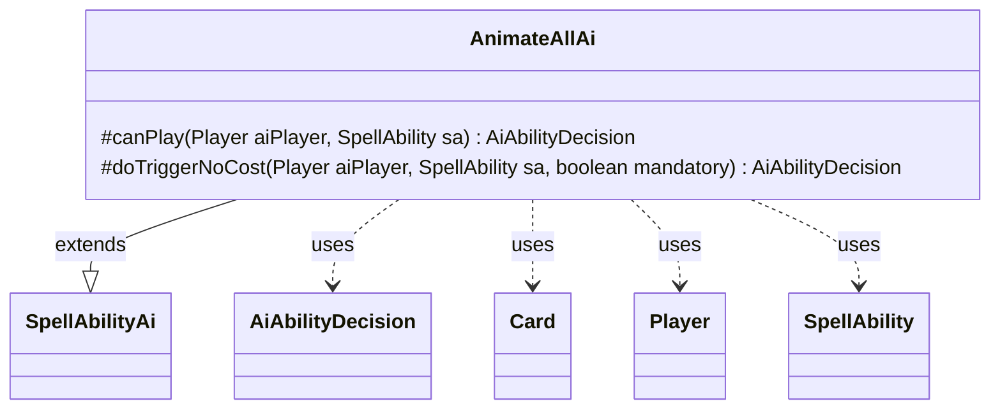

---
aliases:
  - AnimateAllAi
tags:
  - java/class
  - module/forge-ai
  - pkg/forge/ai/ability
fqn: forge.ai.ability.AnimateAllAi
package: forge.ai.ability
module: forge-ai
kind: Class
---

# AnimateAllAi

**Package:** `forge.ai.ability`   **Module:** `forge-ai`   **Kind:** Class



## Relationships
**Extends:**
- [[forge.ai.SpellAbilityAi|SpellAbilityAi]]
**Uses:**
- [[forge.ai.AiAbilityDecision|AiAbilityDecision]]
- [[forge.game.card.Card|Card]]
- [[forge.game.player.Player|Player]]
- [[forge.game.spellability.SpellAbility|SpellAbility]]

## Design Description

AnimateAllAi provides the AI decision logic for an "AnimateAll"-style spell ability, deciding whether the computer player should cast or resolve an effect that animates creatures en masse. As a concrete subclass of `SpellAbilityAi`, it overrides the engine's two AI entry points—`canPlay` for voluntary casting and `doTriggerNoCost` for triggered or mandatory resolution—each returning an `AiAbilityDecision` that bundles a confidence score with a play verdict (`WillPlay` or `CantPlayAi`).

Its choices are dispatched on the ability's `AILogic` parameter: `"CreatureAdvantage"` scans the AI's own creatures and commits only when `ComputerUtilCard.doesCreatureAttackAI` judges an attack favorable, `"Always"` casts unconditionally, and anything else declines; a mandatory trigger always plays. The class collaborates with `Player`, `Card`, and `SpellAbility` solely to read game state and holds no fields of its own, reflecting Forge's stateless, per-ability strategy pattern for AI handlers. A TODO flags the attack heuristic as provisional.

## Source
`forge-ai/src/main/java/forge/ai/ability/AnimateAllAi.java`

```java
package forge.ai.ability;

import forge.ai.AiAbilityDecision;
import forge.ai.AiPlayDecision;
import forge.ai.ComputerUtilCard;
import forge.ai.SpellAbilityAi;
import forge.game.card.Card;
import forge.game.player.Player;
import forge.game.spellability.SpellAbility;

public class AnimateAllAi extends SpellAbilityAi {

    @Override
    protected AiAbilityDecision canPlay(Player aiPlayer, SpellAbility sa) {
        String logic = sa.getParamOrDefault("AILogic", "");

        if ("CreatureAdvantage".equals(logic) && !aiPlayer.getCreaturesInPlay().isEmpty()) {
            // TODO: improve this or implement a better logic for abilities like Oko, the Trickster ultimate
            for (Card c : aiPlayer.getCreaturesInPlay()) {
                if (ComputerUtilCard.doesCreatureAttackAI(aiPlayer, c)) {
                    return new AiAbilityDecision(100, AiPlayDecision.WillPlay);
                }
            }
        }

        if ("Always".equals(logic)) {
            return new AiAbilityDecision(100, AiPlayDecision.WillPlay);
        }
        return new AiAbilityDecision(0, AiPlayDecision.CantPlayAi);
    }

    @Override
    protected AiAbilityDecision doTriggerNoCost(Player aiPlayer, SpellAbility sa, boolean mandatory) {
        if (mandatory) {
            return new AiAbilityDecision(100, AiPlayDecision.WillPlay);
        }
        return canPlay(aiPlayer, sa);
    }

}
```

## Python
`forge/ai/ability/AnimateAllAi.py`

```python
from forge.ai.AiAbilityDecision import AiAbilityDecision
from forge.ai.AiPlayDecision import AiPlayDecision
from forge.ai.ComputerUtilCard import ComputerUtilCard
from forge.ai.SpellAbilityAi import SpellAbilityAi
from forge.game.card.Card import Card
from forge.game.player.Player import Player
from forge.game.spellability.SpellAbility import SpellAbility


class AnimateAllAi(SpellAbilityAi):

    def canPlay(self, aiPlayer: Player, sa: SpellAbility) -> AiAbilityDecision:
        logic = sa.getParamOrDefault("AILogic", "")

        if "CreatureAdvantage" == logic and aiPlayer.getCreaturesInPlay():
            # TODO: improve this or implement a better logic for abilities like Oko, the Trickster ultimate
            for c in aiPlayer.getCreaturesInPlay():
                if ComputerUtilCard.doesCreatureAttackAI(aiPlayer, c):
                    return AiAbilityDecision(100, AiPlayDecision.WillPlay)

        if "Always" == logic:
            return AiAbilityDecision(100, AiPlayDecision.WillPlay)
        return AiAbilityDecision(0, AiPlayDecision.CantPlayAi)

    def doTriggerNoCost(self, aiPlayer: Player, sa: SpellAbility, mandatory: bool) -> AiAbilityDecision:
        if mandatory:
            return AiAbilityDecision(100, AiPlayDecision.WillPlay)
        return self.canPlay(aiPlayer, sa)
```
