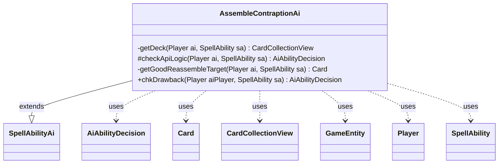

---
aliases:
  - AssembleContraptionAi
tags:
  - java/class
  - module/forge-ai
  - pkg/forge/ai/ability
fqn: forge.ai.ability.AssembleContraptionAi
package: forge.ai.ability
module: forge-ai
kind: Class
---

# AssembleContraptionAi

**Package:** `forge.ai.ability`   **Module:** `forge-ai`   **Kind:** Class



## Relationships
**Extends:**
- [[forge.ai.SpellAbilityAi|SpellAbilityAi]]
**Uses:**
- [[forge.ai.AiAbilityDecision|AiAbilityDecision]]
- [[forge.game.GameEntity|GameEntity]]
- [[forge.game.card.Card|Card]]
- [[forge.game.card.CardCollectionView|CardCollectionView]]
- [[forge.game.player.Player|Player]]
- [[forge.game.spellability.SpellAbility|SpellAbility]]

## Design Description

AssembleContraptionAi provides the AI's decision logic for spell abilities that assemble Contraptions or open Attractions. Extending `SpellAbilityAi`, it overrides `checkApiLogic` and `chkDrawback` to judge whether such an ability is worth activating: it first confirms the relevant deck—Contraption or Attraction, selected by the `ApiType`—is non-empty, then validates any X-cost payment before delegating to the superclass.

When the ability reassembles a `DefinedContraption`, `getGoodReassembleTarget` chooses among candidate `Card`s, preferring opponents' Contraptions or ones not on the next crank sprocket so reassembly isn't wasted on already-optimal placements. The class collaborates with `Player`, `SpellAbility`, and `CardCollectionView` to inspect game state, and reports results as `AiAbilityDecision`/`AiPlayDecision` values rather than booleans, conforming to the framework's richer decision protocol. The empty-deck guard is repeated in `chkDrawback` so the AI behaves sensibly when the ability appears as a drawback.

## Source
`forge-ai/src/main/java/forge/ai/ability/AssembleContraptionAi.java`

```java
package forge.ai.ability;

import forge.ai.AiAbilityDecision;
import forge.ai.AiPlayDecision;
import forge.ai.ComputerUtilCost;
import forge.ai.SpellAbilityAi;
import forge.game.GameEntity;
import forge.game.ability.ApiType;
import forge.game.card.Card;
import forge.game.card.CardCollectionView;
import forge.game.player.Player;
import forge.game.spellability.SpellAbility;
import forge.game.zone.ZoneType;

import java.util.List;

public class AssembleContraptionAi extends SpellAbilityAi {

    private static CardCollectionView getDeck(Player ai, SpellAbility sa) {
        return ai.getCardsIn(sa.getApi() == ApiType.OpenAttraction ?
                ZoneType.AttractionDeck : ZoneType.ContraptionDeck);
    }

    @Override
    protected AiAbilityDecision checkApiLogic(Player ai, SpellAbility sa) {
        CardCollectionView deck = getDeck(ai, sa);

        if (deck.isEmpty())
            return new AiAbilityDecision(0, AiPlayDecision.CantPlayAi);

        if ("X".equals(sa.getParam("Amount")) && sa.getSVar("X").equals("Count$xPaid")) {
            int xPay = ComputerUtilCost.setMaxXValue(sa, ai, sa.isTrigger());
            if (xPay == 0) {
                return new AiAbilityDecision(0, AiPlayDecision.CantPlayAi);
            }
        }

        if (sa.hasParam("DefinedContraption") && sa.usesTargeting()) {
            Card target = getGoodReassembleTarget(ai, sa);
            if (target != null)
                sa.getTargets().add(target);
            else
                return new AiAbilityDecision(0, AiPlayDecision.CantPlayAi);
        }

        return super.checkApiLogic(ai, sa);
    }

    private Card getGoodReassembleTarget(Player ai, SpellAbility sa) {
        List<GameEntity> targets = sa.getTargetRestrictions().getAllCandidates(sa, true);
        int nextSprocket = (ai.getCrankCounter() % 3) + 1;
        return targets.stream()
                .filter(e -> {
                    if(!(e instanceof Card))
                        return false;
                    Card c = (Card) e;
                    if(c.getController().isOpponentOf(ai))
                        return true;
                    return c.isContraption() && c.getSprocket() != nextSprocket;
                }).map(c -> (Card) c)
                .findFirst().orElse(null);
    }

    @Override
    public AiAbilityDecision chkDrawback(Player aiPlayer, SpellAbility sa) {
        if (getDeck(aiPlayer, sa).isEmpty())
            return new AiAbilityDecision(0, AiPlayDecision.CantPlayAi);
        return super.chkDrawback(aiPlayer, sa);
    }
}
```

## Python
`forge/ai/ability/AssembleContraptionAi.py`

````python
forge/ai/ability/AssembleContraptionAi.py:

```python
from forge.ai.AiAbilityDecision import AiAbilityDecision
from forge.ai.AiPlayDecision import AiPlayDecision
from forge.ai.ComputerUtilCost import ComputerUtilCost
from forge.ai.SpellAbilityAi import SpellAbilityAi
from forge.game.GameEntity import GameEntity
from forge.game.ability.ApiType import ApiType
from forge.game.card.Card import Card
from forge.game.card.CardCollectionView import CardCollectionView
from forge.game.player.Player import Player
from forge.game.spellability.SpellAbility import SpellAbility
from forge.game.zone.ZoneType import ZoneType


class AssembleContraptionAi(SpellAbilityAi):

    @staticmethod
    def getDeck(ai: Player, sa: SpellAbility) -> CardCollectionView:
        return ai.getCardsIn(ZoneType.AttractionDeck if sa.getApi() == ApiType.OpenAttraction
                             else ZoneType.ContraptionDeck)

    def checkApiLogic(self, ai: Player, sa: SpellAbility) -> AiAbilityDecision:
        deck = AssembleContraptionAi.getDeck(ai, sa)

        if deck.isEmpty():
            return AiAbilityDecision(0, AiPlayDecision.CantPlayAi)

        if "X" == sa.getParam("Amount") and sa.getSVar("X") == "Count$xPaid":
            xPay = ComputerUtilCost.setMaxXValue(sa, ai, sa.isTrigger())
            if xPay == 0:
                return AiAbilityDecision(0, AiPlayDecision.CantPlayAi)

        if sa.hasParam("DefinedContraption") and sa.usesTargeting():
            target = self.getGoodReassembleTarget(ai, sa)
            if target is not None:
                sa.getTargets().add(target)
            else:
                return AiAbilityDecision(0, AiPlayDecision.CantPlayAi)

        return super().checkApiLogic(ai, sa)

    def getGoodReassembleTarget(self, ai: Player, sa: SpellAbility) -> Card:
        targets: list[GameEntity] = sa.getTargetRestrictions().getAllCandidates(sa, True)
        nextSprocket = (ai.getCrankCounter() % 3) + 1
        for e in targets:
            if not isinstance(e, Card):
                continue
            c = e
            if c.getController().isOpponentOf(ai):
                return c
            if c.isContraption() and c.getSprocket() != nextSprocket:
                return c
        return None

    def chkDrawback(self, aiPlayer: Player, sa: SpellAbility) -> AiAbilityDecision:
        if AssembleContraptionAi.getDeck(aiPlayer, sa).isEmpty():
            return AiAbilityDecision(0, AiPlayDecision.CantPlayAi)
        return super().chkDrawback(aiPlayer, sa)
````
