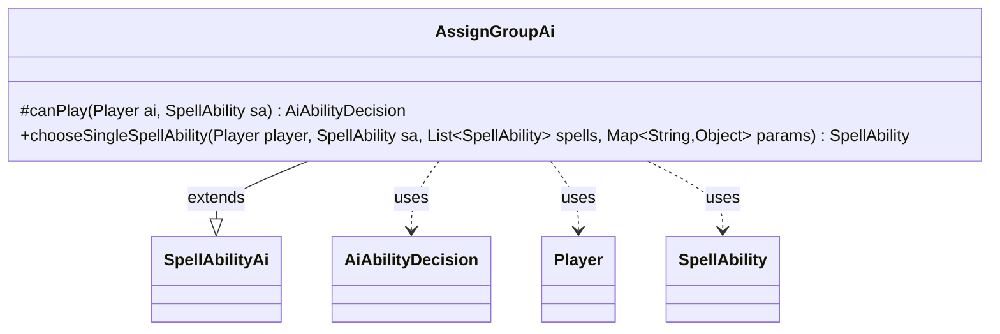

---
aliases:
  - AssignGroupAi
tags:
  - java/class
  - module/forge-ai
  - pkg/forge/ai/ability
fqn: forge.ai.ability.AssignGroupAi
package: forge.ai.ability
module: forge-ai
kind: Class
---

# AssignGroupAi

**Package:** `forge.ai.ability` &nbsp; **Module:** `forge-ai` &nbsp; **Kind:** Class



## Relationships
**Extends:**
- [[forge.ai.SpellAbilityAi|SpellAbilityAi]]
**Uses:**
- [[forge.ai.AiAbilityDecision|AiAbilityDecision]]
- [[forge.game.player.Player|Player]]
- [[forge.game.spellability.SpellAbility|SpellAbility]]

## Design Description

`AssignGroupAi` supplies the AI decision logic for "AssignGroup" effects, where affected entities are sorted into groups; it is the computer-controlled counterpart to that card scripting. As a concrete subclass of `SpellAbilityAi`, it overrides `canPlay` to return an unconditional high-confidence `WillPlay` result (wrapped in an `AiAbilityDecision`), intentionally delegating all play restrictions to per-card hints such as `NeedsToPlay` rather than analyzing board state itself.

Its substantive work is `chooseSingleSpellAbility`, which picks one option from the candidate `SpellAbility` list. Under the `FriendOrFoe` AILogic it reads the `Affected` `Player` from the params map and selects the hostile or friendly branch according to opponent status; otherwise it defaults to the first available choice. The design keeps the AI deliberately thin, externalizing behavior through AILogic strings and card parameters.

## Source
`forge-ai/src/main/java/forge/ai/ability/AssignGroupAi.java`

```java
package forge.ai.ability;

import com.google.common.collect.Iterables;
import forge.ai.AiAbilityDecision;
import forge.ai.AiPlayDecision;
import forge.ai.SpellAbilityAi;
import forge.game.player.Player;
import forge.game.spellability.SpellAbility;

import java.util.List;
import java.util.Map;

public class AssignGroupAi extends SpellAbilityAi {

    @Override
    protected AiAbilityDecision canPlay(Player ai, SpellAbility sa) {
        // TODO: Currently this AI relies on the card-specific limiting hints (NeedsToPlay / NeedsToPlayVar),
        // otherwise the AI considers the card playable.
        return new AiAbilityDecision(100, AiPlayDecision.WillPlay);
    }

    public SpellAbility chooseSingleSpellAbility(Player player, SpellAbility sa, List<SpellAbility> spells, Map<String, Object> params) {
        final String logic = sa.getParamOrDefault("AILogic", "");
        
        if (logic.equals("FriendOrFoe")) {
            if (params.containsKey("Affected") && spells.size() >= 2) {
                Player t = (Player) params.get("Affected");
                return spells.get(player.isOpponentOf(t) ? 1 : 0);
            }
        }

        return Iterables.getFirst(spells, null);
    }
}
```

## Python
`forge/ai/ability/AssignGroupAi.py`

```python
from forge.ai.AiAbilityDecision import AiAbilityDecision
from forge.ai.AiPlayDecision import AiPlayDecision
from forge.ai.SpellAbilityAi import SpellAbilityAi
from forge.game.player.Player import Player
from forge.game.spellability.SpellAbility import SpellAbility

from typing import List, Map


class AssignGroupAi(SpellAbilityAi):

    def canPlay(self, ai: Player, sa: SpellAbility) -> AiAbilityDecision:
        # TODO: Currently this AI relies on the card-specific limiting hints (NeedsToPlay / NeedsToPlayVar),
        # otherwise the AI considers the card playable.
        return AiAbilityDecision(100, AiPlayDecision.WillPlay)

    def chooseSingleSpellAbility(self, player: Player, sa: SpellAbility, spells: List[SpellAbility], params: dict[str, object]) -> SpellAbility:
        logic = sa.getParamOrDefault("AILogic", "")

        if logic == "FriendOrFoe":
            if "Affected" in params and len(spells) >= 2:
                t = params["Affected"]
                return spells[1 if player.isOpponentOf(t) else 0]

        return spells[0] if spells else None
```
