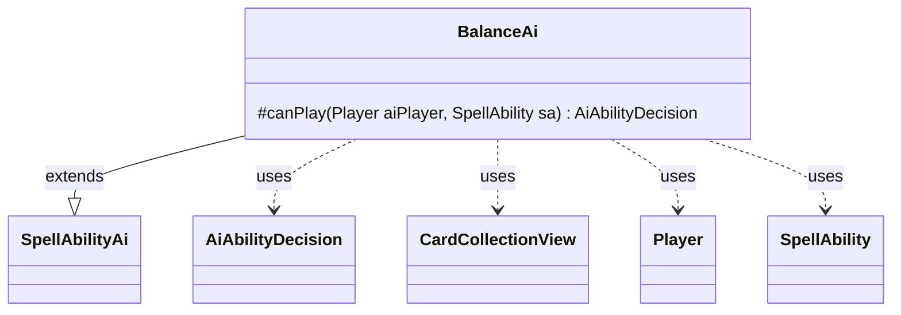

---
aliases:
  - BalanceAi
tags:
  - java/class
  - module/forge-ai
  - pkg/forge/ai/ability
fqn: forge.ai.ability.BalanceAi
package: forge.ai.ability
module: forge-ai
kind: Class
---

# BalanceAi

**Package:** `forge.ai.ability` &nbsp; **Module:** `forge-ai` &nbsp; **Kind:** Class



## Relationships
**Extends:**
- [[forge.ai.SpellAbilityAi|SpellAbilityAi]]
**Uses:**
- [[forge.ai.AiAbilityDecision|AiAbilityDecision]]
- [[forge.game.card.CardCollectionView|CardCollectionView]]
- [[forge.game.player.Player|Player]]
- [[forge.game.spellability.SpellAbility|SpellAbility]]

## Design Description

`BalanceAi` is the AI decision provider for the *Balance*-style "sacrifice down to the minimum" effect, supplying the engine's heuristic for whether the computer should cast such a spell. As a concrete subclass of `SpellAbilityAi`, it overrides only `canPlay`, returning an `AiAbilityDecision` that pairs a numeric confidence with an `AiPlayDecision` outcome. It dispatches on the ability's `AILogic` parameter (`BalanceCreaturesAndLands` or `BalancePermanents`) to compute a board-state differential, scanning each opponent's and the AI's own `CardCollectionView`s across the battlefield and hand zones, weighting creatures and hand size, and targeting the weakest opponent.

The design intent is conservative and probabilistic: it refuses to play whenever the AI would have to sacrifice its own permanents (a negative differential yields `CantPlayAi`), and otherwise scales the chance to cast with the size of the advantage via `MyRandom`, so a larger lead makes activation more likely while small edges usually defer with `StopRunawayActivations`. An inline TODO notes the count-based comparison is a simplification carried over from the legacy hardcoded Balance and should eventually weigh card value.

## Source
`forge-ai/src/main/java/forge/ai/ability/BalanceAi.java`

```java
package forge.ai.ability;

import forge.ai.AiAbilityDecision;
import forge.ai.AiPlayDecision;
import forge.ai.SpellAbilityAi;
import forge.game.card.CardCollectionView;
import forge.game.card.CardLists;
import forge.game.card.CardPredicates;
import forge.game.player.Player;
import forge.game.spellability.SpellAbility;
import forge.game.zone.ZoneType;
import forge.util.MyRandom;

public class BalanceAi extends SpellAbilityAi {
    @Override
    protected AiAbilityDecision canPlay(Player aiPlayer, SpellAbility sa) {
        String logic = sa.getParam("AILogic");
        int diff = 0;
        Player opp = aiPlayer.getWeakestOpponent();
        final CardCollectionView compPerms = aiPlayer.getCardsIn(ZoneType.Battlefield);
        for (Player min : aiPlayer.getOpponents()) {
            if (min.getCardsIn(ZoneType.Battlefield).size() < opp.getCardsIn(ZoneType.Battlefield).size()) {
                opp = min;
            }
        }
        final CardCollectionView humPerms = opp.getCardsIn(ZoneType.Battlefield);
        
        if ("BalanceCreaturesAndLands".equals(logic)) {
            // TODO Copied over from hardcoded Balance. We should be checking value of the lands/creatures for each opponent, not just counting
            diff += CardLists.filter(humPerms, CardPredicates.LANDS).size() -
                    CardLists.filter(compPerms, CardPredicates.LANDS).size();
            diff += 1.5 * (CardLists.filter(humPerms, CardPredicates.CREATURES).size() -
                    CardLists.filter(compPerms, CardPredicates.CREATURES).size());
        }
        else if ("BalancePermanents".equals(logic)) {
            // Don't cast if you have to sacrifice permanents
            diff += humPerms.size() - compPerms.size();
        }

        if (diff < 0) {
            // Don't sacrifice permanents even if opponent has a ton of cards in hand
            return new AiAbilityDecision(0, forge.ai.AiPlayDecision.CantPlayAi);
        }

        final CardCollectionView humHand = opp.getCardsIn(ZoneType.Hand);
        final CardCollectionView compHand = aiPlayer.getCardsIn(ZoneType.Hand);
        diff += 0.5 * (humHand.size() - compHand.size());

        // Larger differential == more chance to actually cast this spell
        boolean willPlay = diff > 2 && MyRandom.getRandom().nextInt(100) < diff*10;
        return new AiAbilityDecision(willPlay ? 100 : 0, willPlay ? forge.ai.AiPlayDecision.WillPlay : AiPlayDecision.StopRunawayActivations);
    }
}
```

## Python
`forge/ai/ability/BalanceAi.py`

```python
from forge.ai.AiAbilityDecision import AiAbilityDecision
from forge.ai.AiPlayDecision import AiPlayDecision
from forge.ai.SpellAbilityAi import SpellAbilityAi
from forge.game.card.CardCollectionView import CardCollectionView
from forge.game.card.CardLists import CardLists
from forge.game.card.CardPredicates import CardPredicates
from forge.game.player.Player import Player
from forge.game.spellability.SpellAbility import SpellAbility
from forge.game.zone.ZoneType import ZoneType
from forge.util.MyRandom import MyRandom


class BalanceAi(SpellAbilityAi):
    def canPlay(self, aiPlayer: Player, sa: SpellAbility) -> AiAbilityDecision:
        logic = sa.getParam("AILogic")
        diff = 0
        opp = aiPlayer.getWeakestOpponent()
        compPerms = aiPlayer.getCardsIn(ZoneType.Battlefield)
        for min in aiPlayer.getOpponents():
            if min.getCardsIn(ZoneType.Battlefield).size() < opp.getCardsIn(ZoneType.Battlefield).size():
                opp = min
        humPerms = opp.getCardsIn(ZoneType.Battlefield)

        if "BalanceCreaturesAndLands" == logic:
            # TODO Copied over from hardcoded Balance. We should be checking value of the lands/creatures for each opponent, not just counting
            diff += CardLists.filter(humPerms, CardPredicates.LANDS).size() - \
                    CardLists.filter(compPerms, CardPredicates.LANDS).size()
            diff += 1.5 * (CardLists.filter(humPerms, CardPredicates.CREATURES).size() -
                           CardLists.filter(compPerms, CardPredicates.CREATURES).size())
        elif "BalancePermanents" == logic:
            # Don't cast if you have to sacrifice permanents
            diff += humPerms.size() - compPerms.size()

        if diff < 0:
            # Don't sacrifice permanents even if opponent has a ton of cards in hand
            return AiAbilityDecision(0, AiPlayDecision.CantPlayAi)

        humHand = opp.getCardsIn(ZoneType.Hand)
        compHand = aiPlayer.getCardsIn(ZoneType.Hand)
        diff += 0.5 * (humHand.size() - compHand.size())

        # Larger differential == more chance to actually cast this spell
        willPlay = diff > 2 and MyRandom.getRandom().nextInt(100) < diff * 10
        return AiAbilityDecision(100 if willPlay else 0, AiPlayDecision.WillPlay if willPlay else AiPlayDecision.StopRunawayActivations)
```
