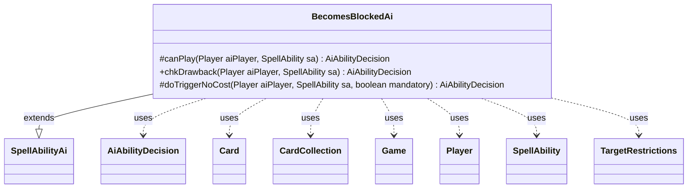

---
aliases:
  - BecomesBlockedAi
tags:
  - java/class
  - module/forge-ai
  - pkg/forge/ai/ability
fqn: forge.ai.ability.BecomesBlockedAi
package: forge.ai.ability
module: forge-ai
kind: Class
---

# BecomesBlockedAi

**Package:** `forge.ai.ability`   **Module:** `forge-ai`   **Kind:** Class



## Relationships
**Extends:**
- [[forge.ai.SpellAbilityAi|SpellAbilityAi]]
**Uses:**
- [[forge.ai.AiAbilityDecision|AiAbilityDecision]]
- [[forge.game.Game|Game]]
- [[forge.game.card.Card|Card]]
- [[forge.game.card.CardCollection|CardCollection]]
- [[forge.game.player.Player|Player]]
- [[forge.game.spellability.SpellAbility|SpellAbility]]
- [[forge.game.spellability.TargetRestrictions|TargetRestrictions]]

## Design Description

BecomesBlockedAi supplies the AI decision logic for an ability that forces a creature to become blocked, extending `SpellAbilityAi` and overriding its hook methods (`canPlay`, `chkDrawback`, `doTriggerNoCost`) to return `AiAbilityDecision` values that score whether the computer should act. Its responsibility is narrow and timing-bound: it only commits to playing during the opponent's declare-blockers step, where forcing a block has tactical value. When the ability targets, it collaborates with `Game`, `CardCollection`, and `TargetRestrictions` to gather the opponent's battlefield creatures, deliberately filtering out those with trample (which would render the effect pointless) and selecting the strongest creature via `ComputerUtilCard`. The drawback and forced-trigger paths are intentionally left unimplemented, conservatively declining to act—reflecting that this AI is tuned only for its primary proactive use case.

## Source
`forge-ai/src/main/java/forge/ai/ability/BecomesBlockedAi.java`

```java
package forge.ai.ability;

import forge.ai.AiAbilityDecision;
import forge.ai.AiPlayDecision;
import forge.ai.ComputerUtilCard;
import forge.ai.SpellAbilityAi;
import forge.game.Game;
import forge.game.card.Card;
import forge.game.card.CardCollection;
import forge.game.card.CardLists;
import forge.game.keyword.Keyword;
import forge.game.phase.PhaseType;
import forge.game.player.Player;
import forge.game.spellability.SpellAbility;
import forge.game.spellability.TargetRestrictions;
import forge.game.zone.ZoneType;

public class BecomesBlockedAi extends SpellAbilityAi {
    @Override
    protected AiAbilityDecision canPlay(Player aiPlayer, SpellAbility sa) {
        final Card source = sa.getHostCard();
        final TargetRestrictions tgt = sa.getTargetRestrictions();
        final Game game = aiPlayer.getGame();

        if (!game.getPhaseHandler().is(PhaseType.COMBAT_DECLARE_BLOCKERS)
                || !game.getPhaseHandler().getPlayerTurn().isOpponentOf(aiPlayer)) {
            return new AiAbilityDecision(0, AiPlayDecision.CantPlayAi);
        }

        if (tgt != null) {
            sa.resetTargets();
            CardCollection list = CardLists.filterControlledBy(game.getCardsIn(ZoneType.Battlefield), aiPlayer.getOpponents());
            list = CardLists.getTargetableCards(list, sa);
            list = CardLists.getNotKeyword(list, Keyword.TRAMPLE);

            while (sa.canAddMoreTarget()) {
                Card choice = null;

                if (list.isEmpty()) {
                    return new AiAbilityDecision(0, AiPlayDecision.CantPlayAi);
                }

                choice = ComputerUtilCard.getBestCreatureAI(list);

                if (choice == null) { // can't find anything left
                    return new AiAbilityDecision(0, AiPlayDecision.CantPlayAi);
                }

                list.remove(choice);
                sa.getTargets().add(choice);
            }
        }
        return new AiAbilityDecision(100, AiPlayDecision.WillPlay);
    }

    @Override
    public AiAbilityDecision chkDrawback(Player aiPlayer, SpellAbility sa) {
        // TODO - implement AI
        return new AiAbilityDecision(0, AiPlayDecision.CantPlayAi);
    }

    @Override
    protected AiAbilityDecision doTriggerNoCost(Player aiPlayer, SpellAbility sa, boolean mandatory) {
        // TODO - implement AI
        return new AiAbilityDecision(0, AiPlayDecision.CantPlayAi);
    }
}
```

## Python
`forge/ai/ability/BecomesBlockedAi.py`

```python
package: forge.ai.ability

from forge.ai.AiAbilityDecision import AiAbilityDecision
from forge.ai.AiPlayDecision import AiPlayDecision
from forge.ai.ComputerUtilCard import ComputerUtilCard
from forge.ai.SpellAbilityAi import SpellAbilityAi
from forge.game.Game import Game
from forge.game.card.Card import Card
from forge.game.card.CardCollection import CardCollection
from forge.game.card.CardLists import CardLists
from forge.game.keyword.Keyword import Keyword
from forge.game.phase.PhaseType import PhaseType
from forge.game.player.Player import Player
from forge.game.spellability.SpellAbility import SpellAbility
from forge.game.spellability.TargetRestrictions import TargetRestrictions
from forge.game.zone.ZoneType import ZoneType


class BecomesBlockedAi(SpellAbilityAi):
    def canPlay(self, aiPlayer, sa):
        source = sa.getHostCard()
        tgt = sa.getTargetRestrictions()
        game = aiPlayer.getGame()

        if (not game.getPhaseHandler().is_(PhaseType.COMBAT_DECLARE_BLOCKERS)
                or not game.getPhaseHandler().getPlayerTurn().isOpponentOf(aiPlayer)):
            return AiAbilityDecision(0, AiPlayDecision.CantPlayAi)

        if tgt is not None:
            sa.resetTargets()
            list = CardLists.filterControlledBy(game.getCardsIn(ZoneType.Battlefield), aiPlayer.getOpponents())
            list = CardLists.getTargetableCards(list, sa)
            list = CardLists.getNotKeyword(list, Keyword.TRAMPLE)

            while sa.canAddMoreTarget():
                choice = None

                if list.isEmpty():
                    return AiAbilityDecision(0, AiPlayDecision.CantPlayAi)

                choice = ComputerUtilCard.getBestCreatureAI(list)

                if choice is None:  # can't find anything left
                    return AiAbilityDecision(0, AiPlayDecision.CantPlayAi)

                list.remove(choice)
                sa.getTargets().add(choice)

        return AiAbilityDecision(100, AiPlayDecision.WillPlay)

    def chkDrawback(self, aiPlayer, sa):
        # TODO - implement AI
        return AiAbilityDecision(0, AiPlayDecision.CantPlayAi)

    def doTriggerNoCost(self, aiPlayer, sa, mandatory):
        # TODO - implement AI
        return AiAbilityDecision(0, AiPlayDecision.CantPlayAi)
```
