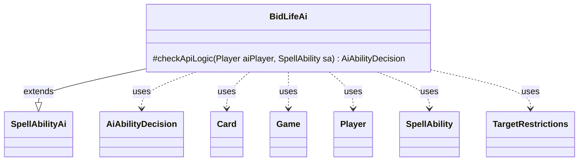

---
aliases:
  - BidLifeAi
tags:
  - java/class
  - module/forge-ai
  - pkg/forge/ai/ability
fqn: forge.ai.ability.BidLifeAi
package: forge.ai.ability
module: forge-ai
kind: Class
---

# BidLifeAi

**Package:** `forge.ai.ability`   **Module:** `forge-ai`   **Kind:** Class



## Relationships
**Extends:**
- [[forge.ai.SpellAbilityAi|SpellAbilityAi]]
**Uses:**
- [[forge.ai.AiAbilityDecision|AiAbilityDecision]]
- [[forge.game.Game|Game]]
- [[forge.game.card.Card|Card]]
- [[forge.game.player.Player|Player]]
- [[forge.game.spellability.SpellAbility|SpellAbility]]
- [[forge.game.spellability.TargetRestrictions|TargetRestrictions]]

## Design Description

BidLifeAi provides the AI's decision logic for spell abilities keyed to the "BidLife" API, extending the abstract `SpellAbilityAi` base and overriding `checkApiLogic` to decide whether the computer player should activate the ability. It reads the ability's `TargetRestrictions` to pick a legal target: when creatures are targetable it selects the best creature controlled by the preferred defending opponent (via `AiAttackController` and `ComputerUtilCard`); when the stack is targetable it targets the top spell only if it is counterable and owned by another player.

The method returns an `AiAbilityDecision` pairing a score with an `AiPlayDecision`—zero on targeting or play failure, 100/`WillPlay` otherwise. As a small, stateless handler, it embodies Forge's API-keyed AI dispatch pattern, delegating to shared game-state and card-evaluation utilities rather than holding state itself.

## Source
`forge-ai/src/main/java/forge/ai/ability/BidLifeAi.java`

```java
package forge.ai.ability;

import forge.ai.AiAbilityDecision;
import forge.ai.AiAttackController;
import forge.ai.AiPlayDecision;
import forge.ai.ComputerUtilCard;
import forge.ai.SpellAbilityAi;
import forge.game.Game;
import forge.game.card.Card;
import forge.game.card.CardLists;
import forge.game.player.Player;
import forge.game.spellability.SpellAbility;
import forge.game.spellability.TargetRestrictions;
import forge.game.zone.ZoneType;

import java.util.List;

public class BidLifeAi extends SpellAbilityAi {

    @Override
    protected AiAbilityDecision checkApiLogic(Player aiPlayer, SpellAbility sa) {
        final Card source = sa.getHostCard();
        final Game game = source.getGame();
        TargetRestrictions tgt = sa.getTargetRestrictions();
        if (tgt != null) {
            sa.resetTargets();
            if (tgt.canTgtCreature()) {
                List<Card> list = CardLists.getTargetableCards(AiAttackController.choosePreferredDefenderPlayer(aiPlayer).getCardsIn(ZoneType.Battlefield), sa);
                if (list.isEmpty()) {
                    return new AiAbilityDecision(0, AiPlayDecision.TargetingFailed);
                }
                Card c = ComputerUtilCard.getBestCreatureAI(list);
                if (sa.canTarget(c)) {
                    sa.getTargets().add(c);
                } else {
                    return new AiAbilityDecision(0, AiPlayDecision.TargetingFailed);
                }
            } else if (tgt.getZone().contains(ZoneType.Stack)) {
                if (game.getStack().isEmpty()) {
                    return new AiAbilityDecision(0, AiPlayDecision.CantPlayAi);
                }
                final SpellAbility topSA = game.getStack().peekAbility();
                if (!topSA.isCounterableBy(sa) || aiPlayer.equals(topSA.getActivatingPlayer())) {
                    return new AiAbilityDecision(0, AiPlayDecision.CantPlayAi);
                }
                if (sa.canTargetSpellAbility(topSA)) {
                    sa.getTargets().add(topSA);
                } else {
                    return new AiAbilityDecision(0, AiPlayDecision.TargetingFailed);
                }
            }
        }

        return new AiAbilityDecision(100, AiPlayDecision.WillPlay);
    }

}
```

## Python
`forge/ai/ability/BidLifeAi.py`

```python
from forge.ai.AiAbilityDecision import AiAbilityDecision
from forge.ai.AiAttackController import AiAttackController
from forge.ai.AiPlayDecision import AiPlayDecision
from forge.ai.ComputerUtilCard import ComputerUtilCard
from forge.ai.SpellAbilityAi import SpellAbilityAi
from forge.game.Game import Game
from forge.game.card.Card import Card
from forge.game.card.CardLists import CardLists
from forge.game.player.Player import Player
from forge.game.spellability.SpellAbility import SpellAbility
from forge.game.spellability.TargetRestrictions import TargetRestrictions
from forge.game.zone.ZoneType import ZoneType


class BidLifeAi(SpellAbilityAi):

    def checkApiLogic(self, aiPlayer: Player, sa: SpellAbility) -> AiAbilityDecision:
        source = sa.getHostCard()
        game = source.getGame()
        tgt = sa.getTargetRestrictions()
        if tgt is not None:
            sa.resetTargets()
            if tgt.canTgtCreature():
                list = CardLists.getTargetableCards(AiAttackController.choosePreferredDefenderPlayer(aiPlayer).getCardsIn(ZoneType.Battlefield), sa)
                if len(list) == 0:
                    return AiAbilityDecision(0, AiPlayDecision.TargetingFailed)
                c = ComputerUtilCard.getBestCreatureAI(list)
                if sa.canTarget(c):
                    sa.getTargets().add(c)
                else:
                    return AiAbilityDecision(0, AiPlayDecision.TargetingFailed)
            elif ZoneType.Stack in tgt.getZone():
                if game.getStack().isEmpty():
                    return AiAbilityDecision(0, AiPlayDecision.CantPlayAi)
                topSA = game.getStack().peekAbility()
                if not topSA.isCounterableBy(sa) or aiPlayer.equals(topSA.getActivatingPlayer()):
                    return AiAbilityDecision(0, AiPlayDecision.CantPlayAi)
                if sa.canTargetSpellAbility(topSA):
                    sa.getTargets().add(topSA)
                else:
                    return AiAbilityDecision(0, AiPlayDecision.TargetingFailed)

        return AiAbilityDecision(100, AiPlayDecision.WillPlay)
```
