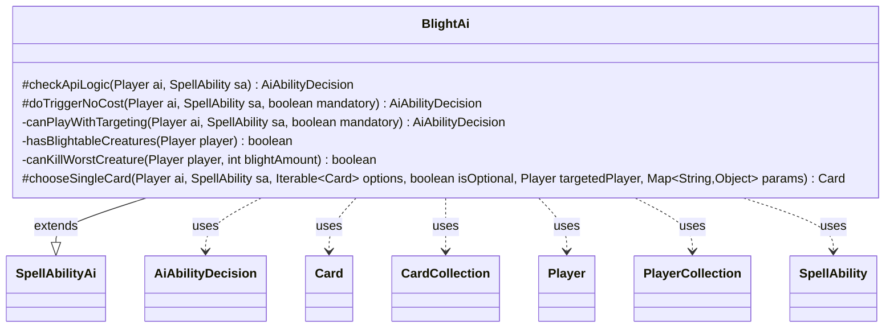

---
aliases:
  - BlightAi
tags:
  - java/class
  - module/forge-ai
  - pkg/forge/ai/ability
fqn: forge.ai.ability.BlightAi
package: forge.ai.ability
module: forge-ai
kind: Class
---

# BlightAi

**Package:** `forge.ai.ability` &nbsp; **Module:** `forge-ai` &nbsp; **Kind:** Class



## Relationships
**Extends:**
- [[forge.ai.SpellAbilityAi|SpellAbilityAi]]
**Uses:**
- [[forge.ai.AiAbilityDecision|AiAbilityDecision]]
- [[forge.game.card.Card|Card]]
- [[forge.game.card.CardCollection|CardCollection]]
- [[forge.game.player.Player|Player]]
- [[forge.game.player.PlayerCollection|PlayerCollection]]
- [[forge.game.spellability.SpellAbility|SpellAbility]]

## Design Description

BlightAi is the AI decision-making strategy for "Blight"-style abilities that place -1/-1 counters on opponents' creatures. Extending `SpellAbilityAi`, it overrides the standard hooks—`checkApiLogic` and `doTriggerNoCost`—routing both through a shared `canPlayWithTargeting` helper so that proactive casting and forced triggers share identical target-selection logic, expressed through the `AiAbilityDecision`/`AiPlayDecision` protocol.

Its design intent is value-maximizing target selection: it filters opponents to those holding counter-eligible creatures and prefers the one whose worst creature the blight amount would actually kill, falling back to an arbitrary targetable opponent only when the effect is mandatory. Collaborating with `Player`/`PlayerCollection` and `Card`/`CardCollection` and leaning on `ComputerUtilCard` for "worst creature" evaluation, it also overrides `chooseSingleCard` to favor sacrificing low-value Undying creatures that survive the counters—heuristics that reflect deliberate play-quality reasoning rather than arbitrary choices.

## Source
`forge-ai/src/main/java/forge/ai/ability/BlightAi.java`

```java
package forge.ai.ability;

import forge.ai.AiAbilityDecision;
import forge.ai.AiPlayDecision;
import forge.ai.ComputerUtilCard;
import forge.ai.SpellAbilityAi;
import forge.game.ability.AbilityUtils;
import forge.game.card.Card;
import forge.game.card.CardCollection;
import forge.game.card.CardLists;
import forge.game.card.CounterEnumType;
import forge.game.keyword.Keyword;
import forge.game.player.Player;
import forge.game.player.PlayerCollection;
import forge.game.player.PlayerPredicates;
import forge.game.spellability.SpellAbility;

import java.util.Map;
import java.util.Optional;

public class BlightAi extends SpellAbilityAi {

    @Override
    protected AiAbilityDecision checkApiLogic(Player ai, SpellAbility sa) {
        return canPlayWithTargeting(ai, sa, false);
    }

    @Override
    protected AiAbilityDecision doTriggerNoCost(final Player ai, final SpellAbility sa, final boolean mandatory) {
        return canPlayWithTargeting(ai, sa, mandatory);
    }

    private AiAbilityDecision canPlayWithTargeting(Player ai, SpellAbility sa, boolean mandatory) {
        if (!sa.usesTargeting()) {
            return new AiAbilityDecision(100, AiPlayDecision.WillPlay);
        }

        sa.resetTargets();
        PlayerCollection opponents = ai.getOpponents().filter(PlayerPredicates.isTargetableBy(sa));
        int blightAmount = AbilityUtils.calculateAmount(
                sa.getHostCard(), sa.getParamOrDefault("Num", "1"), sa);

        // Prioritize opponents whose worst blightable creature would die
        Optional<Player> target = opponents.stream()
                .filter(this::hasBlightableCreatures).min((a, b) -> Boolean.compare(
                        canKillWorstCreature(b, blightAmount),
                        canKillWorstCreature(a, blightAmount)));

        if (target.isPresent()) {
            sa.getTargets().add(target.get());
            return new AiAbilityDecision(100, AiPlayDecision.WillPlay);
        }

        if (mandatory && !opponents.isEmpty()) {
            sa.getTargets().add(opponents.getFirst());
            return new AiAbilityDecision(100, AiPlayDecision.WillPlay);
        }

        return new AiAbilityDecision(0, AiPlayDecision.TargetingFailed);
    }

    private boolean hasBlightableCreatures(Player player) {
        return player.getCreaturesInPlay().stream()
                .anyMatch(c -> c.canReceiveCounters(CounterEnumType.M1M1));
    }

    private boolean canKillWorstCreature(Player player, int blightAmount) {
        Card worst = ComputerUtilCard.getWorstCreatureAI(
                CardLists.filter(player.getCreaturesInPlay(),
                        c -> c.canReceiveCounters(CounterEnumType.M1M1)));
        return worst != null && worst.getNetToughness() <= blightAmount;
    }

    @Override
    protected Card chooseSingleCard(Player ai, SpellAbility sa, Iterable<Card> options, boolean isOptional, Player targetedPlayer, Map<String, Object> params) {
        // Prefer creatures with Undying that won't die from the counters
        int amount = AbilityUtils.calculateAmount(sa.getHostCard(), sa.getParamOrDefault("Num", "1"), sa);
        CardCollection undying = CardLists.filter(options, c ->
                c.hasKeyword(Keyword.UNDYING)
                && c.getCounters(CounterEnumType.P1P1) <= amount
                && c.getNetToughness() > amount);

        if (!undying.isEmpty()) {
            return ComputerUtilCard.getWorstCreatureAI(undying);
        }

        return ComputerUtilCard.getWorstCreatureAI(options);
    }
}
```
