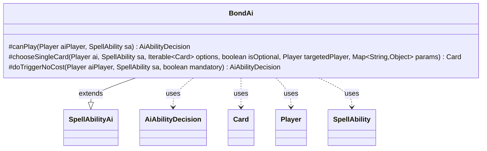

---
aliases:
  - BondAi
tags:
  - java/class
  - module/forge-ai
  - pkg/forge/ai/ability
fqn: forge.ai.ability.BondAi
package: forge.ai.ability
module: forge-ai
kind: Class
---

# BondAi

**Package:** `forge.ai.ability` &nbsp; **Module:** `forge-ai` &nbsp; **Kind:** Class



## Relationships
**Extends:**
- [[forge.ai.SpellAbilityAi|SpellAbilityAi]]
**Uses:**
- [[forge.ai.AiAbilityDecision|AiAbilityDecision]]
- [[forge.game.card.Card|Card]]
- [[forge.game.player.Player|Player]]
- [[forge.game.spellability.SpellAbility|SpellAbility]]

## Design Description

Soul Bond AI helper. BondAi implements the AI decision logic for "soulbond"-style pairing abilities, extending the abstract `SpellAbilityAi` base class and overriding three of its hooks. The `canPlay` and `doTriggerNoCost` methods unconditionally return a high-confidence `WillPlay` decision, reflecting that bonding is essentially always beneficial. Its substantive work is in `chooseSingleCard`, which selects the best partner creature for the bond: it consults the host card's `AIPreference` SVar for a `SoulBond` restriction, validates or filters candidate cards against that restriction, and delegates the final pick to `ComputerUtilCard.getBestCreatureAI`. It collaborates with `Card`, `Player`, and `SpellAbility` from the game model and returns `AiAbilityDecision` results, keeping all bond-specific heuristics isolated from the generic ability-resolution framework.

## Source
`forge-ai/src/main/java/forge/ai/ability/BondAi.java`

```java
/*
 * Forge: Play Magic: the Gathering.
 * Copyright (C) 2011  Forge Team
 *
 * This program is free software: you can redistribute it and/or modify
 * it under the terms of the GNU General Public License as published by
 * the Free Software Foundation, either version 3 of the License, or
 * (at your option) any later version.
 * 
 * This program is distributed in the hope that it will be useful,
 * but WITHOUT ANY WARRANTY; without even the implied warranty of
 * MERCHANTABILITY or FITNESS FOR A PARTICULAR PURPOSE.  See the
 * GNU General Public License for more details.
 * 
 * You should have received a copy of the GNU General Public License
 * along with this program.  If not, see <http://www.gnu.org/licenses/>.
 */
package forge.ai.ability;

import forge.ai.AiAbilityDecision;
import forge.ai.AiPlayDecision;
import forge.ai.ComputerUtilCard;
import forge.ai.SpellAbilityAi;
import forge.game.card.Card;
import forge.game.player.Player;
import forge.game.spellability.SpellAbility;
import org.apache.commons.lang3.StringUtils;

import java.util.Map;
import java.util.stream.StreamSupport;

/**
 * <p>
 * AbilityFactoryBond class.
 * </p>
 * 
 * @author Forge
 * @version $Id: AbilityFactoryBond.java 15090 2012-04-07 12:50:31Z Max mtg $
 */
public final class BondAi extends SpellAbilityAi {
    /**
     * <p>
     * bondCanPlayAI.
     * </p>
     * @param aiPlayer
     *            a {@link forge.game.player.Player} object.
     * @param sa
     *            a {@link forge.game.spellability.SpellAbility} object.
     *
     * @return a boolean.
     */
    @Override
    protected AiAbilityDecision canPlay(Player aiPlayer, SpellAbility sa) {
        return new AiAbilityDecision(100, AiPlayDecision.WillPlay);
    }

    @Override
    protected Card chooseSingleCard(Player ai, SpellAbility sa, Iterable<Card> options, boolean isOptional, Player targetedPlayer, Map<String, Object> params) {
        final Card host = sa.getHostCard();
        Iterable<Card> candidates = options;
        if (host != null && host.hasSVar("AIPreference")) {
            String[] prefs = StringUtils.split(host.getSVar("AIPreference"), "$");
            if (prefs != null && prefs.length == 2 && "SoulBond".equals(prefs[0])) {
                String restriction = prefs[1];
                if (params.get("Partner") instanceof Card partner && !partner.isValid(restriction, ai, host, sa)) {
                    return null;
                }
                candidates = StreamSupport.stream(options.spliterator(), false)
                        .filter(c -> c.isValid(restriction, ai, host, sa))
                        .toList();
            }
        }
        return ComputerUtilCard.getBestCreatureAI(candidates);
    }

    @Override
    protected AiAbilityDecision doTriggerNoCost(final Player aiPlayer, final SpellAbility sa, final boolean mandatory) {
        return new AiAbilityDecision(100, AiPlayDecision.WillPlay);
    }
}
```
