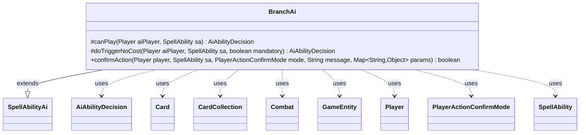

---
aliases:
  - BranchAi
tags:
  - java/class
  - module/forge-ai
  - pkg/forge/ai/ability
fqn: forge.ai.ability.BranchAi
package: forge.ai.ability
module: forge-ai
kind: Class
---

# BranchAi

**Package:** `forge.ai.ability` &nbsp; **Module:** `forge-ai` &nbsp; **Kind:** Class



## Relationships
**Extends:**
- [[forge.ai.SpellAbilityAi|SpellAbilityAi]]
**Uses:**
- [[forge.ai.AiAbilityDecision|AiAbilityDecision]]
- [[forge.game.GameEntity|GameEntity]]
- [[forge.game.card.Card|Card]]
- [[forge.game.card.CardCollection|CardCollection]]
- [[forge.game.combat.Combat|Combat]]
- [[forge.game.player.Player|Player]]
- [[forge.game.player.PlayerActionConfirmMode|PlayerActionConfirmMode]]
- [[forge.game.spellability.SpellAbility|SpellAbility]]

## Design Description

BranchAi is a concrete AI strategy handler for "Branch" spell abilities, extending the abstract `SpellAbilityAi` base to decide whether and how the computer player should play abilities that fork into different effects. Its `canPlay` method dispatches on the spell's `AILogic` parameter: it delegates the `GrislySigil` and `BranchCounter` cases to specialized helpers (`SpecialCardAi`, `SpecialAiLogic`), and for `TgtAttacker` it inspects the active `Combat`, preferring attackers assaulting a battle and otherwise picking the strongest creature via `ComputerUtilCard`. Each branch returns an `AiAbilityDecision` pairing a confidence score with an `AiPlayDecision`.

The design uses a string-keyed dispatch that defaults to willing play, with a TODO marking it as deliberately extensible for future branch logic. `doTriggerNoCost` reuses `canPlay` while forcing mandatory triggers through, and `confirmAction` unconditionally confirms—reflecting that branch choices are resolved during the play decision rather than at prompt time.

## Source
`forge-ai/src/main/java/forge/ai/ability/BranchAi.java`

```java
package forge.ai.ability;


import forge.ai.AiAbilityDecision;
import forge.ai.AiPlayDecision;
import forge.ai.ComputerUtilCard;
import forge.ai.SpecialAiLogic;
import forge.ai.SpecialCardAi;
import forge.ai.SpellAbilityAi;
import forge.game.GameEntity;
import forge.game.card.Card;
import forge.game.card.CardCollection;
import forge.game.card.CardLists;
import forge.game.combat.Combat;
import forge.game.player.Player;
import forge.game.player.PlayerActionConfirmMode;
import forge.game.spellability.SpellAbility;

import java.util.Map;

public class BranchAi extends SpellAbilityAi {
    /* (non-Javadoc)
     * @see forge.card.abilityfactory.SpellAiLogic#canPlayAI(forge.game.player.Player, java.util.Map, forge.card.spellability.SpellAbility)
     */
    @Override
    protected AiAbilityDecision canPlay(Player aiPlayer, SpellAbility sa) {
        final String aiLogic = sa.getParamOrDefault("AILogic", "");
        if ("GrislySigil".equals(aiLogic)) {
            boolean result = SpecialCardAi.GrislySigil.consider(aiPlayer, sa);
            return new AiAbilityDecision(result ? 100 : 0, result ? AiPlayDecision.WillPlay : AiPlayDecision.CantPlayAi);
        } else if ("BranchCounter".equals(aiLogic)) {
            boolean result = SpecialAiLogic.doBranchCounterspellLogic(aiPlayer, sa);
            return new AiAbilityDecision(result ? 100 : 0, result ? AiPlayDecision.WillPlay : AiPlayDecision.CantPlayAi);
        } else if ("TgtAttacker".equals(aiLogic)) {
            final Combat combat = aiPlayer.getGame().getCombat();
            if (combat == null || combat.getAttackingPlayer() != aiPlayer) {
                return new AiAbilityDecision(0, AiPlayDecision.CantPlayAi);
            }

            final CardCollection attackers = combat.getAttackers();
            final CardCollection attackingBattle = CardLists.filter(attackers, card -> {
                final GameEntity def = combat.getDefenderByAttacker(combat.getBandOfAttacker(card));
                return def instanceof Card && ((Card)def).isBattle();
            });

            if (!attackingBattle.isEmpty()) {
                sa.getTargets().add(ComputerUtilCard.getBestCreatureAI(attackingBattle));
            } else {
                sa.getTargets().add(ComputerUtilCard.getBestCreatureAI(attackers));
            }

            return new AiAbilityDecision(sa.isTargetNumberValid() ? 100 : 0, sa.isTargetNumberValid() ? AiPlayDecision.WillPlay : AiPlayDecision.CantPlayAi);
        }

        // TODO: expand for other cases where the AI is needed to make a decision on a branch
        return new AiAbilityDecision(100, AiPlayDecision.WillPlay);
    }

    @Override
    protected AiAbilityDecision doTriggerNoCost(Player aiPlayer, SpellAbility sa, boolean mandatory) {
        AiAbilityDecision decision = canPlay(aiPlayer, sa);
        if (decision.willingToPlay() || mandatory) {
            return new AiAbilityDecision(100, AiPlayDecision.WillPlay);
        }
        return new AiAbilityDecision(0, AiPlayDecision.CantPlayAi);
    }

    @Override
    public boolean confirmAction(Player player, SpellAbility sa, PlayerActionConfirmMode mode, String message, Map<String, Object> params) {
        return true;
    }
}
```
