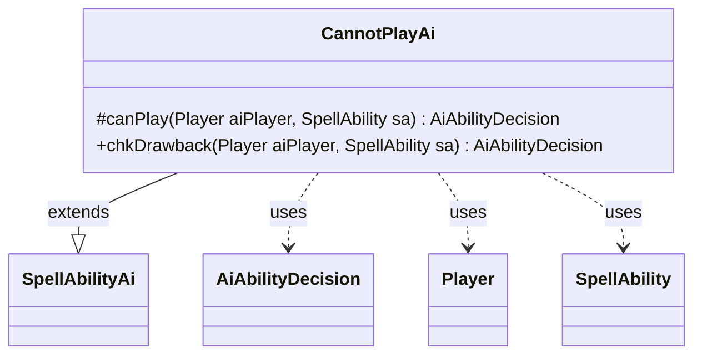

---
aliases:
  - CannotPlayAi
tags:
  - java/class
  - module/forge-ai
  - pkg/forge/ai/ability
fqn: forge.ai.ability.CannotPlayAi
package: forge.ai.ability
module: forge-ai
kind: Class
---

# CannotPlayAi

**Package:** `forge.ai.ability` &nbsp; **Module:** `forge-ai` &nbsp; **Kind:** Class



## Relationships
**Extends:**
- [[forge.ai.SpellAbilityAi|SpellAbilityAi]]
**Uses:**
- [[forge.ai.AiAbilityDecision|AiAbilityDecision]]
- [[forge.game.player.Player|Player]]
- [[forge.game.spellability.SpellAbility|SpellAbility]]

## Design Description

`CannotPlayAi` is the AI behaviour handler for spell abilities that the computer player should never initiate on its own. As a concrete subclass of `SpellAbilityAi`, it overrides the two decision hooks the AI framework consults: `canPlay`, which judges whether to cast or activate an ability, and `chkDrawback`, which judges a sub-ability invoked as part of another effect. Both unconditionally return an `AiAbilityDecision` with a score of `0` and the verdict `AiPlayDecision.CantPlayAi`, telling the engine to skip the ability outright.

The design intent is a reusable "opt-out" strategy: cards whose effects the AI cannot meaningfully evaluate are wired to this handler so the planner declines them immediately instead of running heuristics. It collaborates only with the `Player`, `SpellAbility`, and `AiAbilityDecision` types received through the inherited contract, making it a minimal, stateless terminal decision.

## Source
`forge-ai/src/main/java/forge/ai/ability/CannotPlayAi.java`

```java
package forge.ai.ability;


import forge.ai.AiAbilityDecision;
import forge.ai.AiPlayDecision;
import forge.ai.SpellAbilityAi;
import forge.game.player.Player;
import forge.game.spellability.SpellAbility;

public class CannotPlayAi extends SpellAbilityAi {
    /* (non-Javadoc)
     * @see forge.card.abilityfactory.SpellAiLogic#canPlayAI(forge.game.player.Player, java.util.Map, forge.card.spellability.SpellAbility)
     */
    @Override
    protected AiAbilityDecision canPlay(Player aiPlayer, SpellAbility sa) {
        return new AiAbilityDecision(0, AiPlayDecision.CantPlayAi);
    }

    /* (non-Javadoc)
     * @see forge.card.abilityfactory.SpellAiLogic#chkAIDrawback(java.util.Map, forge.card.spellability.SpellAbility, forge.game.player.Player)
     */
    @Override
    public AiAbilityDecision chkDrawback(Player aiPlayer, SpellAbility sa) {
        return new AiAbilityDecision(0, AiPlayDecision.CantPlayAi);
    }
}
```
